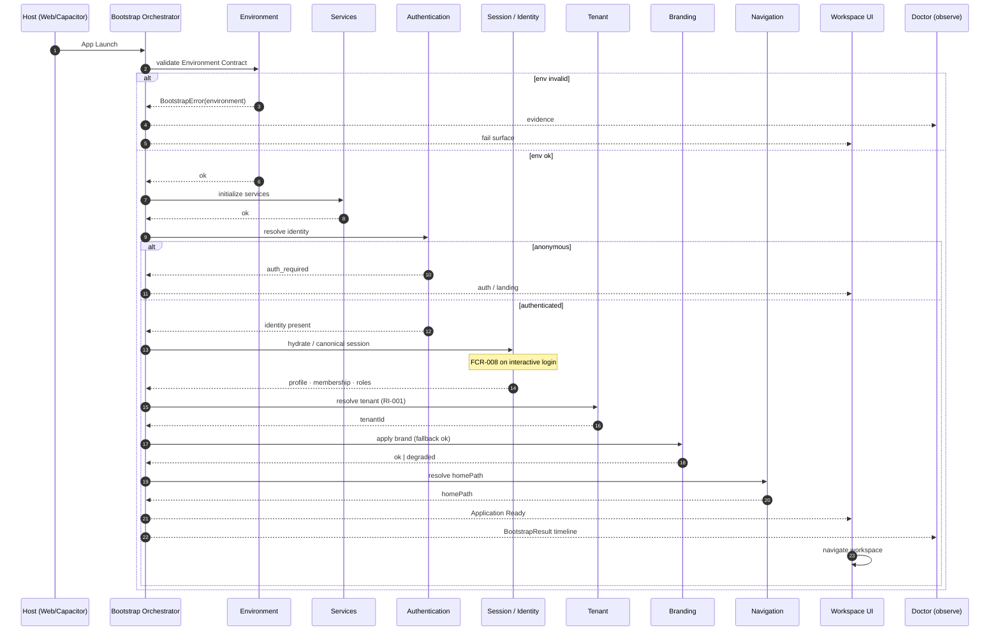
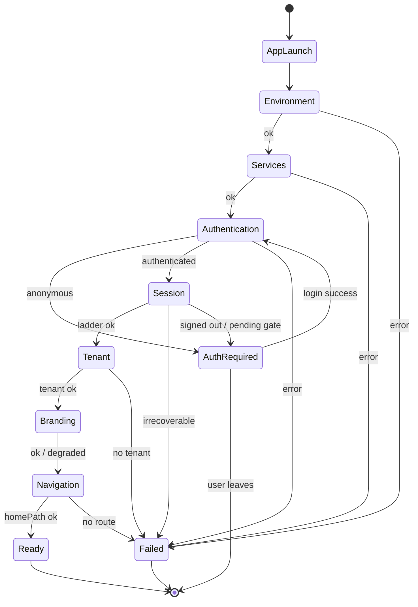

# Bootstrap Pipeline

**PRODUCT-CORE-001 · Architecture Freeze** · **PRODUCT-CORE-002 · Orchestrator**  
**ADR:** [0050 — Bootstrap Pipeline](../adr/0050-bootstrap-pipeline.md) · [0051 — Bootstrap Orchestrator](../adr/0051-bootstrap-orchestrator.md)  
**Status:** **EXECUTABLE** — contract frozen; orchestrator owns startup **order**  
**Code:** `src/bootstrap/pipeline/` (`BootstrapPipeline.ts` = single sequence definition)  
**Audience:** Product Core · EatClean daily operations · Developer Platform (observe only)

---

## Purpose

Define the **canonical application startup contract** for YourMeal OS.

Every cold start and every successful authentication path must eventually converge on the same ordered pipeline:

```text
App Launch
      │
      ▼
Environment
      │
      ▼
Services
      │
      ▼
Authentication
      │
      ▼
Session
      │
      ▼
Tenant
      │
      ▼
Branding
      │
      ▼
Navigation
      │
      ▼
Application Ready
```

This pipeline is the heart of Product Core v1. Orders, customers, kitchen, delivery, and billing all assume it completed correctly.

> **Rule:** Until a stage is `ok` (or explicitly skipped as non-blocking with fallback), later stages must not pretend success.

---

## Naming disambiguation (mandatory)

The word **bootstrap** already means four different things in this repo. Product Core must not collapse them.

| Term | Meaning | Location |
|------|---------|----------|
| **App Bootstrap Pipeline** *(this document)* | Ordered app startup → Application Ready | `src/bootstrap/pipeline/*` |
| **Post-Login Pipeline (FCR-008 / PS-002)** | Ordered milestones after a successful auth API call | `src/auth/post-login-pipeline.ts` |
| **Dev Bootstrap Mode** | Synthetic identity for local UX (`VITE_BOOTSTRAP_MODE`) | `src/bootstrap/*` (siblings; not `pipeline/`) |
| **Operational Bootstrap (OP-001)** | Tenant Day-0 ladder (dishes → menu → orders…) | `src/modules/bootstrap-integrity/*` · [BOOTSTRAP_STATE_MACHINE](./BOOTSTRAP_STATE_MACHINE.md) |

**App Bootstrap** may *invoke* Post-Login milestones. It must never be confused with Operational Bootstrap or Dev Bootstrap Mode.

---

## Observed as-built (orchestration)

| Concern | Ownership |
|---------|-----------|
| **Startup order** | **`src/bootstrap/pipeline/BootstrapPipeline.ts`** (only place) |
| Process entry | Vite / TanStack Start · Capacitor SPA · `startBootstrapPipeline` from `router.tsx` |
| Providers | `__root.tsx` → Query · i18n · Localization · Identity · optional BootstrapShell (**unchanged**) |
| Auth / Session / Tenant enrichment | IdentityProvider + auth facade (stages **delegate** / peek) |
| Branding | TenantBrandScope / shells (stage NON-BLOCKING · delegated) |
| Navigation | `resolveHomePath` / route guards (stage delegated) |
| UI Ready gate | **Not yet** — orchestrator does not block paint (PRODUCT-CORE-002) |

Developer Platform Runtime Suite registers early in `router.tsx` for diagnostics. It is **orthogonal** to Product Core Ready and must not be modified for this track.

---

## Canonical stages

### Stage matrix

| # | Stage id | Blocking? | Summary |
|---|----------|-----------|---------|
| 0 | `app_launch` | BLOCKING | Native/web process starts; shell mounts |
| 1 | `environment` | BLOCKING | Required runtime env present and valid |
| 2 | `services` | BLOCKING | Core clients/singletons initialized |
| 3 | `authentication` | BLOCKING* | Identity known or user sent to auth surface |
| 4 | `session` | BLOCKING* | Canonical session + identity ladder ready |
| 5 | `tenant` | BLOCKING* | Active tenant resolved for the session |
| 6 | `branding` | NON-BLOCKING | Theme/logo applied; fallback allowed |
| 7 | `navigation` | BLOCKING* | Home path resolved; router may enter workspace |
| 8 | `ready` | — | Application Ready latch |

\*Blocking **for authenticated workspaces**. Unauthenticated users stop at Authentication and may show public/auth UI without reaching Ready.

---

### 0 · App Launch

| | |
|--|--|
| **Purpose** | Start the host process and mount the React shell. |
| **Inputs** | OS / Capacitor / browser; packaged web assets. |
| **Outputs** | `BootstrapStage = app_launch` · shell mounted · boot epoch. |
| **Failure** | Crash before shell; blank WebView; asset load catastrophe. |
| **Recovery** | Restart app; Developer Platform Runtime / asset Doctor (observe). |
| **Doctor** | Process alive; main start logged; catastrophic error boundary present. |

---

### 1 · Environment

| | |
|--|--|
| **Purpose** | Prove required configuration before talking to backends. |
| **Inputs** | `import.meta.env` / process env · [Environment Contract](../00-status/ENVIRONMENT_CONTRACT.md) (ADR 0049). |
| **Outputs** | Validated env snapshot (no secrets in logs). |
| **Failure** | Missing `VITE_SUPABASE_*`; placeholders (`REPLACE_ME`); corrupt build flags. |
| **Recovery** | Fix `.env` / rebuild; `npm run doctor:env` (CLI). No silent defaults for required keys. |
| **Doctor** | Map Environment Contract ✔/✖ into Product Core bootstrap evidence (future check). |

---

### 2 · Services

| | |
|--|--|
| **Purpose** | Initialize ordered infrastructure used by Product Core. |
| **Inputs** | Valid environment. |
| **Outputs** | Ready handles: Supabase client, storage port, QueryClient, i18n, (optional) analytics. |
| **Failure** | Client construction throws; storage adapter unavailable; i18n init failed. |
| **Recovery** | Retry soft inits; hard fail if Supabase client cannot construct. |
| **Doctor** | Service init evidence: which services `ok` / `degraded` / `failed`. |

**Ordered init (contract):**

1. Storage provider  
2. Supabase browser client  
3. QueryClient  
4. i18n  
5. Optional analytics (non-blocking)  
6. Developer Platform registration remains **orthogonal** (already frozen)

---

### 3 · Authentication

| | |
|--|--|
| **Purpose** | Establish whether an authenticated identity exists. |
| **Inputs** | Services ready; persisted auth storage (web / Capacitor Preferences). |
| **Outputs** | `authenticated | anonymous | challenge` + auth surface if needed. |
| **Failure** | Auth API unreachable; corrupted tokens; Bootstrap Mode misconfigured in prod. |
| **Recovery** | Clear session → auth UI; network retry; never invent identity. |
| **Doctor** | Auth provider mode (Supabase vs Dev Bootstrap); token presence without dumping JWT. |

**Paths:**

- **Cold start with stored session** → proceed to Session.  
- **Cold start without session** → Authentication challenge (login / landing); pipeline pauses (not Ready).  
- **Interactive login** → Post-Login Pipeline (FCR-008) feeds Session.

---

### 4 · Session

| | |
|--|--|
| **Purpose** | Materialize the canonical working session for the user. |
| **Inputs** | Supabase `Session` (cold hydrate **or** auth API `data.session` — FCR-008). |
| **Outputs** | Identity ladder: User → Profile → Membership → Roles · `AuthState` fields. |
| **Failure** | Session without user; profile missing; membership pending/rejected; role empty for staff entry. |
| **Recovery** | Re-fetch identity rows; send pending users to waiting surface; sign-out on irrecoverable corruption. |
| **Doctor** | Emit PS-002-compatible milestones for canonical login; cold-start labeled `mode: cold`. |

Aligns with ADR [0018](../adr/0018-identity-membership-lifecycle.md) / [0019](../adr/0019-identity-hardening-v1.md):

```text
Identity → Profile → Membership(Approved) → Role → (Workspace later)
```

---

### 5 · Tenant

| | |
|--|--|
| **Purpose** | Bind the session to exactly one active tenant (RI-001). |
| **Inputs** | Approved membership · tenant row. |
| **Outputs** | `tenantId`, tenant record, operational context seed. |
| **Failure** | No membership; inactive tenant; multiple memberships (must not happen at app layer). |
| **Recovery** | Block Ready; show “no organization” / contact admin; SaaS paths may differ (platform owner). |
| **Doctor** | `tenantId` present; membership status; tenant `active`. |

**Not in scope for v1 of this contract:** host/subdomain multi-tenant resolution. EatClean pilot remains membership-driven.

---

### 6 · Branding

| | |
|--|--|
| **Purpose** | Apply tenant visual identity before / as workspace paints. |
| **Inputs** | `tenantId` · static BrandConfig · optional remote brand overrides. |
| **Outputs** | CSS theme vars · logo URL (or fallback) · brand provenance. |
| **Failure** | Remote brand fetch fails; logo 404; contrast invalid. |
| **Recovery** | **Fallback to bundled EatClean / last-known BrandConfig** — NON-BLOCKING. |
| **Doctor** | Brand source (`static` \| `remote` \| `fallback`); logo origin warnings. |

---

### 7 · Navigation

| | |
|--|--|
| **Purpose** | Resolve the first workspace route for this session. |
| **Inputs** | Roles · tenant · auth flags · permissions. |
| **Outputs** | `homePath` · navigation intent · invalidation of stale route caches. |
| **Failure** | No home for role set; capability gate denies all workspaces. |
| **Recovery** | Safe fallback surface (customer `/app` when allowed; else explicit error). |
| **Doctor** | `homePath` + role summary; guard failures as incidents. |

Policy remains role-priority based (`resolveHomePath` / ops entry). Navigation must not run before Session + Tenant for authenticated Ready.

---

### 8 · Application Ready

| | |
|--|--|
| **Purpose** | Single latch: Product Core may accept user work. |
| **Inputs** | All blocking stages `ok`; branding `ok` or `degraded`. |
| **Outputs** | `BootstrapStatus = ready` · `BootstrapResult` sealed · UI unblocks workspaces. |
| **Failure** | Any blocking stage failed/pending. |
| **Recovery** | Stay on bootstrap/error/auth surface; expose Doctor evidence. |
| **Doctor** | Ready duration; stage timeline; FOPEBA-friendly report. |

---

## Blocking policy (freeze)

```text
BLOCKING
  app_launch · environment · services
  authentication (for workspace entry)
  session · tenant · navigation

NON-BLOCKING (fallback required)
  branding
  optional analytics / PostHog
  Developer Platform modules

TERMINAL OUTCOMES
  ready            — workspaces may run
  auth_required    — show auth / landing (not a failure)
  failed           — blocking stage failed
  degraded_ready   — ready with non-blocking fallbacks (e.g. brand)
```

---

## Sequence diagram



---

## State diagram



---

## Public contract (freeze)

Types below are the **stable Product Core v1 surface**. Implementation may live under a future module (suggested: `src/modules/app-bootstrap` or `src/bootstrap-pipeline`) without changing names.

```ts
/** Ordered stages — do not reorder without a superseding ADR. */
export type BootstrapStage =
  | "app_launch"
  | "environment"
  | "services"
  | "authentication"
  | "session"
  | "tenant"
  | "branding"
  | "navigation"
  | "ready";

export type BootstrapStatus =
  | "pending"
  | "running"
  | "ok"
  | "degraded"
  | "auth_required"
  | "failed"
  | "ready";

export type BootstrapErrorCode =
  | "ENV_INVALID"
  | "SERVICE_INIT_FAILED"
  | "AUTH_UNAVAILABLE"
  | "SESSION_INVALID"
  | "MEMBERSHIP_PENDING"
  | "MEMBERSHIP_MISSING"
  | "TENANT_INACTIVE"
  | "TENANT_MISSING"
  | "NAVIGATION_UNRESOLVED"
  | "UNKNOWN";

export type BootstrapError = {
  code: BootstrapErrorCode;
  stage: BootstrapStage;
  message: string;
  recoverable: boolean;
  /** Opaque diagnostic payload for Doctor — never log secrets. */
  evidence?: Record<string, unknown>;
};

export type BootstrapStageResult = {
  stage: BootstrapStage;
  status: Exclude<BootstrapStatus, "ready"> | "ok" | "degraded" | "failed" | "auth_required";
  startedAt: string; // ISO
  finishedAt?: string;
  durationMs?: number;
  error?: BootstrapError;
  notes?: string[];
};

export type BootstrapResult = {
  /** Pipeline run id (correlate with Doctor / Post-Login pipeline id). */
  id: string;
  status: BootstrapStatus;
  currentStage: BootstrapStage;
  stages: BootstrapStageResult[];
  /** Present when status is ready | degraded_ready-equivalent. */
  tenantId?: string | null;
  homePath?: string | null;
  brandProvenance?: "static" | "remote" | "fallback";
  mode: "cold" | "canonical_login" | "bootstrap_mode";
  errors: BootstrapError[];
  readyAt?: string;
};
```

### Orchestrator API (contract, not code)

```ts
interface BootstrapPipeline {
  /** Run or resume cold start. Idempotent while already ready. */
  run(options?: { mode?: "cold" | "canonical_login" }): Promise<BootstrapResult>;
  getResult(): BootstrapResult | null;
  isReady(): boolean;
  /** Subscribe for Doctor / UI progress. */
  subscribe(listener: (result: BootstrapResult) => void): () => void;
}
```

---

## Existing participants

| Concern | Module / path |
|---------|----------------|
| Root providers | `src/routes/__root.tsx` |
| Router + Runtime Suite boot | `src/router.tsx` |
| Start middleware / SSR auth attach | `src/start.ts` · `src/integrations/supabase/auth-attacher.ts` |
| Supabase client | `src/integrations/supabase/client.ts` |
| Auth facade | `src/auth/*` · `post-login-pipeline.ts` |
| Identity providers | `src/identity/*` |
| Dev Bootstrap Mode | `src/bootstrap/*` |
| Guards / permissions | `src/auth/guards.ts` · `src/permissions/*` |
| Home path | `src/lib/home-path.ts` · `resolve-home-path.ts` · `admin-auth-bootstrap.ts` |
| Branding | `src/tenant/*` · `src/modules/branding/*` |
| Storage / device | `src/platform/storage-provider/*` · `device-capabilities/*` |
| i18n / localization | `src/i18n/*` · LocalizationProvider |
| Environment Contract (CLI) | `scripts/development/environment-contract.mjs` · ADR 0049 |
| Operational bootstrap (separate) | `src/modules/bootstrap-integrity/*` |

---

## Missing services (post PRODUCT-CORE-002)

| Gap | Why it matters |
|-----|----------------|
| **Full ownership in Session/Tenant stages** | Still delegated to IdentityProvider — migrate without Provider rewrite |
| **In-app Environment gate UI** | Orchestrator records failure; UI not yet blocked on it |
| **`ApplicationReady` gate in UI** | Prevent workspace paint while auth/tenant still loading |
| **Unified cold vs login convergence** | Cold hydrate and FCR-008 must produce the same `BootstrapResult` shape |
| **Bootstrap Doctor Capability** | Subscribe to `bootstrap:*` lifecycle events (no Doctor change in 002) |
| **Explicit Permissions stage (optional v1.1)** | Roadmap listed Permissions; v1 folds capability checks into Session + Navigation |
| **Host-based tenant resolution** | Deferred; membership-only for EatClean pilot |

---

## Relation to Post-Login Pipeline (FCR-008)

Interactive login remains:

```text
LOGIN → LOGIN_OK → CANONICAL_SESSION → BOOTSTRAP_START
→ IDENTITY_READY → PROFILE_READY → MEMBERSHIP_READY → ROLE_READY
→ HOME_PATH_RESOLVED → NAVIGATE → DASHBOARD_RENDERED
```

Mapping into App Bootstrap:

| PS-002 step | App Bootstrap stage |
|-------------|---------------------|
| LOGIN…CANONICAL_SESSION | Authentication → Session |
| IDENTITY…ROLE_READY | Session |
| (membership → tenant row) | Tenant |
| HOME_PATH_RESOLVED → NAVIGATE | Navigation |
| DASHBOARD_RENDERED | Ready (UI confirmation) |

Cold start uses `mode: "cold"` and **must** still emit a `BootstrapResult` with the same stages (without LOGIN steps).

---

## Non-goals (this freeze)

- Implementing the orchestrator or refactoring `__root` / IdentityProvider.
- Changing Developer Platform engines, Doctor contracts, or Runtime Host.
- Redesigning Operational Bootstrap (OP-001) or Dev Bootstrap Mode UX.
- Multi-tenant switcher / host slug resolution.
- Offline-first sync (later Product Core track).
- New product screens.

---

## Acceptance for Phase 1–2

- [x] Stages described with purpose / inputs / outputs / failure / recovery / Doctor.
- [x] Blocking policy frozen.
- [x] Sequence + state diagrams published.
- [x] Existing vs missing participants listed.
- [x] Public types `BootstrapResult` · `BootstrapStage` · `BootstrapStatus` · `BootstrapError` frozen.
- [x] ADR 0050 accepted.
- [x] Bootstrap Orchestrator executable (`src/bootstrap/pipeline/`) — ADR 0051.
- [x] Single sequence definition: `BootstrapPipeline.ts`.
- [x] Lifecycle events published (no Doctor/UI changes).
- [x] No Provider / FCR / branding / routing refactor.

---

## Next phases

```text
001 Architecture              ✅
002 Bootstrap Orchestrator    ✅
003 Stage Ownership           ✅ / in PR
004 Application Ready UI gate
005 Smoke Test (web + OPPO)
```
