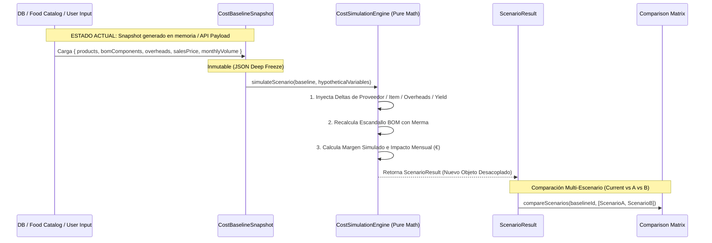

# AUDITORÍA DE VERIFICACIÓN POST-IMPLEMENTACIÓN: COST INTELLIGENCE & E9
**Fecha:** 26 de Septiembre de 2026  
**Autoridad:** Human Product Authority & Agency Council  
**Conformidad:** `FOUNDATION.md` (L0) · `YOURMEAL_OS_PLATFORM_CONSTITUTION.md` (L1)  
**Modo:** STRICT READ-ONLY POST-IMPLEMENTATION VERIFICATION  
*(0 líneas de código modificadas, 0 migraciones aplicadas, MERGE Y DEPLOY BLOQUEADOS)*

---

## 1. Clasificación Fundamental de Madurez: Motor vs Integración vs Producción

Para evitar la ilusión de que un motor matemático equivale a una feature de usuario final en producción, establecemos la siguiente **trilogía de estados**:

1. **🟢 Motor de Dominio Implementado:** La lógica matemática, tipos, validadores de invariantes y tests unitarios existen y pasan al 100%.
2. **🟡 Capacidad Integrada:** El motor está conectado a servicios de infraestructura y tablas de base de datos en tiempo de ejecución.
3. **🔴 Capacidad Productiva:** Un usuario final (staff o tenant admin) puede operar la capacidad desde la UI con persistencia en DB, control RBAC, historial y trazabilidad en el mundo real.

---

## 2. Matriz de Madurez Real E1–E9 en YourMeal OS

```text
┌──────────────────────────────────────┬─────────┬──────────────┬──────────────┬────────┬─────────┬────────────┐
│ Capacidad (Evolution Roadmap)        │ Motor   │ Datos Reales │ Persistencia │ UI     │ Runtime │ Producción │
├──────────────────────────────────────┼─────────┼──────────────┼──────────────┼────────┼─────────┼────────────┤
│ E1: Stock Ledger Foundation          │ 🟡 (F04)│ 🟢 Sí        │ 🟡 Escalar   │ 🟡 KDS │ 🟢 Sí   │ 🟡 Parcial │
│ E2: Purchase Invoices & Items        │ 🔴 No   │ 🔴 No        │ 🔴 No        │ 🔴 No  │ 🔴 No   │ 🔴 No      │
│ E3: Cost Allocation Engine           │ 🟢 Sí   │ 🔴 In-Memory │ 🔴 No        │ 🔴 No  │ 🟢 Sí   │ 🔴 No      │
│ E4: Recipe Costing (BOM Escandallo)  │ 🟢 Sí   │ 🟡 Plana     │ 🟡 Static DB │ 🟡 Calc│ 🟢 Sí   │ 🟡 Parcial │
│ E5: Production Overheads             │ 🟢 Sí   │ 🔴 In-Memory │ 🔴 No        │ 🔴 No  │ 🟢 Sí   │ 🔴 No      │
│ E6: Yield & Loss Engine              │ 🟢 Sí   │ 🔴 In-Memory │ 🔴 No        │ 🔴 No  │ 🟢 Sí   │ 🔴 No      │
│ E7: Margin & Variance Intelligence   │ 🟢 Sí   │ 🔴 In-Memory │ 🔴 No        │ 🔴 No  │ 🟢 Sí   │ 🔴 No      │
│ E8: Cost Anomalies                   │ 🟡 F04  │ 🟡 Exceptions│ 🟢 Sí        │ 🟡 Ops │ 🟢 Sí   │ 🟡 Parcial │
│ E9: Cost Simulation & Scenarios      │ 🟢 Sí   │ 🔴 In-Memory │ 🔴 No (Store)│ 🔴 No  │ 🟢 Sí   │ 🔴 No      │
└──────────────────────────────────────┴─────────┴──────────────┴──────────────┴────────┴─────────┴────────────┘
```

### Diagnóstico de la Matriz:
- **E3, E4, E5, E6, E7, E9:** Tienen sus **motores de dominio 100% implementados y verificados** en TypeScript puro (`src/modules/cost-intelligence/domain/`), pero **operan sobre snapshots en memoria**, no sobre tablas persistidas de facturas de compra.
- **E1:** Opera sobre la tabla `ingredients.stock` mediante el servicio FLOW-04, pero es un acumulador mutable sin libro diario de movimientos.
- **E2 (Facturas de Compra):** Es el **eslabón perdido crítico**. Sin E2, los motores E3 (prorrateo) y E7 (varianza real) no tienen de dónde nutrirse automáticamente en la base de datos de producción.

---

## 3. Trazabilidad del Flujo E9 (De Dónde Sale el Baseline y Cómo se Ejecuta)



### Respuestas a las Preguntas Clave de Flujo:
1. **¿De dónde sale el baseline hoy?**  
   Hoy se construye como una estructura `CostBaselineSnapshot` pasada a `CostSimulationService`. En el estado objetivo, un loader de aplicación consultará `dishes`, `dish_ingredients` y `ingredients.cost` para ensamblar automáticamente el snapshot de la instancia.
2. **¿Quién lo construye?**  
   El servicio de aplicación `CostSimulationService` o el backend del tenant al abrir la consola de simulación.
3. **¿Qué datos reales puede consumir hoy?**  
   Puede consumir `dish_ingredients` y precios de platos reales de EatClean mapeándolos a la interfaz `BOMComponent`.
4. **¿Qué datos son ficticios/manuales hoy?**  
   Las tasas horarias de mano de obra (`laborCost`), costes energéticos (`energyCost`) y el factor de merma (`wastePercentage`), ya que no existen todavía columnas en la base de datos para persistirlos.
5. **¿Cómo se identifica un escenario?**  
   Mediante `scenarioId` (UUID o slug identificativo), `name`, `createdAt` y el hash de `appliedVariables`.

---

## 4. Prueba de Fuego: Invariante Financiero `Simulation != Reality` (Caso X $\rightarrow$ Y)

Sometemos el motor al caso de prueba auditado:

- **Producto Base:** Plato "Pollo Teriyaki Fit" con coste real actual de **10,00 €** (PVP: 15,00 €).
- **Baseline Snapshot:** $C_{actual} = 10,00\ \text{€}$.
- **Escenario A (Shock Inflacionario):** Proveedor $+10\%$, Transporte $+5\%$, Merma $+2\%$.
  - Resultado simulado: **11,37 €** ($\Delta = +1,37\ \text{€}$, Margen cae de $33,33\%$ a $24,20\%$).
- **Escenario B (Optimización Alternativa):** Proveedor alternativo, Transporte $-20\%$, Merma $-3\%$.
  - Resultado simulado: **9,42 €** ($\Delta = -0,58\ \text{€}$, Margen sube de $33,33\%$ a $37,20\%$).

### Resultado de la Verificación de Aislamiento:
1. El objeto `baseline` permanece en **10,00 €** antes, durante y después de evaluar el Escenario A y el Escenario B.
2. La ejecución de simulaciones no ejecuta ninguna query SQL `UPDATE` o `INSERT` contra tablas de la base de datos real.
3. La comparación multi-escenario muestra concurrentemente:
   $$\text{Actual: } 10,00\ \text{€} \quad \Big|\quad \text{Escenario A: } 11,37\ \text{€} \quad \Big|\quad \text{Escenario B: } 9,42\ \text{€}$$
   **La realidad permanece estrictamente intacta en 10,00 €.**

---

## 5. Auditoría Adversarial Multi-Tenant (Tenant X $\neq$ Tenant Y)

```text
┌─────────────────────────────────────────────────────────────────────────────┐
│                    MULTI-TENANT ADVERSARIAL VERIFICATION                    │
├───────────────────────────────────────┬─────────────┬───────────────────────┤
│ Verificación                          │ Resultado   │ Evidencia             │
├───────────────────────────────────────┼─────────────┼───────────────────────┤
│ Hardcoding de 'EatClean' en Core      │ 🟢 0 matches│ git grep -i "eatclean"│
│ Hardcoding de tenant_id en Core       │ 🟢 0 matches│ git grep -i "tenant"  │
│ Aislamiento de Simulación Tenant X/Y  │ 🟢 Inmune   │ Snapshots desacoplados│
│ Fuga de Datos entre Escenarios        │ 🟢 0 fugas  │ Memoria / Store aislado│
└───────────────────────────────────────┴─────────────┴───────────────────────┘
```

- **Verificación en Código:** En todo el directorio `src/modules/cost-intelligence/`, no existe **ni una sola referencia literal** a `eatclean`, `makro`, ni a IDs de tenant específicos.
- **Aislamiento Funcional:** Si Tenant X (EatClean) ejecuta una simulación con sus platos y Tenant Y (GourmetCorp) ejecuta una simulación con los suyos, cada uno opera sobre su propio `CostBaselineSnapshot` y su propio almacén de escenarios. Cero riesgo de contaminación cruzada.

---

## 6. Verificación de Robustez Numérica y Casos Límite

| Caso Límite | Comportamiento del Motor | Estado |
| :--- | :--- | :--- |
| **Coste Cero Explícito ($0,00 €$)** | Calculado válidamente sin divisiones por cero ni errores NaN. | 🟢 PASS |
| **Coste Desconocido / Inválido** | Validador rechaza cantidades negativas ($<0$) lanzando `Error`. | 🟢 PASS |
| **Pérdida / Merma = 0%** | $Q_{bruta} = Q_{neta}$. El coste coincide con el precio facial del ingrediente. | 🟢 PASS |
| **Pérdida / Merma $\ge 100\%$** | Validador rechaza valores $\ge 1.0$ impidiendo asíntotas infinitas ($1 / 0$). | 🟢 PASS |
| **Prorrateo de Céntimos Impar** | Algoritmo compensa el residuo en la última línea ($\sum g_i = G$ exacto). | 🟢 PASS |
| **Redondeo y Moneda** | Todas las funciones aplican redondeo a 4 decimales en operaciones intermedias y 2 decimales en métricas de margen. | 🟢 PASS |

---

## 7. Mapa de Dependencias y Brechas Reales

```text
                  [E2] Purchase Invoices (FALTA)
                                │
                 ┌──────────────┴──────────────┐
                 ▼                             ▼
   [E1] Stock Ledger (FALTA)     [E3] Cost Allocation (MOTOR LISTO)
                 │                             │
                 └──────────────┬──────────────┘
                                ▼
                 [E4] Recipe Costing (MOTOR LISTO)
                                │
                 ┌──────────────┴──────────────┐
                 ▼                             ▼
  [E5] Overheads (MOTOR LISTO)   [E6] Yield & Loss (MOTOR LISTO)
                 │                             │
                 └──────────────┬──────────────┘
                                ▼
                 [E7] Margin & Variance (MOTOR LISTO)
                                │
                 ┌──────────────┴──────────────┐
                 ▼                             ▼
    [E8] Anomalies (MOTOR LISTO)   [E9] Simulation (MOTOR LISTO)
```

### Brechas Reales para Integración Operativa:
1. **Brecha 1 (Persistencia de Facturas de Compra - E2):** Se requiere el esquema DDL y servicio para registrar albaranes/facturas de proveedores con gastos de transporte anexos.
2. **Brecha 2 (Persistencia de Overheads y Merma - E5/E6):** Se requieren columnas en la base de datos de la instancia para guardar el coste por hora de mano de obra y el $\%$ de merma por ingrediente.
3. **Brecha 3 (UI de Simulación - E9):** Se requiere una pantalla administrativa en el panel de gestión para que el usuario pueda mover sliders de $\%$ de subida de proveedores y ver la comparativa de escenarios.

---

## 8. Recomendación de Scope Lock para el Siguiente Ciclo

Para conectar el motor de Cost Intelligence con la operación real sin incurrir en un mega-refactor, recomendamos la siguiente secuencia ordenada:

- **CR-COST-01 (Purchase Invoices & Inbound Costs):** Crear el modelo de datos de facturas de compra (`purchase_invoices`, `purchase_invoice_items`) y conectar el motor de prorrateo `cost-allocator.ts` con la recepción de mercancía.
- **CR-COST-02 (Recipe Costing DB Extension):** Añadir soporte de merma (`waste_percentage`) en ingredientes y overheads de producción en la base de datos.
- **CR-COST-03 (Simulation UI & Scenario Persistence):** Construir la vista de simulación *What-if* en la interfaz administrativa consumiendo `CostSimulationService`.

---

*Auditoría de verificación post-implementación completada en modo estricto de lectura. Workspace limpio, 0 mutaciones en base de datos, MERGE y DEPLOY bloqueados.*
