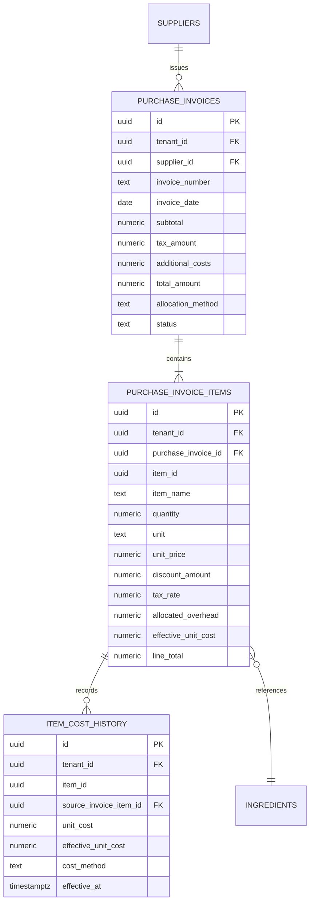

# CR-COST-01: PROCUREMENT COST FOUNDATION — ARCHITECTURE SPECIFICATION
**Fecha:** 26 de Septiembre de 2026  
**Autoridad:** Human Product Authority & Agency Council  
**Conformidad:** `YOURMEAL_OS_PLATFORM_CONSTITUTION.md` (L1)

---

## 1. Misión Arquitectónica

Establecer la **fuente de verdad económica de aprovisionamiento** que alimenta el motor de Cost Intelligence (`cost-allocator.ts`, `bom-calculator.ts`, `variance-analyzer.ts` y `cost-simulation-engine.ts`) con datos reales de facturas de compra, asegurando:
1. Registro estructurado de facturas y líneas de compra de proveedores.
2. Prorrateo determinista de costes adicionales de adquisición (transporte, seguros, tasas).
3. Trazabilidad inmutable de costes históricos ($Cost(t) \neq Cost(t+1)$).
4. Actualización del coste de referencia en catálogo sin mutaciones destructivas.

---

## 2. Diagrama de Relación de Entidades y Flujo Económico

---

## 3. Invariante de Trazabilidad e Inmutabilidad Financiera

1. **Snapshot de Línea:** Cada línea de factura almacena su `unit_price`, su `allocated_overhead` y su `effective_unit_cost` calculado. Si en el futuro se modifican las tarifas del proveedor, la factura permanece inmutable.
2. **Historial Cronológico:** El registro en `item_cost_history` es un log append-only indexado por `(tenant_id, item_id, effective_at DESC)`.
3. **Cálculo de Coste Medio Ponderado (CMP / WAC):**
   $$CMP_{nuevo} = \frac{(Stock_{previo} \times Coste_{previo}) + (Q_{entrada} \times c_i^{eff})}{Stock_{previo} + Q_{entrada}}$$
