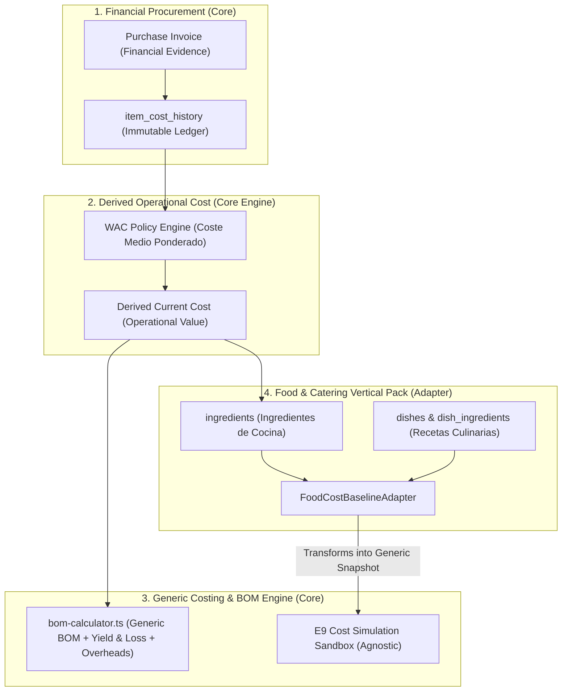

# CR-COST-02: INVENTORY COST SYNC & COSTING INTEGRATION — REFINED ARCHITECTURE
**Versión:** 2.0.0 (Refinamiento Constitucional: Desacoplamiento Core / Food Adapter / WAC Canónico)  
**Fecha:** 26 de Septiembre de 2026  
**Autoridad:** Human Product Authority & Agency Council  
**Conformidad:** `YOURMEAL_OS_PLATFORM_CONSTITUTION.md` (L1) · `YOURMEAL_OS_PLATFORM_EVOLUTION_ROADMAP.md`  
**Modo:** STRICT DESIGN REFINEMENT (0 mutaciones de código / 0 migraciones aplicadas)

---

## 1. Misión y Topología Refinada de CR-COST-02

CR-COST-02 conecta las compras reales con los escandallos y la simulación E9 respetando la separación estricta entre el **Platform Core** (agnóstico y universal) y el **Food & Catering Vertical Pack** (adaptador de cocina):



---

## 2. Resolución de las 5 Decisiones Arquitectónicas Clave

### A. Desacoplamiento de E9 respecto a Food (`FoodCostBaselineAdapter`)
- **Principio:** El Core y el motor E9 **desconocen qué es un plato, una receta o un ingrediente**. E9 opera exclusivamente sobre interfaces genéricas:
  ```typescript
  // Core Domain Concept (src/modules/cost-intelligence/domain/types.ts)
  export interface BaselineProduct {
    productId: string;
    productName: string;
    salesPrice: number;
    monthlyVolume: number;
    bomComponents: BOMComponent[]; // componentId, quantity, unitCost, yieldLoss
    overheads: ProductionOverheadsConfig; // laborCost, energyCost, packagingCost
  }
  ```
- **El Adaptador Sectorial (`FoodCostBaselineAdapter`):** Reside en la capa de adaptación Food (`src/modules/dish-library/` o vertical pack). Se encarga de consultar `dishes`, `dish_ingredients` y `ingredients`, transformándolos en la estructura neutral `CostBaselineSnapshot` que consume E9.

---

### B. Política Canónica de Coste Corriente: Coste Medio Ponderado (CMP / WAC)
Se elimina toda ambigüedad entre LIFO y WAC en el Scope Lock.
- **Fuente Inmutable:** `item_cost_history` registra cada coste efectivo de compra de forma inalterable.
- **Coste Corriente Operativo (`ingredients.cost`):** Se deriva mediante la **Política Canónica WAC (Weighted Average Cost)**:
  $$CMP = \text{round}\left( \frac{(\text{Stock Previo} \times \text{Coste Previo}) + (Q_{entrada} \times c_i^{eff})}{\text{Stock Previo} + Q_{entrada}}, 4 \right)$$
  *(Si el stock previo es $\le 0$, el nuevo coste operativo adopta directamente el coste efectivo de la última compra $c_i^{eff}$).*

---

### C. Desacoplamiento: Factura Financiera $\neq$ Recepción Física de Stock
- **`receiveInvoice()` (Operación Financiera):** Valida la factura del proveedor, calcula el coste efectivo de adquisición y asienta las líneas en `item_cost_history`, actualizando el coste de referencia operativo WAC.
- **Movimiento Físico de Stock:** El incremento de existencias no se asume ciegamente sobre una factura financiera sin recepción material. La entrada de stock se modela como un evento explícito de entrada de almacén, manteniendo desacoplado el flujo documental del flujo de almacén.

---

### D. Unificación Universal de Yield & Loss
- Core provee la interfaz universal `YieldLossConfig: { wastePercentage: number; yieldFactor?: number }`.
- Food almacena `waste_percentage` en `public.ingredients` como dato culinario de catálogo y lo inyecta limpiamente en el `BOMComponent.yieldLoss` del Core sin duplicación de lógica ni solapamiento conceptual.

---

### E. Composición de Overheads Genérica
- Core define `ProductionOverheadsConfig: { laborCost, energyCost, packagingCost, otherOverheads }`.
- Food almacena estos campos en la ficha técnica del plato (`dishes`) y el `FoodCostBaselineAdapter` los traslada directamente a la estructura de composición del Core.
