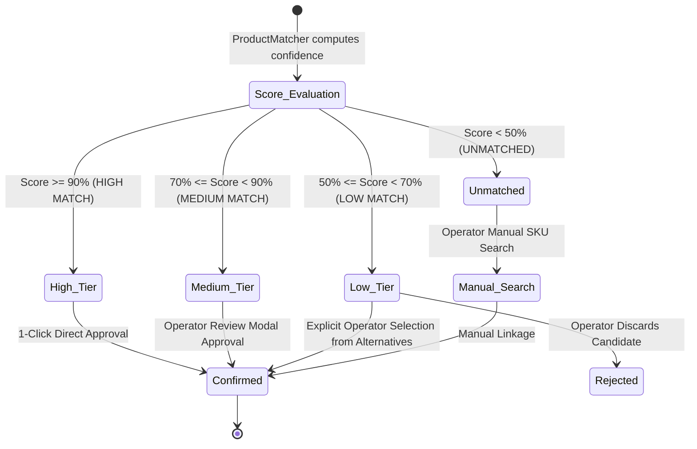

# CR-COST-05: Phase 2 Ingestion Contract & Application Services Design
**Subsystem:** Core Market Intelligence & Ingestion Pipeline  
**Status:** DESIGN & GOVERNANCE SPECIFICATION ONLY (🟡 PRE-PHASE 2 GATE)  
**Parent Blueprint:** [CR_COST_05_PRODUCT_BLUEPRINT.md](file:///Users/alex/Developer/YourMeal-OS/docs/05-architecture/CR_COST_05_PRODUCT_BLUEPRINT.md)  
**Scope Lock Reference:** [CR_COST_05_SCOPE_LOCK.md](file:///Users/alex/Developer/YourMeal-OS/docs/05-architecture/CR_COST_05_SCOPE_LOCK.md)  
**Governance State:** 🔒 **IMPLEMENTATION BLOCKED** (Phase 2 Design & Contract Ratification)  
**Date:** 2026-09-27  

---

## 1. Executive Intent & Architectural Purpose

This contract establishes the formal specification for **Phase 2 (Application Services & MVP 0/1 Ingestion Engine)** of CR-COST-05. 

Following the completion and verification of the pure Domain Foundation (Phase 1), Phase 2 bridges the mathematical engines (`PriceNormalizer`, `ProductMatcher`, `BenchmarkCalculator`) with real data ingestion, data hygiene, audit provenance, and tenant mapping workflows.

```text
┌─────────────────────────────────────────────────────────────────────────────────────────────────┐
│                               PHASE 2 INGESTION PIPELINE FLOW                                   │
├─────────────────────────────────────────────────────────────────────────────────────────────────┤
│ 1. Structured File (CSV/Excel) or Assisted Manual Entry (MVP 0/1)                                │
│    │                                                                                            │
│    ▼                                                                                            │
│ 2. Security & RBAC Gate (Role verification: Platform Owner vs. Tenant Procurement)            │
│    │                                                                                            │
│    ▼                                                                                            │
│ 3. Row-by-Row Schema Parsing & Quarantine Analysis (Rejection log for malformed rows)            │
│    │                                                                                            │
│    ▼                                                                                            │
│ 4. Domain Normalization & Tax Stripping (PriceNormalizer: Net Drained Weight, Ex-Tax €/kg)       │
│    │                                                                                            │
│    ▼                                                                                            │
│ 5. Idempotent Deduplication (SHA-256 Observation Fingerprinting; no duplicate inflation)        │
│    │                                                                                            │
│    ▼                                                                                            │
│ 6. Public Shared Storage (Market Sources, Products, Observations in Core Space)                │
│    │                                                                                            │
│    ▼                                                                                            │
│ 7. Private Matching Engine (ProductMatcher: Multi-Factor Scoring against Tenant Ingredients)     │
│    │                                                                                            │
│    ▼                                                                                            │
│ 8. Human Operator Review & Confirmation Workflow (Suggested ──► Confirmed / Rejected)            │
│    │                                                                                            │
│    ▼                                                                                            │
│ 9. Benchmark & Negotiation Intelligence Recalculation (BenchmarkCalculator)                     │
└─────────────────────────────────────────────────────────────────────────────────────────────────┘
```

---

## 2. Business Policy v1.0 Declaration & Traceability

All weighting factors and thresholds are codified as **Business Policy v1.0**. They represent the initial calibrated baseline traceable to the Product Blueprint and are subject to empirical tuning by Human Product Authority:

```typescript
export interface MarketIntelligencePolicyConfig {
  version: '1.0.0';
  matchingWeights: {
    nameOverlap: 0.40;
    thermalState: 0.25;
    physicalUnit: 0.15;
    cutSpecification: 0.10;
    qualityGrade: 0.10;
  };
  matchingTiers: {
    highMatchThreshold: 0.90;    // >= 90%: HIGH_MATCH (1-click direct confirmation)
    mediumMatchThreshold: 0.70;  // 70-89%: MEDIUM_MATCH (Assisted review modal)
    lowMatchThreshold: 0.50;     // 50-69%: LOW_MATCH (Secondary candidate / alternatives list)
    unmatchedThreshold: 0.00;    // < 50%: UNMATCHED (Discarded; manual search only)
  };
  sourceWeights: {
    b2b_wholesale: 1.0;       // Makro: Primary professional wholesale baseline
    cash_carry: 1.0;          // GM Cash: Food service wholesale competitor
    regional_specialist: 0.9; // 5 Océanos: Insular frozen/poultry specialist
    retail_ceiling: 0.3;      // Mercadona: Consumer retail ceiling reference
  };
  comparabilityWeights: {
    HIGH: 1.0;                // Same channel, same format, same region
    MEDIUM: 0.6;              // Equivalent product, different pack size
    LOW: 0.2;                 // Consumer retail pack or cross-channel reference
    UNKNOWN: 0.0;             // Excluded from benchmark median
  };
  freshness: {
    observationTtlDays: 14;   // Observations older than 14 days incur stale penalty
    stalePenaltyFactor: 0.50; // Halves the weight in weighted median
  };
}
```

### Policy Rationale: The Mercadona Retail Multiplier ($0.3 \times 0.2 = 0.06$)
> [!NOTE]
> A retail supermarket observation (e.g. Mercadona 500g tray at 6.25 €/kg) is assigned `source_weight = 0.3` and `comparability_weight = 0.2`, resulting in a composite weight of **`0.06`**. This prevents consumer retail prices from distorting wholesale catering benchmarks while preserving its role as an economic **ceiling anchor** (alerting operators if a wholesale distributor charges more than retail supermarket shelf prices).

---

## 3. The 10 Ingestion Contract Rules

### Rule 1: Authorization & RBAC Boundaries
* **Core Shared Catalogs (National/Regional Market Feeds):** Ingested exclusively by `platform_owner` or verified system maintenance jobs.
* **Tenant Assisted Imports (Private Local Feeds):** Ingested by authenticated `tenant_admin` or `procurement_manager`. Tenant uploads create local observations scoped to their operating island/region.
* **Viewer/Staff:** Read-only access to calculated benchmarks and negotiation briefs; no import capability.
* **Security Invariant:** *Shared Core Space* means **shared tenant-agnostic business data**, NOT an unauthenticated public API endpoint. All client UI access is strictly gated through authenticated Supabase JWT sessions and tenant RBAC.

---

### Rule 2: Canonical Column Schema (CSV / Excel)

#### Mandatory Columns:
| Column Header | Accepted Aliases | Expected Format | Validation Rule |
|---|---|---|---|
| `source_name` | `proveedor`, `fuente`, `source` | String | Must match an active `market_sources.name` or `source_id`. |
| `product_name` | `producto`, `descripcion`, `raw_name` | String (min 3 chars) | Cannot be empty or purely numerical. |
| `raw_price` | `precio`, `pvp`, `importe` | Float $> 0$ | Dot or comma decimal separator allowed. |
| `quantity` | `cantidad`, `formato`, `peso` | Float $> 0$ | Measurement magnitude (e.g. `2.5`, `500`). |
| `unit` | `unidad`, `medida`, `uom` | String | Must normalize to `kg`, `g`, `l`, `ml`, `cl`, `unit`, `ud`, `pack`. |
| `tax_mode` | `iva_incluido`, `tipo_precio` | `ex_tax` \| `inc_tax` | If absent, defaults to source's `default_tax_mode`. |
| `region_code` | `region`, `provincia`, `zona` | String | Must match enum `ES_TENERIFE_TF`, `ES_GRAN_CANARIA_GC`, `ES_CANARIAS_REGIONAL`, `ES_PENINSULA_MAINLAND`, `ES_NATIONAL`. Defaults to source default if omitted. |

#### Optional Semantic Columns:
| Column Header | Accepted Aliases | Expected Format | Default if Omitted |
|---|---|---|---|
| `external_sku` | `sku`, `codigo_articulo`, `ref` | String | Auto-generated hash from name |
| `brand` | `marca` | String | `null` |
| `category` | `familia`, `categoria` | String | Inferred from culinary stems |
| `thermal_state` | `temperatura`, `conservacion` | `fresh` \| `frozen` \| `ambient` \| `dry` | Inferred from product name |
| `cut_spec` | `corte`, `especificacion` | String (e.g. `limpia`, `filete`) | Inferred from product name |
| `quality_grade` | `calidad`, `gama` | String (e.g. `campero`, `bio`) | `standard` |
| `tax_rate` | `tipo_iva`, `tipo_igic` | Float ($0.0 \dots 0.21$) | Source regional default (7% IGIC / 10% IVA) |
| `net_drained_qty` | `peso_escurrido`, `net_drained` | Float $> 0$ | Equals `quantity` |
| `location_name` | `tienda`, `almacen`, `establecimiento` | String | Source primary warehouse |
| `valid_from` | `fecha_desde`, `desde` | Date (ISO 8601 / `YYYY-MM-DD`) | Observation capture date |
| `valid_to` | `fecha_hasta`, `hasta` | Date (ISO 8601 / `YYYY-MM-DD`) | Observation capture date + 14 days |
| `promotion_status`| `oferta`, `promo` | `standard` \| `temporary_discount` \| `clearance` | `standard` |

---

### Rule 3: Source Identification & Verification
* Ingestion requires a valid `source_id` referencing a registered `MarketSource` in the Core database.
* If a CSV specifies an unknown source name, the batch does not fail silently; it triggers a **Source Resolution Prompt** requesting the operator to map the name to a registered source (e.g. "Makro Adeje" $\to$ `src-makro`).

---

### Rule 4: Raw Data Preservation & Provenance Audit Trail
Every ingested observation permanently stores its full capture context:
* `raw_file_name`: Original file uploaded by operator.
* `raw_payload_json`: Verbatim string row representation prior to transformation.
* `capture_method`: `catalog_import` (CSV/Excel) or `assisted_entry` (UI).
* `imported_by`: User UUID who executed the import.
* `imported_at`: Timestamp of batch execution.

---

### Rule 5: Error Handling & Quarantine Report (Zero Silent Failures)
* **Atomic Validation Check:** Before persisting, the parser evaluates all rows.
* If malformed rows exist (e.g., negative price, unknown unit, empty name), the engine partitions the batch into:
  1. `valid_rows`: Processed and staged.
  2. `quarantined_rows`: Preserved with line number, raw content, and explicit error message (e.g., `Line 42: Unsupported unit "barril"`).
* The user is presented with a **Pre-Import Summary**:  
  *"184 valid products ready to import. 3 invalid rows quarantined for review."*

---

### Rule 6: Granular Deduplication & Idempotent Ingestion (Preserving Distinct Captures)
To prevent duplicate inflation when the same price list or catalog is re-uploaded while strictly preserving legitimate distinct observations (e.g. promo vs standard, or different physical store locations):
* **Granular Observation Fingerprint:**
  $$\text{Observation Hash} = \text{SHA256}(\text{source\_id} + \text{external\_sku} + \text{observed\_date} + \text{region\_code} + \text{location\_name} + \text{promotion\_status} + \text{normalized\_price\_ex\_tax})$$
* **Idempotency Rule:**
  - If an observation with the **exact identical fingerprint** already exists, the system updates metadata (`valid_to`, `updated_at`) and appends the import audit record without creating a duplicate observation record.
  - If a row differs in promotion status, store location, or capture date, it is recognized as a distinct economic fact and stored as a separate observation.

---

### Rule 7: Data Quality Lifecycle States
Every observation is tagged with an immutable quality flag:
```text
┌───────────────────┬─────────────────────────────────────────────────────────────────┐
│ Quality State     │ Trigger Condition                                               │
├───────────────────┼─────────────────────────────────────────────────────────────────┤
│ VERIFIED          │ Ingested via official electronic feed or verified invoice       │
│ OBSERVED          │ Imported from catalog price list or assisted UI entry           │
│ ESTIMATED         │ Derived through tax stripping or volumetric density formula     │
│ PROMOTIONAL       │ Tagged as temporary discount with explicit validity window      │
│ STALE             │ Observation age > 14 days (incurs 50% weight penalty)           │
│ LOW_CONFIDENCE    │ Incomplete metadata or anomalous price dispersion               │
└───────────────────┴─────────────────────────────────────────────────────────────────┘
```

---

### Rule 8: Public Core vs. Private Tenant Mapping Lifecycle
```text
  SHARED CORE SPACE (Authenticated)            TENANT INSTANCE SPACE (Private)
┌────────────────────────────────┐          ┌──────────────────────────────────┐
│  market_sources                │          │  tenant_ingredients              │
│  market_products               │          │  product_mappings (Tenant-Scoped)│
│  market_price_observations     │◄─────────┼─ (Links local ID to Market SKU)  │
│  market_volume_tiers           │          │  variance_analyses               │
└────────────────────────────────┘          │  negotiation_briefs              │
                                            └──────────────────────────────────┘
```
* Market catalog products and price observations exist in the shared Core database.
* Access to shared Core observations requires authenticated user credentials (no public anonymous access).
* `product_mappings` are strictly isolated per tenant (`tenant_id`). Tenant $A$ mapping "Pollo Limpio" to Makro SKU `MK-12345` is completely private and invisible to Tenant $B$.

---

### Rule 9: Immutability Rules
* **Strictly Immutable:**
  - `price_raw`, `tax_mode`, `tax_rate`, `normalized_price_ex_tax`, `observed_at`, `imported_by`, `raw_payload_json`. (Historical market facts cannot be retroactively altered).
* **Operator Mutable:**
  - `ProductMapping.match_status` (`suggested` $\to$ `confirmed` | `rejected`).
  - `ProductMapping.comparability_grade` (Operator override: e.g. downgrade `HIGH` to `MEDIUM` if local quality differs).
  - Target negotiation price in Negotiation Brief.

---

### Rule 10: Human Matching Tiers & Confirmation Workflow


#### Four-Tier Matching Policy Table:
| Score Tier | Classification | UI Presentation | Operator Action Required | Suggested Comparability |
|---|---|---|---|:---:|
| **$\ge 90\%$** | **HIGH MATCH** | 🟢 Green badge with primary placement | 1-Click Confirmation | `HIGH` |
| **$70\% \dots 89\%$** | **MEDIUM MATCH** | 🟡 Amber badge with variance diff | Assisted modal review (checks cut/format diffs) | `MEDIUM` |
| **$50\% \dots 69\%$** | **LOW MATCH** | ⚪ Grey/Yellow "Alternativas de mercado" section | Not auto-linked. Must be manually selected from candidate alternatives list | `LOW` |
| **$< 50\%$** | **UNMATCHED** | 🔴 Hidden / Discarded from suggestions | Excluded from suggestions; requires manual search | `UNKNOWN` |

---

## 4. Phase 2 Target Architecture: Module Structure

```text
src/modules/market-intelligence/
├── domain/                                  [Phase 1: COMPLETE & VERIFIED]
│   ├── types.ts
│   ├── price-normalizer.ts
│   ├── price-normalizer.spec.ts
│   ├── product-matcher.ts
│   ├── product-matcher.spec.ts
│   ├── benchmark-calculator.ts
│   └── benchmark-calculator.spec.ts
│
├── application/                             [Phase 2: TARGET FOR IMPLEMENTATION]
│   ├── market-catalog-ingestion-service.ts  # Parses CSV/Excel, validates, normalizes & stores
│   ├── market-catalog-ingestion-service.spec.ts
│   ├── product-mapping-service.ts           # Auto-suggests, confirms, rejects tenant mappings
│   ├── product-mapping-service.spec.ts
│   ├── market-benchmark-service.ts          # Integrates tenant WAC with active observations
│   └── market-benchmark-service.spec.ts
│
└── infrastructure/                          [Phase 2: TARGET FOR REPOSITORIES & ADAPTERS]
    ├── csv-catalog-parser.ts                # Robust delimiter & encoding parser
    ├── csv-catalog-parser.spec.ts
    └── repositories/
        ├── in-memory-market-repository.ts   # For lightning-fast unit & integration testing
        └── supabase-market-repository.ts    # Bound in Phase 3 after DDL migration
```

---

## 5. Governance Checklist for Opening Phase 2 Implementation

| Verification Item | Requirement | Status |
|---|---|:---:|
| **Blueprint & Scope Lock Alignment** | 100% compliant with no scrapers and no auto-purchasing | 🟢 YES |
| **Business Policy Codification** | Parameters codified as configurable `PolicyConfig v1.0` | 🟢 YES |
| **Error Handling Contract** | Rejection logs and quarantined rows with zero silent drops | 🟢 YES |
| **Deduplication Strategy** | SHA-256 natural observation fingerprinting specified | 🟢 YES |
| **Multi-Tenant Privacy Isolation** | Strict isolation between Core observations and tenant mappings | 🟢 YES |
| **Zero Side-Effects** | No Supabase DDL, no UI routes, no production deploys in Phase 2 | 🟢 YES |
