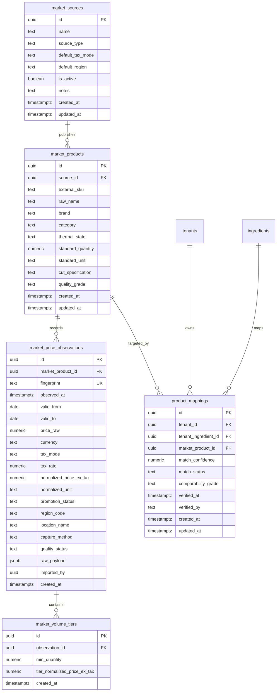

# CR-COST-05: Phase 3 DDL & Database Migration Contract
**Subsystem:** PostgreSQL / Supabase Schema Architecture (Core Market Intelligence & Private Tenant Mapping)  
**Status:** DESIGN & GOVERNANCE SPECIFICATION ONLY (🟡 PRE-PHASE 3 GATE)  
**Parent Blueprint:** [CR_COST_05_PRODUCT_BLUEPRINT.md](file:///Users/alex/Developer/YourMeal-OS/docs/05-architecture/CR_COST_05_PRODUCT_BLUEPRINT.md)  
**Ingestion Contract Reference:** [CR_COST_05_PHASE_2_INGESTION_CONTRACT.md](file:///Users/alex/Developer/YourMeal-OS/docs/05-architecture/CR_COST_05_PHASE_2_INGESTION_CONTRACT.md)  
**Governance State:** 🔒 **IMPLEMENTATION BLOCKED** (DDL Design & Specification Review Only)  
**Date:** 2026-09-27  

---

## 1. Executive Summary & Architectural Separation

This contract establishes the definitive **PostgreSQL / Supabase DDL Specification** for CR-COST-05. 

Following the successful implementation and automated verification of Domain Engines (Phase 1) and Application Services (Phase 2), Phase 3 translates the domain and ingestion requirements into a resilient, tamper-evident relational schema.

### Core vs. Tenant Isolation Architecture:
```text
┌────────────────────────────────────────────────────────────────────────────────────────┐
│                        SHARED CORE MARKET DATA (AUTHENTICATED ONLY)                    │
│                   Shared Time-Series Catalog & Observable Facts                        │
├────────────────────────────────────────────────────────────────────────────────────────┤
│  • public.market_sources              (Wholesale, Cash&Carry, Regional, Retail)         │
│  • public.market_products             (Canonical SKUs, Thermal States, Culinary Specs) │
│  • public.market_price_observations   (Immutable Append-Only Observations, Fingerprinted│
│  • public.market_volume_tiers         (Stepped Wholesale Volume Discounts)             │
└───────────────────────────────────────────┬────────────────────────────────────────────┘
                                            │ Referenced via FK
                                            ▼
┌────────────────────────────────────────────────────────────────────────────────────────┐
│                             TENANT INSTANCE SPACE (PRIVATE)                            │
│                 Isolated via RLS & Tenant Scoping (1 Tenant = 1 Instance)              │
├────────────────────────────────────────────────────────────────────────────────────────┤
│  • public.product_mappings            (Tenant Ingredient ID <──► Market Product ID)    │
│    └─ Isolated by tenant_id           (Strict RLS: is_tenant_member, has_any_staff_role)│
└────────────────────────────────────────────────────────────────────────────────────────┘
```

**Constitutional Invariants:**
1. **Zero Anonymous Access:** Shared Core Market Data tables strictly require authenticated JWT sessions (`authenticated` role); no anonymous public HTTP access.
2. **Database-Enforced Idempotency:** Natural fingerprint unique constraint (`uq_market_price_obs_fingerprint`) prevents concurrent duplicate insertion of identical observations.
3. **Database-Enforced Append-Only Immutability:** Historical price observations are strictly append-only. No `DELETE` is permitted, and a database trigger prevents any modification to economic price facts, tax rates, or historical capture timestamps.
4. **Tenant Isolation:** Tenant $A$ mappings and negotiation briefs are completely invisible to Tenant $B$.

---

## 2. Relational Schema & DDL Specification



---

## 3. SQL Table Definitions & Constraints

### 1. `public.market_sources` (Shared Core)
```sql
CREATE TABLE IF NOT EXISTS public.market_sources (
  id text PRIMARY KEY,
  name text NOT NULL,
  source_type text NOT NULL,
  default_tax_mode text NOT NULL DEFAULT 'ex_tax',
  default_region text NOT NULL DEFAULT 'ES_TENERIFE_TF',
  is_active boolean NOT NULL DEFAULT true,
  notes text,
  created_at timestamptz NOT NULL DEFAULT now(),
  updated_at timestamptz NOT NULL DEFAULT now(),
  CONSTRAINT check_source_type CHECK (
    source_type IN ('b2b_wholesale', 'cash_carry', 'regional_specialist', 'retail_ceiling')
  ),
  CONSTRAINT check_source_tax_mode CHECK (
    default_tax_mode IN ('ex_tax', 'inc_tax')
  ),
  CONSTRAINT check_source_region CHECK (
    default_region IN ('ES_TENERIFE_TF', 'ES_GRAN_CANARIA_GC', 'ES_CANARIAS_REGIONAL', 'ES_PENINSULA_MAINLAND', 'ES_NATIONAL')
  )
);
```

### 2. `public.market_products` (Shared Core)
```sql
CREATE TABLE IF NOT EXISTS public.market_products (
  id uuid PRIMARY KEY DEFAULT gen_random_uuid(),
  source_id text NOT NULL REFERENCES public.market_sources(id) ON DELETE RESTRICT,
  external_sku text NOT NULL,
  raw_name text NOT NULL,
  brand text,
  category text NOT NULL DEFAULT 'General Food',
  thermal_state text NOT NULL DEFAULT 'ambient',
  standard_quantity numeric(12,4) NOT NULL DEFAULT 1.0,
  standard_unit text NOT NULL DEFAULT 'kg',
  cut_specification text,
  quality_grade text NOT NULL DEFAULT 'standard',
  created_at timestamptz NOT NULL DEFAULT now(),
  updated_at timestamptz NOT NULL DEFAULT now(),
  CONSTRAINT uq_market_products_source_sku UNIQUE (source_id, external_sku),
  CONSTRAINT check_mp_thermal_state CHECK (
    thermal_state IN ('fresh', 'frozen', 'ambient', 'dry')
  ),
  CONSTRAINT check_mp_standard_unit CHECK (
    standard_unit IN ('kg', 'l', 'unit')
  ),
  CONSTRAINT check_mp_qty CHECK (standard_quantity > 0)
);
```

### 3. `public.market_price_observations` (Shared Core — Append-Only Time-Series)
```sql
CREATE TABLE IF NOT EXISTS public.market_price_observations (
  id uuid PRIMARY KEY DEFAULT gen_random_uuid(),
  market_product_id uuid NOT NULL REFERENCES public.market_products(id) ON DELETE CASCADE,
  fingerprint text NOT NULL,
  observed_at timestamptz NOT NULL DEFAULT now(),
  valid_from date NOT NULL DEFAULT CURRENT_DATE,
  valid_to date NOT NULL DEFAULT (CURRENT_DATE + INTERVAL '14 days'),
  price_raw numeric(12,4) NOT NULL,
  currency text NOT NULL DEFAULT 'EUR',
  tax_mode text NOT NULL DEFAULT 'ex_tax',
  tax_rate numeric(5,4) NOT NULL DEFAULT 0.0,
  normalized_price_ex_tax numeric(12,4) NOT NULL,
  normalized_unit text NOT NULL DEFAULT 'EUR_PER_KG',
  promotion_status text NOT NULL DEFAULT 'standard',
  region_code text NOT NULL DEFAULT 'ES_TENERIFE_TF',
  location_name text NOT NULL DEFAULT 'Central Warehouse',
  capture_method text NOT NULL DEFAULT 'catalog_import',
  quality_status text NOT NULL DEFAULT 'OBSERVED',
  raw_payload jsonb,
  imported_by uuid REFERENCES auth.users(id) ON DELETE SET NULL,
  created_at timestamptz NOT NULL DEFAULT now(),
  CONSTRAINT uq_market_price_obs_fingerprint UNIQUE (fingerprint),
  CONSTRAINT check_mpo_price_raw CHECK (price_raw >= 0),
  CONSTRAINT check_mpo_normalized_price CHECK (normalized_price_ex_tax >= 0),
  CONSTRAINT check_mpo_tax_rate CHECK (tax_rate >= 0 AND tax_rate <= 1.0),
  CONSTRAINT check_mpo_currency CHECK (currency = 'EUR'),
  CONSTRAINT check_mpo_tax_mode CHECK (tax_mode IN ('ex_tax', 'inc_tax')),
  CONSTRAINT check_mpo_unit CHECK (normalized_unit IN ('EUR_PER_KG', 'EUR_PER_L', 'EUR_PER_UNIT')),
  CONSTRAINT check_mpo_promo CHECK (promotion_status IN ('standard', 'temporary_discount', 'clearance')),
  CONSTRAINT check_mpo_capture_method CHECK (capture_method IN ('assisted_entry', 'catalog_import', 'authorized_feed')),
  CONSTRAINT check_mpo_quality_status CHECK (
    quality_status IN ('VERIFIED', 'OBSERVED', 'ESTIMATED', 'PROMOTIONAL', 'STALE', 'LOW_CONFIDENCE')
  )
);
```

### 4. `public.market_volume_tiers` (Shared Core)
```sql
CREATE TABLE IF NOT EXISTS public.market_volume_tiers (
  id uuid PRIMARY KEY DEFAULT gen_random_uuid(),
  observation_id uuid NOT NULL REFERENCES public.market_price_observations(id) ON DELETE CASCADE,
  min_quantity numeric(12,4) NOT NULL,
  tier_normalized_price_ex_tax numeric(12,4) NOT NULL,
  created_at timestamptz NOT NULL DEFAULT now(),
  CONSTRAINT check_mvt_min_qty CHECK (min_quantity > 0),
  CONSTRAINT check_mvt_tier_price CHECK (tier_normalized_price_ex_tax >= 0)
);
```

### 5. `public.product_mappings` (Private Tenant Instance)
```sql
CREATE TABLE IF NOT EXISTS public.product_mappings (
  id uuid PRIMARY KEY DEFAULT gen_random_uuid(),
  tenant_id uuid NOT NULL REFERENCES public.tenants(id) ON DELETE CASCADE,
  tenant_ingredient_id uuid NOT NULL REFERENCES public.ingredients(id) ON DELETE CASCADE,
  market_product_id uuid NOT NULL REFERENCES public.market_products(id) ON DELETE RESTRICT,
  match_confidence numeric(5,4) NOT NULL DEFAULT 1.0,
  match_status text NOT NULL DEFAULT 'suggested',
  comparability_grade text NOT NULL DEFAULT 'HIGH',
  verified_at timestamptz,
  verified_by text,
  created_at timestamptz NOT NULL DEFAULT now(),
  updated_at timestamptz NOT NULL DEFAULT now(),
  CONSTRAINT uq_product_mapping_tenant_ingredient_product UNIQUE (tenant_id, tenant_ingredient_id, market_product_id),
  CONSTRAINT check_pm_confidence CHECK (match_confidence >= 0 AND match_confidence <= 1.0),
  CONSTRAINT check_pm_status CHECK (match_status IN ('suggested', 'confirmed', 'rejected')),
  CONSTRAINT check_pm_grade CHECK (comparability_grade IN ('HIGH', 'MEDIUM', 'LOW', 'UNKNOWN'))
);
```

---

## 4. Row-Level Security (RLS) & Append-Only Database Guards

### Append-Only Immutability Trigger Guard
To enforce at the database engine level that historical observations cannot be deleted or mutated:

```sql
CREATE OR REPLACE FUNCTION public.trg_guard_market_observation_immutability()
RETURNS trigger AS $$
BEGIN
  IF TG_OP = 'DELETE' THEN
    RAISE EXCEPTION 'CR-COST-05 Invariant Violation: Historical market price observations are strictly append-only and cannot be deleted.'
      USING ERRCODE = 'restrict_violation';
  END IF;

  IF TG_OP = 'UPDATE' THEN
    -- Prevent mutation of any economic facts, tax rates, timestamps, or fingerprints
    IF OLD.price_raw IS DISTINCT FROM NEW.price_raw OR
       OLD.normalized_price_ex_tax IS DISTINCT FROM NEW.normalized_price_ex_tax OR
       OLD.tax_rate IS DISTINCT FROM NEW.tax_rate OR
       OLD.tax_mode IS DISTINCT FROM NEW.tax_mode OR
       OLD.observed_at IS DISTINCT FROM NEW.observed_at OR
       OLD.fingerprint IS DISTINCT FROM NEW.fingerprint OR
       OLD.market_product_id IS DISTINCT FROM NEW.market_product_id THEN
      RAISE EXCEPTION 'CR-COST-05 Invariant Violation: Economic price facts in market_price_observations are immutable and cannot be updated.'
        USING ERRCODE = 'restrict_violation';
    END IF;
  END IF;

  RETURN NEW;
END;
$$ LANGUAGE plpgsql SECURITY DEFINER;

CREATE TRIGGER trg_market_price_obs_immutability
  BEFORE UPDATE OR DELETE ON public.market_price_observations
  FOR EACH ROW
  EXECUTE FUNCTION public.trg_guard_market_observation_immutability();
```

---

### Shared Core Space Security Policies (Authenticated Only):
```sql
-- 1. market_sources
ALTER TABLE public.market_sources ENABLE ROW LEVEL SECURITY;
GRANT SELECT ON public.market_sources TO authenticated;
GRANT ALL ON public.market_sources TO service_role;

CREATE POLICY market_sources_read_auth ON public.market_sources
  FOR SELECT TO authenticated
  USING (true);

-- 2. market_products
ALTER TABLE public.market_products ENABLE ROW LEVEL SECURITY;
GRANT SELECT, INSERT, UPDATE ON public.market_products TO authenticated;
GRANT ALL ON public.market_products TO service_role;

CREATE POLICY market_products_read_auth ON public.market_products
  FOR SELECT TO authenticated
  USING (true);

CREATE POLICY market_products_write_staff ON public.market_products
  FOR INSERT TO authenticated
  WITH CHECK (
    EXISTS (
      SELECT 1 FROM public.tenant_users tu
      WHERE tu.user_id = auth.uid()
    )
  );

-- 3. market_price_observations (Append-Only: SELECT and INSERT only granted to authenticated)
ALTER TABLE public.market_price_observations ENABLE ROW LEVEL SECURITY;
GRANT SELECT, INSERT ON public.market_price_observations TO authenticated;
GRANT ALL ON public.market_price_observations TO service_role;

CREATE POLICY market_price_obs_read_auth ON public.market_price_observations
  FOR SELECT TO authenticated
  USING (true);

CREATE POLICY market_price_obs_insert_staff ON public.market_price_observations
  FOR INSERT TO authenticated
  WITH CHECK (
    EXISTS (
      SELECT 1 FROM public.tenant_users tu
      WHERE tu.user_id = auth.uid()
    )
  );

-- 4. market_volume_tiers
ALTER TABLE public.market_volume_tiers ENABLE ROW LEVEL SECURITY;
GRANT SELECT, INSERT ON public.market_volume_tiers TO authenticated;
GRANT ALL ON public.market_volume_tiers TO service_role;

CREATE POLICY market_volume_tiers_read_auth ON public.market_volume_tiers
  FOR SELECT TO authenticated
  USING (true);
```

### Private Tenant Space Policies (`product_mappings`):
```sql
ALTER TABLE public.product_mappings ENABLE ROW LEVEL SECURITY;
GRANT SELECT, INSERT, UPDATE, DELETE ON public.product_mappings TO authenticated;
GRANT ALL ON public.product_mappings TO service_role;

CREATE POLICY product_mappings_tenant_read ON public.product_mappings
  FOR SELECT TO authenticated
  USING (
    public.is_tenant_member(tenant_id)
  );

CREATE POLICY product_mappings_tenant_write ON public.product_mappings
  FOR ALL TO authenticated
  USING (
    public.is_tenant_member(tenant_id)
  )
  WITH CHECK (
    public.has_any_staff_role(auth.uid(), tenant_id)
  );
```

---

## 5. Performance Indices & Lookup Optimization

```sql
-- Core lookup by SKU & Source
CREATE INDEX IF NOT EXISTS idx_market_products_source_sku
  ON public.market_products(source_id, external_sku);

-- Core observation time-series lookup
CREATE INDEX IF NOT EXISTS idx_market_price_obs_product_date
  ON public.market_price_observations(market_product_id, observed_at DESC);

-- Core observation regional pricing lookup
CREATE INDEX IF NOT EXISTS idx_market_price_obs_region
  ON public.market_price_observations(region_code, observed_at DESC);

-- Private tenant mapping fast index
CREATE INDEX IF NOT EXISTS idx_product_mappings_tenant_ingredient
  ON public.product_mappings(tenant_id, tenant_ingredient_id);

CREATE INDEX IF NOT EXISTS idx_product_mappings_tenant_product
  ON public.product_mappings(tenant_id, market_product_id);
```

---

## 6. Seed Data for Initial 4 Registered Market Sources

```sql
INSERT INTO public.market_sources (id, name, source_type, default_tax_mode, default_region, is_active, notes)
VALUES
  ('src-makro', 'Makro', 'b2b_wholesale', 'ex_tax', 'ES_TENERIFE_TF', true, 'Professional B2B / HORECA Cash & Carry baseline'),
  ('src-gmcash', 'GM Cash', 'cash_carry', 'ex_tax', 'ES_TENERIFE_TF', true, 'HORECA Cash & Carry Transgourmet'),
  ('src-5oceanos', '5 Océanos', 'regional_specialist', 'ex_tax', 'ES_TENERIFE_TF', true, 'Canary Islands Frozen & Protein Specialist'),
  ('src-mercadona', 'Mercadona', 'retail_ceiling', 'inc_tax', 'ES_CANARIAS_REGIONAL', true, 'Consumer Supermarket Retail Reference Ceiling (Not HORECA Supplier)')
ON CONFLICT (id) DO UPDATE SET
  name = EXCLUDED.name,
  source_type = EXCLUDED.source_type,
  default_tax_mode = EXCLUDED.default_tax_mode,
  default_region = EXCLUDED.default_region,
  is_active = EXCLUDED.is_active,
  notes = EXCLUDED.notes,
  updated_at = now();
```

---

## 7. Migration Hygiene & Rollback Strategy

The corresponding rollback script `20260927120000_food_market_intelligence_foundation.rollback.sql` is specified to ensure clean reversible operations:

```sql
DROP TABLE IF EXISTS public.product_mappings CASCADE;
DROP TABLE IF EXISTS public.market_volume_tiers CASCADE;
DROP TABLE IF EXISTS public.market_price_observations CASCADE;
DROP TABLE IF EXISTS public.market_products CASCADE;
DROP TABLE IF EXISTS public.market_sources CASCADE;
```

---

## 8. Governance Checklist for Opening Phase 3 Migration

| Item | Requirement | Compliant |
|---|---|:---:|
| **Tenancy Isolation** | Tenant mappings strictly partitioned by `tenant_id` + RLS | 🟢 YES |
| **No Anonymous Access** | Core tables require authenticated JWT (`authenticated` role) | 🟢 YES |
| **Deduplication Invariant** | `uq_market_price_obs_fingerprint` prevents duplicate rows | 🟢 YES |
| **Append-Only Time Series** | Observations are immutable historical snapshots | 🟢 YES |
| **Rollback Plan** | Reversible migration plan defined | 🟢 YES |
| **Zero Side-Effects** | No SQL executed yet; pending explicit authorization | 🟢 YES |
