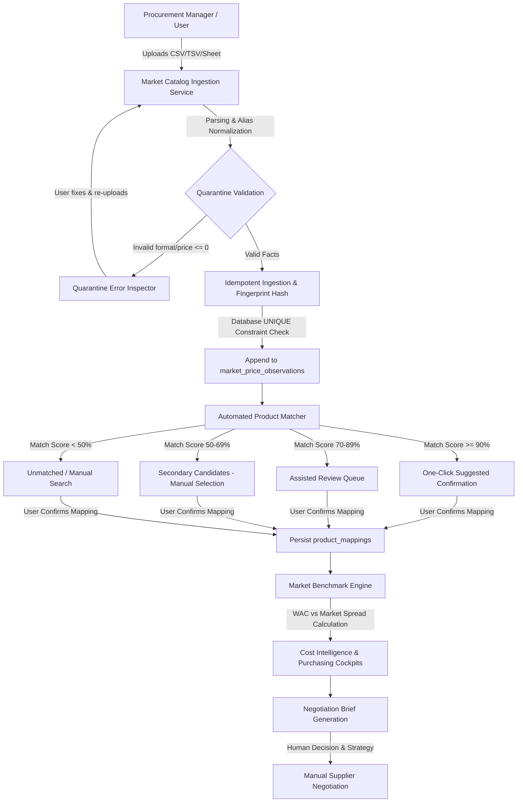

# CR-COST-05 — Phase 4 UI Integration Implementation Plan

**Feature:** Food Market Price Intelligence Foundation & Negotiation Cockpit  
**Module:** Core / Market Intelligence (`src/modules/market-intelligence`)  
**Status:** 🔴 **PROPOSED IMPLEMENTATION PLAN — NOT YET AUTHORIZED**  
**Preceding Milestone:** Phase 3 Local PostgreSQL Runtime Verification (21/21 PASS) 🟢  
**Target Environments:** `YourMeal-OS` Core Admin Application (`/admin/cost-intelligence`, `/admin/purchasing`)  

---

## 1. Phase 4 Product Surfaces

Market Intelligence integrates natively into existing YourMeal-OS operational surfaces without introducing orphan sub-apps or mock views.

```text
┌──────────────────────────────────────────────────────────────────────────────────┐
│                             YOURMEAL-OS CORE ADMIN                               │
├────────────────────────────────────────┬─────────────────────────────────────────┤
│ 1. /admin/cost-intelligence            │ 2. /admin/purchasing                    │
│ ┌────────────────────────────────────┐ │ ┌─────────────────────────────────────┐ │
│ │ TAB: Market Intelligence (E9)      │ │ │ TAB: Invoices / Orders / Items      │ │
│ │ • Market Benchmark Cockpit         │ │ │ • Market Benchmark Reference Badge │ │
│ │ • Sourcing Price Dispersion Graph  │ │ │ • Sourcing Variance Pill (vs WAC)   │ │
│ │ • Freshness & Quality Grade Pills  │ │ │ • Mapping Health Indicators         │ │
│ │ • Catalog Ingestion Drawer (CSV)   │ │ └──────────────────┬──────────────────┘ │
│ │ • Assisted Product Mapping Queue   │ │                    │                    │
│ │ • Historical Observation Explorer  │ │                    ▼                    │
│ └────────────────────────────────────┘ │ ┌─────────────────────────────────────┐ │
│                                        │ │ 3. Negotiation Brief Modal / Export │ │
│                                        │ │ • Supplier Sourcing Context         │ │
│                                        │ │ • Current WAC vs Market Dispersion  │ │
│                                        │ │ • Potential Savings & Target Target │ │
│                                        │ │ • Human Decision Form (No Auto-Mut) │ │
│                                        │ └─────────────────────────────────────┘ │
└────────────────────────────────────────┴─────────────────────────────────────────┘
```

### Surface A: `/admin/cost-intelligence` (Market Intelligence Cockpit)
* **Dedicated Tab:** `"market-intelligence"` alongside `"overview"`, `"scenarios"`, and `"history"`.
* **Sub-Panels:**
  1. **Market Benchmark Grid:** Ingredient-level view showing Tenant Ingredient, Current WAC, Primary Market Benchmark (ex-tax EUR/kg or EUR/L), Spread/Variance (%), Confidence Score, and Freshness.
  2. **Source Dispersion & Price Spread:** Interactive visual comparison comparing Wholesaler (Makro), Cash & Carry (GM Cash), Regional Specialist (5 Océanos), and Retail Ceiling (Mercadona).
  3. **Catalog Ingestion & Quarantine Hub:** Ingestion trigger supporting CSV upload with delimiter auto-detection, schema aliasing, quarantine error inspector, and deduplication badge.
  4. **Product Mapping Queue:** Side drawer / modal presenting algorithmic suggestions (≥90% direct confirmation, 70–89% assisted review, 50–69% secondary candidates) with comparability grade selectors (`HIGH`, `MEDIUM`, `LOW`).
  5. **Historical Price Observation Timeline:** Queryable time-series drawer showing historical append-only observations, volume tiers, validity windows, and provenance metadata (`raw_payload`).

### Surface B: `/admin/purchasing` (Procurement Cost Intelligence Integration)
* **Market Benchmark Reference Badges:** On purchase invoice creation/review and item tables, each item displays a live Market Price Pill:
  * `🟢 -8.5% vs Market Benchmark` (Purchasing below market benchmark)
  * `🔴 +14.2% vs Market Benchmark` (Purchasing above market benchmark)
  * `⚪ Unmapped` (Click to map against market catalog)
* **Direct Mapping Quick-Action:** Unmapped invoice items can trigger a lightweight mapping modal to associate the vendor SKU with a canonical market product.

### Surface C: Negotiation Brief (Supplier Negotiation Cockpit)
* **Trigger:** Accessible from both `/admin/purchasing` and `/admin/cost-intelligence` when an ingredient or supplier shows negative procurement variance.
* **Content:**
  * Supplier profile and annualized purchase volume/spend.
  * Current Effective Acquisition Cost (WAC + prorated logistical costs).
  * Market benchmark range: Wholesale Floor (Makro/GM Cash) vs Retail Ceiling (Mercadona).
  * Volume tier thresholds (e.g., 5+ units = 8.33% discount).
  * Comparability Grade and Quality Caveats (e.g., `"Makro Chef 1kg standard grade vs Premium Brand"`).
  * Printable/Exportable Negotiation Summary for Purchasing Managers.
  * **Human Decision Form:** Target negotiation price input with zero automatic mutations to active contracts or catalogs.

---

## 2. End-to-End User Flows



### Flow 1: CSV Catalog Ingestion & Deduplication
1. User clicks **"Importar Catálogo de Mercado"** in `/admin/cost-intelligence`.
2. User selects Market Source (`Makro`, `GM Cash`, `5 Océanos`, `Mercadona`) and uploads CSV/TSV.
3. Service parses rows using header aliases (`precio_sin_iva`, `pvp`, `sku`, etc.) and normalizes units (`EUR_PER_KG`, `EUR_PER_L`).
4. If invalid rows exist, Ingestion Modal displays the **Quarantine Review** (row index, raw string, rejection reason) without failing valid rows.
5. Ingestion persists valid observations. Duplicate rows within the same import or re-runs are transparently deduplicated via `uq_market_price_obs_fingerprint`.
6. Summary toast displays: `X nuevos precios importados, Y duplicados ignorados, Z en cuarentena`.

### Flow 2: Product Mapping & Comparability Classification
1. User opens **"Cola de Mapeo de Ingredientes"**.
2. Service lists unmapped tenant ingredients alongside candidate market products ranked by score:
   * **≥90%:** High-confidence match (e.g., `"Harina de Trigo 1kg"` vs `"Harina Trigo 1kg"`). User clicks **"Confirmar Mapeo"**.
   * **70–89%:** Ambiguous match. User inspects brand, packaging, and sets Comparability Grade (`HIGH`, `MEDIUM`, `LOW`).
   * **50–69%:** Secondary candidate. Shown as non-selected suggestion; requires active user selection.
   * **<50%:** Manual search required via live autocomplete.
3. On confirmation, row is persisted to `public.product_mappings` with `tenant_id`, `match_confidence`, `comparability_grade`, `confirmed_by`, and `confirmed_at`.

### Flow 3: Benchmark Analysis & WAC Comparison
1. In `/admin/cost-intelligence`, user views the active ingredient portfolio.
2. Market Intelligence calculates the primary benchmark for each mapped ingredient (excluding stale observations older than 30 days and retail ceilings by default).
3. The table displays current tenant WAC vs Market Benchmark:
   * Sourcing Efficiency Metric: `((WAC - Benchmark) / Benchmark) * 100`.
   * High-variance alert triggered if WAC exceeds market benchmark by > 10%.

### Flow 4: Negotiation Brief Generation
1. From an ingredient row or purchasing invoice item with negative variance, user clicks **"Generar Brief de Negociación"**.
2. Drawer opens with structured briefing data:
   * Annualized consumption and cost impact.
   * Wholesale market price range across active suppliers.
   * Volume tier discounts available in the market.
   * Quality grade differences and comparability considerations.
3. User enters target negotiation price and notes, and can export as PDF/Summary.
4. **Strict Safety:** Submitting notes stores a negotiation intent record; it NEVER alters existing purchase orders, recipe costs, or WAC.

---

## 3. Real Data Contract & State Management

**Strict Rule:** No hardcoded arrays, no mock JSONs, and no in-component `useState` holding unpersisted business truth.

```text
┌─────────────────────────────────────────────────────────────────────────────────┐
│                               REAL DATA PIPELINE                                │
├─────────────────────────┬─────────────────────────────┬─────────────────────────┤
│ UI Component            │ Application / Domain Engine │ PostgreSQL / Supabase   │
├─────────────────────────┼─────────────────────────────┼─────────────────────────┤
│ MarketIntelligenceTab   │ MarketBenchmarkService      │ market_price_obs + rls  │
│ ProductMappingDrawer    │ ProductMappingService       │ product_mappings + rls  │
│ CatalogUploadModal      │ MarketCatalogIngestionServ  │ market_products + obs   │
│ NegotiationBriefModal   │ CostSimulationService (WAC) │ item_cost_history + obs │
└─────────────────────────┴─────────────────────────────┴─────────────────────────┘
```

| UI Surface / Component | Application Service | PostgreSQL Entity | Read / Write | Tenant Boundary | RBAC Permission |
| :--- | :--- | :--- | :--- | :--- | :--- |
| **Market Sources Selector** | `MarketBenchmarkService` | `public.market_sources` | Read | Shared Core | `inventory.operate` or `purchasing.operate` |
| **Market Product Catalog** | `MarketCatalogIngestionService` | `public.market_products` | Read / Insert | Shared Core (Auth) | `has_any_staff_role` |
| **Price Observations View** | `MarketBenchmarkService` | `public.market_price_observations` | Read / Insert (Append) | Shared Core (Auth) | `has_any_staff_role` |
| **Volume Tiers Viewer** | `MarketBenchmarkService` | `public.market_volume_tiers` | Read / Insert | Shared Core (Auth) | `has_any_staff_role` |
| **Product Mapping Matrix** | `ProductMappingService` | `public.product_mappings` | Read / Write | Strict Tenant Isolation (`tenant_id`) | `has_any_staff_role` |
| **Ingredient WAC Baseline** | `WACCalculator` / `BaselineAdapter` | `public.ingredients`, `public.purchase_invoices` | Read | Strict Tenant Isolation (`tenant_id`) | `accounting.operate` / `inventory.operate` |

### UI State Machine Specification

Each UI panel explicitly implements the 4 standard states:

1. **Loading State:** Skeleton table rows with animated pulse matching table column layout.
2. **Empty State:** Distinct empty banners for:
   * *No Market Data Ingested yet* → CTA to upload first CSV catalog.
   * *No Mappings Configured* → CTA to open mapping queue.
   * *No Benchmark Available (Unmapped)* → Badge with `⚪ Sin Mapeo`.
3. **Error State:** Alert banner displaying database/network error details with a retry trigger.
4. **Freshness State:** Visual indicators for observations:
   * 🟢 **Fresh:** Observed ≤ 14 days ago (`VERIFIED` / `OBSERVED`).
   * 🟡 **Aging:** Observed 15–30 days ago.
   * 🔴 **Stale:** Observed > 30 days ago (flagged as `STALE`, excluded from active benchmark calculations).

---

## 4. Product Capability Certification (12-Step Standard)

To guarantee that Phase 4 represents a complete, verified operational product capability and not merely a static code commit, it is mapped to the standard 12 verification steps:

```text
 1. CODE             -> Clean TypeScript, zero type errors, strict modular architecture.
 2. BUILD            -> Production Vite build succeeds without bundle or chunk warnings.
 3. DEPLOY (Local)   -> Live in local Vite dev server (http://localhost:5173).
 4. ROUTE            -> Routes /admin/cost-intelligence and /admin/purchasing load properly.
 5. NAVIGATION       -> Tabs, drawers, and modal transitions operate without router faults.
 6. RBAC             -> Blocked for unauthenticated/unauthorized; accessible to purchasing/inventory/admin.
 7. REAL DATA        -> Queries live PostgreSQL tables (market_sources, market_products, mappings).
 8. USER ACTION      -> User can upload CSV, map products, confirm matches, inspect briefs.
 9. PERSISTENCE      -> Mappings and observations persist across transactions.
10. RELOAD           -> Hard page refresh preserves confirmed mappings and benchmark calculations.
11. NO UNINTENDED    -> ZERO auto-mutation of WAC, recipes, purchase orders, or sale prices.
12. MULTI-TENANT     -> Tenant Alpha mappings are invisible to Tenant Beta in the browser UI.
```

---

## 5. Architecture Boundary Enforcement

```text
┌────────────────────────────────────────────────────────────────────────────────────────┐
│                                 LAYERED ARCHITECTURE                                   │
├────────────────────────────────────────────────────────────────────────────────────────┤
│ 1. CORE (Platform-wide Shared Market Intelligence)                                     │
│    • market_sources (Makro, GM Cash, 5 Océanos, Mercadona)                             │
│    • market_products (Standardized SKUs, thermal state, unit normalization)             │
│    • market_price_observations (Append-only time-series, unique fingerprints)           │
│    • market_volume_tiers (Volume discount price breaks)                                │
│    • Normalizers, Matchers, Benchmark Calculation Engines                              │
│    • NO TENANT LOGIC, NO CUSTOMER DATA, NO PRIVATE FINANCIALS                          │
├────────────────────────────────────────────────────────────────────────────────────────┤
│ 2. FOOD SEMANTICS (Domain Specifics)                                                   │
│    • Food taxonomy categorization (meats, produce, flours, dairy, oils)                │
│    • Culinary unit conversions (kg, g, L, ml, units, cans, packs)                      │
│    • Cut specifications & quality grade comparability                                 │
├────────────────────────────────────────────────────────────────────────────────────────┤
│ 3. INSTANCE / TENANT PRIVATE DATA (Tenant-Isolated Sourcing Context)                    │
│    • product_mappings (Private mapping between Tenant Ingredient and Market Product)   │
│    • ingredients (Tenant stock, active suppliers, current WAC)                         │
│    • purchase_invoices (Tenant vendor invoices, actual procurement contracts)          │
│    • Negotiation Briefs and strategic target intents                                   │
└────────────────────────────────────────────────────────────────────────────────────────┘
```

---

## 6. Security & Access Control

1. **Authentication:** All UI routes and data loaders require an active Supabase JWT session.
2. **Authorization (RBAC):**
   * Viewing Market Intelligence: requires capability `inventory.operate` or `purchasing.operate` or role `operations_manager` / `company_admin`.
   * Uploading Market Catalogs: requires staff role in `public.tenant_members`.
   * Confirming/Rejecting Mappings: requires `purchasing` or `company_admin` role.
3. **Database RLS:**
   * Direct queries to `product_mappings` enforce `public.is_tenant_member(tenant_id)`.
   * Shared market data queries enforce authenticated role (`TO authenticated`).
4. **Client-Side Secrets:** **ZERO** hardcoded service keys or administrative secrets in frontend code. Uses canonical `supabase` client initialized from session context.

---

## 7. Explicit Invariant: No Unintended Mutation

The Market Intelligence UI is strictly an **observational, analytical, and advisory** tool.

> **CRITICAL ARCHITECTURAL GUARANTEE:**  
> Under NO circumstance shall importing a market catalog, mapping a product, or generating a negotiation brief automatically:
> 1. Mutate an ingredient's active cost in `public.ingredients`.
> 2. Mutate Weighted Average Cost (WAC).
> 3. Mutate recipe costing or Bill of Materials in `public.dishes` / `public.dish_ingredients`.
> 4. Mutate retail sale prices or menu prices.
> 5. Mutate supplier purchase orders or contracts in `public.purchase_invoices`.
> 6. Create physical inventory or adjust stock levels.
> 7. Alter or delete historical price observations in `public.market_price_observations`.
>
> All actual procurement and financial modifications MUST proceed exclusively through the authorized, canonical accounting and procurement workflows.

---

## 8. Phase 4 Dependencies & Prerequisites

* [x] Phase 1 Domain Core verified (`23/23 tests pass`).
* [x] Phase 2 Application Services verified (`10/10 tests pass`).
* [x] Phase 3 Migration & Rollback artifacts created.
* [x] Phase 3 Local PostgreSQL Runtime verified (`21/21 assertions pass` against live local DB).
* [x] Local Supabase stack active on port `54322` via OrbStack Docker Engine.
* [ ] Human Product Authority approval of this Phase 4 Implementation Plan.

---

## 9. Phase 4 Proposed File Plan

*(Note: These files are proposed for implementation following human ratification. NO files have been created or modified).*

```text
src/
├── modules/market-intelligence/
│   ├── infrastructure/
│   │   └── repositories/
│   │       ├── supabase-market-repository.ts      <-- Supabase Postgres implementation
│   │       └── supabase-market-repository.spec.ts
│   └── presentation/
│       ├── components/
│       │   ├── MarketBenchmarkBadge.tsx           <-- Reusable benchmark variance pill
│       │   ├── MarketSourceSpreadCard.tsx         <-- Wholesaler vs Retail dispersion
│       │   ├── CatalogIngestionDrawer.tsx         <-- CSV upload & quarantine viewer
│       │   ├── ProductMappingQueueDrawer.tsx      <-- Assisted mapping interface
│       │   ├── PriceObservationHistoryModal.tsx   <-- Append-only observation timeline
│       │   └── NegotiationBriefModal.tsx          <-- Supplier negotiation summary
│       └── hooks/
│           ├── use-market-intelligence.ts         <-- Real-data hook connecting repository
│           └── use-product-mappings.ts            <-- Mapping management & mutation hook
├── routes/_authenticated/
│   ├── admin.cost-intelligence.tsx                <-- Integrate Market Intelligence Tab
│   └── admin.purchasing.tsx                       <-- Integrate Market Benchmark Badges
```

---

## 10. Comprehensive Verification & Test Plan

Upon receiving authorization to implement Phase 4, the following test suite will be constructed and executed:

1. **Unit Tests (`*.spec.ts`):**
   * Supabase Market Repository query mappers and payload serializers.
   * Benchmark variance badge color/status thresholds.
   * Negotiation Brief calculation and volume tier formatting.
2. **Integration Tests (`*.spec.tsx`):**
   * `CatalogIngestionDrawer`: CSV file upload, delimiter detection, quarantine rendering.
   * `ProductMappingQueueDrawer`: Candidate scoring display, confirmation action, error handling.
   * `MarketIntelligenceTab`: Renders real database observations, displays loading skeleton and empty state.
3. **Multi-Tenant & Security Integration Tests:**
   * Verify that switching tenant context in the UI re-queries `product_mappings` and never reveals Tenant A mappings to Tenant B.
   * Verify that unauthenticated requests fail route guards.
4. **Full Quality Suite:**
   * `npm run typecheck` (`tsc --noEmit` -> 0 errors).
   * `npx vitest run` (100% PASS across all test files).
   * `npm run build` (Clean production build).
   * Browser Runtime Walkthrough verification.

---

## 11. Human Approval Gate

```text
========================================================================
PHASE 4 IMPLEMENTATION AUTHORIZATION:
🔴 NOT YET AUTHORIZED (Awaiting Human Product Authority Review)
========================================================================
```

### Decisions Requiring Human Authority Ratification:
1. **Target UI Layout:** Confirm placement of Market Intelligence as a primary tab in `/admin/cost-intelligence` plus contextual benchmark badges in `/admin/purchasing`.
2. **Mapping Threshold Defaults:** Ratify standard thresholds:
   * `≥90%`: Suggested Direct Match (1-click confirmation)
   * `70%–89%`: Assisted Match (Review required)
   * `50%–69%`: Secondary Candidate (No auto-link)
   * `<50%`: Manual Search only
3. **Freshness Window:** Ratify 14 days as fresh, 30 days as aging, and >30 days as stale/excluded from active benchmark.
4. **Negotiation Brief Export:** Confirm in-app printable modal format vs dedicated PDF generation.
