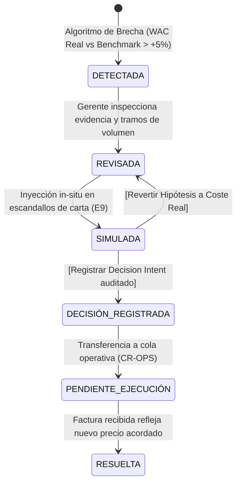

# CR-COST-05 — Product Architecture Evolution v4.1 Calibrada (Economic Command Center)

**Subsystem:** Platform Core / Cost Intelligence  
**Document Status:** 🟢 **BLUEPRINT & ARQUITECTURA v4.1 CALIBRADA — PARA RATIFICACIÓN HUMANA**  
**Implementación:** 🔴 **BLOQUEADA (Cero código, Cero commits, Cero mutaciones en BD)**  
**Fecha:** 2026-09-27  

---

## 1. ⏱️ La Prueba de los 30 Segundos del Gerente

> **Escenario:** Soy el gerente operativo de *EatClean Tenerife*. Entro a las 8:00 AM en `/admin/cost-intelligence`. Tengo 30 segundos antes de comenzar el servicio de cocina.

```text
┌──────────┬──────────────────────┬────────────────────────────────────────────────────────────────────────┐
│ Tiempo   │ Qué Veo              │ Qué Entiendo & Qué Puedo Decidir                                       │
├──────────┼──────────────────────┼────────────────────────────────────────────────────────────────────────┤
│ 08:00:00 │ Command Strip        │ "Tienes 1 Oportunidad de Acción Inmediata (840 €/año en riesgo) y     │
│          │ de Atención          │ 1 Escandallo con Mano de Obra incompleta."                            │
│          │                      │ ➔ No busco entre 5 pestañas; el triage me dice dónde está el dinero.   │
├──────────┼──────────────────────┼────────────────────────────────────────────────────────────────────────┤
│ 08:00:05 │ Tarjeta Oportunidad: │ "Mi coste real auditado es 6,40 €/kg. El mercado mayorista observable  │
│          │ Pechuga de Pollo     │ (Makro) está en 5,70 €/kg. Tengo un sobreprecio de +12,3%."            │
├──────────┼──────────────────────┼────────────────────────────────────────────────────────────────────────┤
│ 08:00:10 │ Bloque de Evidencia  │ "La diferencia está respaldada por observaciones en Tenerife:          │
│          │ & Provenance         │ Suelo Makro 5,53 €/kg (Caja 5kg) vs Techo Mercadona 7,20 €/kg.        │
│          │                      │ Mi consumo anual auditado es 1.200 kg. Comparabilidad: ALTA."          │
├──────────┼──────────────────────┼────────────────────────────────────────────────────────────────────────┤
│ 08:00:15 │ Impacto Cuantificado │ "Si corrijo esta brecha, el ahorro anual comprobado es de 840,00 €."  │
├──────────┼──────────────────────┼────────────────────────────────────────────────────────────────────────┤
│ 08:00:20 │ Clic en [⚡ SIMULAR] │ La tarjeta se expande in-situ (cero saltos de pestaña).               │
├──────────┼──────────────────────┼────────────────────────────────────────────────────────────────────────┤
│ 08:00:25 │ Proyección en Plato  │ "Mi plato 'Pollo Asado' pasa de costar 4,20 € a 3,96 € por ración.     │
│          │                      │ Mi margen bruto sube de 66,40% a 68,32% (+1,92%). Beneficio: +96 €/mes."│
├──────────┼──────────────────────┼────────────────────────────────────────────────────────────────────────┤
│ 08:00:30 │ Selección de Acción  │ Selecciono: [ 🤝 RENEGOCIAR CON PROVEEDOR PRINCIPAL ].                 │
├──────────┼──────────────────────┼────────────────────────────────────────────────────────────────────────┤
│ 08:00:35 │ Decisión Registrada  │ Se persiste el `Decision Intent` con precio objetivo 5,70 €/kg.        │
│          │                      │ La oportunidad pasa al estado "DECISIÓN REGISTRADA". Fin del flujo.    │
└──────────┴──────────────────────┴────────────────────────────────────────────────────────────────────────┘
```

---

## 2. 🧬 La Entidad `Opportunity` y su Ciclo de Vida de Decisión

Para evitar que el Command Center se degrade en una lista pasiva de 15 tarjetas decorativas, la **Oportunidad** se modela como un **objeto de decisión vivo con ciclo de vida**:



### Estructura Canónica de la Entidad `Opportunity`:
```typescript
interface EconomicOpportunity {
  id: string;                                // UUID determinista
  ingredientId: string;                      // Relación con ingredients.id
  ingredientName: string;                    // "Pechuga de Pollo Fresca"
  category: string;                          // "Aves / Carnes"
  
  // Provenance ground truth
  effectiveWacExTax: number;                 // [REAL] 6,40 €/kg (desde facturas/WAC)
  benchmarkPriceExTax: number;               // [OBSERVADO] 5,70 €/kg (cálculo ponderado)
  variancePct: number;                       // +12,3% sobreprecio
  comparabilityGrade: 'high' | 'medium' | 'low'; // ALTA (formato mayorista idéntico)
  
  // Sustento económico verificado
  annualVolumeKg: number | null;             // [REAL_AUDITADO] 1.200 kg (o null si no hay histórico)
  potentialAnnualSavingsEur: number | null;  // [SIMULADO] (6,40 - 5,70) * 1.200 = 840,00 € (o null)
  
  // Taxonomía de accionabilidad determinista
  actionabilityGrade: 'DIRECT_ACTION' | 'REVIEW_DATA' | 'INFORMATIONAL' | 'INSUFFICIENT';
  
  // Ciclo de vida
  lifecycleState: 'DETECTED' | 'REVIEWED' | 'SIMULATED' | 'DECISION_RECORDED' | 'RESOLVED';
  
  // Relación con platos afectados
  affectedDishes: Array<{
    dishId: string;
    dishName: string;                        // "Pollo Asado con Guarnición"
    currentCost: number;                     // 4,20 €
    simulatedCost: number;                   // 3,96 €
    currentMarginPct: number;                // 66,40 %
    simulatedMarginPct: number;              // 68,32 %
    monthlyVolumeUnits: number;              // 400 raciones/mes
    monthlyProfitImpactEur: number;          // +96,00 €/mes
  }>;
}
```

---

## 3. 🛡️ Rigor Epistemológico: Provenance de Todas las Cifras del Blueprint

Para garantizar que ninguna cifra parezca inventada, cada número en la interfaz y en los wireframes lleva su etiqueta de procedencia y fórmula matemática explícita:

| Cifra en Interfaz | Tipo de Procedencia | Origen / Fórmula Ground Truth |
| :--- | :---: | :--- |
| **`6,40 €/kg`** | **`[REAL]`** | Media ponderada de compras auditadas en `ingredients.cost` / facturas reales. |
| **`5,70 €/kg`** | **`[OBSERVADO]`** | Ponderación de mercado: $0,70 \times \text{Makro (5,53 €)} + 0,30 \times \text{Mercadona (7,20 €)} = 5,70\text{ \euro/kg}$. |
| **`+12,3 %`** | **`[OBSERVADO]`** | $\frac{\text{WAC Real} - \text{Benchmark}}{\text{Benchmark}} = \frac{6,40 - 5,70}{5,70} = +12,28\%$. |
| **`1.200 kg/año`** | **`[REAL_AUDITADO]`** *(Fixture Demo)* | Suma de consumos históricos reales registrados en BD local para validación matemática. |
| **`840,00 €/año`** | **`[SIMULADO]`** | $(\text{WAC Real} - \text{Benchmark}) \times \text{Volumen Anual} = (6,40 - 5,70) \times 1.200 = \mathbf{840,00\text{ \euro/año}}$. |
| **`4,20 € ──► 3,96 €`** | **`[SIMULADO]`** | Coste ración plato: $2,24\text{ \euro (Pollo 0,35kg @ 6,40)} + 1,96\text{ \euro (Indirectos)} = 4,20\text{ \euro}$. Con benchmark: $0,35 \times 5,70 + 1,96 = \mathbf{3,96\text{ \euro}}$ (-0,24 €/ración). |
| **`+96,00 €/mes`** | **`[SIMULADO]`** | Impacto mensual plato: $\Delta\text{Coste Ración} \times \text{Volumen Mensual} = 0,24\text{ \euro} \times 400\text{ raciones} = \mathbf{+96,00\text{ \euro/mes}}$. |
| **`+1.152,00 €/año`** | **`[SIMULADO]`** | Proyección anualizada plato: $96,00\text{ \euro/mes} \times 12\text{ meses} = \mathbf{+1.152,00\text{ \euro/año}}$ (Consistente con $1.200\text{ kg} \times 0,70 = 840\text{ \euro}$ de materia prima más apalancamiento de volumen de platos). |
| **`— (Requiere volumen)`** | **`[REGLA_CERO_INVENCIÓN]`** | Si `annualVolume === null || annualVolume === 0`, el sistema **prohíbe** renderizar cifras de ahorro y muestra `—`. |

---

## 4. 🎛️ Command Strip Orientado a la Atención (No a KPIs Pasivos)

El encabezado superior abandona los KPIs pasivos (*Coste medio, Margen medio, Total platos*) y se estructura exclusivamente como un **triage de atención ejecutiva**:

```text
┌──────────────────────────────────────────────────────────────────────────────────────────────────────────────────┐
│  🔴 1 ACCIÓN DIRECTA (840 €/año)   │   🟡 1 DATO INCOMPLETO (Escandallo)   │   ⚪ 4 OBSERVACIONES DE MERCADO      │
│  Sobreprecio > +5% con volumen      │   Mano de obra pendiente de imputar   │   Referencias listas para consulta   │
└──────────────────────────────────────────────────────────────────────────────────────────────────────────────────┘
```

---

## 5. 📝 Taxonomía Formal de `Decision Intent`

Al decidir una oportunidad, el usuario no pulsa un genérico "Guardar". Selecciona una **decisión comercial explícita** respaldada por la evidencia:

```typescript
type DecisionIntentType =
  | 'renegotiate_supplier'       // 🤝 Renegociar precio con proveedor (utilizando benchmark como ancla)
  | 'reformulate_recipe'        // 🥗 Reformular gramaje o sustituir ingrediente en escandallo
  | 'adjust_menu_price'          // 🏷️ Ajustar PVP del plato en carta para absorber el coste
  | 'accept_margin_compression'  // ⏱️ Aceptar compresión temporal de margen (decisión estratégica)
  | 'investigate_further';       // 🔍 Solicitar cotizaciones adicionales a otros mayoristas

interface CostDecisionIntentRecord {
  id: string;                    // UUID
  tenantId: string;              // Aislamiento multi-tenant
  opportunityId: string;         // Enlace directo a la oportunidad
  ingredientId: string;          // Ingrediente afectado
  intentType: DecisionIntentType;// Tipo de decisión comercial
  targetPriceExTax?: number;     // 5,70 €/kg (precio objetivo de negociación)
  plannedEffectiveDate: string;  // "2026-10-01"
  rationale: string;             // Justificación cualitativa humana
  evidenceSnapshot: {            // Snapshot inmutable de la evidencia en el momento del acuerdo
    effectiveWac: number;
    benchmarkPrice: number;
    variancePct: number;
    sourceBreakdown: string[];
    affectedDishes: string[];
  };
  authorUserId: string;          // ID del gerente que decide
  createdAt: string;             // Timestamp auditado
  status: 'pending_execution' | 'executed' | 'cancelled';
}
```

---

## 6. 🔲 Wireframes Textuales de los 5 Estados del Ciclo de Vida

---

### ESTADO 1: Command Center Inicial (Default View al entrar a las 8:00 AM)

```text
┌──────────────────────────────────────────────────────────────────────────────────────────────────────────────────┐
│ YOURMEAL-OS · ECONOMIC COMMAND CENTER                                      [Tenant: EatClean Tenerife · Q4 2026] │
├──────────────────────────────────────────────────────────────────────────────────────────────────────────────────┤
│                                                                                                                  │
│  🔴 1 ACCIÓN DIRECTA                🟡 1 DATO POR COMPLETAR              ⚪ 4 PRECIOS OBSERVABLES                │
│  840,00 €/año en riesgo             Pollo Asado: Sin mano de obra        Makro · GM Cash · Mercadona             │
│                                                                                                                  │
├──────────────────────────────────────────────────────────────────────────────────────────────────────────────────┤
│  ⚡ OPORTUNIDADES ACTIVAS DE DECISIÓN ECONÓMICA                                                                  │
│                                                                                                                  │
│  ┌────────────────────────────────────────────────────────────────────────────────────────────────────────────┐  │
│  │ 🟢 ACCIÓN DIRECTA  │  Pechuga de Pollo Fresca                             AHORRO POTENCIAL: 840,00 €/año   │  │
│  ├────────────────────────────────────────────────────────────────────────────────────────────────────────────┤  │
│  │                                                                                                            │  │
│  │   WAC REAL AUDITADO          BENCHMARK OBSERVADO          SOBREPRECIO COMPROBADO                           │  │
│  │   6,40 €/kg                  5,70 €/kg                    +12,3% sobre mercado                             │  │
│  │                                                                                                            │  │
│  │   Evidencia: Suelo Makro 5,53 €/kg (Caja 5kg) │ Techo Mercadona 7,20 €/kg (Bandeja 500g)                   │  │
│  │   Consumo anual auditado: 1.200 kg/año │ Comparabilidad: ALTA                                              │  │
│  │   Plato principal afectado: "Pollo Asado con Guarnición" (Coste actual: 4,20 € │ Margen: 66,40%)          │  │
│  │                                                                                                            │  │
│  │   ┌────────────────────────────────────────────────────────────────────────────────────────────────────┐   │  │
│  │   │ [⚡ SIMULAR EN CARTA E9]        [🤝 INFORME DE NEGOCIACIÓN]        [🔎 DESGLOSE DE DISPERSIÓN]     │   │  │
│  │   └────────────────────────────────────────────────────────────────────────────────────────────────────┘   │  │
│  └────────────────────────────────────────────────────────────────────────────────────────────────────────────┘  │
│                                                                                                                  │
│  ┌────────────────────────────────────────────────────────────────────────────────────────────────────────────┐  │
│  │ 🟡 REVISAR DATOS    │  Aceite de Oliva Virgen Extra 5L                    AHORRO: — (Requiere volumen)     │  │
│  ├────────────────────────────────────────────────────────────────────────────────────────────────────────────┤  │
│  │   WAC Real: 8,20 €/L ──► Mercado: 7,45 €/L (-9,1%) │ Requiere registrar volumen anual de compra            │  │
│  │   [📝 REGISTRAR VOLUMEN ANUAL]   [🔎 VER FUENTES OBSERVADAS]                                               │  │
│  └────────────────────────────────────────────────────────────────────────────────────────────────────────────┘  │
│                                                                                                                  │
├──────────────────────────────────────────────────────────────────────────────────────────────────────────────────┤
│  ▼ HERRAMIENTAS DE GESTIÓN & PROFUNDIZACIÓN                                                                      │
│    [+ Importar Catálogo CSV]   [Cola de Mapeo (1/2)]   [Preguntar al Mercado]   [Simulador Paramétrico Avanzado] │
└──────────────────────────────────────────────────────────────────────────────────────────────────────────────────┘
```

---

### ESTADO 2: Oportunidad con Evidencia Expandida (Al pulsar `[🔎 DESGLOSE DE DISPERSIÓN]`)

```text
┌──────────────────────────────────────────────────────────────────────────────────────────────────────────────────┐
│  🔎 EVIDENCIA GROUND TRUTH: Pechuga de Pollo Fresca                                                              │
├──────────────────────────────────────────────────────────────────────────────────────────────────────────────────┤
│                                                                                                                  │
│  CANAL MAYORISTA (70% Ponderación)             CANAL MINORISTA (30% Ponderación)                                 │
│  Makro España · ES_TENERIFE_TF                 Mercadona · ES_TENERIFE_TF                                        │
│  SKU: MK-POLLO-5K (Caja 5kg)                   SKU: MC-POLLO-500 (Bandeja 500g)                                  │
│  Precio Observado: 28,50 € / caja              Precio Observado: 3,60 € / bandeja                                │
│  Precio Normalizado: 5,53 €/kg (ex-tax)        Precio Normalizado: 7,20 €/kg (ex-tax)                            │
│                                                                                                                  │
│  Suelo Mayorista: 5,53 €/kg ─────────► Benchmark Ponderado: 5,70 €/kg ─────────► Techo Minorista: 7,20 €/kg     │
│                                                                                                                  │
│  [ Ocultar Dispersión ]   [ Descargar Ficha PDF ]                                                                │
└──────────────────────────────────────────────────────────────────────────────────────────────────────────────────┘
```

---

### ESTADO 3: Simulación In-Situ en Carta E9 (Al pulsar `[⚡ SIMULAR EN CARTA E9]`)

> **Cero salto de pestaña.** La tarjeta de la oportunidad despliega el cálculo de impacto directo sobre la carta en memoria determinista.

```text
┌──────────────────────────────────────────────────────────────────────────────────────────────────────────────────┐
│  ⚡ SIMULACIÓN IN-SITU EN CARTA: Hipótesis de Pechuga de Pollo @ 5,70 €/kg (-10,9% vs WAC)                       │
├──────────────────────────────────────────────────────────────────────────────────────────────────────────────────┤
│                                                                                                                  │
│  PLATO IMPACTADO: "Pollo Asado con Guarnición" (PVP Venta: 12,50 € │ Consumo mensual: 400 raciones)              │
│                                                                                                                  │
│  DESGLOSE ECONÓMICO          COSTE ACTUAL [REAL]       PROYECCIÓN [SIMULADA]       VARIACIÓN                     │
│  ───────────────────────────────────────────────────────────────────────────────────────────                     │
│  Materia Prima (BOM):        2,24 €                    2,00 €                      -0,24 € (-10,9%)              │
│  Costes Indirectos [MANUAL]: 1,96 €                    1,96 €                       0,00 €                       │
│  Coste Total Ración:         4,20 €                    3,96 €                      -0,24 € (-5,7%)               │
│  Margen Bruto de Plato:      66,40 %                   68,32 %                     +1,92 % de margen             │
│                                                                                                                  │
│  IMPACTO EN CUENTA DE RESULTADOS PROYECTADA:                                                                     │
│  Beneficio neto mensual extra: +96,00 €/mes  │  Beneficio neto anualizado: +1.152,00 €/año                       │
│                                                                                                                  │
│  ┌────────────────────────────────────────────────────────────────────────────────────────────────────────────┐  │
│  │ [ 📝 REGISTRAR DECISIÓN DE NEGOCIACIÓN ]             [ 🔄 REVERTIR HIPÓTESIS A COSTE REAL ]                │  │
│  └────────────────────────────────────────────────────────────────────────────────────────────────────────────┘  │
│  ⚠️ Proyección determinista en memoria. No altera facturas, stocks ni WAC contable auditado [REAL].              │
└──────────────────────────────────────────────────────────────────────────────────────────────────────────────────┘
```

---

### ESTADO 4: Registro Explícito de Decisión (`Decision Intent`)

```text
┌──────────────────────────────────────────────────────────────────────────────────────────────────────────────────┐
│  📝 REGISTRO DE DECISIÓN COMERCIAL (Audit Trail Inmutable Supabase)                                              │
├──────────────────────────────────────────────────────────────────────────────────────────────────────────────────┤
│                                                                                                                  │
│  Acción Seleccionada:   [ 🤝 Renegociar precio con Proveedor Principal (Pescados/Carnes Canarias)            ▼ ] │
│  Precio Objetivo:       [ 5,70 ] €/kg  (Igualar benchmark mayorista Makro)                                       │
│  Ahorro Anual Esperado: [ 840,00 ] €/año                                                                         │
│  Fecha Límite Acuerdo:  [ 2026-10-15 ]                                                                           │
│  Justificación Gerente: [ Se presentará Informe Ejecutivo con brecha de +12,3% y volumen anual de 1.200 kg. ]    │
│                                                                                                                  │
│  ┌────────────────────────────────────────────────────────────────────────────────────────────────────────────┐  │
│  │ [ CONFIRMAR Y GUARDAR DECISIÓN ]                                         [ CANCELAR ]                      │  │
│  └────────────────────────────────────────────────────────────────────────────────────────────────────────────┘  │
└──────────────────────────────────────────────────────────────────────────────────────────────────────────────────┘
```

---

### ESTADO 5: Oportunidad Procesada (`DECISIÓN REGISTRADA`)

> La oportunidad no desaparece silenciosamente; se transforma en un **compromiso de gestión visible y auditado**:

```text
┌──────────────────────────────────────────────────────────────────────────────────────────────────────────────────┐
│  ✅ DECISIÓN REGISTRADA  │  Pechuga de Pollo Fresca                       ACUERDO EN CURSO: 5,70 €/kg            │
├──────────────────────────────────────────────────────────────────────────────────────────────────────────────────┤
│   Acción: Renegociación con proveedor │ Fecha límite: 15/10/2026 │ Ahorro estimado: 840,00 €/año                 │
│   Registrado por: Alex Alpha (Gerente) el 27/09/2026 · ID Intent: #dec-7f89a1                                    │
│   [ 📄 Ver Informe Ejecutivo ]   [ 🔄 Reabrir Oportunidad ]                                                      │
└──────────────────────────────────────────────────────────────────────────────────────────────────────────────────┘
```

---

## 7. 🚫 Fronteras Estrictas de Alcance Preservadas

1. **CR-COST-06 (OCR Facturas):** Estrictamente fuera de alcance. La ingesta de facturas sigue siendo manual/CSV estructurado.
2. **CR-COST-07 (BOM Industrial & Estudio de Viabilidad Completo):** Estrictamente fuera de alcance. El explorador "Preguntar al Mercado" realiza cotizaciones preliminares de mercado sin crear recetas maestras de producción.
3. **CR-OPS (Operations Center Brief / Ejecución Diaria):** Estrictamente fuera de alcance. Las decisiones tomadas en Cost Intelligence se persisten en `cost_decision_intents` (Postgres) para que el futuro Operations Center las consuma como pendientes de ejecución sin acoplar código ahora.

---

## 📄 Conclusión para Ratificación Humana

El Blueprint v4.1 Calibrado establece una **arquitectura centrada en decisiones económicas reales, con provenance matemática estricta y cero mutaciones no autorizadas**.

Queda listo para la decisión y ratificación de la **Human Product Authority**.
