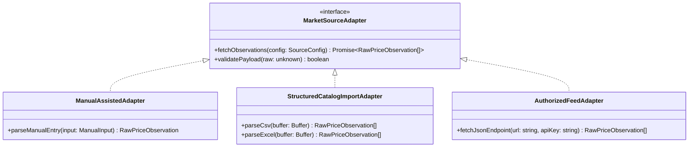
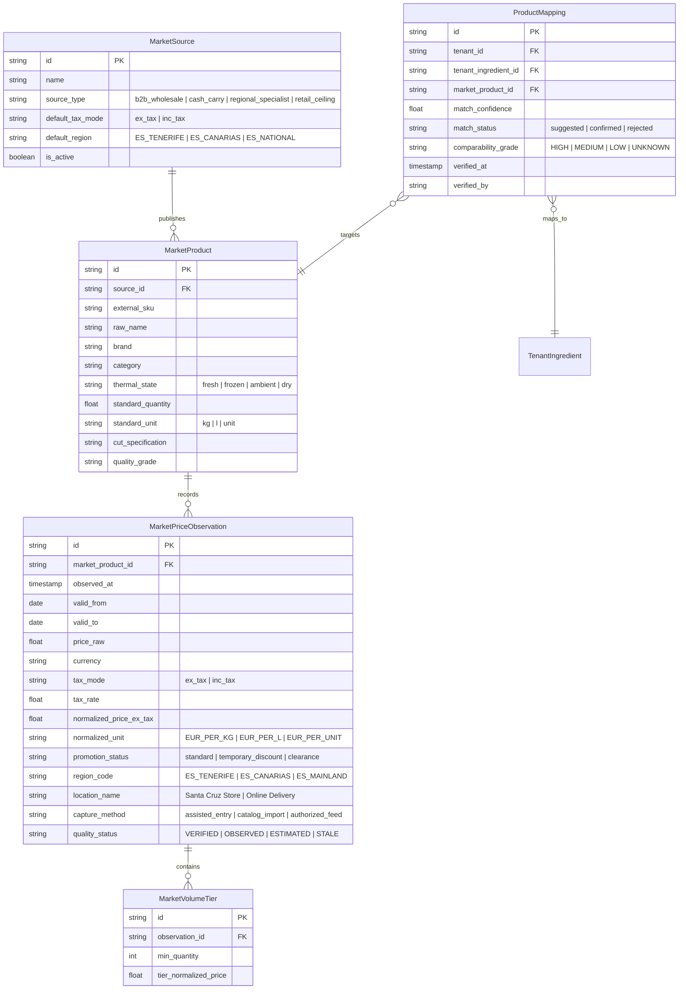

# CR-COST-05: Food Market Price Intelligence — Product Blueprint
**Subsystem:** Core Market Intelligence & FOOD Vertical Economics  
**Status:** DISCOVERY & ARCHITECTURAL DESIGN ONLY (🟡 PRE-IMPLEMENTATION GATE)  
**Parent Evolution:** Cost Intelligence & Decision Engine (CR-COST-01 $\to$ CR-COST-04 Certified)  
**Governance State:** 🔒 **IMPLEMENTATION BLOCKED** (Design & Specification Only)  
**Date:** 2026-09-27  

---

## 1. Executive Summary

CR-COST-05 expands YourMeal OS from an internal cost accounting engine into an **Observable Market Intelligence System**. 

While CR-COST-01 through CR-COST-04 certified the internal operational chain (Purchase Invoices $\to$ Acquisition Portes $\to$ WAC $\to$ Escandallo $\to$ Dish Overheads $\to$ Gross Margin $\to$ E9 What-If Simulation), CR-COST-05 establishes an external reference baseline: **what observable market suppliers and retail anchors are charging for comparable food products**.

```text
┌────────────────────────────────────────────────────────────────────────┐
│                   FOOD MARKET PRICE INTELLIGENCE (E10)                 │
│    Observable Benchmarks: Makro (B2B), GM Cash, 5 Océanos, Mercadona   │
└───────────────────────────────────┬────────────────────────────────────┘
                                    │ Contextual Delta / Variance
                                    ▼
┌───────────────────────────────────┴────────────────────────────────────┐
│                  INTERNAL ECONOMIC GROUND TRUTH (E1–E9)                │
│   Invoiced Cost (WAC) ──► Escandallo (BOM) ──► PVP ──► Gross Margin    │
└───────────────────────────────────┬────────────────────────────────────┘
                                    │
                                    ▼
┌────────────────────────────────────────────────────────────────────────┐
│                        NEGOTIATION INTELLIGENCE                        │
│   Actionable Operator Briefs · Spending Volume Leverage · No Auto-Ops  │
└────────────────────────────────────────────────────────────────────────┘
```

**Core Constitutional Invariant:**
> **YourMeal OS informs. The human operator decides. YourMeal OS never automatically changes suppliers, alters catalog prices, or executes negotiations.**

---

## 2. Product Problem & Vision

### The Problem
Food service operators (catering kitchens, restaurant groups, institutional food providers) operate with extreme purchasing opacity:
1. **Asymmetric Vendor Pricing:** Raw material suppliers adjust weekly prices without market transparency, claiming general inflation when market indices may be stable or dropping.
2. **Disconnected Invoicing vs. Benchmarks:** Operators discover cost increases post-facto when analyzing monthly margins, with no easy way to know if they overpaid relative to wholesale Cash & Carry or retail market baselines.
3. **Weak Negotiation Posture:** Buyers lack organized volume data, historical market trajectories, and price variance evidence when meeting with food distributors.

### The Vision
A lightweight, non-invasive intelligence layer inside YourMeal OS that maps internal ingredients to observable market reference products, computes real price variance against effective WAC, and generates **Negotiation Briefs** that empower operators to defend their margins.

### Primary Users
* **Primary:** Head of Procurement / Purchasing Manager (analyzing supplier proposals, evaluating alternatives, preparing vendor reviews).
* **Secondary:** Operations Director / General Manager (monitoring macro inflation trends, gross margin compression risks, and strategic sourcing).
* **Consumer:** Head Chef (understanding raw material cost volatility when planning seasonal menu cycles).

---

## 3. Core vs. FOOD vs. Instance Boundary

To prevent cross-tenant contamination and maintain a generic platform architecture:

```text
┌────────────────────────────────────────────────────────────────────────┐
│                          YOURMEAL OS CORE                              │
│  - Generic MarketSource registry (B2B, Retail, Cash&Carry, Exchange)   │
│  - Time-series observation storage & TTL lifecycle                     │
│  - Currency & unit conversion math (€/kg, €/L, €/unit)                 │
│  - Statistical Trend Engine (Median, Mean, Dispersion, Moving Avg)     │
│  - Shared/Tenant-Agnostic Market Reference Repository                  │
└───────────────────────────────────┬────────────────────────────────────┘
                                    │
┌───────────────────────────────────▼────────────────────────────────────┐
│                        FOOD VERTICAL PLUGIN                            │
│  - Culinary taxonomy (Meat, Fish, Produce, Dairy, Dry Goods)          │
│  - Food-specific matching rules (Fresh vs Frozen, Cut, Yield/Shrink)   │
│  - Volume-to-weight culinary density tables (Liters to Kilograms)      │
│  - Quality class & origin specifications (Campero, Granel, Calibre)    │
└───────────────────────────────────┬────────────────────────────────────┘
                                    │
┌───────────────────────────────────▼────────────────────────────────────┐
│                      TENANT INSTANCE (EatClean)                        │
│  - Private Supplier contracts & negotiated terms (Payment days, Portes)│
│  - Private Ingredient Catalog & Recipe Escandallos                    │
│  - Private ProductMapping (Tenant Ingredient ID <───> Market Product)  │
│  - Private Effective WAC & Inbound Purchase History                    │
│  - Private Negotiation Briefs & Recorded Decision Intents              │
└────────────────────────────────────────────────────────────────────────┘
```

---

## 4. Public Primary Price: Taxonomy & Spectrum

A **Public Primary Price** is an observable, non-confidential unit quotation published by a market supplier or retailer for a specific product specification at a specific point in time and geographic region.

```text
┌──────────────────────────────────────────────────────────────────────────────────────────────────┐
│                                     PRICE TAXONOMY SPECTRUM                                      │
├──────────────────────────┬─────────────────┬──────────────┬──────────────────────────────────────┤
│ Classification           │ Nature          │ Visibility   │ Role in YourMeal OS                  │
├──────────────────────────┼─────────────────┼──────────────┼──────────────────────────────────────┤
│ Public Primary Price     │ Observable      │ Public       │ Market Reference Benchmark           │
│ Wholesale / Cash&Carry   │ Professional B2B│ Semi-Public  │ Sourcing Baseline (Makro, GM Cash)   │
│ Volume Tier Price        │ Stepped Promo   │ Semi-Public  │ Scale Opportunity Benchmark          │
│ Regional Specialist      │ Regional Market │ Public       │ Regional Cost Anchor (5 Océanos)     │
│ Retail Shelf Price       │ Consumer Retail │ Public       │ Market Ceiling Anchor (Mercadona)    │
│ Contractual Price        │ Bilateral       │ Private/NDA  │ Master Vendor Agreement              │
│ Invoiced Line Price      │ Transactional   │ Private      │ Inbound Invoice Fact (Raw)           │
│ Effective Acquisition WAC│ Derived (WAC)   │ Private      │ Real Invoiced Cost + Allocated Portes│
│ Production Dish Cost     │ BOM Derived     │ Private      │ Escandallo Cost (BOM + Overheads)    │
└──────────────────────────┴─────────────────┴──────────────┴──────────────────────────────────────┘
```

---

## 5. Non-Equivalent Source Analysis

The initial market sources are fundamentally heterogeneous and serve distinct analytical roles:

```text
               ┌─────────────────────────────────────────────────┐
               │          INITIAL MARKET SOURCE SPECTRUM         │
               └────────────────────────┬────────────────────────┘
                                        │
        ┌───────────────────────────────┴───────────────────────────────┐
        ▼                                                               ▼
┌──────────────────────────────┐                                ┌──────────────────────────────┐
│       WHOLESALE / B2B        │                                │        RETAIL / BENCHMARK    │
│  Direct Sourcing Alternat.   │                                │  Ceiling / Regional Baseline │
└──────────────┬───────────────┘                                └──────────────┬───────────────┘
               │                                                               │
       ┌───────┴───────┐                                               ┌───────┴───────┐
       ▼               ▼                                               ▼               ▼
 ┌───────────┐   ┌───────────┐                                   ┌───────────┐   ┌───────────┐
 │   MAKRO   │   │  GM CASH  │                                   │ 5 OCÉANOS │   │ MERCADONA │
 └───────────┘   └───────────┘                                   └───────────┘   └───────────┘
```

### 1. Makro (Metro AG)
* **Channel:** Professional B2B / HORECA Cash & Carry.
* **Pricing Model:** Base ex-VAT, Volume-tiered pricing ("Compra Más, Paga Menos"), and individualized commercial contracts.
* **Format:** Bulk catering packaging (e.g., 2 kg vacuum-packed chicken breast, 5 L oil jug).
* **Role in YourMeal OS:** **Primary Professional Benchmark**. Represents the standard wholesale market price for commercial catering.

### 2. GM Cash (Transgourmet Ibérica)
* **Channel:** HORECA Cash & Carry.
* **Pricing Model:** Professional ex-VAT, digital promotional brochures, private food service brands.
* **Format:** Commercial food service formats.
* **Role in YourMeal OS:** **Secondary Professional Benchmark**. Validates competitive wholesale pricing.

### 3. 5 Océanos (Canary Islands Regional Specialist)
* **Channel:** Regional Protein & Frozen specialist across Canary Islands (Tenerife / Las Palmas).
* **Pricing Model:** Regional retail/semi-wholesale with frequent local promotions.
* **Role in YourMeal OS:** **Canary Regional Baseline**. Critical benchmark for insular poultry, frozen fish, and staple proteins adapted to island transport regimes (REREA/POSEI).

### 4. Mercadona
* **Channel:** Consumer Supermarket Retail.
* **Pricing Model:** Inc-VAT (EDLP), consumer packaging, weight-variable items.
* **Role in YourMeal OS:** **Market Reference Ceiling (Not HORECA Supplier)**. Used as an economic ceiling anchor to detect purchasing anomalies (e.g., when a catering vendor charges more than supermarket retail).

---

## 6. Source Adapter Architecture & Ingestion Hierarchy

YourMeal OS strictly rejects fragile, invasive web scrapers behind authenticated customer portals. The ingestion model follows a defensible, multi-modal hierarchy:

```text
┌────────────────────────────────────────────────────────────────────────┐
│                   INGESTION ADAPTER HIERARCHY                          │
├────────────────────────────────────────────────────────────────────────┤
│ Level 2: Authorized API / Direct Electronic Feed (REST / EDI JSON)     │
│ Level 1: Structured Catalog Import (CSV / Excel / PDF Price List)     │
│ Level 0: Assisted Manual Observation (Operator UI sampling & tickets) │
└────────────────────────────────────────────────────────────────────────┘
```



---

## 7. Domain Model (Conceptual Schema)



---

## 8. Product Matching & Normalization Engine

### Multi-Dimensional Match Confidence Formula

$$\text{Confidence Score} = w_1 S_{\text{name}} + w_2 S_{\text{state}} + w_3 S_{\text{unit}} + w_4 S_{\text{spec}} + w_5 S_{\text{grade}}$$

```text
┌───────────────────────────┬────────┬───────────────────────────────────────────┐
│ Scoring Dimension         │ Weight │ Semantic Evaluation                       │
├───────────────────────────┼────────┼───────────────────────────────────────────┤
│ 1. Semantic Name Overlap  │ 0.40   │ Token set intersection and culinary stems │
│ 2. Thermal State Match    │ 0.25   │ Fresh vs. Frozen vs. Ambient (Binary)     │
│ 3. Physical Metric Base   │ 0.15   │ Mass (kg) vs. Volume (L) vs. Unit (count) │
│ 4. Cut / Prep Specification│ 0.10  │ Filleted vs. Whole vs. Diced / Cleaned    │
│ 5. Quality / Breed Grade  │ 0.10   │ Standard vs. Free-Range (Campero) / Origin│
└───────────────────────────┴────────┴───────────────────────────────────────────┘
```

### Match Confidence & Human Governance Tiers

```text
┌────────────────────────────────────────────────────────────────────────┐
│                      MATCH CONFIDENCE GOVERNANCE                       │
├────────────────┬───────────────┬───────────────────────────────────────┤
│ Score Range    │ Classification│ Required Operator Action              │
├────────────────┼───────────────┼───────────────────────────────────────┤
│ ≥ 90%          │ HIGH MATCH    │ Auto-suggested; 1-click confirmation  │
│ 70% – 89%      │ MEDIUM MATCH  │ Review prompt (highlights variances)  │
│ 50% – 69%      │ LOW MATCH     │ Manual review required (Not default)  │
│ < 50%          │ UNMATCHED     │ Discarded / No comparison permitted   │
└────────────────┴───────────────┴───────────────────────────────────────┘
```

---

## 9. Economic & Tax Normalization

1. **Canonical Denominators:** All price observations are normalized to:
   * **`€ / kg`** for mass (using net drained weight for liquids).
   * **`€ / L`** for volume.
   * **`€ / unit`** for count-based items (with documented piece weight).
2. **Tax Isolation (IVA / IGIC):**
   * Wholesale prices (Makro/GM Cash ex-VAT) are mapped directly to base ex-tax fields.
   * Retail prices (Mercadona inc-VAT/IGIC) are mathematically converted to base ex-tax values using the applicable regional tax rate (Canary IGIC 0%, 3%, 7%; Mainland IVA 0%, 4%, 10%, 21%).
   * Comparisons against tenant WAC always occur on a **Base-to-Base (Ex-Tax)** level.

---

## 10. Geography & Insular Logistics (Canary Islands Reality)

Comparisons must never compare mainland pricing directly against Canary Island kitchens without regional metadata:
* **Region Tagging:** `ES_TENERIFE_TF`, `ES_GRAN_CANARIA_GC`, `ES_CANARIAS_REGIONAL`, `ES_PENINSULA_MAINLAND`.
* **Fiscal Regimes:** Awareness of Canary Special Economic and Tax Regime (REF), AIEM, and POSEI/REREA freight compensations.
* **Pricing Rule:** A mainland Cash & Carry observation cannot be marked as `HIGH` comparability against a Tenerife ingredient unless freight overheads are factored in.

---

## 11. Market Benchmark Engine & Comparability Scoring

The benchmark price is **not a simple arithmetic mean**. It applies a **Comparability-Weighted Median**:

$$\text{Benchmark Price} = \text{WeightedMedian}\left( \left\{ P_{\text{norm}, i} \right\}, \left\{ w_{\text{source}, i} \cdot w_{\text{comp}, i} \right\} \right)$$

### Comparability Scoring Matrix:
```text
┌────────────────────┬───────────────────────────────────────────────────────────┐
│ Grade              │ Meaning & Operational Impact                              │
├────────────────────┼───────────────────────────────────────────────────────────┤
│ HIGH COMPARABILITY │ Same format, same channel (B2B wholesale), same region.   │
│ MEDIUM COMPARABIL. │ Equivalent product, but volume tier or packaging differs. │
│ LOW COMPARABILITY  │ Retail benchmark (Mercadona) or cross-regional reference. │
│ UNKNOWN            │ Insufficient metadata; excluded from automated variance.  │
└────────────────────┴───────────────────────────────────────────────────────────┘
```

---

## 12. Invoiced Cost vs. Market Benchmark Metrics

The engine derives four primary metrics for each ingredient:

1. **`market_variance_pct`**:
   $$\text{Variance \%} = \frac{\text{Internal Effective WAC} - \text{Market Benchmark Price}}{\text{Market Benchmark Price}} \times 100$$
2. **`supplier_price_gap_eur`**: Euro difference per kilogram/unit between current supplier invoice price and market wholesale benchmark.
3. **`annual_spend_at_risk_eur`**: Annual consumption volume multiplied by the supplier price gap.
4. **`inflation_divergence_pct`**: Spread between supplier invoice inflation rate and observable market wholesale inflation rate over 90 days.

---

## 13. Negotiation Intelligence: Operator Negotiation Briefs

YourMeal OS generates structured, evidence-based **Negotiation Briefs** designed to give operators leverage during supplier price reviews:

```text
================================================================================
YOURMEAL OS — PROCUREMENT NEGOTIATION BRIEF (CONFIDENTIAL)
Tenant: EatClean Tenerife | Date: 2026-09-27
Target Supplier: Distribuciones Cárnicas Canarias S.L.
================================================================================

Item: PECHUGA DE POLLO LIMPIA (FRESCA)
- Current Contract Invoiced Price:      6.10 €/kg
- 90-Day Weighted Average Cost (WAC):   6.04 €/kg
- 90-Day Tenant Consumption Volume:     1,250 kg
- Annual Projected Spend:               30,500.00 €

OBSERVABLE MARKET BENCHMARK (Tenerife Region):
- Makro B2B Wholesale (Tier 2 Volume): 5.25 €/kg  (-13.9% vs our cost) [HIGH]
- GM Cash HORECA Base:                 5.35 €/kg  (-12.3% vs our cost) [HIGH]
- 5 Océanos Regional (Frozen/Promo):   5.60 €/kg  (-7.9% vs our cost)  [MEDIUM]
- Mercadona Retail Ceiling:            6.25 €/kg  (+3.4% vs our cost)  [LOW]

FINANCIAL OPPORTUNITY:
- Potential Annual Savings at Benchmark:  2,592.50 € / year
- Target Re-negotiation Price:            5.45 €/kg (-0.65 €/kg)

KEY NEGOTIATION TALKING POINTS:
1. "Our monthly volume of 400+ kg qualifies for Tier 2 wholesale pricing in Tenerife."
2. "Observable market wholesale rates in Tenerife have been flat (+0.8%) over 60 days, while our contract was increased by +4.5%."
================================================================================
```

---

## 14. Data Quality, Provenance & Freshness (TTL)

Every market price observation adheres to strict lifecycle states:

```text
┌────────────────────────────────────────────────────────────────────────┐
│                        DATA QUALITY LIFECYCLE                          │
├───────────────────┬────────────────────────────────────────────────────┤
│ VERIFIED          │ Confirmed by official authorized feed or invoice   │
│ OBSERVED          │ Recorded from catalog/digital brochure             │
│ ESTIMATED         │ Derived via tax/volume normalization formula       │
│ PROMOTIONAL       │ Marked as temporary discount with expiration date  │
│ STALE             │ Observation older than source TTL (Default: 14 days│
│ LOW_CONFIDENCE    │ Incomplete metadata or dubious product matching    │
└───────────────────┴────────────────────────────────────────────────────┘
```

**Provenance Trace Invariant:**  
Every benchmark displayed in the UI must provide a clickable **Provenance Audit**:
`Market Benchmark €5.25/kg ──► Source: Makro Tenerife (Catalog Q3) ──► Observed: 2026-09-25 ──► Method: Assisted Import ──► Match Confidence: 94%`.

---

## 15. Security, Multi-Tenant Privacy & RLS

* **Public Market Space (Core):** `market_sources`, `market_products`, `market_price_observations`, and `market_volume_tiers` are shared, tenant-agnostic catalog tables.
* **Private Tenant Space (Instance):** `product_mappings`, `tenant_suppliers`, `purchase_invoices`, `ingredients.cost`, and `negotiation_briefs` are strictly partitioned by `tenant_id` with PostgreSQL RLS policies.
* **Anti-Leak Invariant:** Tenant $A$ can never observe Tenant $B$'s negotiated supplier prices, purchase volumes, product mapping links, or negotiation briefs.

---

## 16. UX Concept (Non-Binding Wireframe Architecture)

```text
Admin Operations
├── Compras (/admin/purchasing)
│   └── Badge en línea de factura: "Makro Benchmark: 5.25 €/kg (+14% vs mercado)"
│
└── Cost Intelligence (/admin/cost-intelligence)
    ├── Tab 1: Simulador de Escenarios (E9)
    ├── Tab 2: Anatomía de Costes Live
    ├── Tab 3: Escenarios Guardados
    ├── Tab 4: Histórico de Decisiones
    └── Tab 5: Market Intelligence & Benchmarks [NUEVO EN CR-COST-05]
        ├── Matriz de Varianzas de Compra (WAC vs Benchmark)
        ├── Mapeo de Ingredientes a Referencias de Mercado
        ├── Histórico y Tendencias de Precios de Mayoristas
        └── Generador de Negotiation Briefs
```

---

## 17. Non-Goals (What CR-COST-05 Will NOT Build)

1. **NO Web Scrapers:** No automated scrapers against protected/authenticated websites.
2. **NO Autonomous Purchasing:** No automated vendor switching or order dispatch.
3. **NO ERP / Supply Chain Replacement:** Focuses strictly on pricing intelligence.
4. **NO Anonymous Price Leakage:** No crowdsourced sharing of private supplier invoice prices between tenants without explicit consortium agreements.
5. **NO Alert Center in MVP:** The notification bell (🔔) remains in the future backlog.

---

## 18. Proposed MVP Boundary (CR-COST-05 Foundation)

```text
CR-COST-05 MVP (FOUNDATION):
├── 1. Core Data Model (Sources, Observations, Volume Tiers, Mappings)
├── 2. Ingestion Mode: Level 0 (Manual Assisted Entry) + Level 1 (CSV/Excel Catalog Import)
├── 3. Sources Configured: Makro (B2B), GM Cash, 5 Océanos, Mercadona (Retail Reference)
├── 4. Matching Engine: Multi-factor confidence scoring with operator confirmation
├── 5. Benchmark Engine: Normalized €/kg & €/L variance against effective WAC
└── 6. Output: Procurement Variance Badges & Exportable Negotiation Brief
```

---

## 19. Committee Answers to Final Questions

### **Question 1:**
> *"What is the minimal architecture that allows YourMeal OS FOOD to move from knowing only 'what we pay' to also knowing 'what the observable market charges', without losing traceability, comparability, privacy, or human control?"*

**Answer:**  
A modular **Market Intelligence Subsystem** with:
1. Shared Core time-series tables for public observations (`€/kg`).
2. Private tenant mappings (`product_mappings`) linking local ingredients to market SKUs.
3. A multi-factor **Comparability Score** (High/Medium/Low) that prevents false equivalence between retail consumer packs and wholesale catering boxes.
4. An exportable **Negotiation Brief** that leaves all purchasing decisions in human hands.

### **Question 2:**
> *"What must we NOT build yet to avoid turning this capability into a fragile scraper or an enterprise ERP monstrosity?"*

**Answer:**  
1. Do not build web crawlers/scrapers. Use assisted imports and structured catalogs.
2. Do not build automated vendor order dispatch or EDI purchasing workflows.
3. Do not build real-time alert daemon loops until the static benchmark engine is certified.
