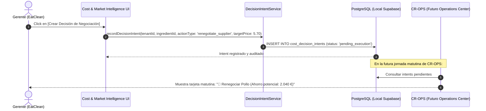

# CR-COST-05 — Product Evolution Blueprint v3.1: Interactive Economic Engine & Actionable Intelligence

**Subsystem:** Platform Core / Cost Intelligence & Food Market Price Intelligence  
**Document Version:** 3.1.0  
**Status:** 🟡 DRAFT CALIBRADO PARA RATIFICACIÓN HUMANA  
**Author:** Antigravity Architecture Team  
**Date:** 2026-09-27  

---

## 1. Fundamento y Declaración de Misión

### 1.1. Diagnóstico de la Revisión Humana de Producto
El pase técnico de las fases 1 a 4 y del refinamiento v2.0.0 cumplió con los contratos estáticos (tests, types, Chromium, normalización, RLS), pero dio lugar a una **interfaz pasiva de visualización**. 

El objetivo de esta versión calibrada **v3.1** es transformar la superficie en un **motor interactivo de decisión económica**, bajo un principio inquebrantable:
> **"Pasar de: Datos aislados ──► Comprensión ──► Escenario de Hipótesis ──► Decisión Auditada ──► Acción Operativa."**

---

## 2. Los 6 Principios y Calibraciones de Arquitectura

```text
┌────────────────────────────────────────────────────────────────────────────────────────────────────────────────────────┐
│                                       PRINCIPIOS DE GOBERNANZA ECONÓMICA (v3.1)                                        │
├────────────────────────────────┬────────────────────────────────┬──────────────────────────────────────────────────────┤
│ 1. INMUTABILIDAD ECONÓMICA     │ 2. AISLAMIENTO DE HIPÓTESIS    │ 3. VERACIDAD & ZERO FABRICACIÓN                      │
│ [REAL] nunca se sobreescribe.  │ [SIMULADO] vive en memoria y   │ Los ahorros anuales solo se calculan si existe       │
│ [MANUAL] se registra con autor │ cuenta con botón de "Deshacer" │ volumen real comprobable. Si falta: "— No disponible"│
│ y motivo sin alterar histórico.│ para revertir a coste real.    │                                                      │
├────────────────────────────────┼────────────────────────────────┼──────────────────────────────────────────────────────┤
│ 4. NIVELES DE ACCIONABILIDAD   │ 5. FRONTERA CON CR-COST-07     │ 6. PUENTE CON CR-OPS                                 │
│ 🟢 Acción Directa              │ Consulta de mercado acotada.   │ El insight genera un Decision Intent que alimentará  │
│ 🟡 Revisar Datos / Incompleto  │ Estudio integral de producto   │ el inicio de jornada en Operations Center.           │
│ ⚪ Información Exploratoria    │ permanece estrictamente en     │                                                      │
│ 🔴 Datos Insuficientes         │ CR-COST-07.                    │                                                      │
└────────────────────────────────┴────────────────────────────────┴──────────────────────────────────────────────────────┘
```

---

## 3. Especificación Detallada de las 4 Nuevas Capacidades Interactivas

### 3.1. Capacidad 1: Imputación Manual In-Situ con Trazabilidad (Sin Mutación Retroactiva)

#### A. Problema que Resuelve
Cuando un plato carece de costes indirectos (mano de obra, energía, packaging), la pantalla mostraba `— (Sin configurar)`. El usuario no tenía forma de resolverlo in-situ.

#### B. Flujo Operativo y de Datos
1. Junto al texto `— (Sin configurar)`, se integra el botón **`[Imputar]`**.
2. Al pulsar, se despliega el **Micro-Editor de Supuestos Operativos**:
   - Campos: Coste por ración (€), Tipo de imputación (*Mano de Obra*, *Energía*, *Packaging*), Rationale / Motivo (*ej. "Tarifa fija estimada convenio 2026"*).
   - Advertencia explícita en interfaz:
     > *"Este dato se registrará como un supuesto operativo [MANUAL] para cálculos y simulaciones futuras. No modifica facturas ni costes históricos reales [REAL]."*
3. **Persistencia y Reactividad:**
   - Se persiste con metadata: `recorded_by`, `recorded_at`, `provenance: 'MANUAL'`, `rationale`.
   - La interfaz actualiza el escandallo del plato inmediatamente sin recarga de página, marcando el coste con el tag 🟠 **`[MANUAL]`**.

---

### 3.2. Capacidad 2: Inyección de Hipótesis de Mercado en Simulador E9 con "Deshacer" Explícito

#### A. Problema que Resuelve
Ver una Pechuga de Pollo con benchmark favorable en Makro (5,70 €/kg vs WAC 6,40 €/kg) era un dato muerto; el usuario no podía ver qué significaría ese ahorro en el margen de toda su carta.

#### B. Flujo Operativo y Aislamiento de Memoria
```text
[Benchmark de Pechuga de Pollo en Makro: 5,70 €/kg]
                   │
                   ▼ Botón: [⚡ Simular con Precio de Mercado]
┌────────────────────────────────────────────────────────────────────────┐
│ SIMULADOR DE ESCENARIOS (E9) — HIPÓTESIS ACTIVA                        │
├────────────────────────────────────────────────────────────────────────┤
│ • Ingrediente Afectado: Pechuga de Pollo Fresca                        │
│ • Coste Base Actual [REAL]:        6,40 €/kg                           │
│ • Precio Observable [OBSERVADO]:   5,70 €/kg                           │
│ • Variación Aplicada:              -10,94%                             │
│ • Platos de la Carta Impactados:   4 platos                            │
│ • Margen Bruto Proyectado Carta:   68,4% (▲ +2,1%)                     │
├────────────────────────────────────────────────────────────────────────┤
│ [🔄 Revertir a Coste Real (Deshacer)]     [💾 Guardar como Escenario]  │
└────────────────────────────────────────────────────────────────────────┘
```
1. **Regla de Oro:** La acción **NO altera el WAC real de la base de datos**.
2. Navega fluidamente a la pestaña *Simulador de Escenarios*, inyecta la variación en memoria reactiva y recalcula la matriz de platos.
3. Un banner flotante permite en todo momento pulsar **`[Revertir a Coste Real]`**, limpiando la hipótesis y restableciendo los costes base.

---

### 3.3. Capacidad 3: Consulta de Mercado Acotada ("Preguntar al Mercado" — Frontera con CR-COST-07)

#### A. Frontera Estricta de Alcance
- **En CR-COST-05 (Esta Capacidad):** Consulta interactiva y cotización de mercado de ingredientes para un producto hipotético.
- **En CR-COST-07 (Futuro Backlog):** Motor integral de New Product Study con ingeniería de BOM multinivel, rendimientos térmicos, logística de distribución, dossier ejecutivo y aprobación de lanzamiento.

#### B. Flujo de Consulta de Mercado (Ejemplo: Tarta de Zanahoria a 4,00 €)
1. El usuario introduce:
   - Nombre de referencia: *"Tarta de Zanahoria"*
   - PVP Objetivo deseado: `4,00 €` / ración
2. El explorador busca en el catálogo observable de mercado los ingredientes y devuelve el estado de evidencia:
   - ✓ *Zanahoria fresca:* `1,15 €/kg` [OBSERVADO en Makro]
   - ✓ *Harina de trigo:* `0,95 €/kg` [OBSERVADO en Makro]
   - ✓ *Huevo fresco:* `0,22 €/ud` [OBSERVADO en Mercadona]
   - ✓ *Azúcar blanco:* `1,20 €/kg` [OBSERVADO en GM Cash]
   - ⚠️ *Queso Crema:* `— Sin referencia comparable en mercado` $\to$ Permite `[Ingresar coste manual estimado]` o continuar con datos disponibles.
3. **Diagnóstico Preliminar de Viabilidad:**
   - Coste Materia Prima Observable: `0,98 €` (24,5% del PVP).
   - Margen Bruto Preliminar: `75,5%` (a falta de costes operativos e ingredientes no comparables).
   - Diagnóstico: 🟢 **VIABILIDAD PRELIMINAR POSITIVA**.
4. **Acción de Cierre:** `[Guardar Consulta en Histórico de Inteligencia]`.

---

### 3.4. Capacidad 4: Insights Accionables con Trazabilidad y Niveles de Decisión

#### A. Clasificación de Accionabilidad (Taxonomía de 4 Niveles)

| Nivel de Decisión | Criterios de Ground Truth | Acción UI Habilitada |
| :--- | :--- | :--- |
| 🟢 **ACCIÓN DIRECTA** | • WAC [REAL] verificado.<br>• Benchmark [OBSERVADO] Alta Comparabilidad.<br>• Volumen Anual [REAL] registrado.<br>• Disparidad $>5\%$. | • `[⚡ Simular en Carta]`<br>• `[📑 Generar Informe Negociación]`<br>• `[📋 Crear Decision Intent]` |
| 🟡 **REVISAR DATOS** | • Benchmark observable presente.<br>• Falta volumen anual o comparabilidad Media. | • `[✏️ Completar Volumen Anual]`<br>• `[🔍 Ver Fuentes de Mercado]` |
| ⚪ **INFORMACIÓN** | • Precio de mercado registrado en catálogo pero sin mapear a ingrediente del tenant. | • `[🔗 Mapear con Ingrediente]` |
| 🔴 **INSUFICIENTE** | • Observación aislada, dispersión extrema o sin evidencia de comparabilidad. | • Muestra `— (Sin recomendación confiable)`. No fabrica datos. |

#### B. Regla Estricta de Veracidad en Ahorro Potencial
$$\text{Ahorro Potencial Anual (€)} = (\text{WAC}_{\text{REAL}} - \text{Benchmark}_{\text{OBSERVADO}}) \times \text{Volumen Anual}_{\text{REAL}}$$
- **Si el volumen anual no existe en el sistema:**
  La UI muestra:
  $$\text{Ahorro Potencial Anual: } \text{— (Requiere registrar volumen anual)}$$
  **Bajo ninguna circunstancia se inventará o extrapolará una cifra sin evidencia.**

---

### 3.5. Capacidad 5: Conexión con el Centro de Operaciones (`CR-OPS`) vía `Decision Intent`

Cuando el usuario decide actuar sobre un insight (por ejemplo, renegociar Pechuga de Pollo con Makro como alternativa):



Esto desacopla la creación del intent (en Cost Intelligence) de su consumo operativo (en Operations Center), permitiendo avanzar CR-COST-05 sin escribir código prematuro de CR-OPS.

---

## 4. Arquitectura de Componentes y Estado

```text
src/modules/market-intelligence/presentation/
├── components/
│   ├── MarketBenchmarkBadge.tsx           (Etiquetas limpias + tooltips explicativos)
│   ├── MarketSourceSpreadCard.tsx         (Comparativa suelo mayorista vs techo minorista)
│   ├── NegotiationBriefModal.tsx          (Informe Ejecutivo interactivo con tags)
│   ├── CatalogIngestionDrawer.tsx         (Ingesta CSV con inspector de cuarentena)
│   ├── ProductMappingQueueDrawer.tsx      (Cola de mapeo asistido con comparabilidad)
│   ├── MarketIntelligenceTab.tsx          (Cockpit principal con oportunidades y buscador)
│   ├── StrategicOpportunityCards.tsx      (NUEVO: Panel de Insights con Niveles de Decisión)
│   ├── MarketInquiryExplorerModal.tsx     (NUEVO: Consulta de Mercado "Tarta de Zanahoria")
│   └── IndirectCostQuickEditModal.tsx     (NUEVO: Micro-editor [MANUAL] in-situ con trazabilidad)
```

---

## 5. Matriz de Quality Gates para la Futura Verificación

| Criterio | Estándar Exigido en v3.1 |
| :--- | :--- |
| **Inmutabilidad Económica** | Comprobación por snapshot DB: WAC histórico y facturas permanecen inalterados tras usar simulación o imputación manual. |
| **Aislamiento de Hipótesis** | Botón `[Revertir a Coste Real]` restaura inmediatamente el estado base sin mutar el catálogo. |
| **Veracidad en Insights** | Ahorro anual muestra `— (Sin datos de volumen)` si falta `annualVolume`. Cero números inventados. |
| **Frontera de Alcance** | La consulta de nuevos platos cotiza ingredientes y calcula margen preliminar sin implementar el motor pesado de CR-COST-07. |
| **Calidad de Código** | `tsc --noEmit` = 0 errores. Vitest = 100% PASS. Chromium Playwright = 100% PASS con capturas de todas las interacciones nuevas. |

---

## 6. Estado de Gobernanza

```text
CR-COST-05 · Product Evolution

Blueprint v3.0                     🔴 REEMPLAZADO POR v3.1
Blueprint v3.1                     🟡 DRAFT COMPLETO LISTO PARA RATIFICACIÓN
Scope Lock v3.0                    🔴 PENDIENTE DE RATIFICACIÓN
Implementación                     🔴 BLOQUEADA
Git Commit / Push                  🔴 BLOQUEADO
Producción / Deploy                🔴 BLOQUEADO
```

Quedo a la espera de tu revisión y ratificación del **Blueprint v3.1** para proceder a redactar el **Scope Lock v3.0**.
