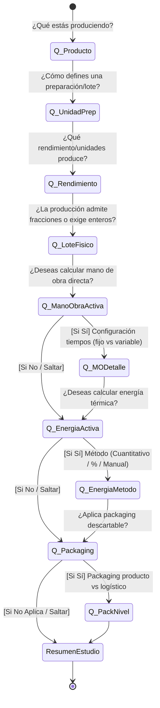
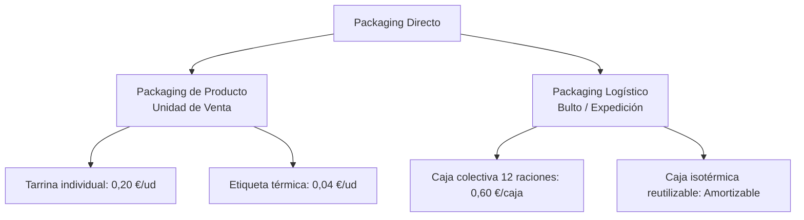
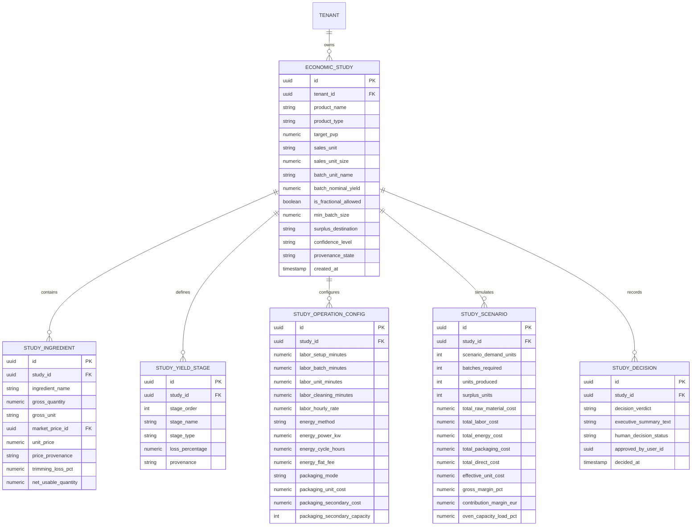

# YOURMEAL OS — BLUEPRINT DE ARQUITECTURA DE PRODUCTO Y CONTRATO DE DATOS
## CR-COST-07 · Product Economics & Production Scenario Engine
**Document ID:** `CR-COST-07-BLUEPRINT-DATA-CONTRACT-001`  
**Subsystem:** Core Cost Intelligence (E9) · Market Intelligence (E10) · Food Production Vertical  
**Status:** 🟡 **BLUEPRINT COMPLETE · PENDING HUMAN PRODUCT AUTHORITY QUESTIONS**  
**Governance Standard:** Zero Code Mutation · Zero DB Migration · Zero Commits · Zero Deployment  
**Date:** 2026-09-27  
**Authoring Authority:** Multi-Agent Council & Human Product Authority Consensus  

---

```text
========================================================================================
                              ESTADO DE GOBERNANZA
========================================================================================
STATUS:                       BLUEPRINT & DATA CONTRACT COMPLETE
IMPLEMENTATION:               BLOCKED (Sin autorización de código)
DATABASE:                     UNCHANGED (nhirlpkuvonggctdzzad intacta)
PRODUCTION:                   UNCHANGED (Cloudflare Worker 26a1ded6 intacto)
GIT WORKING TREE:             UNCHANGED (main en 4cb1e08b, solo docs/ agregados)
SIGUIENTE PASO:               RONDA DE PREGUNTAS SOBERANAS → SCOPE LOCK
========================================================================================
```

---

## 1. Executive Summary

El presente Blueprint formaliza la arquitectura técnica, el modelo conceptual de datos y los contratos de servicio de **CR-COST-07: Product Economics & Production Scenario Engine**. 

Este subsistema transforma radicalmente la capacidad validada en producción de **CR-COST-05 v4.1** (*"Preguntar al Mercado · Cotización de Nuevo Producto"*), elevándola desde una calculadora molecular de ingredientes hacia un **Motor de Inteligencia de Producción y Decisión Empresarial**:

```text
       ┌────────────────────────────────────────────────────────┐
       │             MARKET INTELLIGENCE (CR-COST-05)           │
       │     Precios Observados Públicos y Profesionales        │
       └───────────────────────────┬────────────────────────────┘
                                   │ Alimentación de precios base
                                   ▼
┌────────────────────────────────────────────────────────────────────────┐
│            CR-COST-07: PRODUCT ECONOMICS & SCENARIO ENGINE             │
│                                                                        │
│   ┌────────────────────────┐         ┌─────────────────────────────┐   │
│   │  Cuestionario Adaptativo│────────►│  Ontología de Lote & Merma  │   │
│   │  (Sin supuestos ciegos) │         │  (Rendimiento multietapa)   │   │
│   └────────────────────────┘         └──────────────┬──────────────┘   │
│                                                     │                  │
│                                                     ▼                  │
│   ┌────────────────────────┐         ┌─────────────────────────────┐   │
│   │  Operativa: MO + Energía│────────►│  Matriz de Escenarios       │   │
│   │  + Packaging directo   │         │  [ 10 · 20 · 30 · 60 · 100 ]│   │
│   └────────────────────────┘         └──────────────┬──────────────┘   │
│                                                     │                  │
│                                                     ▼                  │
│   ┌────────────────────────┐         ┌─────────────────────────────┐   │
│   │  Veredicto Ejecutivo   │◄────────│  Anatomía de Coste Directo  │   │
│   │  & Síntesis Narrativa  │         │  & Break-even Cuádruple     │   │
│   └────────────────────────┘         └─────────────────────────────┘   │
└──────────────────────────────────┬─────────────────────────────────────┘
                                   │
                                   ▼
       ┌────────────────────────────────────────────────────────┐
       │                 DECISIÓN HUMANA DE CARTA               │
       │   [Aprobar] · [Simular Shock] · [Descartar Viabilidad] │
       └────────────────────────────────────────────────────────┘
```

El motor resuelve la falla epistemológica de calcular *"por ración"* demasiado pronto: sitúa al **Lote/Preparación** como la unidad física primaria de fabricación y a la **Ración** como una unidad derivada de comercialización, calculando con exactitud los efectos del redondeo de lotes, los excedentes físicos, las mermas multietapa y las curvas no lineales de mano de obra y energía.

---

## 2. Product Principles

1. **Anti-Formulario Adaptativo:** El sistema no despliega un muro de 80 campos. Ramifica sus preguntas según la técnica del producto y ofrece siempre la opción `[Saltar / Configurar después]`.
2. **Física Discreta de Lotes:** La cocina real no hornea 1,67 tartas. El motor computa techos enteros discretos ($\lceil \text{Demanda} / \text{Rendimiento} \rceil$) o lotes fraccionados solo cuando la física de la preparación lo admita.
3. **El Excedente es Información Económica:** La producción que supera la demanda inmediata no se descarta silenciosamente; se le asigna un destino operativo (`STOCK`, `CONGELADO`, `MERMA`, etc.) que altera el coste efectivo vendido.
4. **Mermas Cuantitativas y Trazables:** Descomposición explícita de pérdidas (limpieza $\to$ cocción $\to$ porcionado). Prohibición de bibliotecas de porcentajes mágicos o no auditados.
5. **Cortafuegos de Costes Fijos:** El coste unitario directo ($\text{Materia Prima} + \text{MO Directa} + \text{Energía} + \text{Envase}$) jamás se contamina con repartos arbitrarios de alquiler o administración. La estructura se reserva para el análisis de viabilidad mensual y break-even.
6. **Síntesis Ejecutiva Humana:** El sistema no devuelve una cifra inerte, sino una explicación narrativa basada en datos que diagnostica viabilidad, cuellos de botella y riesgos.

---

## 3. Constitutional Rule

> ### 🏛️ Regla Constitucional de CR-COST-07:
> **"YOURMEAL OS NO ASUME: PREGUNTA, CALCULA Y EXPLICA."**  
> 
> *El sistema no presupone porcentajes ciegos, no impone jerarquías rígidas y no inventa costes. Descubre la realidad operativa de la cocina mediante un diálogo adaptativo, calcula con rigor dimensional y justifica cada número ante el operador.*

Cualquier cálculo que asuma que la energía es gratis, que la mano de obra es un porcentaje de los ingredientes, que un excedente es basura sin preguntar o que un producto pierde un porcentaje no confirmado por el operador, **viola la constitución de YourMeal OS**.

---

## 4. Economic Ontology

El sistema implementa una **red dimensional de transformación**, no una tubería rígida y obligatoria:


### Relaciones Ontológicas Flexibles por Tipo de Producto

| Tipo de Producto | Unidad de Receta | Unidad de Lote | Rendimiento por Lote | Unidad de Venta | Naturaleza del Lote |
| :--- | :--- | :--- | :--- | :--- | :--- |
| **Repostería (Tarta)** | 1 formulación | 1 tarta (1,8 kg) | 12 raciones (150 g) | 1 ración | **Discreta estricta** (enteros) |
| **Guiso / Salsa** | 10 kg de fondo | 1 olla (10 L) | 40 raciones (250 ml)| 1 tarrina 250 ml | **Fraccionable** (ej. 0,5 lotes) |
| **Ensalada Ensamble** | 20 unidades | 1 tirada (20 bowls)| 20 unidades | 1 bowl individual | **Unitaria escalable** |
| **Catering B2B** | 1 banquete | 1 servicio (100 pax)| 100 comensales | 1 evento cerrado | **Por lote cerrado** |

---

## 5. Adaptive Question Engine

El motor de cuestionario adaptativo opera mediante un árbol de decisión dinámico basado en estados:



### Principios de Ejecución del Cuestionario:
1. **Poda Contextual:** Si el operador marca que un producto es de ensamble frío, se ocultan instantáneamente las preguntas sobre potencia y precalentamiento de hornos.
2. **Salto de Gracia:** Cualquier pregunta dispone de la acción `[Saltar / Configurar después]`. El parámetro pasa al estado `[NO CONFIGURADO]` sin detener el flujo.
3. **Persistencia Progresiva:** Las respuestas parciales se guardan como borrador en el estudio económico.

---

## 6. Production & Lot Model

### 6.1 Cálculo del Techo Discreto
Para preparaciones con restricción física entera:
$$\text{Lotes Físicos} = \left\lceil \frac{\text{Demanda Requerida}}{\text{Rendimiento por Lote}} \right\rceil$$
$$\text{Producción Total Realizada} = \text{Lotes Físicos} \times \text{Rendimiento por Lote}$$
$$\text{Excedente Físico} = \text{Producción Total Realizada} - \text{Demanda Requerida}$$

### 6.2 Destino del Excedente y Repercusión Financiera

| Estado del Excedente | Significado Operativo | Tratamiento Económico en el Escenario |
| :--- | :--- | :--- |
| `STOCK_REFRIGERADO` | Pasa a cámara para venta en siguientes 48h. | El coste del excedente **se excluye** del coste de la tirada actual; pasa a activo de inventario. |
| `STOCK_CONGELADO` | Abatido y congelado para lote futuro. | Se excluye de la tirada; genera coste menor de envase de congelación. |
| `VENTA_POSTERIOR` | Demanda esperada en el mismo turno. | Coste repartido entre el volumen total producido. |
| `MERMA_DESPERDICIO` | No tiene salida comercial ni conservación. | El coste total del lote se **absorbe íntegramente por las unidades vendidas** ($\text{Coste Efectivo} \uparrow$). |
| `CONSUMO_INTERNO` | Comida de personal o muestra comercial. | Se imputa a cuenta de personal o marketing, no a la ración del cliente. |

$$\text{Coste Efectivo por Unidad Vendida} = \frac{\text{Coste Total Lotes} - \text{Valor Excedente Recuperable}}{\text{Demanda Vendida}}$$

---

## 7. Yield / Waste Model (Rendimiento Multietapa)

El motor implementa el cálculo multietapa sin redondeos prematuros:

```text
[MASA COMPRADA BRUTA: Q_0]
       │
       ▼ Etapa 1: Limpieza / Pelado (Merma M_1 %)
Q_1 = Q_0 × (1 - M_1)
       │
       ▼ Etapa 2: Transformación / Cocción (Merma M_2 %)
Q_2 = Q_1 × (1 - M_2)
       │
       ▼ Etapa 3: Porcionado / Descarte (Merma M_3 %)
Q_vendible = Q_2 × (1 - M_3)
```

$$\text{Rendimiento Acumulado Global} = (1 - M_1) \times (1 - M_2) \times (1 - M_3)$$
$$\text{Coste Efectivo de Materia Prima (€/kg vendible)} = \frac{\text{Coste Compra Total (€)}}{Q_{\text{vendible}} \text{ (kg)}}$$

*Gobernanza:* Cero bibliotecas de mermas predeterminadas en esta fase. Los valores $M_i$ son introducidos o validados por el operador con procedencia `[MANUAL]` o `[OBSERVADO]`.

---

## 8. Labor Model (Mano de Obra No Lineal)

El tiempo de trabajo se compone de factores fijos y factores escalables:

$$T_{\text{labor}} = T_{\text{setup}} + (N_{\text{lotes}} \times T_{\text{lote}}) + (Q_{\text{unidades}} \times T_{\text{unidad}}) + (M_{\text{kg}} \times T_{\text{masa}}) + T_{\text{limpieza}}$$

### Taxonomía de Tiempos:
- **$T_{\text{setup}}$ (Fijo por Tirada):** Mise en place, pesaje, preparación de utillaje (ej. 10 min).
- **$T_{\text{lote}}$ (Variable por Lote):** Batido de masa, volcado en molde, carga en horno (ej. 8 min/tarta).
- **$T_{\text{unidad}}$ (Variable por Ración):** Corte individual, emplatado, etiquetado (ej. 0,5 min/ración).
- **$T_{\text{limpieza}}$ (Fijo por Tirada):** Fregado de cubas, desinfección de estación (ej. 10 min).

$$\text{Coste Mano de Obra} = \frac{T_{\text{labor}} \text{ (minutos)}}{60} \times \text{Tarifa Horaria (€/h)}$$

Si la tarifa horaria no está definida en la instancia, el campo se marca `[NO CONFIGURADO]`.

---

## 9. Energy Model (Energía en 3 Modos Trazables)

El operador elige cómo reflejar el consumo térmico según la madurez de sus datos:

### Modo A: Cuantitativo (Basado en Equipos)
$$\text{Consumo (kWh)} = P_{\text{nominal}} \text{ (kW)} \times t_{\text{uso}} \text{ (h)} \times F_{\text{carga}}$$
$$\text{Coste Energía} = \text{Consumo (kWh)} \times \text{Tarifa (€/kWh)}$$
*(Donde $F_{\text{carga}}$ es el factor de ciclo termostático del equipo, por defecto 0.60 para hornos de convección).*

### Modo B: Porcentual Declarado
$$\text{Coste Energía} = \text{Coste Materia Prima} \times \frac{X_{\%}}{100}$$
*(Se registra explícitamente como `[CALC · PORCENTUAL]` indicando el % aplicado).*

### Modo C: Coste Promedio Manual
El operador asigna una cuantía fija por tirada o lote (ej. *"1,50 € de gas/luz por tarta"*).  
Se etiqueta de forma permanente como `[MANUAL]`.

---

## 10. Packaging Model (Jerarquía y Dimensiones)

El packaging se desagrega en dos niveles operativos con dimensión de aplicación configurable:



### Regla de Asignación Dimensional:
$$\text{Coste Packaging Total} = (Q_{\text{raciones}} \times C_{\text{envase\_unitario}}) + \left( \left\lceil \frac{Q_{\text{raciones}}}{\text{Capacidad Caja}} \right\rceil \times C_{\text{caja}} \right)$$
Si el producto se sirve sin envase desechable, se marca estrictamente como `[NO APLICA]`.

---

## 11. Fixed Costs Boundary (Cortafuegos de Estructura)

Se establece una frontera inquebrantable entre el **Coste Directo de Fabricación** y la **Estructura Fija**:

```text
       ┌────────────────────────────────────────────────────────┐
       │                 PVP DE VENTA (Sin IVA)                 │
       └───────────────────────────┬────────────────────────────┘
                                   │
                                   ▼  (-) COSTE DIRECTO DE PRODUCTO
       ┌────────────────────────────────────────────────────────┐
       │  • Materia Prima (ajustada por mermas multietapa)      │
       │  • Mano de Obra Directa (tiempos setup + preparación)  │
       │  • Energía Térmica Directa (ciclo de cocción)          │
       │  • Packaging Primario y Secundario                     │
       │  • Coste Neto de Excedentes No Reutilizables           │
       └───────────────────────────┬────────────────────────────┘
                                   │
                                   ▼  (=)
       ┌────────────────────────────────────────────────────────┐
       │               MARGEN DE CONTRIBUCIÓN DIRECTO           │
       │                 (Euros/ración y Porcentaje)            │
       └───────────────────────────┬────────────────────────────┘
                                   │
           ════════════════════════╪════════════════════════ (CORTAFUEGOS ESTRUCTURAL)
                                   │
                                   ▼  (-) COSTES ESTRUCTURALES (Solo para Viabilidad)
       ┌────────────────────────────────────────────────────────┐
       │  Alquiler de nave/local · Seguros · Software/SaaS ·    │
       │  Amortización de maquinaria · Salarios indirectos      │
       └───────────────────────────┬────────────────────────────┘
                                   │
                                   ▼  (=)
       ┌────────────────────────────────────────────────────────┐
       │               VIABILIDAD & BREAK-EVEN MENSUAL          │
       └────────────────────────────────────────────────────────┘
```

**Invariante:** Ningún algoritmo de YourMeal OS dividirá el alquiler entre las tartas de un día para inflar el coste unitario directo.

---

## 12. Scenario Engine (El Corazón del Motor)

El motor proyecta la rampa de escenarios estándar `[10 · 20 · 30 · 60 · 100 · 300]` y cualquier volumen personalizado introducido por el operador.

### Matriz Comparativa de Proyección (Ejemplo Tarta de Zanahoria, Lote = 12 raciones)

| Escenario (Demanda) | Lotes Físicos | Raciones Fabricadas | Excedente | Materia Prima | Mano Obra | Energía | Packaging | Coste Total | Coste/Ración Vendida | Margen Bruto (PVP 4€) |
| :---: | :---: | :---: | :---: | :---: | :---: | :---: | :---: | :---: | :---: | :---: |
| **10 raciones** | 1 | 12 | +2 (Stock) | 10,20 € | 7,50 € | 1,20 € | 4,00 € | 22,90 € | **2,29 €** | **42,8 %** |
| **20 raciones** | 2 | 24 | +4 (Stock) | 20,40 € | 10,00 €| 1,20 € | 8,00 € | 39,60 € | **1,98 €** | **50,5 %** |
| **30 raciones** | 3 | 36 | +6 (Stock) | 30,60 € | 12,50 €| 1,20 € | 12,00 €| 56,30 € | **1,88 €** | **53,0 %** |
| **60 raciones** | 5 | 60 | 0 | 51,00 € | 17,50 €| 2,40 € | 24,00 €| 94,90 € | **1,58 €** | **60,5 %** |
| **100 raciones**| 9 | 108 | +8 (Stock) | 91,80 € | 27,50 €| 3,60 € | 40,00 €| 162,90 €| **1,63 €** | **59,3 %** |
| **300 raciones**| 25 | 300 | 0 | 255,00 €| 67,50 €| 7,20 € | 120,00 €| 449,70 €| **1,50 €** | **62,5 %** |

*Comportamiento no lineal evidenciado:*  
Entre 10 y 60 raciones el coste unitario se reduce un **31%** debido a la amortización del setup de mano de obra y al aprovechamiento completo de la capacidad del horno. A 100 raciones experimenta un leve repunte por el excedente del noveno molde y la necesidad de un tercer ciclo térmico.

---

## 13. Break-Even Model (Cuádruple Métrica de Equilibrio)

El subsistema computa cuatro outputs complementarios para respaldar la toma de decisiones:

### 1. Break-Even por Lote / Tirada (Unidades)
$$BE_{\text{tirada}} = \left\lceil \frac{T_{\text{fijo\_setup}} \times \text{Tarifa} + \text{Energía Ciclo}}{\text{PVP} - (\text{Materia Prima Unit} + \text{Envase Unit} + \text{MO Variable Unit})} \right\rceil$$
Indica cuántas raciones de la tirada deben venderse para que la cocinada no sea deficitaria.

### 2. Break-Even Mensual (Volumen de Supervivencia)
$$BE_{\text{mensual}} = \frac{\text{Costes Fijos Mensuales Estructurales Atribuidos al Centro}}{\text{Margen de Contribución Medio por Ración (€)}}$$
Indica el volumen mensual necesario del producto (o mix) para pagar la estructura física. Si los costes fijos no están parametrizados en la instancia, se muestra `[NO CONFIGURADO]`.

### 3. PVP Mínimo Recomendado
$$PVP_{\text{min}} = \frac{\text{Coste Directo Total por Ración}}{1 - \text{Margen Objetivo Deseado (ej. 0.65)}}$$

### 4. Capacidad Operativa Requerida
$$\text{Ocupación de Horno} = \frac{\text{Lotes Físicos}}{\text{Capacidad Máxima de Moldes por Ciclo}} \times 100\%$$
Alerta si el volumen del escenario sobrepasa la jornada laboral o los metros de bandeja disponibles.

---

## 14. Market Inquiry Evolution (Estudio Económico de Nuevo Producto)

"Preguntar al Mercado" evoluciona desde un popup cotizador hacia una **Estación de Decisión Económica** estructurada en 9 fases secuenciales:

```text
FASE 1: IDEA & MERCADO ──► Nombre del producto y búsqueda de ingredientes en Makro/Mercadona
         │
FASE 2: RECETA BASE    ──► Formulación bruta de ingredientes requeridos para 1 preparación
         │
FASE 3: RENDIMIENTO    ──► Declaración de mermas (limpieza, cocción, porcionado) y raciones por lote
         │
FASE 4: PRODUCCIÓN     ──► Restricción física (¿discreto o fraccionable?) y destino de excedentes
         │
FASE 5: COSTES OPER.   ──► Configuración de tiempos de MO, método de energía y envases
         │
FASE 6: ESCENARIOS     ──► Generación de la rampa comparativa de volúmenes (10 a 300 + ad-hoc)
         │
FASE 7: ECONOMÍA       ──► Visualización de la anatomía de costes y márgenes de contribución
         │
FASE 8: CAPACIDAD      ──► Verificación de límites físicos de cocina y break-even cuádruple
         │
FASE 9: DECISIÓN       ──► Veredicto narrativo ejecutivo y registro de la decisión en el sistema
```

---

## 15. Provenance & Confidence Model

### 15.1 Taxonomía Epistémica y Chips de UI
Internamente, cada sumando preserva su linaje estricto. En la interfaz se presenta de forma limpia:

```text
3,15 € · [CALCULADO · MIXTO]
  ├── Materia Prima: 1,02 € [OBSERVADO · MAKRO]
  ├── Mano de Obra:   0,60 € [CALCULADO · REAL]
  ├── Energía:        0,05 € [CALCULADO · CUANTITATIVO]
  ├── Packaging:      0,40 € [REAL · FACTURA]
  └── Queso Crema:    0,35 € [MANUAL · ESTIMADO]
```

### 15.2 Nivel de Confianza Humana (Sin Porcentajes Ruidosos)

| Nivel de Confianza | Insignia UI | Criterio de Activación | Mensaje al Usuario |
| :---: | :---: | :--- | :--- |
| **ALTA** | 🟢 `Confianza Alta` | $>80\%$ de los costes directos proceden de `REAL_WAC` u `OBSERVADO` verificado. Cero costes esenciales en `[SIN DATOS]`. | *"Basado principalmente en precios auditados y tarifas reales de tu cocina."* |
| **MEDIA** | 🟡 `Confianza Media` | Existen ingredientes relevantes o mermas en estado `[MANUAL]` o la energía es un `% estimado`. | *"Viable con supuestos manuales. Revisa el precio del queso crema y el rendimiento."* |
| **BAJA** | 🔴 `Confianza Baja` | Hay dimensiones clave `[NO CONFIGURADO]` o más del $50\%$ de la materia prima carece de precio. | *"Datos insuficientes para certificar viabilidad. Rellena los ingredientes pendientes."* |

---

## 16. Executive Decision Layer (Veredicto Narrativo)

El sistema genera una **Síntesis Ejecutiva Determinista** (sin invenciones ni alucinaciones de IA generativa no supervisada) aplicando plantillas condicionales auditadas:

```text
┌────────────────────────────────────────────────────────────────────────────────────────┐
│  VEREDICTO ECONÓMICO EJECUTIVO                                                         │
│                                                                                        │
│  "A un PVP de 4,00 €/ración, la Tarta de Zanahoria Casera es VIABLE en los escenarios  │
│   de 60 a 300 raciones (margen de contribución entre 59,3% y 62,5%).                   │
│                                                                                        │
│   A escalas pequeñas (10–30 raciones), el coste unitario se eleva hasta un 52% debido  │
│   al peso del setup de cocina y al excedente de 2 a 6 raciones del molde mínimo de     │
│   12 unidades.                                                                         │
│                                                                                        │
│   ⚠ Factores de Sensibilidad: El estudio depende de un precio [MANUAL] de 4,50 €/kg   │
│   para el queso crema y de una merma de cocción estimada del 5%."                     │
│                                                                                        │
│   [Ver Anatomía de Costes]   [Comparar Escenarios]   [Simular Shock]   [Aprobar Plato] │
└────────────────────────────────────────────────────────────────────────────────────────┘
```

---

## 17. Core vs. Food vs. Instance Boundary

```text
┌────────────────────────────────────────────────────────────────────────┐
│                        CORE PLATFORM (Generic)                         │
│  • Motor de conversión dimensional (kg, g, l, ml, unidades).           │
│  • Gestor de grafos de estados epistémicos y cálculo de procedencia.   │
│  • Algoritmo matemático de techo discreto (Ceiling / Rounding).        │
│  • Contenedor abstracto de matriz de escenarios multidimensionales.    │
│  • Framework de preguntas y respuestas adaptativas (State Machine).    │
└───────────────────────────────────┬────────────────────────────────────┘
                                    │
                                    ▼
┌────────────────────────────────────────────────────────────────────────┐
│                       FOOD VERTICAL DOMAIN (Food)                      │
│  • Estructuras de Escandallo y Receta Culinaria (BOM de alimentos).   │
│  • Ontología de mermas multietapa (limpieza, evaporación, corte).      │
│  • Semántica de destino de excedentes (cámara, congelación, merma).    │
│  • Modelos térmicos de maquinaria culinaria (hornos, fuegos, freidoras)│
│  • Jerarquía de packaging alimentario (contacto primario vs catering). │
└───────────────────────────────────┬────────────────────────────────────┘
                                    │
                                    ▼
┌────────────────────────────────────────────────────────────────────────┐
│                    INSTANCE RUNTIME (EatClean, etc.)                   │
│  • Coste/hora laboral de la plantilla de cocina (ej. 18,00 €/h).       │
│  • Tarifa contratada de suministro eléctrico/gas (ej. 0,22 €/kWh).     │
│  • Catálogo local de envases y proveedores de packaging asignados.     │
│  • Capacidad geométrica de cocina (número de bandejas de horno).       │
│  • PVP fijado de carta y política comercial de la marca.               │
└────────────────────────────────────────────────────────────────────────┘
```

---

## 18. Conceptual Data Model

El modelo conceptual desacopla la formulación de la receta de las ejecuciones de escenario y del registro de decisiones.



---

## 19. Service & API Contracts

### 19.1 Servicio de Cuestionario Adaptativo
```typescript
interface AdaptiveQuestionnaireQuery {
  tenantId: string;
  studyId?: string;
  currentStep: string;
  providedAnswers: Record<string, any>;
}

interface AdaptiveQuestionnaireResponse {
  currentStep: string;
  isComplete: boolean;
  nextQuestions: Array<{
    id: string;
    questionText: string;
    helpText?: string;
    dataType: 'string' | 'number' | 'boolean' | 'enum';
    options?: Array<{ label: string; value: any }>;
    defaultValue?: any;
    allowsNotApplicable: boolean;
    allowsSkip: boolean;
  }>;
  skippedQuestions: string[];
}
```

### 19.2 Contrato del Motor de Escenarios Económicos
```typescript
interface CalculateProductEconomicsRequest {
  tenantId: string;
  productDefinition: {
    name: string;
    targetPvp: number;
    batchUnitName: string;
    nominalBatchYield: number;
    isFractionalAllowed: boolean;
    surplusDestination: 'STOCK_REFRIGERADO' | 'STOCK_CONGELADO' | 'VENTA_POSTERIOR' | 'MERMA_DESPERDICIO' | 'CONSUMO_INTERNO';
  };
  ingredients: Array<{
    name: string;
    grossQty: number;
    grossUnit: string;
    marketPriceId?: string;
    manualUnitPrice?: number;
    trimmingLossPct: number;
  }>;
  yieldStages: Array<{
    stageName: string;
    lossPct: number;
  }>;
  operatingCosts: {
    labor: {
      setupMinutes: number;
      batchMinutes: number;
      unitMinutes: number;
      cleaningMinutes: number;
      hourlyRate?: number;
    };
    energy: {
      method: 'QUANTITATIVE' | 'PERCENTAGE' | 'MANUAL_FLAT' | 'NOT_APPLICABLE';
      powerKw?: number;
      cycleHours?: number;
      tariffKwh?: number;
      percentageRate?: number;
      flatFee?: number;
    };
    packaging: {
      status: 'CONFIGURED' | 'NOT_APPLICABLE' | 'UNCONFIGURED';
      unitCost?: number;
      secondaryBundleCost?: number;
      secondaryCapacity?: number;
    };
  };
  requestedScenarios: number[]; // e.g. [10, 20, 30, 60, 100, 300, 42]
}

interface CalculateProductEconomicsResponse {
  studyId: string;
  confidence: {
    level: 'HIGH' | 'MEDIUM' | 'LOW';
    epistemicBadge: string;
    whyExplanation: string[];
  };
  breakEven: {
    runUnits: number | null;
    monthlyUnits: number | null;
    minimumPvp: number | null;
    capacityWarning?: string;
  };
  scenarios: Array<{
    demandUnits: number;
    batchesRequired: number;
    unitsProduced: number;
    surplusUnits: number;
    costAnatomy: {
      rawMaterial: number;
      labor: number | null;
      energy: number | null;
      packaging: number | null;
      totalDirect: number;
    };
    costPerSoldUnit: number;
    marginPct: number;
    contributionEur: number;
    capacityLoadPct: number;
  }>;
  executiveVerdict: {
    status: 'VIABLE' | 'VIABLE_CONDITIONED' | 'NOT_VIABLE' | 'INSUFFICIENT_DATA';
    summaryNarrative: string;
    sensitivityFactors: string[];
    availableActions: Array<'VIEW_ANATOMY' | 'COMPARE_SCENARIOS' | 'SIMULATE_SHOCK' | 'RECORD_DECISION'>;
  };
}
```

---

## 20. UX State Machine (10 Estados de Experiencia)

```text
[1. NUEVO PRODUCTO] ──────► Entrada inicial de nombre y PVP objetivo
        │
        ▼
[2. CUESTIONARIO ADAPT.] ──► Flujo guiado de preguntas esenciales con escape [Saltar]
        │
        ▼
[3. DEFINICIÓN PRODUCTO] ──► Definición de unidades de venta y de preparación
        │
        ▼
[4. CONFIG. PRODUCCIÓN] ──► Lote entero vs fraccionado y destino de excedentes
        │
        ▼
[5. CONFIG. COSTES] ──────► Mermas multietapa, MO, método de energía y envases
        │
        ▼
[6. MATRIZ ESCENARIOS] ───► Tabla y gráfica comparativa [10 · 20 · 30 · 60 · 100 · 300]
        │
        ▼
[7. ANATOMÍA DE COSTE] ───► Desglose visual waterfall (Materia prima, MO, luz, packaging)
        │
        ▼
[8. MODAL DE CONFIANZA] ──► Drill-down "¿Por qué?" explicando procedencia y vacíos
        │
        ▼
[9. VEREDICTO EJECUTIVO] ─► Caja de síntesis narrativa humana y riesgos clave
        │
        ▼
[10. REGISTRO DECISIÓN] ──► Botón de acción soberana: [Aprobar para Carta / Archivar]
```

---

## 21. Invariants (Reglas de Oro del Sistema)

1. **Invariante de Techo Físico:** Si `is_fractional_allowed = false`, `batches_required` debe ser estrictamente un entero $\ge 1$.
2. **Invariante de No Gratuidad Silenciosa:** Si la mano de obra o energía están sin configurar, el coste correspondiente no puede ser `0,00 €`; debe mostrarse `[NO CONFIGURADO]` y el margen neto no puede emitir veredicto definitivo.
3. **Invariante de Pureza de Datos Reales:** Ninguna simulación de escenario alterará jamás el histórico de compras, el WAC real de inventario ni los precios facturados en la base de datos de producción.
4. **Invariante de Destino de Excedente:** Todo excedente debe tener un destino asignado (`STOCK`, `VENTA`, `MERMA`, etc.).
5. **Invariante de Trazabilidad:** Todo sumando de coste directo debe llevar su etiqueta de procedencia (`[REAL]`, `[OBSERVADO]`, `[MANUAL]`, `[CALCULADO]`, `[SIMULADO]`).
6. **Invariante de Aislamiento Tenant:** Toda consulta o cálculo está indexado obligatoriamente por `tenant_id` mediante RLS estricto.

---

## 22. Failure & Missing Data States

| Estado de Dato | Representación en UI | Impacto en el Cálculo | Capacidad de Decisión |
| :--- | :--- | :--- | :--- |
| **`[NO APLICA]`** | Texto tenue `[No aplica]` | Suma 0,00 € de forma legítima (la dimensión no existe). | 🟢 Permite veredicto completo. |
| **`[NO CONFIGURADO]`**| Chip ámbar `[No configurado]` | Se excluye del total; se añade aviso al margen. | 🟡 Veredicto condicionado. |
| **`[SIN DATOS]`** | Chip rojo `[Sin datos]` | Bloquea el cálculo del sumando específico. | 🔴 Veredicto bloqueado para margen. |
| **`[MANUAL]`** | Chip azul `[Manual]` | Se computa utilizando el valor estimado por el operador. | 🟡 Veredicto condicionado a revisión. |
| **`[OBSOLETO]`** | Chip naranja `[>30 días]` | Se computa pero advierte de riesgo inflacionario. | 🟡 Veredicto condicionado a refresco. |

---

## 23. Security & Tenant Isolation

- **Supabase RLS Policy:** Todas las futuras tablas del modelo `economic_study_*` implementarán políticas estrictas:
  ```sql
  -- (Especificación conceptual de seguridad, no migración física)
  CREATE POLICY "Tenant isolation for economic studies" 
  ON economic_studies FOR ALL 
  USING (tenant_id = auth.jwt() ->> 'tenant_id');
  ```
- **Sin Fugas Inter-Tenant:** Las recetas, rendimientos y costes de mano de obra de un tenant (ej. EatClean) son completamente invisibles para otros tenants de la plataforma YourMeal OS.
- **Precios de Mercado Públicos:** Las observaciones de mercado (`food_market_prices` de CR-COST-05) son de lectura compartida en catálogo público neutral, pero las cotizaciones privadas de proveedores son privadas por tenant.

---

## 24. Future Extensions (Roadmap Posterior)

1. **Arquetipos de Producción Reutilizables (Fase 07B/C):** Guardar plantillas de procesos (ej. *"Método Pastelería Horno 175°C"*) para instanciarlas en nuevas recetas en 1 click.
2. **Ingesta Inteligente de Facturas (CR-COST-06):** Alimentación automática del WAC real mediante escaneo OCR asistido de albaranes y facturas de compra en PDF.
3. **Kitchen Operations Center (CR-OPS):** Conversión de los escenarios de producción aprobados en órdenes reales de trabajo de cocina y listas de preparación de mise en place.
4. **Distribution & Delivery Economics:** Conexión del coste de producto terminado con las tarifas de reparto de última milla y comisiones de canales de delivery.

---

## 25. Explicit Out-of-Scope (Lo que NO se construye en CR-COST-07)

- ❌ **Cero OCR de facturas:** Reservado exclusivamente para **CR-COST-06**.
- ❌ **Cero distribución y última milla:** Sin cálculo de flotas, kilometraje, comisiones de Glovo o UberEats.
- ❌ **Cero MRP / Planificación Industrial Automática:** No genera órdenes de compra automáticas a proveedores.
- ❌ **Cero Sensores IoT:** Sin conexión a enchufes inteligentes ni telemetría en tiempo real de maquinaria.
- ❌ **Cero Modificación Automática de Precios:** No muta el PVP de venta en las plataformas de comanda sin confirmación humana explícita.
- ❌ **Cero IA Generativa con Respuestas No Auditadas:** Toda la síntesis narrativa se basa en reglas deterministas de negocio.

---

## 26. Open Questions for Human Product Authority

Para que la Autoridad Humana de Producto pueda ejercer su soberanía antes de bloquear el alcance (Scope Lock), se formulan las siguientes **5 preguntas clave de arquitectura y negocio**:

1. **¿Confirmamos que el Cuestionario Adaptativo debe permitir guardar un estudio en estado "Borrador Incompleto"** para que el hostelero pueda salir a medir un tiempo en cocina y continuar más tarde?
2. **Respecto al destino del excedente:** Si el operador no define qué hace con las raciones sobrantes de un lote, ¿prefieres que por defecto el sistema las considere `STOCK_REFRIGERADO` (asumiendo venta futura) o `MERMA_DESPERDICIO` (el escenario más conservador para proteger el margen)?
3. **En la vista comparativa de escenarios:** ¿Deseas que la tabla resalte automáticamente el **"Escenario Óptimo de Margen"** con una insignia verde distintiva?
4. **En cuanto a la evolución de "Preguntar al Mercado":** ¿Mantenemos la experiencia rápida de ingredientes actual como pestaña de *"Cotización Rápida"* y añadimos la pestaña *"Estudio Completo de Producción"*, o fusionamos ambas en un único flujo progresivo?
5. **Para el despliegue del subsistema:** ¿Ratificas la división en tres hitos:
   - **07A:** Fundación de Datos, Recetas, Lotes y Mermas Multietapa.
   - **07B:** Motor de Escenarios Operativos, Tiempos, Energía y Packaging.
   - **07C:** Interfaz Interactiva de Decisión, Síntesis Ejecutiva y Veredicto?

---

## 27. Implementation Gate

```text
========================================================================================
                              PUERTA FINAL DE GOBERNANZA
========================================================================================
ESTADO DEL BLUEPRINT:         COMPLETO Y DOCUMENTADO (Solo lectura)
ESTADO DE IMPLEMENTACIÓN:     BLOQUEADO (Cero código ejecutable)
BASE DE DATOS:                INALTERADA (Sin migraciones DDL ni DML)
PRODUCCIÓN:                   INALTERADA (Worker 26a1ded6 intacto)
GIT STATUS:                   INALTERADO (Sin commits, sin pushes)
AUTORIZACIÓN REQUERIDA:       RESOLUCIÓN DE PREGUNTAS SOBERANAS → SCOPE LOCK OFICIAL
========================================================================================
```
