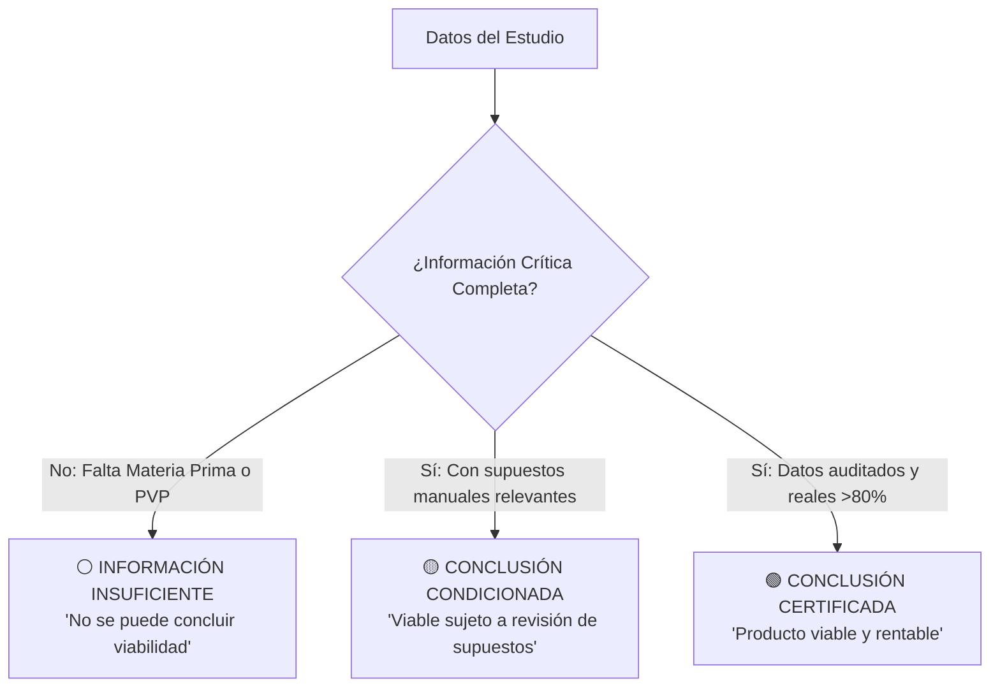
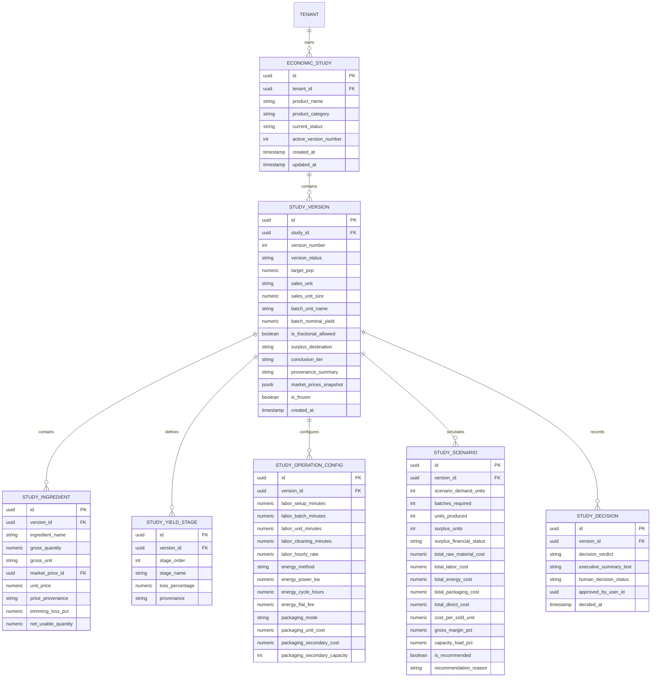

# YOURMEAL OS — BLUEPRINT DE ARQUITECTURA DE PRODUCTO Y CONTRATO DE DATOS (v2.0)
## CR-COST-07 · Product Economics & Production Scenario Engine
**Document ID:** `CR-COST-07-BLUEPRINT-DATA-CONTRACT-v2`  
**Subsystem:** Core Cost Intelligence (E9) · Market Intelligence (E10) · Food Production Vertical  
**Version:** **2.0 (Ratified Product Consensus · Pre-Scope-Lock)**  
**Status:** 🟡 **BLUEPRINT v2 COMPLETE · READY FOR FINAL HUMAN READING**  
**Governance Standard:** Zero Code Mutation · Zero DB Migration · Zero Commits · Zero Deployment  
**Date:** 2026-09-27  
**Authoring Authority:** Multi-Agent Council & Human Product Authority (Sovereign Consensus)  

---

```text
========================================================================================
                              ESTADO DE GOBERNANZA
========================================================================================
STATUS:                       BLUEPRINT v2 RATIFIED (Solo Lectura)
IMPLEMENTATION:               BLOCKED (Sin autorización de código)
DATABASE:                     UNCHANGED (nhirlpkuvonggctdzzad intacta)
PRODUCTION:                   UNCHANGED (Cloudflare Worker 26a1ded6 intacto)
GIT WORKING TREE:             UNCHANGED (main en 4cb1e08b, solo docs/ modificados)
SIGUIENTE PASO:               LECTURA FINAL HUMANA → CREACIÓN DE SCOPE LOCK
========================================================================================
```

---

## 1. Executive Summary

El presente Blueprint v2 consolida la arquitectura definitiva y los contratos de datos de **CR-COST-07: Product Economics & Production Scenario Engine**, integrando las correcciones críticas emitidas por la Autoridad Humana de Producto:

1. **Gobernanza Rigurosa del Excedente:** Prohibición absoluta de asumir `STOCK` o `MERMA` por defecto; si el operador no especifica el destino, se declara `[DESTINO NO CONFIGURADO]` y se bloquea el coste efectivo vendido para evitar distorsiones.
2. **Escenario Recomendado Multidimensional:** Sustitución del concepto simplista de "escenario óptimo" por una evaluación condicionada al **objetivo del operador** (coste, margen, beneficio, excedente) y **restringida por la capacidad física real de cocina**.
3. **Estudios Versionados e Inmutables:** Los estudios económicos se congelan en el tiempo. Si un precio de mercado en Makro/Mercadona cambia, el sistema **nunca muta silenciosamente el estudio**, sino que notifica la novedad y genera una **Versión 2 (v1 vs v2)** bajo acción humana explícita.
4. **Flujo Progresivo Unificado:** Se fusiona la cotización rápida de ingredientes con el estudio profundo de producción en un único embudo de 4 niveles (`Rápido → Receta → Producción → Decisión`).
5. **Derecho Constitucional a Declarar "NO SÉ":** Si faltan variables críticas, el motor rechaza emitir veredictos de viabilidad y declara abiertamente `[INFORMACIÓN INSUFICIENTE]`.

```text
NIVEL 1: RÁPIDO         ──► Cotización de ingredientes con precios de mercado observables
           │
NIVEL 2: RECETA         ──► Formulación, mermas multietapa y peso terminado
           │
NIVEL 3: PRODUCCIÓN     ──► Lotes físicos, MO escalable, energía, envases y matriz de escenarios
           │
NIVEL 4: DECISIÓN       ──► Capacidad, break-even, veredicto narrativo y congelación de versión
```

---

## 2. Product Principles

1. **"YourMeal OS No Asume: Pregunta, Calcula y Explica":** El sistema no rellena vacíos con porcentajes mágicos ni costes supuestos.
2. **Flujo Progresivo sin Fricción:** El operador entra cotizando ingredientes y puede profundizar hacia producción sin cambiar de módulo ni enfrentarse a un muro de 80 campos obligatorios.
3. **Física Real de Lote y Techo Discreto:** La cocina produce en lotes físicos ($\lceil \text{Demanda} / \text{Rendimiento} \rceil$). La ración es solo una unidad derivada de comercialización.
4. **Honestidad ante la Incertidumbre (Capacidad de decir "NO SÉ"):** Distinción explícita entre conclusiones certificadas, condicionadas e información insuficiente.
5. **Reproducibilidad Histórica mediante Versionado:** Toda decisión económica queda anclada a los precios y supuestos exactos vigentes en su fecha de creación.
6. **Cortafuegos Estructural Inviolable:** El coste directo unitario jamás se contamina con repartos arbitrarios de alquiler o administración.

---

## 3. Constitutional Rule

> ### 🏛️ Regla Constitucional de CR-COST-07:
> **"YOURMEAL OS NO ASUME: PREGUNTA, CALCULA Y EXPLICA."**  
> 
> *El sistema no presupone porcentajes ciegos, no impone jerarquías rígidas y no inventa costes. Descubre la realidad operativa de la cocina mediante un diálogo adaptativo, calcula con rigor dimensional y justifica cada número ante el operador. Si faltan datos críticos, no emite juicios de viabilidad: declara información insuficiente.*

---

## 4. Economic Ontology

El modelo rechaza una jerarquía única y obligatoria en favor de una **red dimensional de transformación flexible**:


### Relaciones Ontológicas Flexibles

- **Tarta:** 1 receta $\to$ 1 lote físico (1 tarta) $\to$ 12 raciones (venta). Lote **discreto estricto** (enteros).
- **Salsa:** 1 receta (10 kg) $\to$ 1 lote (10 kg) $\to$ venta en tarrinas de 250 ml. Lote **fraccionable** (ej. 0,5 lotes = 5 kg).
- **Ensalada:** 1 preparación (20 unidades) $\to$ 20 bowls individuales. Lote **unitario escalable**.
- **Catering:** 1 servicio (100 comensales) $\to$ 1 lote cerrado por evento.

---

## 5. Adaptive Question Engine & Ciclo de Vida del Estudio

### 5.1 Ciclo de Vida de un Estudio Económico
Un estudio económico avanza a través de 5 estados explícitos y puede guardarse en cualquier momento sin contaminar el sistema operativo:

```text
[ BORRADOR ] ────────► El operador inicia el estudio; puede salir a medir mermas o pesar ingredientes.
      │                Cero impacto en costes reales, inventario ni recetas del restaurante.
      ▼
[ EN CONFIGURACIÓN ] ─► Se completan ingredientes y mermas; faltan dimensiones operativas opcionales.
      │
      ▼
[ LISTO SIMULAR ] ───► Parámetros suficientes para generar la matriz de escenarios.
      │
      ▼
[ ESTUDIADO ] ───────► Escenarios evaluados, cuellos de botella identificados y versión congelada.
      │
      ▼
[ DECISIÓN ] ────────► La dirección registra su resolución soberana: [Aprobar Carta / Descartar].
```

### 5.2 Árbol de Preguntas Adaptativas
1. **Poda Contextual:** Si el producto no requiere horneado, se omiten las preguntas sobre potencia y tiempo de ciclo térmico.
2. **Botón de Escape Sistemático:** Toda pregunta incluye `[Saltar / Configurar después]`.
3. **No Bloqueo:** El estudio calcula lo conocido (ej. coste de materia prima: 0,85 €) y reporta el resto como `[NO CONFIGURADO]`.

---

## 6. Production & Lot Model: Lotes Físicos y Gobernanza de Excedentes

### 6.1 Regla del Techo Discreto
Para preparaciones donde la física culinaria no admite fracciones:
$$\text{Lotes Físicos} = \left\lceil \frac{\text{Demanda Requerida}}{\text{Rendimiento por Lote}} \right\rceil$$
$$\text{Producción Total Realizada} = \text{Lotes Físicos} \times \text{Rendimiento por Lote}$$
$$\text{Excedente Físico} = \text{Producción Total Realizada} - \text{Demanda Requerida}$$

### 6.2 El Principio del Excedente No Asumido

> ⚠️ **REGLA CONSTITUCIONAL DE EXCEDENTES:**  
> Si `Excedente Físico > 0` y el operador no ha seleccionado explícitamente su destino, el sistema **NUNCA asumirá que es Stock ni que es Merma**.  
> Se declara formalmente como:  
> **`[DESTINO NO CONFIGURADO]`**

### 6.3 Consecuencias Financieras del Destino de Excedentes

$$\text{Coste Bruto de Producción} = \text{Coste Total de los Lotes Fabricados (Ingredientes + MO + Luz + Envases)}$$

| Destino del Excedente | Tratamiento Financiero | Coste Efectivo por Ración Vendida |
| :--- | :--- | :--- |
| **`[DESTINO NO CONFIGURADO]`** | **No se puede calcular el coste efectivo vendido.** Se muestra alerta: *"4 unidades producidas de más con destino incierto"*. | **`[PENDIENTE DE DESTINO]`** |
| **`STOCK_REFRIGERADO`** | El excedente pasa a cámara para vender en el siguiente turno. Su coste se difiere al inventario. | $\frac{\text{Coste Total} - \text{Coste Excedente}}{\text{Demanda Vendida}}$ (Coste óptimo) |
| **`STOCK_CONGELADO`** | Abatido y congelado para lote futuro. Coste diferido con pequeño recargo de envase. | $\frac{\text{Coste Total} - \text{Coste Excedente}}{\text{Demanda Vendida}}$ |
| **`VENTA_POSTERIOR`** | Se asume venta natural durante la jornada. | $\frac{\text{Coste Total}}{\text{Producción Realizada}}$ |
| **`MERMA_DESPERDICIO`** | Sin conservación ni venta posterior. **Pérdida asumida.** | $\frac{\text{Coste Total de Fabricación}}{\text{Demanda Vendida}}$ (Coste penalizado) |
| **`CONSUMO_INTERNO`** | Comida de personal o degustación de marketing. | Coste imputado a cuenta de personal/mkt; ración de venta queda limpia. |

---

## 7. Yield / Waste Model (Rendimiento Multietapa Cuantitativo)

El sistema calcula pérdidas en tres estadios físicos sin números mágicos:

```text
[MASA COMPRADA BRUTA: Q_0]
       │
       ▼ Etapa 1: Limpieza / Pelado (Merma M_1 %)
Q_1 = Q_0 × (1 - M_1)
       │
       ▼ Etapa 2: Transformación / Cocción (Merma M_2 %)
Q_2 = Q_1 × (1 - M_2)
       │
       ▼ Etapa 3: Porcionado / Descarte (Merma M_3 %)
Q_vendible = Q_2 × (1 - M_3)
```

$$\text{Rendimiento Acumulado Global} = (1 - M_1) \times (1 - M_2) \times (1 - M_3)$$
$$\text{Coste Efectivo de Materia Prima (€/kg vendible)} = \frac{\text{Coste Compra Total (€)}}{Q_{\text{vendible}} \text{ (kg)}}$$

*Gobernanza:* Cero bibliotecas de mermas automáticas. Toda merma requiere validación del operador con procedencia `[MANUAL]` u `[OBSERVADO]`.

---

## 8. Labor Model: Tiempos Escalables y Costes Parciales

El tiempo de trabajo se compone de factores fijos y factores escalables:
$$T_{\text{labor}} = T_{\text{setup}} + (N_{\text{lotes}} \times T_{\text{lote}}) + (Q_{\text{unidades}} \times T_{\text{unidad}}) + (M_{\text{kg}} \times T_{\text{masa}}) + T_{\text{limpieza}}$$

- $T_{\text{setup}}$ y $T_{\text{limpieza}}$ son **fijos por tirada** (amortizables a mayor volumen).
- $T_{\text{lote}}$ o $T_{\text{unidad}}$ son **variables**.

### Principio de Coste Parcial Conocido:
Si la mano de obra no está configurada, el sistema **no inventa una cifra ni asume 0,00 €**:
- Muestra: `Materia Prima: 0,85 € · Mano de Obra: [NO CONFIGURADO]`.
- Reporta: `Coste Parcial Conocido: 0,85 €`.
- Advierte: `Coste Económico Completo: Pendiente de configuración de tiempos/tarifas`.

---

## 9. Energy Model: Tres Métodos Trazables

1. **Método Cuantitativo:** $\text{Potencia (kW)} \times \text{Tiempo de Ciclo (h)} \times \text{Factor Carga (0.60)} \times \text{Tarifa (€/kWh)}$.
2. **Método Porcentual:** $X\%$ declarado sobre materia prima (etiquetado como `[CALC · PORCENTUAL]`).
3. **Método Promedio Manual:** Coste fijo introducido por el operador (ej. 1,50 €/tarta) con chip `[MANUAL]`.
4. **Si no aplica:** Texto tenue `[NO APLICA]` (ej. ensaladas frías).
5. **Si falta información:** Chip ámbar `[NO CONFIGURADO]` sin sumar 0,00 €.

---

## 10. Packaging Model: Dos Niveles y Dimensiones de Aplicación

- **Packaging de Producto (Primario):** Vinculado a la ración/unidad vendida (tarrina, tapa, etiqueta).
- **Packaging Logístico (Secundario/Terciario):** Vinculado al bulto de transporte (cajas de 12 unidades, cubeta isotérmica).
- Si se sirve en vajilla de local o a granel: estrictamente `[NO APLICA]`.

---

## 11. Fixed Costs Boundary: Cortafuegos de Estructura

El sistema prohíbe la absorción arbitraria de costes fijos en el plato:
- **Coste Directo:** Materia prima + MO directa + Energía directa + Envases + Mermas de tirada.
- **Margen de Contribución I y II:** $\text{PVP} - \text{Costes Directos}$.
- **Costes Fijos (Alquiler, seguros, salarios base):** Exclusivamente utilizados para calcular el **Break-even Mensual** y la viabilidad del negocio, jamás para inflar el coste unitario del plato.

---

## 12. Scenario Engine & Evaluación Multidimensional de Escenarios

El motor proyecta la rampa estándar `[10 · 20 · 30 · 60 · 100 · 300]` y volúmenes ad-hoc (`17`, `42`, etc.).

### 12.1 Evaluación del Escenario Recomendado (No "Óptimo Universal")

> ⚠️ **REGLA CONSTITUCIONAL DE RECOMENDACIÓN:**  
> YourMeal OS **nunca declarará un "Escenario Óptimo" absoluto basado únicamente en el menor coste unitario**.  
> El sistema evaluará el **"Escenario Recomendado según Objetivo y Restricciones"**.

El operador puede seleccionar su objetivo prioritario:
1. **Minimizar Coste Unitario:** Busca el punto más bajo de la curva U antes de saturación.
2. **Maximizar Margen de Contribución (%):** Prioriza la rentabilidad relativa por ración.
3. **Maximizar Beneficio Total en Euros (€):** Prioriza el volumen neto de caja generado.
4. **Minimizar Excedente Físico:** Prioriza tiradas donde $\text{Demanda} \approx \text{Producción Realizada}$ para reducir riesgo de perecederos.
5. **Respetar Restricción de Capacidad:** Filtra cualquier escenario que exceda el 100% de la capacidad de cocina.

### Ejemplo de Evaluación Multidimensional

| Escenario | Coste/Ración | Margen | Beneficio Total | Carga Cocina | Evaluación del Sistema |
| :---: | :---: | :---: | :---: | :---: | :--- |
| **10 raciones** | 2,29 € | 42,8 % | +17,10 € | 8 % | 🟡 Penalizado por setup y excedente de 2 raciones. |
| **30 raciones** | 1,88 € | 53,0 % | +63,70 € | 25 % | 🟢 Óptimo si el objetivo es **Minimizar Excedente**. |
| **60 raciones** | 1,58 € | 60,5 % | +145,10 € | 42 % | 🟢 **RECOMENDADO:** Óptimo en coste y beneficio sin excedente. |
| **100 raciones**| 1,63 € | 59,3 % | +237,10 € | 75 % | 🟡 Leve repunte de coste por noveno molde (+8 excedente). |
| **300 raciones**| 1,50 € | 62,5 % | +750,30 € | **115 %** | 🔴 **INVIABLE POR CAPACIDAD:** Requiere horas extras o segundo turno. |

*Si no hay datos suficientes de tiempos o capacidad:* El sistema indica abiertamente:  
`[No se puede determinar escenario recomendado · Datos de capacidad pendientes]`.

---

## 13. Break-Even Model: Cuádruple Métrica de Equilibrio

1. **Break-Even por Tirada (Unidades):** Raciones de la cocinada que deben venderse para no perder dinero en la jornada.
2. **Break-Even Mensual (Unidades/Mes):** Volumen necesario para pagar la estructura fija asignada al centro de producción. (Si falta estructura, se marca `[NO CONFIGURADO]`).
3. **PVP Mínimo Viable:** Precio necesario para alcanzar el margen objetivo de la marca.
4. **Capacidad Operativa Requerida:** Ocupación porcentual de maquinaria y plantilla; emite alerta roja si supera el 100%.

---

## 14. Market Inquiry Evolution: El Embudo Progresivo de 4 Niveles

Se elimina cualquier división entre "herramienta simple" y "herramienta compleja". "Preguntar al Mercado" se convierte en la puerta de entrada a un **único flujo continuo y progresivo**:

```text
┌────────────────────────────────────────────────────────────────────────┐
│ NIVEL 1: COTIZACIÓN RÁPIDA (Mercado)                                   │
│ "Quiero saber cuánto cuestan los ingredientes de una Tarta de Zanahoria"│
│ • Búsqueda en catálogo de precios observados (Makro / Mercadona)       │
│ • Coste de ingredientes brutos por ración teórica                      │
│ • Botón: [ ¿Deseas estudiar su producción real? ]                      │
└───────────────────────────────────┬────────────────────────────────────┘
                                    │
                                    ▼
┌────────────────────────────────────────────────────────────────────────┐
│ NIVEL 2: RECETA & MERMAS (Producto)                                    │
│ "Definamos cómo se transforma la materia prima"                        │
│ • Formulación de la preparación base (BOM)                             │
│ • Mermas de limpieza, cocción y corte                                  │
│ • Coste efectivo de materia prima por ración real                     │
└───────────────────────────────────┬────────────────────────────────────┘
                                    │
                                    ▼
┌────────────────────────────────────────────────────────────────────────┐
│ NIVEL 3: PRODUCCIÓN & OPERATIVA (Fábrica)                              │
│ "Simulemos cómo se comporta al cocinar 10, 30, 60 o 100 unidades"      │
│ • Lote discreto vs fraccionable y gobernanza de excedentes             │
│ • Tiempos de mano de obra (fijo/variable), energía térmica y envases   │
│ • Matriz de escenarios multidimensional                                │
└───────────────────────────────────┬────────────────────────────────────┘
                                    │
                                    ▼
┌────────────────────────────────────────────────────────────────────────┐
│ NIVEL 4: DECISIÓN ECONÓMICA (Dirección)                                │
│ "Evaluación de viabilidad, riesgos y aprobación de carta"              │
│ • Escenario recomendado según objetivo del operador                    │
│ • Veredicto narrativo humano ("Viable", "Condicionado" o "No sé")      │
│ • Congelación de Versión e histórico reproducible                      │
└────────────────────────────────────────────────────────────────────────┘
```

---

## 15. Estudio Versionado e Inmutable (Gestión de Cambios de Mercado)

### 15.1 Invariante de Congelación Histórica
> 🏛️ **INVARIANTE DE INMUTABILIDAD:**  
> Un estudio económico representa la fotografía exacta de precios y supuestos con los que se tomó una decisión empresarial.  
> **Si un precio de mercado (Makro / Mercadona) cambia, el sistema NUNCA modificará silenciosamente el estudio existente.**

### 15.2 Protocolo de Detección de Varianza de Mercado
1. El estudio conserva un hash y timestamp de los precios observados en su creación (`snapshot_market_prices`).
2. Cuando el motor detecta que un precio observado en CR-COST-05 ha cambiado (ej. Zanahoria sube de 1,15 € a 1,25 €/kg):
   - Muestra un aviso no invasivo en el estudio:  
     `🔄 Hay datos de mercado más recientes disponibles (+8,7% en materias primas).`
   - Ofrece el botón soberano: **`[Crear Versión 2 con Precios Actuales]`**.
3. Al pulsarlo, el sistema genera la **Versión 2 (v2)**, manteniendo la **Versión 1 (v1)** intacta para auditoría y permitiendo la comparación directa:
   $$\Delta \text{ Margen v1 vs v2} = -2,4\%$$

---

## 16. Provenance, Confianza y la Tríada de Conclusión ("Derecho a decir NO SÉ")

### 16.1 Taxonomía de Procedencia Simple con Drill-Down
- **Visualización Primaria Limpia:** Chips discretos: `[REAL]`, `[OBSERVADO]`, `[MANUAL]`, `[SIMULADO]`.
- **Drill-down "¿Cómo se calcula?":** Despliega el linaje interno completo (`CALCULATED_REAL`, `CALCULATED_MIXED`, pesos porcentuales de cada procedencia).

### 16.2 La Tríada de Conclusión Ejecutiva
YourMeal OS ejerce honestidad epistémica radical:



- **🟢 Conclusión Certificada:** Datos auditados suficientes para avalar la decisión de negocio.
- **🟡 Conclusión Condicionada:** Viable matemáticamente, pero advierte de supuestos manuales críticos (ej. precio de queso crema o merma estimada).
- **⚪ Información Insuficiente ("NO SÉ"):** Faltan ingredientes esenciales, PVP o destino de excedentes. El sistema bloquea el dictamen de viabilidad.

---

## 17. Executive Decision Layer: Síntesis Narrativa

El motor emite un diagnóstico humano determinista basado en reglas de negocio:

```text
┌────────────────────────────────────────────────────────────────────────────────────────┐
│  SÍNTESIS ECONÓMICA DE DECISIÓN · ESTUDIO #001 (Versión 1 · Congelada 27/09)          │
│                                                                                        │
│  "A un PVP de 4,00 €/ración, la Tarta de Zanahoria Casera es VIABLE en los escenarios  │
│   de 30 a 60 raciones (margen de contribución entre 53,0% y 60,5%).                    │
│                                                                                        │
│   Escenario Recomendado: 60 raciones (optimiza coste a 1,58 €/ración y aprovecha el    │
│   100% de la carga del horno sin generar raciones excedentes).                         │
│                                                                                        │
│   ⚠ Factores de Sensibilidad: El excedente en 10 y 20 raciones está configurado como   │
│   [STOCK REFRIGERADO]; si finalmente se desperdicia, el margen caerá 11 puntos.        │
│   El precio del queso crema es un supuesto [MANUAL] de 4,50 €/kg."                     │
│                                                                                        │
│   [Ver Anatomía de Costes]  [Comparar Escenarios]  [Simular Shock]  [Registrar Decisión]│
└────────────────────────────────────────────────────────────────────────────────────────┘
```

---

## 18. Core vs. Food vs. Instance Boundary

- **Core Platform:** Motor de unidades SI, álgebra dimensional, máquina de estados del cuestionario adaptativo, cálculo de techos discretos y contenedor de versiones.
- **Food Vertical Domain:** Semántica de escandallo culinario (BOM), etapas de merma alimentaria, factores de carga térmica de hornos, taxonomía de destinos de excedente y envases alimentarios.
- **Instance Runtime (EatClean):** Coste/hora laboral del personal de cocina, tarifa contratada de luz/gas, catálogo local de envases asignados, límites de bandejas de horno y precios PVP de venta.

---

## 19. Conceptual Data Model

El modelo de datos garantiza aislamiento por tenant, versionado inmutable y soporte para borradores incompletos:



---

## 20. Service & API Contracts

### 20.1 Servicio de Escenarios Económicos Versionados
```typescript
interface CalculateProductEconomicsRequest {
  tenantId: string;
  studyId?: string; // Si existe, calcula sobre borrador o genera nueva versión
  versionNumber?: number;
  productDefinition: {
    name: string;
    targetPvp: number;
    batchUnitName: string;
    nominalBatchYield: number;
    isFractionalAllowed: boolean;
    surplusDestination?: 'STOCK_REFRIGERADO' | 'STOCK_CONGELADO' | 'VENTA_POSTERIOR' | 'MERMA_DESPERDICIO' | 'CONSUMO_INTERNO' | 'UNCONFIGURED';
  };
  ingredients: Array<{
    name: string;
    grossQty: number;
    grossUnit: string;
    marketPriceId?: string;
    manualUnitPrice?: number;
    trimmingLossPct: number;
  }>;
  yieldStages: Array<{
    stageName: string;
    lossPct: number;
  }>;
  operatingCosts: {
    labor?: {
      setupMinutes: number;
      batchMinutes: number;
      unitMinutes: number;
      cleaningMinutes: number;
      hourlyRate?: number;
    };
    energy?: {
      method: 'QUANTITATIVE' | 'PERCENTAGE' | 'MANUAL_FLAT' | 'NOT_APPLICABLE' | 'UNCONFIGURED';
      powerKw?: number;
      cycleHours?: number;
      tariffKwh?: number;
      percentageRate?: number;
      flatFee?: number;
    };
    packaging?: {
      status: 'CONFIGURED' | 'NOT_APPLICABLE' | 'UNCONFIGURED';
      unitCost?: number;
      secondaryBundleCost?: number;
      secondaryCapacity?: number;
    };
  };
  optimizationGoal?: 'MINIMIZE_COST' | 'MAXIMIZE_MARGIN' | 'MAXIMIZE_PROFIT' | 'MINIMIZE_SURPLUS' | 'RESPECT_CAPACITY';
  requestedScenarios: number[];
}

interface CalculateProductEconomicsResponse {
  studyId: string;
  versionNumber: number;
  isFrozen: boolean;
  marketPriceOutdatedWarning?: {
    isOutdated: boolean;
    changedIngredients: Array<{ name: string; oldPrice: number; newPrice: number }>;
  };
  conclusion: {
    tier: 'CERTIFIED' | 'CONDITIONED' | 'INSUFFICIENT_DATA';
    badgeLabel: string;
    whyExplanation: string[];
  };
  scenarios: Array<{
    demandUnits: number;
    batchesRequired: number;
    unitsProduced: number;
    surplusUnits: number;
    surplusStatus: string;
    costAnatomy: {
      rawMaterial: number;
      labor: number | null;
      energy: number | null;
      packaging: number | null;
      totalKnownDirect: number;
    };
    costPerSoldUnit: number | null; // null si surplusStatus == UNCONFIGURED
    marginPct: number | null;
    capacityLoadPct: number | null;
    isRecommended: boolean;
    recommendationNote?: string;
  }>;
  executiveVerdict: {
    status: 'VIABLE' | 'VIABLE_CONDITIONED' | 'NOT_VIABLE' | 'INSUFFICIENT_DATA';
    narrativeText: string;
    sensitivityFactors: string[];
  };
}
```

---

## 21. UX State Machine (Flujo Progresivo de 4 Niveles)

```text
[NIVEL 1: MERCADO] ───► Nombre + ingredientes en Makro/Mercadona ──► Cotización de materia prima
          │
          ▼ [ ¿Deseas estudiar su producción? ]
[NIVEL 2: RECETA]  ───► Mermas de limpieza y cocción ──────────────► Rendimiento neto vendible
          │
          ▼ [ Continuar a fábrica ]
[NIVEL 3: FÁBRICA] ───► Lotes enteros, destino excedente, MO, luz ─► Matriz de escenarios multidimensional
          │
          ▼ [ Ver viabilidad ejecutiva ]
[NIVEL 4: DECISIÓN] ──► Escenario recomendado según objetivo ─────► Veredicto y congelación v1
```

---

## 22. Invariants (Reglas Inviolables)

1. **Invariante de Excedente Honesto:** Si hay excedente y no hay destino asignado, el coste por unidad vendida es `NULL` / `[PENDIENTE DE DESTINO]`.
2. **Invariante de Inmutabilidad Versionada:** Ningún cambio en las tablas de mercado de CR-COST-05 modificará un estudio existente; requiere la creación explícita de una `Version 2`.
3. **Invariante de Derecho a No Concluir:** Si faltan variables críticas, el veredicto es estrictamente `[INFORMACIÓN INSUFICIENTE]`.
4. **Invariante de Techo Físico:** Si `is_fractional_allowed = false`, `batches_required` es estrictamente un entero.
5. **Invariante de Pureza Histórica:** Todo cálculo vive en sandbox de estudio; jamás contamina WAC real de inventario ni facturas pagadas.

---

## 23. Failure & Missing Data States

| Código de Ausencia | Significado Ontológico | Visualización UI | Impacto en Veredicto |
| :--- | :--- | :--- | :--- |
| **`[NO APLICA]`** | Dimensión inexistente para este plato. | Texto tenue `[No aplica]` | Suma 0,00 € legítimamente; permite certificación. |
| **`[NO CONFIGURADO]`**| Dimensión existente sin parámetros. | Chip ámbar `[No configurado]` | Emite coste parcial; veredicto condicionado. |
| **`[SIN DATOS]`** | Falta precio de mercado u observación. | Chip rojo `[Sin datos]` | Bloquea margen; veredicto insuficiente. |
| **`[MANUAL]`** | Supuesto introducido por el operador. | Chip azul `[Manual]` | Computa con aviso de sensibilidad. |

---

## 24. Security & Tenant Isolation

- RLS estricto en todas las tablas `economic_study_*` particionadas por `tenant_id`.
- Los borradores incompletos y las versiones de estudio de un tenant son totalmente invisibles para otros tenants de la plataforma.

---

## 25. Explicit Out-of-Scope (Lo que NO se construye en CR-COST-07)

- ❌ Cero OCR de facturas (asignado a **CR-COST-06**).
- ❌ Cero gestión de flotas, kilometraje ni comisiones de delivery (asignado a **CR-DELIVERY**).
- ❌ Cero órdenes de compra automáticas (MRP).
- ❌ Cero telemetría IoT de hornos o sensores de cocina.
- ❌ Cero modificación automática de PVP en comandas sin confirmación humana.

---

## 26. Roadmap de Ejecución (07A / 07B / 07C)

- **CR-COST-07A:** Fundación de Datos, Recetas, Lotes Físicos, Mermas Multietapa y Versionado Inmutable.
- **CR-COST-07B:** Motor de Tiempos de Mano de Obra, Energía Trazable, Packaging y Matriz de Escenarios Multidimensional.
- **CR-COST-07C:** Interfaz Progresiva Unificada (Niveles 1 a 4), Evaluación Multidimensional del Escenario Recomendado, Veredicto Narrativo y Registro de Decisión.

---

## 27. Implementation Gate

```text
========================================================================================
                              PUERTA FINAL DE GOBERNANZA
========================================================================================
ESTADO DEL BLUEPRINT:         v2.0 CONSOLIDADO (Solo Lectura)
ESTADO DE IMPLEMENTACIÓN:     BLOQUEADO (Cero código ejecutable)
BASE DE DATOS:                INALTERADA (Sin migraciones DDL ni DML)
PRODUCCIÓN:                   INALTERADA (Worker eatclean 26a1ded6 intacto)
GIT STATUS:                   INALTERADO (main en 4cb1e08b, sin commits, sin pushes)
AUTORIZACIÓN REQUERIDA:       LECTURA HUMANA FINAL → CREACIÓN DE SCOPE LOCK OFICIAL
========================================================================================
```
