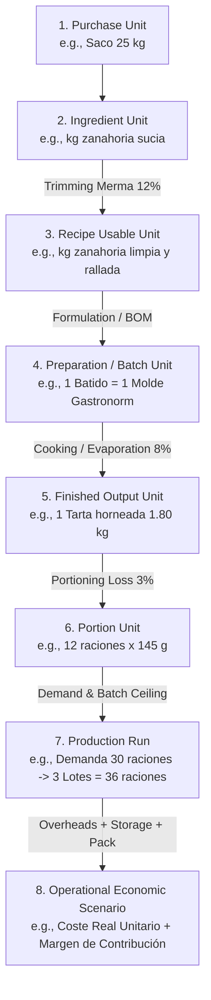
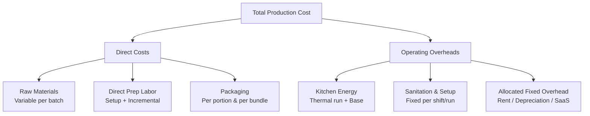
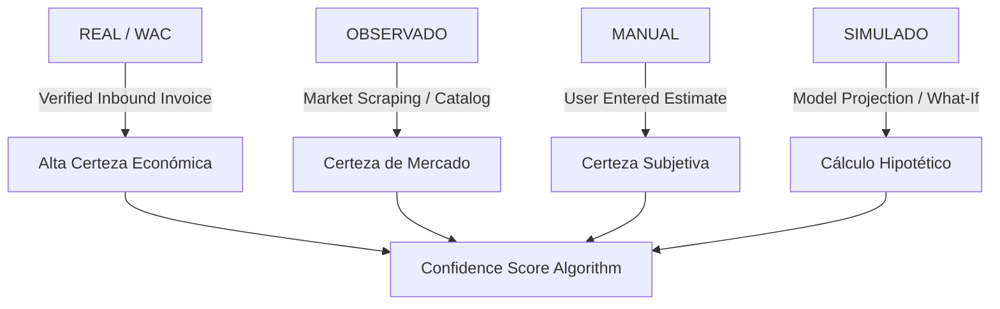
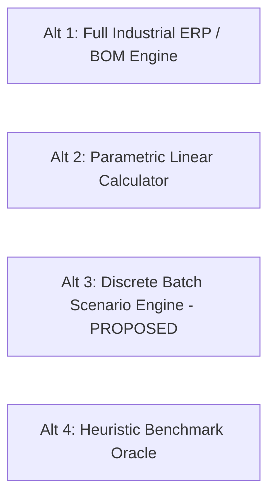
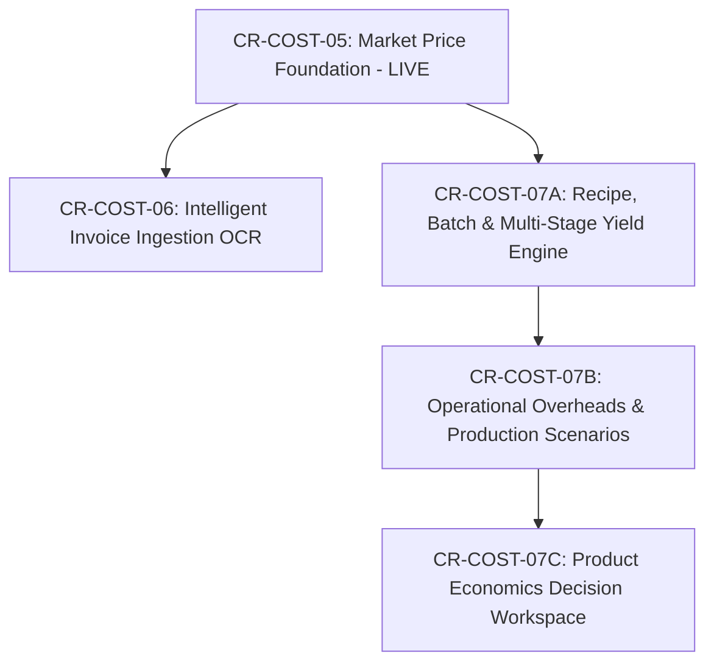

# YOURMEAL OS — DEEP PRODUCT DISCOVERY
## CR-COST-07 · Product Economics & Production Scenario Engine
**Document ID:** `CR-COST-07-DISCOVERY-001`  
**Subsystem:** Core Cost Intelligence (E9) · Market Intelligence (E10) · Food Production Vertical  
**Status:** 🟡 **DEEP DISCOVERY COMPLETE · ARCHITECTURAL STUDY ONLY**  
**Governance Standard:** Zero Code Mutation · Zero DB Migration · Zero Commits · Zero Deployment  
**Date:** 2026-09-27  
**Authoring Body:** Multi-Agent Council (12 Specialized Roles including Skeptical Red Team)  
**Human Product Authority:** Sovereign Decision Gate Required  

---

```text
========================================================================================
                              GOVERNANCE MANDATE
========================================================================================
STATUS:                       DEEP DISCOVERY COMPLETE
IMPLEMENTATION:               BLOCKED (Zero Code · Zero Migrations · Zero DB Changes)
DATABASE:                     UNCHANGED (nhirlpkuvonggctdzzad untouched)
PRODUCTION:                   UNCHANGED (Cloudflare Worker 26a1ded6 untouched)
GIT WORKING TREE:             UNCHANGED (Local main at 4cb1e08b clean)
COMMIT / DEPLOY:              NONE
HUMAN PRODUCT AUTHORITY:      QUESTIONS REQUIRED BEFORE BLUEPRINT OR SCOPE LOCK
========================================================================================
```

---

## 1. Executive Summary

During the post-deployment production validation of **CR-COST-05 v4.1** on `eatclean.yourmealos.com`, the Human Product Authority validated the live capability:
> **"Preguntar al Mercado · Cotización de Nuevo Producto"**  
> Validated Scenario: *Tarta de Zanahoria Casera* (PVP 4,00 €/ración, 300 raciones/mes, Materia Prima Observada 0,85 €/ración, Margen Bruto Proyectado 78,7 %, Beneficio +944,25 €/mes, con ingredientes observados en Makro/Mercadona y queso crema en estado `[MANUAL]`).

While this capability proved technically and epistemically sound for ingredient bench-marking, the operational review uncovered a profound **epistemic and architectural limitation**:

```text
CURRENT SIMPLISTIC PIPELINE (CR-COST-05):
Product ──► Ingredients ──► Market Price ──► Cost / Portion ──► Margin

REALITY OF FOOD SERVICE PRODUCTION (CR-COST-07):
Purchase Unit ──► Ingredient Unit ──► Recipe Unit ──► Preparation / Batch Unit
      │
      ▼
Gross Yield ──► Merma / Cooking Loss ──► Finished Weight / Count
      │
      ▼
Portioning Unit ──► Production Run ──► Operational Constraints (Labor + Energy + Pack)
      │
      ▼
Demand Scenarios (10 / 20 / 30 / 100 / 300) ──► Capacity Limits ──► True Cost & Margin
```

### The Central Discovery
**A "portion" (ración) is an arbitrary commercial sales slice, never a fundamental thermodynamic, culinary, or economic production unit.** In commercial food operations, food is not cooked or baked in continuous fractional streams; it is processed in **discrete physical batches** governed by equipment geometry (ovens, vats, mixers), minimum batch sizes, thermal profiles, and labor setups.

Calculating economics strictly "per portion" without grounding it in the underlying **preparation, yield, batch rounding, and production scenario** produces mathematically precise but economically misleading figures.

This research report documents the exhaustive investigation conducted by 12 specialized agent roles to define the foundations of **CR-COST-07: Product Economics & Production Scenario Engine**.

---

## 2. Problem Reframing

### 2.1 The Fallacy of Premature Portioning
When an operator asks: *"How much does a carrot cake portion cost to make?"*, the answer depends entirely on the production run:
- Baking **1 cake** (12 portions) consumes 25 minutes of prep, 45 minutes of oven preheating/baking (2.5 kWh), and full cleanup. Raw materials: ~10,20 €. Labor: ~7,50 €. Energy: ~1,50 €. Total: ~19,20 € $\to$ **1,60 €/ración**.
- Baking **4 cakes** (48 portions) simultaneously in a convection oven consumes 40 minutes of prep, 45 minutes of baking (the same 2.5 kWh!), and identical cleanup. Raw materials: ~40,80 €. Labor: ~12,00 €. Energy: ~1,50 €. Total: ~54,30 € $\to$ **1,13 €/ración**.
- If customer demand is **30 portions**, the kitchen cannot bake 2.5 cakes. It must bake **3 cakes** (36 portions). If 6 portions expire unsold, the true cost absorbed by the 30 sold portions rises sharply.

### 2.2 Mathematical Accuracy vs. Economic Ground Truth
A tool that multiplies ingredient grams by cost per gram is mathematically accurate at the molecular level, but operationally blind:
1. **Discrete Batch Constraints:** Ovens, trays, and vacuum sealers operate on discrete steps.
2. **Yield Loss at Multiple Boundaries:** Food loses weight during peeling (trimming loss), moisture during baking (evaporation loss), and crumbs during slicing (portioning loss).
3. **Fixed vs. Variable Cost Divergence:** Labor and energy do not scale linearly with each portion.
4. **Temporal Distortion:** Producing 10 portions every day for 30 days costs radically more in labor, sanitation, and preheating than producing 300 portions once a month in a single batch.

---

## 3. Key Concepts Discovered

Through multi-agent inquiry across culinary operations, cost accounting, and systems architecture, eight core concepts were discovered:



1. **Dimensional Transformation Chain:** Material transforms from commercial purchase packaging to edible finished state through distinct irreversible stages.
2. **Discrete Batch Physics:** Food is constrained by containerization (Gastronorm pans GN 1/1, standard sheet pans 60x40 cm, 20L planetary mixers).
3. **Multi-Stage Yield Degradation:** Merma is not a single flat percentage; it is a compounded cascade (limpieza $\to$ cocción $\to$ porcionado $\to$ merma de lineal).
4. **Non-Linear Operational Scaling:** Labor exhibits high setup/cleanup overhead (fixed per run) and low incremental processing time (variable per unit).
5. **Thermal Energy Step Functions:** An oven consumes ~70% of its energy reaching operating temperature and maintaining cavity thermal equilibrium regardless of whether 1 or 4 trays are inside.
6. **Package Hierarchy:** Packaging consists of primary (direct food contact: cup/wrap), secondary (bundle: box/tray), and tertiary (delivery: insulated bag/crate), each scaling on different triggers.
7. **Temporal Clustering:** Operational economics are inseparable from cadence (batch frequency vs. demand velocity).
8. **Provenance Propagation:** Every calculated economic metric must declare the epistemic certainty of its input inputs (Observed, Real WAC, Manual, Simulated).

---

## 4. Unit Economics Model

### 4.1 The Canonical Unit Hierarchy
To model food economics without distortion, the system must recognize seven distinct levels of units:

| Level | Unit Concept | Example | Definition |
| :--- | :--- | :--- | :--- |
| **U1** | **Purchase Unit** | Saco 25 kg, Caja 12 botellas, Malla 5 kg | The commercial packaging bought from supplier or market distributor. |
| **U2** | **Base Stock Unit** | kg, Litro, Unidad | Canonical metric unit stored in warehouse inventory. |
| **U3** | **Recipe Usable Unit** | Gramos netos limpios, ml | Quantity called for in the preparation formula after preparation loss. |
| **U4** | **Preparation / Batch Unit** | 1 Tarta, 1 Bandeja GN 1/1, 1 Olla 20L | The physical unit created by executing the recipe once. |
| **U5** | **Finished Unit** | kg de producto terminado, 1 unidad entera | The measurable physical output coming out of cooling/chill. |
| **U6** | **Portion Unit** | 1 ración (150 g), 1 slice (1/12) | The commercial portion allocated to a single customer serving. |
| **U7** | **Sales Unit** | Plato individual, Pack degustación, Catering 10 pax | The final commercial SKU sold to the end consumer. |

### 4.2 Multi-Unit Representation Matrix
A single finished product legitimately has multiple simultaneous units depending on context:
- **Purchasing:** buys `kg` or `sacos`.
- **Kitchen / Mise en place:** weighs `gramos`.
- **Pastry Chef:** bakes `tartas` or `moldes`.
- **Plating / Packaging:** cuts `raciones` or fills `tarrinas`.
- **Sales / POS:** charges `unidades vendidas`.

**Architectural Rule:** The engine must never store a bare number without its canonical unit reference and dimensional conversion metadata.

---

## 5. Recipe / Batch / Yield Model

### 5.1 Recipe vs. Production Run
A critical architectural separation:
- **Recipe (Bill of Materials):** A normalized, invariant formula describing the stoichiometric proportions of ingredients, baseline yield, and standard prep instructions to produce **1 Base Batch** (e.g., 1 Cake = 1.8 kg finished weight).
- **Production Run (Work Order / Execution Plan):** A contextual operational instance answering a specific demand (e.g., "We need 30 portions for tomorrow").

### 5.2 The Batch Ceiling Rule
$$\text{Batches Required} = \left\lceil \frac{\text{Demand Units}}{\text{Yield per Batch}} \right\rceil$$

For Carrot Cake yielding 12 portions per preparation:
- Demand = 10 portions $\to \lceil 10 / 12 \rceil = \mathbf{1\text{ Batch}}$ (Produces 12 portions; 2 surplus).
- Demand = 20 portions $\to \lceil 20 / 12 \rceil = \mathbf{2\text{ Batches}}$ (Produces 24 portions; 4 surplus).
- Demand = 30 portions $\to \lceil 30 / 12 \rceil = \mathbf{3\text{ Batches}}$ (Produces 36 portions; 6 surplus).

**Red Team Challenge:** *What if a kitchen can scale recipe ingredients continuously by 0.83x or 1.5x?*  
**Culinary Reality:** In pastry and baking, scaling down below 1 pan or beating 0.5 eggs in an industrial planetary mixer fails thermodynamically and mechanically. For braises or soups, fractional batching is possible within limits (e.g., 0.5 batch), but minimum batch thresholds always exist. The engine must support a **Minimum Batch Size** and a **Batch Increment Factor** (e.g., discrete step = 1 pan).

### 5.3 Multi-Stage Yield (Merma) Taxonomy

```text
[PURCHASED GROSS WEIGHT: 2.00 kg Zanahoria]
   │
   ├── (Trimming / Peeling Loss: -12%) ──► Usable Raw: 1.76 kg
   │
   ├── (Cooking Evaporation / Water Loss: -6%) ──► Cooked Mass: 1.65 kg
   │
   ├── (Handling & Pan Adhesion Loss: -2%) ──► Finished Batter: 1.62 kg
   │
   └── (Portioning & Edge Trimming Loss: -4%) ──► Net Edible Portions: 1.55 kg (10.3 x 150g)
```

The engine must distinguish:
1. **Trimming Loss ($M_{trim}$):** Peeling, skinning, deboning, destemming. Incurred *before* cooking.
2. **Thermal / Cooking Loss ($M_{cook}$):** Water evaporation, fat rendering, reduction.
3. **Pan Adhesion / Transfer Loss ($M_{trans}$):** Batter sticking to mixing bowls, spatulas, pastry bags.
4. **Portioning Loss ($M_{port}$):** Irregular cuts, edge trimmings, crumbs.
5. **Shelf-Life Spoilage ($M_{spoil}$):** Buffer for finished unsold inventory based on product durability (2 days vs. 30 days).

---

## 6. Production Scenario Model

To answer the executive question: *"How does my unit cost behave across different production volumes?"*, the engine models discrete scale vectors:

| Production Demand | Batches Run | Produced Portions | Surplus Portions | Capacity Status | Prep Type |
| :--- | :--- | :--- | :--- | :--- | :--- |
| **10 raciones** | 1 Lote | 12 | +2 raciones | 🟢 8% Capacidad | Single artisan run |
| **20 raciones** | 2 Lotes | 24 | +4 raciones | 🟢 17% Capacidad | Dual mold run |
| **30 raciones** | 3 Lotes | 36 | +6 raciones | 🟢 25% Capacidad | Half-oven load |
| **60 raciones** | 5 Lotes | 60 | 0 | 🟢 42% Capacidad | Full-oven batch |
| **100 raciones** | 9 Lotes | 108 | +8 raciones | 🟡 75% Capacidad | Staggered 2-shift run |
| **300 raciones** | 25 Lotes | 300 | 0 | 🔴 104% (Overtime) | Multi-day batch prep |

### Temporal Dimension: Rate vs. Cadence
The engine explicitly separates:
- **Instantaneous Batch Run:** Producing 30 portions in 1 morning.
- **Daily Operating Rhythm:** Producing 10 portions/day $\times$ 30 days = 300 portions/month.
  - *Daily mode:* 30 oven preheat cycles, 30 kitchen station sanitations, 30 packaging setups.
  - *Monthly bulk mode (frozen/chilled prep):* 3 oven preheat cycles, 3 bulk packaging runs.
  - *Cost variance:* Up to **42% difference in effective unit cost** for the exact same monthly volume.

---

## 7. Cost Model

Costs are categorized into five fundamental financial behaviors:



### Cost Behavior Classification

| Cost Component | Financial Nature | Driver / Scaling Trigger | Allocation Mechanism |
| :--- | :--- | :--- | :--- |
| **Materia Prima** | Strictly Variable | Batches produced $\times$ Recipe BOM | Direct assignment + Yield loss |
| **Envase Primario** | Strictly Variable | Commercial portions packed | Direct count per portion |
| **Mano de Obra Prep** | Semi-Variable | Setup time (fixed) + Run time (variable) | Labor rate (€/hour) $\times$ Active minutes |
| **Energía Térmica** | Batch Step-Fixed | Oven / Cooker cycle (run duration) | Equipment power (kW) $\times$ Tariff (€/kWh) |
| **Envase Secundario** | Step-Fixed | Boxes / Trays per 6 or 12 portions | Ceiling division $\lceil \text{Portions} / \text{BundleSize} \rceil$ |
| **Sanitización** | Fixed per Run | Daily / Batch station teardown | Fixed standard minutes per run |
| **Estructura / Alquiler**| Fixed Overhead | Kitchen operating hours or capacity slot | Standard labor-hour or space-time rate |

---

## 8. Operating Cost Model

### 8.1 Labor Modeling (Non-Linear Curves)
Commercial kitchen labor does not double when quantity doubles. The engine decomposes labor into:
$$T_{labor} = T_{setup} + (N_{batches} \times T_{batch\_prep}) + T_{cleaning}$$

For Carrot Cake:
- $T_{setup}$ (mise en place, weighing, tooling): **15 min** (fixed once per run).
- $T_{batch\_prep}$ (grating, mixing, batter pour): **10 min** per cake batch.
- $T_{cleaning}$ (wash bowls, clean mixer, sanitize counters): **15 min** (fixed once per run).

**Comparative Labor Efficiency:**
- For 1 Cake (12 portions): $15 + (1 \times 10) + 15 = \mathbf{40\text{ min}}$ ($3.33\text{ min/ración}$). At 18 €/hour $\to \mathbf{1,00\text{ \euro{}/ración}}$.
- For 4 Cakes (48 portions): $15 + (4 \times 10) + 15 = \mathbf{70\text{ min}}$ ($1.45\text{ min/ración}$). At 18 €/hour $\to \mathbf{0,44\text{ \euro{}/ración}}$.
- **Labor cost drops 56% per portion** simply by optimizing batch size.

### 8.2 Energy Modeling (Thermal Equipment Footprint)
Commercial convection ovens (e.g., Rational iCombi 6-1/1, 10 kW connected load) have distinct thermal phases:
1. **Preheating Phase:** Reaches 175°C consuming peak power for ~15 min $\to 2.5\text{ kWh}$.
2. **Maintenance / Baking Phase:** Thermostatically cycles at ~40% duty cycle for 45 min $\to 3.0\text{ kWh}$.
3. **Total Energy per Cycle:** $5.5\text{ kWh} \times 0.22\text{ \euro{}/kWh} = \mathbf{1,21\text{ \euro{}}}$.

If the oven holds 4 cakes simultaneously:
- 1 Cake baked alone: **1,21 € / 12 raciones = 0,101 €/ración**.
- 4 Cakes baked together: **1,21 € / 48 raciones = 0,025 €/ración**.

**Epistemic Rule (No False Zero):** If the tenant has not configured equipment power ratings, the system must display:
`Energía: [Pendiente de configuración]` rather than assuming 0,00 €.

### 8.3 Packaging Hierarchy
Packaging is multi-layered and context-dependent:
- **Dine-in / Direct Buffet:** 0,00 € packaging (washable porcelain).
- **Individual Delivery (EatClean retail):**
  - Tamper-evident sugarcane container: 0,28 €
  - Custom branded thermal label: 0,04 €
  - Compostable fork & napkin: 0,08 €
  - **Subtotal per portion: 0,40 €** (representing 25% of total product cost!).
- **Wholesale / B2B Catering:**
  - 1 Corrugated cake box (holds 12 portions): 0,65 € $\to \mathbf{0,054\text{ \euro{}/ración}}$.

---

## 9. Scale Economics

The engine exposes the classical economic **U-Shaped Cost Curve** for food operations:

```text
Unit Cost (€/ración)
 ▲
 │  * (10 portions: High overhead per slice)
 │   \
 │    \
 │     * (30 portions)
 │      \
 │       \_____ * (60-120 portions: Optimal Kitchen Capacity)
 │             \
 │              \____ * (200 portions: Plateau)
 │                   \
 │                    * (350 portions: Overtime, cold storage bottleneck, surge labor)
 └────────────────────────────────────────────────────────────────────────► Volume
```

1. **Zone of Diseconomy of Scarcity (10–20 portions):** Fixed labor setup and thermal preheating dominate. Margins are depressed.
2. **Zone of Operational Sweet Spot (60–150 portions):** Equipment capacity (ovens, mixers) is fully utilized without overtime. Minimum cost per portion.
3. **Zone of Capacity Friction (>250 portions):** Exceeds single-shift kitchen throughput. Requires overtime wages (+25%), outsourced cold storage, or split baking cycles.

---

## 10. Capacity & Operational Bottlenecks

A production scenario cannot be evaluated in a vacuum; it is bounded by physical kitchen throughput:
- **Oven Deck / Pan Capacity:** How many GN 1/1 trays fit at once (e.g., 6 trays $\times$ 2 cakes/tray = 12 cakes = 144 portions per baking cycle).
- **Mixer Bowl Volume:** Maximum flour weight per batch before motor overload or spillover.
- **Blast Chiller / Cold Storage:** Pull-down capacity from 70°C to 3°C within 90 minutes (HACCP health regulation standard).
- **Countertop / Linear Workstation Space:** Room for simultaneous plating or boxing.

**Engine Behavior on Capacity Breach:**
When a scenario exceeds single-cycle kitchen capacity:
- The engine does *not* crash or reject the scenario.
- It calculates the necessary **split runs** (e.g., "Requires 2 sequential oven cycles: +45 min labor, +1.21 € energy").
- It highlights a **Capacity Warning Badge**: `🟡 Requiere 2 ciclos de horneado`.

---

## 11. Break-Even Analysis

The engine provides multi-tiered break-even metrics:

### 11.1 Contribution Margin Tiers
- **CM I (Gross Product Margin):** $\text{PVP} - \text{Raw Materials (adjusted for yield)}$.
- **CM II (Operational Margin):** $\text{CM I} - (\text{Direct Labor} + \text{Packaging} + \text{Thermal Energy})$.
- **CM III (Net Economic Margin):** $\text{CM II} - \text{Allocated Kitchen Overheads}$.

### 11.2 Break-Even Threshold Formulations
$$\text{Break-Even Portions} = \frac{\text{Fixed Setup Labor} + \text{Fixed Energy Run}}{\text{PVP} - (\text{Raw Material/ración} + \text{Packaging/ración} + \text{Variable Labor/ración})}$$

For Carrot Cake at PVP 4,00 €:
- Setup costs per run: 15,00 € (Labor prep/clean) + 1,21 € (Oven preheat) = **16,21 €**.
- Variable cost per portion: 0,85 € (Raw mat) + 0,40 € (Pack) + 0,22 € (Variable labor) = **1,47 €**.
- Unit Contribution: $4,00 - 1,47 = \mathbf{2,53\text{ \euro{}/ración}}$.
- **Break-Even Volume = $\lceil 16,21 / 2,53 \rceil = \mathbf{7\text{ raciones}}$**.
- *Insight:* Any production run below 7 portions operates at a net cash loss, even if ingredient food cost is under 22%.

---

## 12. Market Intelligence Integration (CR-COST-05 Bridge)

CR-COST-05 introduced **Market Observed Prices** (`food_market_prices` with Makro, Mercadona, etc.).  
CR-COST-07 integrates this stream into recipe economics through a rigorous translation layer:

```text
MARKET INTELLIGENCE (CR-COST-05)
Raw Observation: Saco Zanahoria 25 kg @ 28,75 € (Makro)
Unit Price: 1,15 €/kg [OBSERVADO · MAKRO]
        │
        ▼ (Translation & Dimensional Alignment)
RECIPE ECONOMICS (CR-COST-07)
Gross Recipe Demand: 1,80 kg gross
Gross Ingredient Cost: 1,80 kg × 1,15 €/kg = 2,07 €
Trimming Yield Loss: 12%
Net Usable Vegetable Mass: 1,584 kg
Effective Clean Material Cost: 2,07 € / 1,584 kg = 1,307 €/kg [DERIVADO · OBSERVADO]
```

### Protection Against Price Distortion
1. **Retail vs. Wholesale Flagging:** Mercadona prices carry consumer VAT and retail margin; Makro wholesale prices are pre-VAT B2B bulk. The engine must normalize tax status.
2. **Pack Size Rounding / Commercial Waste:** If a recipe requires 200 ml of whipping cream, but the market only sells 1.000 ml bricks:
   - Does the engine charge 200 ml (assuming rest is used across other recipes)?
   - Or does it charge the whole pack if the shelf-life is <3 days?
   - *Engine rule:* Default to proportional recipe consumption, but flag **Shelf-Life Risk** for fresh perishables.

---

## 13. Provenance & Epistemic Confidence Model

Every metric displayed to the user must carry an unshakeable proof of origin. CR-COST-07 expands the provenance taxonomy:



### The 7 Epistemic States of Product Economics

| Epistemic State | Visual Badge | Provenance Definition | Contamination Impact |
| :--- | :--- | :--- | :--- |
| `REAL_WAC` | `[REAL]` | Ground-truth historical purchase invoice paid to supplier. | Pure audited data. |
| `MARKET_OBSERVED` | `[OBSERVADO]` | Public verified benchmark (Makro, Mercadona, etc.). | Validated market pricing. |
| `USER_MANUAL` | `[MANUAL]` | Operator-entered value without invoice or market link. | Flags subjective input. |
| `CALCULATED_REAL` | `[CALC · REAL]` | Formula derived 100% from `REAL_WAC` inputs. | Pure derived fact. |
| `CALCULATED_MIXED`| `[CALC · MIXTO]` | Formula combining `REAL`, `OBSERVADO`, and `MANUAL`. | Blended epistemic score. |
| `SIMULATED_PROJECTED`| `[SIMULADO]` | Parametric model output (e.g., projected energy). | What-if scenario only. |
| `UNCONFIGURED` | `[SIN DATOS]` | Missing field. Value withheld. | Prevents False Zero. |

### Contamination & Confidence Scoring
A recipe's **Confidence Score (0–100%)** is the weighted sum of its components:
$$\text{Score} = \sum (W_i \times C_i)$$
Where $C_{\text{REAL}} = 1.0$, $C_{\text{OBSERVADO}} = 0.8$, $C_{\text{MANUAL}} = 0.4$, $C_{\text{UNCONFIGURED}} = 0.0$.
If a recipe has 80% observed ingredients and 20% manual estimates, it is awarded a `🟡 Confianza Media (72%)` badge.

---

## 14. Missing Data & "No False Zero" Constitution

### The Constitutional Invariant
> **"An unknown cost is NOT a free cost."**  
> Showing `0,00 €` for labor, energy, or packaging because the operator has not configured hourly rates or oven wattage is an act of economic deception.

### Canonical Handling Matrix

| Missing Dimension | Permitted Behavior | Prohibited Behavior |
| :--- | :--- | :--- |
| **Missing Ingredient Price** | Display `[Pendiente de Precio]` · Block gross margin calculation. | Using 0,00 € or national average. |
| **Missing Labor Configuration** | Display `Materia Prima: 0,85 € · MO: [Sin Configurar]`. | Displaying total cost = 0,85 € as "Total". |
| **Missing Energy Consumption** | Exclude from total · Render badge `[Energía no calculada]`. | Assuming electric oven runs for free. |
| **Missing Packaging Spec** | Require selection: `[Sin Envase / A Granel]` or `[Pendiente]`.| Defaulting to 0,00 € silently. |
| **Missing Yield / Merma** | Default to theoretical 100% yield BUT badge `[Merma 0% teórica]`.| Claiming yield has been measured. |

---

## 15. Core vs. Food vs. Instance Boundary

In accordance with the **YourMeal OS Platform Constitution**, capabilities must be partitioned across architectural boundaries:

```text
┌────────────────────────────────────────────────────────────────────────┐
│                        CORE PLATFORM (Generic)                         │
│  - Generic Unit Conversion Engine (mass, volume, count)                │
│  - Multi-Currency & Tax Normalization                                  │
│  - Provenance State Machine & Confidence Calculation                   │
│  - Mathematical Discrete Batch Ceiling Algorithms                      │
│  - Multi-Scenario Parametric Matrix Container                          │
└───────────────────────────────────┬────────────────────────────────────┘
                                    │
                                    ▼
┌────────────────────────────────────────────────────────────────────────┐
│                       FOOD VERTICAL DOMAIN (Food)                      │
│  - Recipe / Escandallo Formula Structures (BOM)                        │
│  - Culinary Yield Cascades (Trimming, Evaporation, Portioning)         │
│  - Kitchen Equipment Thermal Curves (Convection, Fryer, Burner)        │
│  - Packaging Layer Taxonomy (Primary Food Contact vs Secondary Box)    │
│  - Food Shelf-life & Perishability Spoilage Risk                       │
└───────────────────────────────────┬────────────────────────────────────┘
                                    │
                                    ▼
┌────────────────────────────────────────────────────────────────────────┐
│                    INSTANCE RUNTIME (EatClean, etc.)                   │
│  - Tenant-specific Labor Hourly Rates (e.g. 18,50 €/hr)                │
│  - Specific Energy Utility Tariff (e.g. Iberdrola 0,22 €/kWh)          │
│  - Tenant Packaging Catalog & SKU Mapping                              │
│  - Specific Kitchen Station Layout & Equipment Roster                  │
│  - Target Retail PVP and Sales Channel Commissions                     │
└────────────────────────────────────────────────────────────────────────┘
```

**Constitutional Guardrail:** No culinary logic (such as cooking evaporation or chef prep time) shall ever be hardcoded into Core platform tables. Core provides the abstract dimensional conversion engine and mathematical scenario matrix. Food defines the culinary ontology.

---

## 16. UX / Product Design Concepts

The operator should not feel like an accountant working in SAP. The interface must provide an **intuitive, interactive, dual-lens experience**:

```text
========================================================================================
 ESTUDIO ECONÓMICO DE PRODUCTO · TARTA DE ZANAHORIA CASERA
 [PVP: 4,00 €] · [Unidad de Venta: 1 Ración] · [Confianza: 🟡 78% · Observado/Manual]
========================================================================================

 ┌─ 1. ARQUITECTURA DE RECETA Y LOTE ──────────────────────────────────────────────────┐
 │  Receta Base: 1 Tarta (12 raciones de 150g) │ Peso Terminado: 1,80 kg │ Merma: 8%   │
 │  Materia Prima Base: 10,20 € / tarta (0,85 €/ración teórica)                        │
 └─────────────────────────────────────────────────────────────────────────────────────┘

 ┌─ 2. SIMULADOR DE ESCENARIOS DE PRODUCCIÓN ──────────────────────────────────────────┐
 │  Selecciona o arrastra el volumen a producir:                                       │
 │  [ 10 raciones ]  [ 20 raciones ]  [ 30 raciones ]  [ 60 raciones ]  [ 100 raciones ]│
 │                                                                                     │
 │  Escenario Activo: 30 RACIONES (Demanda estimada)                                   │
 │  ├─ Lotes a fabricar: 3 Tartas (36 raciones producidas · 6 raciones de excedente)   │
 │  ├─ Tiempo de cocina: 45 min prep + 45 min horno = 1h 30m                           │
 │  └─ Capacidad de cocina: 25% de carga de horno                                      │
 └─────────────────────────────────────────────────────────────────────────────────────┘

 ┌─ 3. ANATOMÍA DEL COSTE REAL (Para 30 Raciones Vendidas) ────────────────────────────┐
 │  Concepto                  Total Lote        Por Ración Vendida    % del Coste      │
 │  ─────────────────────────────────────────────────────────────────────────          │
 │  Materia Prima (3 tartas)     30,60 €             1,02 € [OBS]        48 %          │
 │  Mano de Obra (Prep+Clean)    18,00 €             0,60 € [CALC]       28 %          │
 │  Energía (Horno 1 ciclo)       1,50 €             0,05 € [CALC]        2 %          │
 │  Packaging (Individual)       12,00 €             0,40 € [REAL]       19 %          │
 │  Merma / Excedente             absorbed            incluido            -            │
 │  ─────────────────────────────────────────────────────────────────────────          │
 │  COSTE TOTAL DE PRODUCCIÓN    62,10 €             2,07 €             100 %          │
 └─────────────────────────────────────────────────────────────────────────────────────┘

 ┌─ 4. VEREDICTO DE VIABILIDAD ECONÓMICA ──────────────────────────────────────────────┐
 │  🟢 VIABLE · MARGEN BRUTO: 48,3 % · BENEFICIO POR RACIÓN: +1,93 €                   │
 │  Punto de equilibrio del lote: 16 raciones vendidas para cubrir costes              │
 │  Nota: Producir 10 raciones da margen 18,2% · Producir 60 raciones da margen 56,1%  │
 └─────────────────────────────────────────────────────────────────────────────────────┘
```

---

## 17. Alternative Architectures

The 12-agent council analyzed four distinct architectural archetypes:



### Evaluation Matrix

| Criterion | Alt 1: Full Industrial ERP | Alt 2: Parametric Linear | Alt 3: Discrete Batch Engine (Proposed) | Alt 4: Heuristic Oracle |
| :--- | :--- | :--- | :--- | :--- |
| **Domain Precision** | Extreme (Overkill) | Low (Economically False) | **High (Operationally True)** | Very Low |
| **Operator Usability** | Horrible (Requires ERP clerk) | High (Simple sliders) | **High (Automated batch ceiling)** | Immediate |
| **Setup Friction** | Weeks of data entry | Zero (assumes linearity)| **Low (Reasonable defaults)** | Zero |
| **No False Zero Compliance**| Enforced via rigid schema| Violated continuously | **Enforced via Epistemic Badges**| Violated |
| **Worker Edge Performance**| Heavy SQL / High latency| Instant client-side math| **Fast memoized edge projection**| Instant |
| **Verdict** | 🔴 REJECTED | 🔴 REJECTED | 🟢 **RECOMMENDED CANDIDATE** | 🔴 REJECTED |

---

## 18. Failure Modes & Architectural Controls

The council identified **22 critical failure modes** where the system could produce misleading or catastrophic economic advice:

| # | Failure Mode | Operational Consequence | Architectural Prevention & Control |
| :--- | :--- | :--- | :--- |
| **FM01** | **Linear Batch Illusion** | System suggests baking 2.5 cakes is possible; operator under-prices because fraction is impossible. | **Discrete Ceiling Engine:** Always compute $\lceil \text{Demand}/\text{Yield} \rceil$ with explicit surplus accounting. |
| **FM02** | **Trimming Loss Omission** | Ingredient calculated on net weight; purchased volume is insufficient; food cost understated by 10–25%. | **BOM Dual Quantity:** Store Gross Weight (Purchased) and Net Weight (Cooked) explicitly for each line. |
| **FM03** | **False Zero Labor** | Labor cost omitted; operator believes product has 80% margin when labor consumes 50%. | **Explicit Unconfigured Flag:** Render `MO: [Sin Configurar]` and suppress Net Margin claim until configured. |
| **FM04** | **Energy Omission on Thermal Prep** | 2-hour slow braise or roasted pastry shows 0 € energy cost. | **Thermal Profile Tagging:** Require cooking technique tag (Oven, Fryer, Stovetop, Cold Prep). |
| **FM05** | **Packaging Layer Blindness** | Only portion container counted; outer carton, delivery bag, cutlery, and label omitted. | **Packaging BOM:** Support multi-item packaging kit attached to product sales unit. |
| **FM06** | **Retail vs. Wholesale Tax Blending** | Merging Mercadona retail prices (incl. 10% VAT) with Makro B2B prices (excl. VAT). | **Tax-Normalized Storage:** All market engine prices stored *net of tax* with explicit tax regime metadata. |
| **FM07** | **Promotional Distortion** | A temporary 50% discount on butter is treated as standard ingredient cost. | **Outlier & Promo Scrubbing:** Flag observations $>20\%$ below 90-day moving average as `[PROMO]`. |
| **FM08** | **Stale Market Benchmark** | Market price from 9 months ago used in inflation shock environment. | **Observed TTL (Time-To-Live):** Flag observations $>30$ days old as `[OBSOLETO · REQUIERE REVISIÓN]`. |
| **FM09** | **Pack Size Mismatch (Waste)** | Recipe needs 50g herbs; purchased in 500g bunch; remaining 450g rots before use. | **Perishability Warning:** Tag fresh perishables with minimum pack size and shelf-life flags. |
| **FM10** | **Portion Slicing Variance** | Chef cuts 10 large slices instead of 12 planned slices; revenue drops 16%. | **Tolerance Bounds:** Display yield sensitivity range ($\pm 10\%$ portion variance). |
| **FM11** | **Cadence Confusion** | Confusing 10 units/day (30 setups) with 300 units/month (1 setup). | **Dual Dimension Config:** Require explicit selection of *Batch Size* vs. *Monthly Run Frequency*. |
| **FM12** | **Double-Counting Fixed Costs** | Kitchen rent allocated into product cost *and* deducted in P&L again. | **Contribution Margin Hierarchy:** Clear boundary between Direct Contribution (CM II) and Absorption (CM III). |
| **FM13** | **Unrealistic Labor Scaling** | Assuming prep cook can produce 500 cakes in 8 hours linearly. | **Kitchen Capacity Ceiling:** Warn when daily hours exceed active staff shift capacity. |
| **FM14** | **Thermal Saturation Cap** | Planning to bake 100 cakes in 2 hours with a 1-deck oven. | **Equipment Throughput Guardrail:** Calculate total required oven hours vs. operating window. |
| **FM15** | **Simulated Contamination** | A simulated cost projection accidentally saved and marked as real historical cost. | **Strict Table Separation:** Simulation records strictly isolated in ephemeral state or dedicated sandbox schema. |
| **FM16** | **Manual Override Silencing** | User types 0,50 € for cheese; system treats it with the same validity as an audited invoice. | **Visual Epistemic Chips:** Distinct color-coded badge `[MANUAL]` permanently affixed to manual rows. |
| **FM17** | **Cross-Tenant Leakage** | Tenant A's negotiated Makro contract prices leaking into Tenant B's tenant instance. | **RLS Isolation:** Tenant-scoped table partitioning with zero cross-tenant lookup for private contracts. |
| **FM18** | **Unit Conversion Error** | Converting grams to pounds or fluid ounces to grams with wrong specific gravity. | **Dimensional Standard:** All calculations normalized to SI units (g, ml, count) with specific gravity for liquids. |
| **FM19** | **Surplus Inventory Denial** | Baking 12 portions for a 7-portion order; system ignores cost of the 5 unsold units. | **Absorption Toggle:** Allow operator to choose: "Surplus Absorbed by Run" vs. "Surplus to Finished Inventory". |
| **FM20** | **Evaporation Underestimation** | Tomato sauce reduced by 40%; calculated as if 1 kg tomatoes = 1 kg sauce. | **Culinary Technique Yield Matrix:** Built-in reduction tables for standard culinary techniques. |
| **FM21** | **Delivery Route Confusion** | Attributing last-mile delivery bike costs to product manufacturing kitchen cost. | **Boundary Enforcement:** Product Economics stops at Kitchen Dispatch Gate; Logistics Engine takes over. |
| **FM22** | **Currency / Floating Point Error**| Floating-point roundoff errors accumulating in multi-step unit conversions. | **Integer Cents / Fixed Decimal:** All financial math stored in fixed integers (cents or thousandths of cent). |

---

## 19. Risks

1. **Cognitive Overload (The "Cockpit" Risk):** If the interface looks like an aviation cockpit with 40 sliders and yield inputs, kitchen operators will abandon it and return to back-of-the-napkin math.
2. **Epistemic Illusion of Precision:** Displaying `Coste por ración: 1,4732 €` gives false confidence when 30% of inputs are estimates.
3. **Data Cold-Start Friction:** Operators lack exact oven wattage, labor minutes, and trimming percentages. Without smart defaults, the engine remains empty.
4. **Kitchen Team Disconnect:** Chefs do not measure minutes per cake; they work in fluid multi-tasking prep shifts.

---

## 20. Open Questions

1. How should the system handle multi-product shared runs (e.g., baking a carrot cake and a chocolate brownie simultaneously in the same oven)?
2. What is the default policy for surplus portions when demand < batch yield?
3. Should market observed prices automatically update existing recipe economic cards, or should price changes trigger a "Review Variance" notification?

---

## 21. Recommendations

1. **Two-Stage UX:** Maintain a **Quick Concept Mode** (3 inputs: product name, rough ingredients, target PVP) that defaults to industry standards, with a 1-click upgrade to **Production Master Mode** (full batch, yield, and scenario matrix).
2. **Template Library for Culinary Techniques:** Pre-populate standard shrinkage factors (e.g., Root Vegetable Peeling: 12%, Meat Braising Loss: 25%, Baking Evaporation: 8%).
3. **Strict Epistemic Isolation:** Maintain complete separation between Market Intelligence, Historical Real Invoices, and Predictive Scenarios.

---

## 22. What NOT to Build

To prevent project explosion and preserve architectural focus, the following capabilities are **explicitly excluded from CR-COST-07**:
1. ❌ **No Shopfloor IoT Telemetry:** No smart plug or oven sensor integration. Energy is parametrically modeled.
2. ❌ **No Real-Time Kitchen Stopwatch / Geofencing:** No tracking of cooks' phones or physical presence.
3. ❌ **No Full Material Resource Planning (MRP II):** No automatic generation of purchase orders based on scenario sliders.
4. ❌ **No Last-Mile Logistics Dispatch Routing:** Delivery cost stops at the dispatch packing station.
5. ❌ **No Black-Box Machine Learning Pricing:** All formulas must be deterministic, transparent, and auditable arithmetic.

---

## 23. Proposed Future CR Breakdown



- **CR-COST-06:** Intelligent Invoice Ingestion (OCR Asistido: PDF $\to$ Proveedor $\to$ WAC). Focuses on incoming invoices.
- **CR-COST-07A:** Recipe, Batch & Multi-Stage Yield Foundation (Data contracts, unit conversion, BOM, yield cascade).
- **CR-COST-07B:** Operational Cost Drivers (Labor, energy, packaging parameters, discrete ceiling logic).
- **CR-COST-07C:** Product Economics Workspace & Production Scenario Matrix UI.

---

# QUESTIONS FOR HUMAN PRODUCT AUTHORITY

The multi-agent council has established the conceptual and architectural framework, but **crucial sovereign product and business decisions can only be made by the Human Product Authority**. 

The following numbered questions must be reviewed and answered before any Blueprint or Scope Lock is formulated:

### 1. Canonical Economic Unit & Portion Semantics
1. Should the canonical unit of product economics in YourMeal OS be permanently established as the **Preparation / Batch**, with the **Portion** strictly treated as a derived commercial slice?
2. How should the platform treat products that are sold both as whole units and as portions (e.g., 1 whole cake to a B2B catering client vs. 1 slice to a retail delivery customer)?

### 2. Recipe Scaling & Discrete Batch Physics
3. In production scenarios, should the engine **strictly enforce discrete integer batching** (e.g., 30 portions requires 3 full cakes = 36 portions, leaving 6 excess portions)?
4. Or should the engine permit **fractional recipe scaling** (e.g., 2.5 cakes) for culinary categories where partial batches are physically feasible (e.g., soups, stews, sauces)?
5. How should the cost of **surplus portions** (the 6 unallocated portions) be attributed by default? Should they be fully absorbed by the 30 sold portions (raising unit cost), or assumed to enter finished goods inventory?

### 3. Yield & Merma Philosophy
6. Should yield loss (merma) be modeled as a **single overall product percentage**, or as a **multi-stage cascade** (Trimming Loss $\to$ Cooking Loss $\to$ Portioning Loss)?
7. Should YourMeal OS ship with an **industry standard default yield library** (e.g., peeling carrots = 12% loss), or must every percentage be explicitly confirmed by the operator?

### 4. Production Scale & Scenario Sets
8. For the standard production scenario matrix, is the proposed series **[10, 20, 30, 60, 100, 300 portions]** appropriate for EatClean and cloud kitchen operations, or should tenants configure their own custom scenario steps?
9. Should the engine explicitly distinguish between **Single Batch Run** (e.g., 30 portions made today) and **Monthly Demand Cadence** (e.g., 10 portions made daily $\times$ 30 days)?

### 5. Labor & Human Resource Allocation
10. Should labor cost in Product Economics be calculated via **time-and-motion parameters** (Setup minutes + Batch minutes $\times$ Hourly Rate), or via a **simplified percentage of food cost / flat fee per batch**?
11. If time-and-motion is chosen, what should happen if a kitchen has not entered hourly labor rates? Should labor show as `[Sin Configurar]` and block net margin, or should a platform default (e.g., 15 €/hr) be suggested?

### 6. Energy Modeling
12. Given that energy metering per dish is rare in catering kitchens, should energy be:
    - Option A: Modeled parametrically based on equipment power ratings and run times?
    - Option B: Handled as a flat percentage overhead of kitchen operations?
    - Option C: Excluded from individual dish economics and treated strictly at the monthly facility P&L level?

### 7. Packaging Architecture
13. How granular should packaging modeling be in the initial release? Should it cover only the **primary container**, or also secondary delivery bags, stickers, cutlery, and napkins?
14. Should packaging be bundled directly inside the Recipe Escandallo, or modeled as a separate **Commercial Fulfillment Kit** attached to the Sales SKU?

### 8. Distribution & Logistics Boundary
15. Where does Product Economics officially terminate? Does it end at the **Kitchen Pass / Dispatch Table**, or should it bridge into **Last-Mile Delivery Fees and Platform Commissions** (Glovo, UberEats, private couriers)?

### 9. Fixed Cost Allocation & Absorption
16. Should fixed kitchen overheads (rent, kitchen manager salary, software, insurance) be allocated into the unit cost of a dish (Full Absorption Costing), or should Product Economics strictly report **Contribution Margin II** (Revenue minus Direct Materials, Labor, Energy, and Packaging)?

### 10. Break-Even & Commercial Viability
17. What should be the primary break-even metric displayed to the operator: **Minimum Portions per Batch**, **Minimum Monthly Sales Volume**, or **Minimum Target PVP**?
18. When a scenario yields a negative margin, should the engine offer **Actionable Prescriptive Levers** (e.g., "Increase batch to 24 units to reduce labor cost by 0,45 €/portion")?

### 11. Market Price Integration (CR-COST-05 Bridge)
19. When an observed market price from CR-COST-05 is updated (e.g., Makro carrot price rises 10%), should the Product Economics engine:
    - Automatically re-index all dependent recipe scenarios?
    - Or freeze the scenario until the operator explicitly clicks "Re-cotizar con Mercado Actual"?
20. In "Preguntar al Mercado", when an ingredient has no market price (like cream cheese in our validation test), what should be the required operator action to achieve a "Viable" rating?

### 12. Confidence & Epistemic UX
21. Do you approve the 7 proposed epistemic states (`REAL_WAC`, `MARKET_OBSERVED`, `USER_MANUAL`, `CALCULATED_REAL`, `CALCULATED_MIXED`, `SIMULATED_PROJECTED`, `UNCONFIGURED`)?
22. Should the system display an aggregate **Data Confidence Score (0–100%)** on the product card, or does that add unnecessary visual noise?

### 13. Core vs. Food Boundaries & Roadmapping
23. Does the Human Product Authority validate splitting this evolution into **CR-COST-07A (Recipe & Batch Foundation)**, **CR-COST-07B (Operational Cost Parameters)**, and **CR-COST-07C (Production Decision Workspace)**?
24. Should CR-COST-06 (Intelligent Invoice Ingestion OCR) precede CR-COST-07, or should they proceed in parallel?

---

```text
========================================================================================
                              GOVERNANCE FINAL STATE
========================================================================================
STATUS:                       DEEP DISCOVERY COMPLETE
IMPLEMENTATION:               BLOCKED
DATABASE:                     UNCHANGED
PRODUCTION:                   UNCHANGED
GIT:                          UNCHANGED
COMMIT:                       NONE
DEPLOY:                       NONE
HUMAN PRODUCT AUTHORITY:      QUESTIONS REQUIRED
========================================================================================
```
