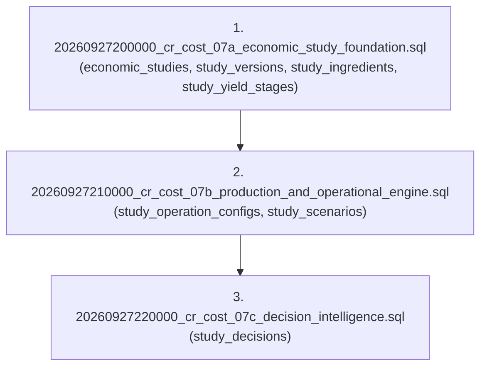

# CR-COST-07 — Release Integration & Production UI Architecture Plan
## Product Economics & Production Scenario Engine
**Subsystem:** Core Cost Intelligence (E9) · Market Intelligence (E10) · Food Production Vertical  
**Status:** 🟡 **PROPOSED · PENDING HUMAN PRODUCT AUTHORITY APPROVAL**  
**Gate:** Post-Domain Certification · Pre-Release Integration  
**Fecha:** 2026-09-27  
**Autoridad Soberana:** Human Product Authority  

---

```text
========================================================================================
                          ESTADO DE GOBERNANZA PREVIO A RELEASE
========================================================================================
CR-COST-07A (BOM Multietapa & Rendimientos):     🟢 CERTIFICADO LOCAL
CR-COST-07B (Producción & Costes Operativos):    🟢 CERTIFICADO LOCAL
CR-COST-07C (Decisions, Break-Even & Capacity):  🟢 CERTIFICADO LOCAL
DOMINIO COMPLETO CR-COST-07:                     🟢 COMPLETADO Y CONGELADO LOCAL
TESTS AUTOMATIZADOS:                             ✅ 12/12 archivos | 64/64 PASS
TYPESCRIPT COMPILATION:                          ✅ 0 errores
PRODUCCIÓN SUPABASE (nhirlpkuvonggctdzzad):      🔒 INTACTA (0 migraciones aplicadas)
WORKER PRODUCCIÓN (eatclean 26a1ded6):           🔒 INTACTO (v4.1 Operativa)
GITHUB (origin/main @ 4cb1e08b):                 🔒 INTACTO (0 commits, 0 push)
========================================================================================
```

---

## 1. 🎯 Objetivo del Plan de Integración de Release

Conectar el motor de dominio económico de producción y decisiones (`CR-COST-07A/B/C`) con la superficie de producto existente (**Centro de Decisión Económica v4.1**) en `YourMeal OS` y la instancia **EatClean**, garantizando:

1. **Cero Regresiones:** El Centro de Decisión Económica v4.1, la ingesta CSV/TSV, los benchmarks de mercado y el simulador macro E9 continúan operando con normalidad.
2. **Cero Mutaciones No Deseadas:** El motor de estudios vive en su propio sandbox dimensional; jamás altera de forma automática el WAC real de inventario ni los precios de platos en comanda sin confirmación humana.
3. **Continuidad del Embudo Progresivo:** Transformar la herramienta puntual de cotización (*«Preguntar al Mercado»*) en el embudo unificado de 4 niveles (`Mercado → Receta → Fábrica → Decisión`).
4. **Cumplimiento de los 14 Pasos Canónicos de Gobernanza:** Ningún cambio se considerará en producción sin evidencia verificada extremo a extremo.

---

## 2. 🗄️ Estrategia DDL y Migraciones Acumuladas

### 2.1 Orden Transaccional de Migraciones en Supabase
Las 3 migraciones DDL desarrolladas durante 07A, 07B y 07C se aplicarán en riguroso orden secuencial de dependencia:



### 2.2 Inventario de Objetos y Aislamiento RLS Creados
| Tabla | Clave Primaria | Clave Foránea Principal | Política RLS (Multi-Tenant) |
| :--- | :--- | :--- | :--- |
| **`economic_studies`** | `id uuid` | `tenant_id` $\to$ auth.uid() | Directo por `tenant_id = auth.uid()` |
| **`study_versions`** | `id uuid` | `study_id` $\to$ `economic_studies(id)` | Via `study_id -> economic_studies.tenant_id` |
| **`study_ingredients`** | `id uuid` | `version_id` $\to$ `study_versions(id)` | Via `version_id -> study_versions -> economic_studies.tenant_id` |
| **`study_yield_stages`** | `id uuid` | `version_id` $\to$ `study_versions(id)` | Via `version_id -> study_versions -> economic_studies.tenant_id` |
| **`study_operation_configs`**| `id uuid` | `version_id` $\to$ `study_versions(id)` | Via `version_id -> study_versions -> economic_studies.tenant_id` |
| **`study_scenarios`** | `id uuid` | `version_id` $\to$ `study_versions(id)` | Via `version_id -> study_versions -> economic_studies.tenant_id` |
| **`study_decisions`** | `id uuid` | `version_id` $\to$ `study_versions(id)` | Via `version_id -> study_versions -> economic_studies.tenant_id` |

### 2.3 Idempotencia y Reversibilidad
Cada migración cuenta con su script de reversión verificado contractualmente:
* `20260927200000_cr_cost_07a_economic_study_foundation.rollback.sql`
* `20260927210000_cr_cost_07b_production_and_operational_engine.rollback.sql`
* `20260927220000_cr_cost_07c_decision_intelligence.rollback.sql`

En caso de fallo en cualquier etapa del despliegue, la reversión elimina limpiamente las tablas e índices en orden inverso sin dejar artefactos huérfanos.

---

## 3. 🖥️ Arquitectura de Superficie UI: Embudo de 4 Niveles

### 3.1 Punto de Entrada Orgánico
En `src/modules/market-intelligence/presentation/components/EconomicCommandCenter.tsx`:
* El botón **«Preguntar al Mercado»** (Command Strip / barra de herramientas) abre el nuevo espacio de trabajo **`ProductEconomicsWorkspaceModal`** (o expande la vista dentro del Cockpit).
* Si el operador introduce un plato rápido (ej. Tarta de Zanahoria Casera), el sistema cotiza los ingredientes de mercado (Nivel 1).
* Un nuevo botón de acción destacado:  
  **`⚙️ Estudiar Producción y Viabilidad Física (CR-COST-07)`**  
  desbloquea el embudo completo hacia los Niveles 2, 3 y 4.

```text
┌────────────────────────────────────────────────────────────────────────────────────────┐
│                        ESTUDIO ECONÓMICO DE PRODUCTO v1.0                              │
│                                                                                        │
│  [1. Mercado (Cotización)] ──► [2. Receta (Mermas)] ──► [3. Fábrica] ──► [4. Decisión] │
└────────────────────────────────────────────────────────────────────────────────────────┘
```

### 3.2 Detalle de Cada Nivel en la Interfaz

#### NIVEL 1: MERCADO (Cotización Rápida de Materia Prima)
* Consulta y autocompletado contra el catálogo de mercado (`market_products` en Makro, Mercadona, etc.).
* Distinción visual obligatoria de procedencia mediante chips:
  * `[REAL]`: Factura de compra histórica contrastada.
  * `[OBSERVADO]`: Precio de mercado observado recientemente.
  * `[MANUAL]`: Estimación libre del usuario.
* Soporte para guardar borrador en cualquier momento (`currentStatus = 'BORRADOR'`).

#### NIVEL 2: RECETA & MERMAS (Física del Producto y Lotes)
* Definición del lote físico nominal:  
  * Nombre de la unidad de lote (ej. *1 Bandeja*, *1 Tarta*, *1 Olla*).
  * Rendimiento nominal en raciones vendibles (ej. *12 raciones*).
  * Flag explícito de lotes fraccionados: *¿Permite elaborar medios lotes?* (`isFractionalAllowed`).
* Cascada de mermas multietapa cuantitativa:
  * Merma de limpieza por ingrediente (`trimmingLossPct`). Si no se introduce, chip ámbar `[NO CONFIGURADO]`; si es cero, `[0% MERMA]`.
  * Conversión rigurosa de volumen a masa: exige densidad (`densityKgPerL`) o masa unitaria (`pieceMassKg`); jamás asume $1\ \text{kg/L}$.
  * Etapas de proceso (horneado, evaporación, porcionado).
* Emisión del **Coste Efectivo de Materia Prima por Ración Vendible**.

#### NIVEL 3: FÁBRICA & OPERACIONES (Tiempos, Energía, Packaging y Escenarios)
* **Mano de Obra No Lineal:**
  * Tiempos fijos: Minutos de preparación de partida ($T_{\text{setup}}$) y minutos de limpieza final ($T_{\text{limpieza}}$).
  * Tiempos variables: Minutos por lote ($T_{\text{batch}}$) y minutos por unidad ($T_{\text{unidad}}$).
  * Tarifa por hora (€/h). Si falta: chip `[NO CONFIGURADO]` y aviso epistemológico `Coste Laboral Pendiente`.
* **Energía Trazable en 3 Modos:**
  * Selector: `Cuantitativa (kW · h · tarifa)`, `Porcentual (% s/ MP)`, `Tarifa Plana por Lote (€)` o `[No Aplica (0,00 €)]`.
* **Packaging Granular:** Primario (por ración) y Secundario (cajas/bandejas de expedición).
* **Destino de Excedentes:**
  * Selector: `Stock Refrigerado`, `Stock Congelado`, `Venta Posterior`, `Merma/Desperdicio`, `Consumo Interno` o `[DESTINO NO CONFIGURADO]`.
  * **Regla Inviolable:** Si hay excedente y el operador no selecciona destino, el coste unitario vendido muestra el chip `[PENDIENTE DE DESTINO]` y el margen queda bloqueado.
* **Matriz Multidimensional de Escenarios:**
  * Generación automática de la rampa: `[10 · 20 · 30 · 60 · 100 · 300]` raciones + ad-hoc.
  * Visualización de lotes necesarios $\lceil \text{Demanda} / \text{Rendimiento} \rceil$, unidades producidas, excedente y costes desglosados.

#### NIVEL 4: DECISIÓN SOBERANA & BREAK-EVEN
* **Evaluador Multidimensional de Escenario Recomendado:**
  * Selector de Objetivo de Negocio:
    * `MINIMIZAR COSTE`: Menor coste por ración vendida.
    * `MAXIMIZAR MARGEN`: Mayor margen bruto %.
    * `MAXIMIZAR BENEFICIO TOTAL`: Mayor ganancia absoluta en euros.
    * `MINIMIZAR EXCEDENTE`: Menor número de raciones sobrantes.
    * `RESPETAR CAPACIDAD`: Mayor volumen dentro de límites seguros ($<85\%$).
  * **Capacidad y Cuellos de Botella:**
    * Capacidad máxima declarada (ej. bandejas de horno o unidades por turno).
    * Alerta roja: `🔴 INVIABLE POR CAPACIDAD` (excluido automáticamente de recomendación).
    * Alerta ámbar: `⚠️ CUELLO DE BOTELLA CERCANO (>85%)`.
* **Break-Even:**
  * Raciones mínimas por tirada para cubrir tiempos de setup y costes fijos.
  * PVP Mínimo Recomendado para alcanzar el 70% de margen objetivo.
* **Síntesis Ejecutiva & Tríada de Conclusión:**
  * `🟢 PRODUCTO VIABLE Y CERTIFICADO`: Datos completos y sostenibles.
  * `🟡 PRODUCTO VIABLE CON CONDICIONANTES`: Dependiente de supuestos manuales, stock excedente o cercanía al límite de capacidad.
  * `⚪ INFORMACIÓN INSUFICIENTE / NO DETERMINABLE`: Bloqueo por falta de PVP, ingredientes sin precio o excedente no configurado.
* **Registro Soberano de Decisión (`study_decisions`):**
  * Formulario de aprobación con selector: `APROBADO PARA CARTA`, `RECHAZADO POR MARGEN BAJO`, `RECHAZADO POR CAPACIDAD`, `POSPUESTO PARA REVISIÓN DE RECETA`.
  * Campo de notas y PVP final acordado.
  * Al pulsar **`Confirmar Decisión`**, el estudio avanza a `DECISION` y la versión queda congelada como inmutable (`isFrozen = true`, `versionStatus = 'CONGELADA'`).

---

## 4. 📋 Checklist E2E de Verificación en 14 Pasos

Para declarar CR-COST-07 como capacidad de producto certificada en producción, recorreremos y registraremos la siguiente cadena:

| # | Eslabón Canónico | Acción de Verificación | Evidencia Requerida |
| :---: | :--- | :--- | :--- |
| **1** | **PRODUCT SCOPE** | Contrastar contra Scope Lock y Blueprint v2.0. | Cero OCR, cero delivery, cero suposiciones. |
| **2** | **LOCAL CODE** | Integración del servicio y componentes de UI en local. | TypeScript con 0 errores (`tsc --noEmit`). |
| **3** | **MAIN** | Preparación de commit semántico en rama `main`. | Commit firmado documentando 07A, 07B, 07C. |
| **4** | **BUILD** | Compilación de producción con Vite (`npm run build`). | Bundle generado sin warnings ni fallos de chunking. |
| **5** | **DEPLOY** | Ejecución de migraciones en Supabase y despliegue a Cloudflare. | Output exitoso de Wrangler y tablas activas en BD. |
| **6** | **ROUTE** | Navegación a `https://eatclean.yourmealos.com/admin/cost-intelligence`. | HTTP 200, carga de shell administrativo. |
| **7** | **NAVIGATION** | Apertura del Command Center y lanzamiento del embudo de 4 niveles. | Transición fluida sin saltos ni pantallas en blanco. |
| **8** | **RBAC** | Acceso con credenciales de EatClean (`inventory.operate`). | Autorización concedida; denegación para usuarios anónimos. |
| **9** | **REAL DATA** | Vinculación con ingredientes de Makro/Mercadona en vivo. | Precios reales/observados reflejados en pantalla. |
| **10** | **USER ACTION** | Simulación de la Tarta de Zanahoria a 60 raciones con mermas y MO. | Cálculo instantáneo de lotes, excedente y costes. |
| **11** | **PERSISTENCE** | Registro de una decisión real `APPROVED_FOR_MENU` en Supabase. | Fila visible en `study_decisions` con id y timestamps. |
| **12** | **RELOAD** | Recarga dura del navegador ($Ctrl+F5$ / $Cmd+Shift+R$). | El estudio se recarga idéntico y en estado `CONGELADA`. |
| **13** | **NO MUTATION** | Auditoría de las tablas `dishes` e `ingredients`. | WAC real y PVP en comanda sin alteraciones. |
| **14** | **MULTI-TENANT** | Verificación cruzada desde otro tenant / usuario sin permisos. | `SELECT` retorna 0 filas gracias al RLS verificado. |

---

## 5. 🛡️ Plan de Rollback y Contingencia Operativa

Si ocurriera cualquier incidencia durante la integración:
1. **Frontend / UI:** Si el nuevo embudo presentara algún fallo, el Centro de Decisión Económica v4.1 cuenta con fallback automático al modo de cotización simplificada existente.
2. **Base de Datos:** Los scripts de rollback (`20260927200000...rollback.sql`, etc.) permiten la eliminación limpia de las tablas de estudios sin afectar las tablas nucleares de `dishes`, `ingredients` o `market_prices`.
3. **Producción:** El worker de Cloudflare `26a1ded6` de EatClean permanece en estado funcional y puede ser restaurado instantáneamente a `4cb1e08b` si fuera preciso.

---

## 6. 🚦 Solicitud de Dictamen a la Autoridad Humana

Presento este plan a la **Human Product Authority** para:
1. **Ratificación del Plan de Integración de Release de CR-COST-07**.
2. **Autorización para construir la superficie de UI conectando el servicio con el frontend local**.
3. **Mantener expresamente bloqueado el despliegue a producción y el push a GitHub hasta completar la verificación de build local**.
