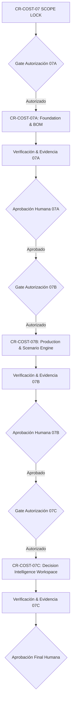

# CR-COST-07 — Scope Lock & Implementation Contract
## Product Economics & Production Scenario Engine
**Subsystem:** Core Cost Intelligence (E9) · Market Intelligence (E10) · Food Production Vertical  
**Document Status:** 🟢 **SCOPE LOCK RATIFIED · PRE-IMPLEMENTATION GATE**  
**Implementación:** 🔴 **BLOQUEADA (Cero código, Cero migraciones, Cero commits, Cero deploys)**  
**Fecha:** 2026-09-27  
**Autoridad Soberana:** Human Product Authority  

---

```text
========================================================================================
                              ESTADO DE GOBERNANZA
========================================================================================
STATUS:                       SCOPE LOCK OFICIALMENTE RATIFICADO
IMPLEMENTATION:               BLOQUEADA (Requiere autorización explícita fase por fase)
DATABASE SUPABASE:            INALTERADA (nhirlpkuvonggctdzzad intacta)
PRODUCTION WORKER:            INALTERADO (eatclean 26a1ded6 intacto)
GIT WORKING TREE:             INALTERADO (Local main en 4cb1e08b, solo docs/ agregados)
AUTORIZACIÓN MODULAR:         07A (Bloqueada) · 07B (Bloqueada) · 07C (Bloqueada)
========================================================================================
```

---

## 1. 🎯 Objetivo del Programa CR-COST-07

Convertir la capacidad de cotización de ingredientes de CR-COST-05 en un **Motor de Inteligencia de Producción y Decisión Económica** (*Product Economics Engine*), capaz de analizar productos alimentarios bajo rigor de fabricación física (lotes enteros, mermas multietapa, mano de obra no lineal, energía y packaging) a través de un embudo progresivo unificado de 4 niveles (`Mercado → Receta → Fábrica → Decisión`).

---

## 2. 🏛️ La Regla Constitucional Inviolable

> ### 🏛️ Regla Constitucional de CR-COST-07:
> **"YOURMEAL OS NO ASUME: PREGUNTA, CALCULA Y EXPLICA."**  
> 
> *El sistema no presupone porcentajes ciegos, no impone jerarquías rígidas y no inventa costes. Descubre la realidad operativa de la cocina mediante diálogo adaptativo, calcula con rigor dimensional y justifica cada número ante el operador.*

---

## 3. 🛡️ Las 5 Cláusulas Constitucionales del Scope Lock

Todo código, contrato o pantalla implementada en este programa deberá satisfacer estrictamente estas cinco cláusulas:

### 1. Cero Valores Inventados (No False Zero / No False Data)
* Ausencia de información **nunca equivale a 0,00 €**.
* La falta de datos se declara mediante la cuádruple taxonomía:
  - `[NO APLICA]`: La dimensión no existe para este producto por definición operativa.
  - `[NO CONFIGURADO]`: La dimensión existe pero el operador aún no ha introducido los parámetros.
  - `[SIN DATOS]`: El sistema carece de lecturas de mercado o facturas vigentes.
  - `[MANUAL]`: Valor estimado subjetivamente por el operador.
* Si la mano de obra o la energía no están parametrizadas, el sistema reporta **`Coste Parcial Conocido`** y bloquea la certificación de margen completo.

### 2. Cero Recálculos Silenciosos (Estudios Versionados e Inmutables)
* Un estudio económico es un registro histórico congelado (`v1`, `v2`, etc.).
* Si un precio de mercado en Makro o Mercadona cambia, **el sistema jamás muta silenciosamente un estudio existente**.
* Despliega la alerta de varianza `🔄 Hay datos de mercado más recientes disponibles` y requiere la acción humana explícita `[Crear Versión 2 con Precios Actuales]`.

### 3. Cero Suposiciones de Destino de Excedentes
* Si una tirada produce raciones por encima de la demanda física requerida (ej. 24 producidas para 20 demandadas) y el operador no define el destino:
  - **Queda terminantemente prohibido asumir `STOCK` o `MERMA` por defecto.**
  - El estado obligatorio es **`[DESTINO NO CONFIGURADO]`**.
  - Se calcula el coste bruto de fabricación, pero el coste efectivo por ración vendida queda en **`[PENDIENTE DE DESTINO]`**.

### 4. Cero "Escenario Óptimo" Universal
* El sistema **nunca declarará un "Escenario Óptimo" absoluto** basado únicamente en el menor coste por plato.
* El motor evalúa el **`Escenario Recomendado según Objetivo y Restricciones`** (minimizar coste, maximizar margen, maximizar beneficio en euros, minimizar excedente o respetar capacidad).
* Cualquier escenario que exceda el 100% de la capacidad de cocina se etiqueta como **`🔴 INVIABLE POR CAPACIDAD`**.

### 5. Cero Falsas Certezas: Derecho Constitucional a decir "NO SÉ"
* Si faltan variables críticas (materia prima esencial, PVP o destino de excedente), el sistema tiene la obligación constitucional de declarar:  
  **`⚪ INFORMACIÓN INSUFICIENTE / NO DETERMINABLE`**.
* Queda prohibido emitir calificaciones de "Producto Viable" sin evidencia completa.

---

## 4. 🧩 Desglose Modular y Gating Estricto por Fases

El Scope Lock establece que **no existe una autorización en bloque**. Cada fase requiere su propio ciclo de gobernanza:

$$\text{Scope Lock} \longrightarrow \mathbf{Autorización\;Específica} \longrightarrow \text{Implementación} \longrightarrow \text{Verificación} \longrightarrow \text{Aprobación\;Humana}$$



---

## 5. 📦 Contratos de Alcance por Fase

### FASE 07A: Economic Study Foundation & BOM Multietapa
* **Estado:** 🔴 **BLOQUEADA (Pendiente de Autorización Humana)**
* **Alcance Técnico:**
  1. Modelo de datos Supabase: tablas `economic_studies`, `study_versions`, `study_ingredients`, `study_yield_stages`.
  2. Aislamiento multi-tenant estricto mediante RLS por `tenant_id`.
  3. Soporte para el ciclo de vida: `BORRADOR` $\to$ `EN_CONFIGURACION` $\to$ `LISTO_SIMULAR` $\to$ `ESTUDIADO` $\to$ `DECISION`.
  4. Red dimensional de unidades flexibles (receta, lote, producto terminado, ración, venta).
  5. Motor de mermas multietapa cuantitativo ($\text{Limpieza} \to \text{Cocción} \to \text{Porcionado}$).
  6. Inmutabilidad versionada con snapshot de precios de mercado al crear versión.
* **Criterio de Cierre 07A:** Capacidad de persistir un estudio borrador, formular una receta con ingredientes de mercado (CR-COST-05) y calcular el coste efectivo de materia prima neta vendible sin contaminar WAC real ni producción.

---

### FASE 07B: Production & Operational Cost Engine
* **Estado:** 🔴 **BLOQUEADA (Depende de 07A y Autorización Humana)**
* **Alcance Técnico:**
  1. Motor de techo discreto: $\lceil \text{Demanda} / \text{Rendimiento} \rceil$ para lotes enteros o cálculo fraccionario según flag `is_fractional_allowed`.
  2. Gobernanza de excedentes con estado `[DESTINO NO CONFIGURADO]` y soporte para `STOCK`, `CONGELADO`, `MERMA`, `VENTA_POSTERIOR`.
  3. Cálculo de Mano de Obra No Lineal: tiempos fijos ($T_{\text{setup}}$, $T_{\text{limpieza}}$) + variables ($T_{\text{lote}}$, $T_{\text{unidad}}$).
  4. Cálculo de Energía en 3 modos trazables: Cuantitativo (kW $\times$ h $\times$ tarifa), Porcentual ($X\%$) y Manual promedio.
  5. Packaging desacoplado: Primario (producto) vs. Logístico (expedición/cajas).
  6. Generador de Matriz de Escenarios: Rampa estándar `[10 · 20 · 30 · 60 · 100 · 300]` + volúmenes libres ad-hoc.
  7. Principio de Coste Parcial Conocido: si falta MO o luz, emite coste conocido sin falsear 0,00 €.
* **Criterio de Cierre 07B:** Matriz de escenarios calculada en memoria y persistida, demostrando no linealidad en costes y bloqueo del coste efectivo cuando el excedente carezca de destino.

---

### FASE 07C: Decision Intelligence & Workspace Progresivo
* **Estado:** 🔴 **BLOQUEADA (Depende de 07B y Autorización Humana)**
* **Alcance Técnico:**
  1. Cuádruple métrica de Break-Even (Tirada, Mensual, PVP Mínimo y Capacidad Requerida).
  2. Evaluador Multidimensional de Escenario Recomendado (Coste, Margen, Beneficio, Excedente y Capacidad).
  3. Detector de Varianza de Mercado y flujo de creación de `Versión 2 (v1 vs v2)`.
  4. Generador determinista de Veredicto Narrativo Humano aplicando la Tríada de Conclusión (Certificada, Condicionada, Información Insuficiente).
  5. UI progresiva unificada en 4 niveles (`Mercado → Receta → Fábrica → Decisión`).
  6. Registro formal de Decisión Soberana en base de datos (`study_decisions`).
* **Criterio de Cierre 07C:** Navegación fluida por los 4 niveles del embudo, emisión de veredicto con derecho a decir "NO SÉ" y registro de decisión de carta auditada.

---

## 6. 🚫 Frontera de Exclusión Absoluta (Anti-Scope)

Queda estrictamente prohibido implementar o alterar en este programa:
- ❌ **Cero OCR de facturas:** Exclusivo de **CR-COST-06**.
- ❌ **Cero logística y delivery:** Sin rutas, flotas, kilometraje ni comisiones de Glovo/Uber.
- ❌ **Cero órdenes automáticas de compra (MRP):** Sin mutación de órdenes de compra.
- ❌ **Cero telemetría IoT:** Sin integración de sensores de hornos o enchufes inteligentes.
- ❌ **Cero mutación automática de PVP:** Sin alterar precios en sistemas TPV sin confirmación humana.
- ❌ **Cero alteración de WAC o facturas reales:** Todo cálculo vive en el sandbox del estudio.

---

## 7. 🚦 Protocolo de Inicio para la Autoridad Humana

El Scope Lock queda oficialmente redactado y ratificado como contrato vinculante.

Para iniciar la ejecución:
1. El Human Product Authority debe autorizar de forma explícita el **Hito 07A (Foundation & BOM Multietapa)**.
2. Mientras dicha autorización no ocurra, el agente mantendrá **bloqueada toda escritura de código, migraciones SQL o mutaciones en producción**.

```text
========================================================================================
                              FIRMA DEL SCOPE LOCK
========================================================================================
AUTORIDAD HUMANA:             APROBADO
EQUIPO MULTI-AGENTE:          RATIFICADO & CALIBRADO 1:1 CON BLUEPRINT v2.0
ESTADO DE IMPLEMENTACIÓN:     🔴 BLOQUEADO
PRÓXIMA ACCIÓN PERMITIDA:     AUTORIZACIÓN EXPLÍCITA DEL HITO CR-COST-07A
========================================================================================
```
