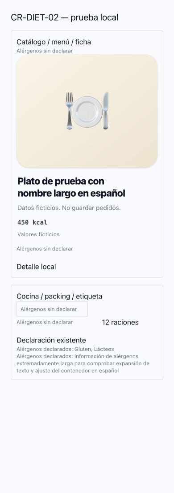

# CR_DIET_02_PHASE1 — Semántica de declaración de alérgenos

OBJECTIVE: Semántica de declaración de alérgenos.
CURRENT STATE: main 752234f406366bdf2fcec18750092b6f0fd44039, base independiente.
CLASSIFICATION: Bug Fix / semántica de presentación.
AUTHORIZED NOW: implementación, tests, commit, push de rama y PR; autorización humana adjunta del 04/10/2026.
NOT AUTHORIZED: merge, Gate 7, dispatch, deploy, producción, migraciones, OAuth, B2 o Responsive Clientes.
PLAN: trazar → implementar mínimo → validar → red team → PR.
STOP CONDITION: PR OPEN / READY FOR HUMAN REVIEW.

# DOCUMENT CONTEXT CHECK
FOUNDATION y AGENTS: CONSULTED. Estrategia, Filosofía y CTO: CONSULTED. ENGINEERING_OPERATING_PROTOCOL y ADR de review: CONSULTED. Contratos relevantes: fechas/Weekly Menu/Orders en B1; Dish/allergens y operaciones en DIET. Provider runbooks: N/A, sin ejecución de proveedor. Discovery y contrato humano: ACCEPTED. No se reabre Foundation.

## Contrato autorizado
NULL/[]/undefined → UNKNOWN; array no vacío → DECLARED. Ninguna certificación VERIFIED. Helper puro de presentación/dominio; las declaraciones y arrays originales permanecen intactos. Sin DB, migration, backfill, inferencia, receta, ingrediente ni writes de pedidos.

## Trazabilidad de superficies
- Biblioteca: admin.dishes, lista y alta/edición: antes omisión; ahora aviso vacío junto a badges existentes.
- Menús admin: slots y selector de platos: antes omisión; aviso cuando existe plato y carece de declaración. Un slot sin plato no inventa estado del plato.
- Captura Universal y captura legacy: catálogo conserva arrays; aviso desconocido. La Universal muestra además declaración existente usando labels canónicos.
- Cliente: MenuDishPost (menú/schedule) y detalle app.menu.$dishId: aviso desconocido; el post muestra declaración presente. DishCard antiguo no usado por rutas actuales, no cambiado.
- Cocina: kitchen-execution, production.batch, producción por plato y hojas impresas: el vacío ya no es silencio/dash.
- Packing: production-sheet por plato/cliente e impresión por cliente utiliza metadata existente por dishId; ausencia de metadata también UNKNOWN. Jerarquía sin composición conserva alertas, pero aclara que ausencia de alerta no acredita ausencia de alérgenos. Etiquetas de ración: aviso para platos desconocidos/customs sin composición.
- Mapper catálogo y repositorio de menú: dishes completos, null→[]; no se cambian contratos API porque el helper conserva UNKNOWN tras normalización.
- ProductionReportService/production-report y operational-date-resolver: arrays normalizados y coincidencias declaradas; no representan certificación. No se altera el engine, cantidades ni estados.
- Perfil/restricciones del cliente y orders.dietary_snapshot: conceptos distintos, no modificados. El texto existente “Sin alérgenos ni condiciones especiales declaradas en este pedido” pertenece a restricciones del cliente, no al plato.

## Archivos esperados
Policy pura, presentación reutilizable, pruebas y puntos de integración anteriores. Scope transversal de semántica, sin rediseño de páginas o Core/Auth.

## Validación
PASS: 26 pruebas dirigidas (incluye mapper semanal, reporte operativo y captura), typecheck, governance, build Nitro y git diff --check. PASS local de componente real en contextos card/table/label: 1440/1280/1024/768/390, texto largo español y texto duplicado; sin clipping/overflow del aviso.
FAIL — PRE-EXISTING: lint de archivos existentes; comparación con base, cero diagnósticos nuevos.
NOT TESTED: navegación integral autenticada de todas las rutas, impresión física y producción; no equivaler fixtures de contenedores a certificación de cada página completa.

## Red team / límites
No altera arrays ni deduce composición. UNKNOWN no es garantía de ausencia; DECLARED no significa completa/verificada. Sin nuevos permisos ni acciones interactivas. No se obtiene procedencia persistente: no requerida para este aviso; estados/versiones/snapshots futuros requieren diseño y autorización separada. La integridad total del Dietary Engine sigue pendiente. Las alerts actuales solo calculan coincidencias sobre declaraciones, no garantizan seguridad.

## Valor operativo
Permite al operador identificar información pendiente antes de confiar en una ausencia visual. No estimar ahorro temporal ni certificación alimentaria sin observación humana y fuente culinaria.

## Estado de revisión
READY FOR HUMAN REVIEW. No merge ni despliegue autorizados.

## PR REVIEW REPORT
Base: 752234f406366bdf2fcec18750092b6f0fd44039. Reviewer: Codex. Fecha: 2026-10-04.
Arquitectura/contratos/tests/TypeScript/governance/build: PASS. Lint: WARN (preexistente, cero nuevos). Android/APK/ADB: N/A, no se certifica dispositivo. Regresión: PASS local; producción NOT TESTED. Evidencias: fixture local, no observación de pedidos reales. Laws: consumo Core, no redefine autoridad; tiempo ahorrado no medido. Riesgo: LOW en B1, MEDIUM de presentación transversal en DIET.
Veredicto técnico: READY WITH WARNINGS. Estado autorizado: READY FOR HUMAN REVIEW; no recomendación de merge/despliegue automático.

Suite ampliada: 47 archivos, 223 pruebas PASS (dish-library, weekly-menu, operations, componentes y rutas de pedidos). No se presenta como certificación alimentaria.
