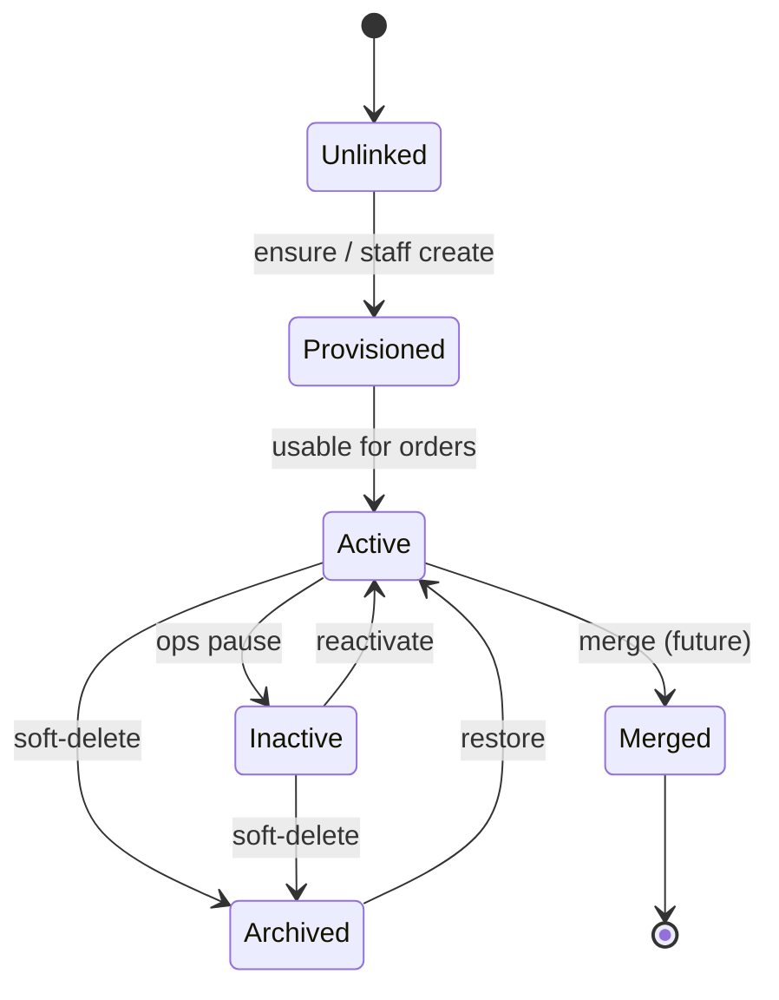
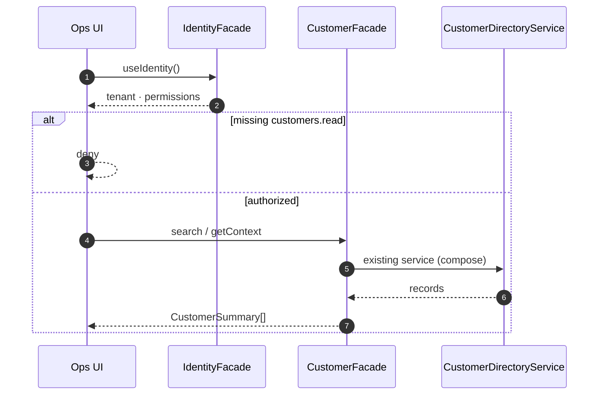
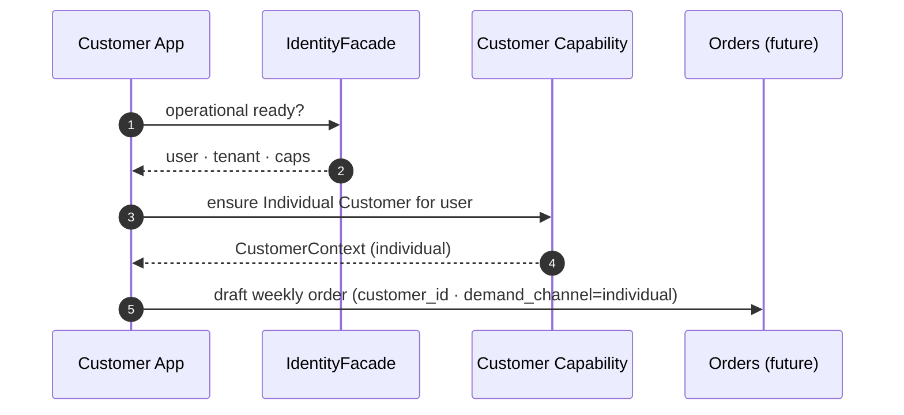

# Customer Capability

**OPERATIONAL-002 · Phase 3 — Validation (Engineering Certified)**  
**ADR:** [0058 — Customer Capability](../adr/0058-customer-capability.md) · [0059 — Customer Facade](../adr/0059-customer-facade.md) · [0060 — Customer Validation](../adr/0060-customer-validation.md)  
**Status:** **Engineering Certified** (14 PASS · 2 UNIMPLEMENTED · 0 FAIL — no Product UI in this phase)  
**Depends on:** Identity Capability (ADR 0055–0057 · Engineering Certified)  
**EatClean lens:** weekly meal prep · particulares + empresas · delivery locations · production grouping  
**Maturity:** Architecture → Facade → **Engineering Certified** → Field Validated → Production Ready  
**Completeness:** Architecture → Facade → Validation → **UI next** → Field → Production

---

## Purpose

Define the **canonical Customer Capability** for YourMeal OS.

Customer is a **business capability**, not a screen and not a CRUD.

> **What is a Customer inside YourMeal OS?**

One canonical answer — for EatClean ops, packaging, routes, and support — without inventing a second CRM vocabulary on top of Party / B2B / B2C.

---

## EatClean first (not generic CRM)

EatClean does not need “the world’s best CRM”. It needs:

| Daily question | Customer Capability must answer |
|----------------|----------------------------------|
| Who ordered this week? | Demand party + channel (B2C / B2B) |
| Where do we deliver? | Delivery location (personal address or Site / Delivery Group) |
| How do we group packaging? | Company / Site / OU / Delivery Group · or individual |
| Can staff find this client fast? | Directory search · tags · status |
| Any allergy / preference risk? | Allergens · preferences (safe packaging) |
| Who may place / manage? | Permissions via Identity + Customer caps |

If a feature does not reduce time or errors in that loop → **wait**.

---

## Naming (ubiquitous language)

Bare word **Customer** is ambiguous. Capability contracts use precise terms (ADR 0015 / 0016 / DICT):

| Term | Meaning |
|------|---------|
| **Party** | Semantic demand actor (umbrella) |
| **Individual Customer** | Person party — physical `customers` row (B2C / employee person) |
| **Company Account** | B2B contracting party — `companies` (≠ Tenant Organization) |
| **Consumer / Beneficiary** | Role views of a person (who orders / who eats) |
| **Site** | Delivery / ops location under Company Account |
| **Organizational Unit (OU)** | Department-like structure |
| **Delivery Group** | Logistics grouping for B2B |
| **Employee Membership** | Person ↔ Company Account link |
| **Demand Channel** | `individual` \| `company` on orders |

**Physical freeze (this ADR):** keep ADR 0015 pilot tables. Do **not** require `parties` table in OPERATIONAL-002. Party remains semantic (ADR 0016 Option C).

---

## Responsibilities

| Area | Customer Capability owns | Does not own |
|------|--------------------------|--------------|
| Customer identity | Individual Customer / Company Account records · link to auth user when present | Supabase Auth / Identity ladder |
| Contact information | Email · phones · company contact fields | Notification transport (WhatsApp senders) |
| Addresses | Personal addresses (B2C) | Route planning algorithm |
| Delivery locations | Resolve personal address **or** Site / Delivery Group | Driver GPS / route execution |
| Tags | Customer / company tags for ops search | Dish tags |
| Operational status | Durable lifecycle (active / inactive / archived…) beyond soft-delete heuristics | Order status |
| Preferences | Dietary / ops prefs · dish favorites as sub-surface | Identity-scoped UI prefs (locale chrome) |
| Allergens | Allergy records for safe packaging (future-ready) | Kitchen recipe formulation |
| Communication preferences | Opt-in channels · quiet hours (future) | Messaging providers |
| Tenant ownership | `tenant_id` · RLS · staff vs self | Multi-tenant platform SaaS admin |
| Audit metadata | Writes stamped with Identity `membershipId` (preferred) | Doctor / Platform engines |
| Directory | Staff read models for ops center | Full BI / analytics warehouse |

---

## Relationships

```text
Identity Capability
        │ authorizes · tenant · permissions · membershipId
        ▼
Customer Capability
        │
        ├── Orders          (who / for whom / demand channel / delivery target)
        ├── Invoices        (payer may be Individual or Company Account)
        ├── Membership      (Employee Membership — CompanyAccount owns structure)
        ├── Delivery        (targets · not routing)
        └── Support notes   (directory activity)
```

| Related | Rule |
|---------|------|
| **Orders** | Strong consumer of Customer; Order Capability will own order lifecycle |
| **Invoices** | Billing owns invoices; Customer exposes payer party |
| **Membership** | `company_employees` stays under Company Account structure — Customer does not redefine Membership as CRM |
| **Delivery** | Customer exposes **where**; Delivery Capability owns **how routes run** |
| **Identity** | Never call Supabase Auth from Customer modules — consume `IdentityFacade` |

---

## Lifecycle

### Individual Customer

```text
Prospect / Unlinked
      │
      ▼
Provisioned (row exists · optional user_id)
      │
      ▼
Active (can receive orders · directory visible)
      │
      ├── Inactive (ops pause · no new orders)
      ├── Archived (soft-delete)
      └── Merged (future · into another Individual)
```

### Company Account

```text
Created (staff-provisioned by EatClean)
      │
      ▼
Active
      │
      ├── Sites / OUs / Delivery Groups configured
      ├── Employees join via Company Code
      ├── Suspended
      └── Archived
```

**EatClean commercial rule (frozen from ADR 0015):** companies are **staff-provisioned**; employees **join**; particulares keep CJ-001 — Customer App never creates Company Accounts.

---

## State machine (Individual — capability level)



Directory “new / inactive” heuristics from order recency may **inform** UI but must not replace durable `CustomerStatus` once Implement defines it.

---

## Permission model

Consumes Identity `PermissionModel`. Customer Capability declares **which caps it requires**:

| Capability | Who | Purpose |
|------------|-----|---------|
| `customers.read` | Staff | Directory / detail |
| `customers.write` | Staff | Create / update / archive / restore |
| `support.read` / `support.write` | Staff | Support notes |
| `company.manage` | Staff | Company Account structure |
| `site.manage` | Staff | Sites |
| `organization.manage` | Staff | OUs |
| `employee.manage` | Staff | Employee memberships |
| `customers.self` *(future freeze)* | Authenticated customer | Own profile / addresses / allergens |

**Rule:** UI never invents permission checks — Identity + Capability matrix only.

---

## Public contracts (freeze)

```ts
/** Durable ops status — not order status. */
export type CustomerStatus =
  | "unlinked"
  | "provisioned"
  | "active"
  | "inactive"
  | "archived"
  | "merged";

export type CustomerErrorCode =
  | "NOT_FOUND"
  | "TENANT_MISMATCH"
  | "PERMISSION_DENIED"
  | "INVALID_STATE"
  | "DUPLICATE"
  | "COMPANY_CODE_INVALID"
  | "LINK_CONFLICT"
  | "UNKNOWN";

export type CustomerError = {
  code: CustomerErrorCode;
  message: string;
  recoverable: boolean;
  evidence?: Record<string, unknown>;
};

/** Staff directory card / search hit. */
export type CustomerSummary = {
  partyKind: "individual" | "company_account";
  /** Individual: customers.id · Company: companies.id */
  id: string;
  displayName: string;
  status: CustomerStatus;
  demandChannelDefault: "individual" | "company";
  tenantId: string;
  tags: string[];
  /** Optional Identity link */
  userId: string | null;
};

/** Individual person party (maps to customers + facets). */
export type CustomerProfile = {
  id: string;
  kind: "individual";
  fullName: string | null;
  email: string | null;
  phones: { id: string; e164: string; label?: string }[];
  addresses: {
    id: string;
    label?: string;
    line1: string;
    city?: string;
    postalCode?: string;
    isDefaultDelivery?: boolean;
  }[];
  allergens: { id: string; code: string; note?: string }[];
  preferences: Record<string, unknown>;
  communicationPreferences: {
    channels: Record<string, boolean>;
    quietHours?: { start: string; end: string } | null;
  };
  status: CustomerStatus;
  userId: string | null;
  tenantId: string;
  tags: string[];
};

/** Resolved “where do we deliver this demand?” */
export type DeliveryLocationRef =
  | { kind: "customer_address"; addressId: string }
  | { kind: "company_site"; siteId: string; deliveryGroupId?: string | null };

/**
 * Canonical operational read for modules that need “the customer in context”.
 * Always authorized via Identity (tenant + caps).
 */
export type CustomerContext = {
  summary: CustomerSummary;
  profile: CustomerProfile | null; // null when partyKind=company_account until company profile type
  companyAccountId: string | null;
  deliveryLocation: DeliveryLocationRef | null;
  identityUserId: string | null;
  permissions: {
    canRead: boolean;
    canWrite: boolean;
    canSupport: boolean;
    canSelf: boolean;
  };
};

export type CustomerResult = {
  ok: boolean;
  context: CustomerContext | null;
  errors: CustomerError[];
};
```

Company Account detail contracts remain those in ADR 0015 / `CompanyAccount` domain types — Customer Capability **references** them; it does not fork a parallel company CRM.

### Facade (ADR 0059 — implemented)

```ts
// src/customer/CustomerFacade.ts · useCustomer()
// Commands (write intent) — not customer.save()
CreateCustomer | UpdateCustomer | ArchiveCustomer | RestoreCustomer | MergeCustomer

// Queries (read intent) — not customer.search()
GetCustomer | SearchCustomers | ListRecentCustomers | GetDeliveryLocations | GetCompanyAccounts
```

Operational Modules consume **only** `CustomerFacade` / `useCustomer`.  
UI never imports repositories, Supabase, or infrastructure (FOUNDATION LAW 002).

---

## Capability questions (Definition of Done drivers)

| Question | Capability answer surface |
|----------|---------------------------|
| Who is the customer? | `CustomerSummary` / `CustomerProfile` / Company Account |
| Can create? | `customers.write` · company.manage (staff) · ensure individual (CJ-001) |
| Can archive? | soft-delete → `archived` |
| Can merge? | Future `Merged` state — extension point |
| Can search? | Directory search |
| Can assign? | Support / delivery assignment via related modules |
| Can blacklist? | Prefer `inactive` + tags — explicit blacklist later if EatClean needs it |
| Can export? | Future Analytics / Admin — not Phase 1 |

---

## Sequence — staff opens directory



## Sequence — particular places weekly order (CJ-001)



---

## Relationship with existing code (observe)

| Existing | Role under this Capability |
|----------|----------------------------|
| `CustomerDirectoryService` | Staff directory read/write substrate |
| `CompanyAccountService` | B2B structure substrate |
| `CustomerPreferencesService` | Favorites sub-surface |
| `customers` + facets tables | Physical Individual Customer |
| `companies/*` tables | Physical Company Account |
| `/admin/customers` | UI — later, behind Facade |

Phase 1 does **not** move or rewrite these — Freeze only.

---

## Gaps → Implement / Facade phases

| Gap | Plan |
|-----|------|
| Durable `CustomerStatus` | Replace heuristics with explicit status |
| Tags | Persist customer/company tags |
| Allergens service | Wire `customer_allergies` safely for kitchen labels |
| Addresses CRUD | Complete CJ-002 behind Facade |
| Comms preferences | Persist opt-in · quiet hours |
| `customers.self` | Freeze self-service caps with Identity |
| `membershipId` on writes | Close Identity V10 WARNING |
| CustomerFacade | ✅ ADR 0059 (`src/customer/`) |
| UpdateCustomer / RestoreCustomer substrate | UNIMPLEMENTED intent frozen — wire in Validate / UI |
| Individual delivery addresses (CJ-002) | GetDeliveryLocations individual gap |

---

## Future extension points

- Party physical table (`parties`) post-Gate (ADR 0016)  
- Customer merge / blacklist explicit  
- Allergen → Label automation for packaging  
- Communications engine (recipients from directory)  
- Export for Accounting / Analytics  
- Beneficiary as first-class eater profile distinct from payer  

---

## Acceptance (Phase 1)

- [x] Responsibilities · lifecycle · state machine  
- [x] Contracts (`CustomerContext`, `CustomerSummary`, `CustomerProfile`, `CustomerStatus`, `CustomerError`, …)  
- [x] Sequence diagrams  
- [x] Identity relationship · permission model  
- [x] EatClean operational lens  
- [x] Extension points  
- [x] ADR 0058 · Capability Registry entry  
- [x] **No UI · no CRUD · no DB changes · no implementation** (Phase 1)

## Acceptance (Phase 2 — Facade)

- [x] `CustomerFacade` · `useCustomer` · Commands · Queries  
- [x] Compose Directory + CompanyAccount — no storage exposure  
- [x] FOUNDATION LAW 002 · Capability Maturity in Registry  
- [x] ADR 0059  
- [x] **No CRUD screens · no routing · no business workflow rewrite**

## Acceptance (Phase 3 — Validation)

- [x] Validation matrix · Expected / Observed / Evidence  
- [x] Customer Validation Report · Smoke Checklist  
- [x] ADR 0060 · Engineering Certified  
- [x] FOUNDATION LAW 003  
- [x] Capability Completeness dimension  
- [x] **No Product UI · no routing · no feature work**

---

## Next

```text
OPERATIONAL-002 Phase 1  Architecture   ✅ ADR 0058
OPERATIONAL-002 Phase 2  Facade         ✅ ADR 0059
OPERATIONAL-002 Phase 3  Validate       ✅ ADR 0060 / this PR
OPERATIONAL-002 Phase 4  UI             (Law 003 — screens orchestrate only)
Then field smoke · Orders Architecture
```
