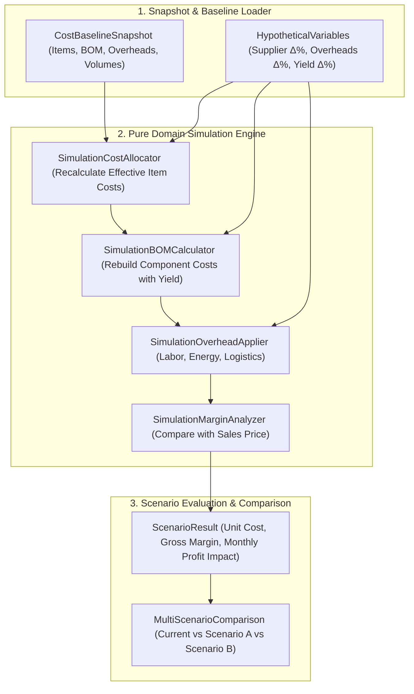

# E9: COST SIMULATION & SCENARIO INTELLIGENCE ARCHITECTURE
**Fecha:** 26 de Septiembre de 2026  
**Autoridad:** Human Product Authority & Agency Council  
**Conformidad:** `YOURMEAL_OS_PLATFORM_CONSTITUTION.md` (L1) · `YOURMEAL_OS_PLATFORM_EVOLUTION_ROADMAP.md`

---

## 1. Misión de E9

Proveer un motor de simulación en sandbox (*What-if Engine*) que permita a los gestores de negocio experimentar con variables hipotéticas de compra, logística, energía, mano de obra y mermas, proyectando su impacto directo sobre costes unitarios, márgenes de producto y rentabilidad mensual **sin alterar jamás los datos reales de producción ni contabilidad**.

---

## 2. Invariante Canónico: Simulation $\neq$ Reality

```text
┌─────────────────────────────────────────────────────────────────────────────┐
│                        SANDBOX ISOLATION CONTRACT                           │
│                                                                             │
│  [ Real Database ] ──( Snapshot Read-Only )──► [ Simulation Sandbox ]       │
│                                                        │                    │
│                                              + Hypothetical Deltas          │
│                                                        │                    │
│                                                        ▼                    │
│                                              [ Projected Scenarios ]        │
│                                                        │                    │
│                                               ( 0 Writes to Real DB )       │
└─────────────────────────────────────────────────────────────────────────────┘
```

1. **No Mutations:** La ejecución de una simulación no emite mutaciones en `stock_movements`, `ingredients`, `dishes.price`, `orders` ni `invoices`.
2. **Deterministic Baseline:** Todo escenario parte de un `CostBaselineSnapshot` inmutable que fija los costes reales de los componentes a fecha $T$.
3. **Reproducibilidad:** Dados el mismo `CostBaselineSnapshot` y el mismo conjunto de `HypotheticalVariables`, el resultado proyectado es idéntico al 100%.

---

## 3. Arquitectura del Motor de Simulación



---

## 4. Tipos del Dominio de Simulación

```typescript
export interface HypotheticalVariables {
  supplierDeltas?: Record<string, number>; // e.g. { "SUPP-MAKRO": 0.08 } (+8%)
  itemCostDeltas?: Record<string, number>; // e.g. { "ING-POLLO": 0.12 } (+12%)
  overheadDeltas?: {
    laborRateDeltaPct?: number; // e.g. +0.05 (+5%)
    energyRateDeltaPct?: number; // e.g. +0.10 (+10%)
    logisticsRateDeltaPct?: number; // e.g. +0.15 (+15%)
    packagingRateDeltaPct?: number; // e.g. +0.07 (+7%)
  };
  yieldLossAdjustments?: Record<string, number>; // e.g. { "ING-POLLO": -0.03 } (-3% merma)
}

export interface SimulatedProductImpact {
  productId: string;
  productName: string;
  salesPrice: number;
  currentCost: number;
  simulatedCost: number;
  costDelta: number;
  costDeltaPct: number;
  currentMarginPct: number;
  simulatedMarginPct: number;
  marginDeltaPct: number;
  varianceBreakdown: {
    materialsDelta: number;
    logisticsDelta: number;
    energyDelta: number;
    laborDelta: number;
    packagingDelta: number;
    yieldLossDelta: number;
  };
}

export interface ScenarioResult {
  scenarioId: string;
  name: string;
  baselineDate: string;
  productImpacts: SimulatedProductImpact[];
  summary: {
    avgCostDeltaPct: number;
    avgMarginDeltaPct: number;
    projectedMonthlyVolume: number;
    projectedMonthlyCostDelta: number;
    projectedMonthlyProfitImpact: number;
  };
}
```
