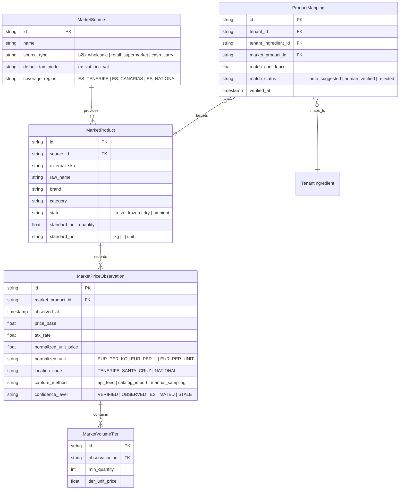

# YOURMEAL OS — FOOD MARKET PRICE INTELLIGENCE
## Discovery & Multi-Agent Architectural Study
**Subsystem:** Core Market Intelligence & FOOD Vertical Economics  
**Status:** DISCOVERY ONLY (🟡 Pre-CR Architectural Study)  
**Governance Standard:** Read-Only Analysis · No Code · No Database Mutation · No Deployment  
**Date:** 2026-09-27  

---

## 1. Executive Summary

This architectural study evaluates the design, feasibility, boundaries, and strategic impact of introducing a **Food Market Price Intelligence** subsystem into YourMeal OS. 

Rather than a simple flat pricing database or fragile web scraper, this capability represents an **Observable Market Intelligence Layer** that operates alongside our certified calculation engines:

```text
       ┌────────────────────────────────────────────────────────┐
       │             FOOD MARKET PRICE INTELLIGENCE             │
       │   Observable Public & Professional Benchmarks (E10)    │
       └───────────────────────────┬────────────────────────────┘
                                   │ Contextual Delta / Variance
                                   ▼
┌───────────────────────────┐           ┌────────────────────────────┐
│      PROCUREMENT (E1)     │           │   COST INTELLIGENCE (E9)   │
│ Inbound Invoices & WAC    │──────────►│ Escandallo, Overheads,     │
│ Real Purchase Cost (Paid) │           │ Margin & Shock Simulation  │
└───────────────────────────┘           └────────────────────────────┘
                                   │
                                   ▼
       ┌────────────────────────────────────────────────────────┐
       │                 NEGOTIATION INTELLIGENCE               │
       │  Actionable Operator Briefs & Purchasing Opportunities │
       └────────────────────────────────────────────────────────┘
```

The core objective is to provide the food service operator with simultaneous, ground-truth visibility across five dimensions:
1. **Market Public Benchmark:** What professional distributors (Makro, GM Cash, 5 Océanos) and retail anchors (Mercadona) charge.
2. **Contractual & Invoiced Cost:** What our specific suppliers actually bill us (WAC / Effective Unit Acquisition Cost).
3. **True Production Cost:** What it costs to execute each dish considering recipes (BOM), shrinkage/yield, labor, energy, and packaging.
4. **Real Operating Margin:** Real gross margin percentage derived from calibrated PVP.
5. **Negotiation Leverage:** Identifying where contractual prices exceed market references and arming the buyer with actionable volume and variance briefs.

---

## 2. Multi-Agent Findings & Consensus

A comprehensive cross-agent panel was convened across 15 operational disciplines:

### 1. Foundation Guardian
* **Invariant:** Market intelligence must remain **purely observable context**. An external market price must never silently overwrite internal catalog costs (`ingredients.cost`), stock valuations, or billing history. Market data is read-only reference; internal WAC is factual reality.

### 2. Agency Governance
* **Invariant:** Discovery only. No migrations, scrapers, background daemons, or UI alterations without explicit Scope Lock and Human Product Authority ratification.

### 3. Software Architect
* **Layering:** Market Intelligence constitutes an independent domain module (`@/modules/market-intelligence`) located within Platform Core, with semantic plugins specialized for the FOOD vertical (shrinkage models, food taxonomies, culinary units).

### 4. Core ↔ Instance Architect
* **Multi-Tenancy:** Market observation data (e.g., Makro Tenerife wholesale price for Chicken Breast on 2026-09-27) is **shared, tenant-agnostic reference knowledge** stored in Core/Platform space. Tenant instances (e.g., EatClean) maintain private `ProductMapping` links between their private catalog ingredients and public market products.

### 5. Database / Supabase Engineer
* **Storage Schema:** Time-series price observations require append-only historical design with composite indexes on `(market_product_id, observed_at DESC, region_id)`. Tenant mappings require strict foreign key cascading with `tenant_id` RLS isolation.

### 6. Backend Engineer
* **Services:** Clean domain service separation: `MarketPriceIngestionService` (capturing observations), `ProductMatchingService` (confidence scoring), and `MarketBenchmarkService` (variance computation against internal WAC).

### 7. Frontend Engineer
* **User Experience:** Contextual comparison badges directly in `/admin/purchasing` (comparing invoice line price vs market benchmark) and a dedicated tab in `/admin/cost-intelligence` showing price dispersion and negotiation briefs.

### 8. QA Engineer
* **Testability:** Complete decoupling between ingestion adapters and calculation math. Benchmark engines must be 100% unit-testable using deterministic mock price feeds without network dependencies.

### 9. Product / YourMeal OS Core
* **Value Proposition:** Transforms YourMeal OS from an administrative record-keeping system (*"What did we pay?"*) into a predictive decision engine (*"Are we overpaying, by how much, and what is our leverage?"*).

### 10. Food / EatClean Instance
* **Local Realism:** Canary Islands market conditions demand regional precision. Retail pricing in Santa Cruz de Tenerife differs significantly from mainland wholesale pricing due to IGIC, maritime freight (REREA / POSEI), and insular logistics.

### 11. Cost Intelligence Specialist
* **E9 Synergy:** External market price trajectories directly feed E9 What-If scenarios. Operators can simulate: *"If market poultry rises 12% in Q4 (as observed in Makro trends), what is our monthly profit impact before our supplier applies a price hike?"*

### 12. Procurement Specialist
* **Negotiation Power:** Generates structured "Negotiation Briefs" displaying annual purchase volume, current supplier price, benchmark gap, and alternative market offerings before quarterly vendor meetings.

### 13. Growth / Commercial Lead
* **Enterprise Appeal:** High-margin B2B SaaS differentiator. Chains and catering operators can achieve immediate ROI by shaving 3–7% off core raw material procurement.

### 14. Security & Data Governance
* **Data Hygiene:** Clear separation between publicly observable data (public prices, catalog PDFs) and proprietary tenant transaction data (negotiated vendor discounts, private rebates, actual supplier identities).

### 15. Legal & Compliance
* **IP & Scraping Boundaries:** Scraping behind authenticated B2B portals violates Terms of Service. Ingestion must prioritize authorized feeds, standard digital catalogs, assisted human entry, and publicly accessible non-gated price indices.

---

## 3. Core vs. FOOD vs. Instance Boundary

To avoid architectural contamination, responsibilities are partitioned according to the Constitutional 3-Tier Model:

```text
┌────────────────────────────────────────────────────────────────────────┐
│                          YOURMEAL OS CORE                              │
│  - Generic MarketSource registry (B2B, Retail, Cash&Carry, Exchange)   │
│  - Time-series observation storage & TTL lifecycle                     │
│  - Normalized currency & unit conversion engines (€/kg, €/L, €/unit)   │
│  - Variance calculation math & Statistical Trend Engines               │
│  - Tenant-agnostic public benchmark storage                            │
└───────────────────────────────────┬────────────────────────────────────┘
                                    │
┌───────────────────────────────────▼────────────────────────────────────┐
│                        FOOD VERTICAL PLUGIN                            │
│  - Food taxonomy & item categorization (Meat, Fish, Dairy, Produce)   │
│  - Food-specific matching rules (Fresh vs Frozen, Cut, Origin, Yield) │
│  - Culinary conversion matrices (e.g., density of liquid eggs/sauces) │
│  - Perishable shrinkage & waste percentage awareness                  │
└───────────────────────────────────┬────────────────────────────────────┘
                                    │
┌───────────────────────────────────▼────────────────────────────────────┐
│                      TENANT INSTANCE (EatClean)                        │
│  - Private Supplier contracts & payment conditions                     │
│  - Private Ingredient Catalog & Recipe Escandallos                    │
│  - ProductMapping: Tenant Ingredient ID <───> Core Market Product ID   │
│  - Private Effective Acquisition Costs (WAC + Freight/Portes)          │
│  - Negotiation Briefs & Human Decision Intents                        │
└────────────────────────────────────────────────────────────────────────┘
```

---

## 4. Public Primary Price: Taxonomy & Formal Definition

A **Public Primary Price** is an observable, non-confidential unit quotation published by a market supplier or retailer for a specific product specification at a specific point in time and geographic region.

It is distinct from other financial and commercial price types:

```
┌─────────────────────────────────────────────────────────────────────────────────────────────────┐
│                                    PRICE TAXONOMY MATRIX                                        │
├──────────────────────────┬─────────────────┬──────────────┬─────────────────────────────────────┤
│ Price Type               │ Nature          │ Confidential │ Context in YourMeal OS              │
├──────────────────────────┼─────────────────┼──────────────┼─────────────────────────────────────┤
│ Public Primary Price     │ Observable      │ Public       │ Market Reference Benchmark          │
│ Retail Shelf Price       │ Consumer        │ Public       │ Retail Ceiling Reference (e.g. Merc)│
│ Wholesale / Cash&Carry   │ Professional B2B│ Semi-Public  │ B2B Base Benchmark (e.g. Makro/GM)  │
│ Volume Tier Price        │ Stepped Promo   │ Semi-Public  │ Purchasing Scale Opportunity        │
│ Contractual Price        │ Bilateral       │ Private/NDA  │ Supplier Master Agreement           │
│ Invoice Price (Base)     │ Transactional   │ Private      │ Inbound Invoice Line Item           │
│ Effective Acquisition Cost│ Derived (WAC)   │ Private      │ Invoice Price + Freight - Discounts │
│ Transfer / Internal Cost │ Production      │ Private      │ Finished Dish Escandallo (BOM)      │
└──────────────────────────┴─────────────────┴──────────────┴─────────────────────────────────────┘
```

---

## 5. Source Analysis: Heterogeneity & Semantic Roles

The four proposed sources are fundamentally non-equivalent and fulfill distinct intelligence roles:

```text
               ┌─────────────────────────────────────────────────┐
               │         SOURCING INTELLIGENCE SPECTRUM          │
               └────────────────────────┬────────────────────────┘
                                        │
        ┌───────────────────────────────┴───────────────────────────────┐
        ▼                                                               ▼
┌──────────────────────────────┐                                ┌──────────────────────────────┐
│       WHOLESALE / B2B        │                                │        RETAIL / BENCHMARK    │
│  Direct Sourcing Alternat.   │                                │  Ceiling / Emergency Sourcing│
└──────────────┬───────────────┘                                └──────────────┬───────────────┘
               │                                                               │
       ┌───────┴───────┐                                               ┌───────┴───────┐
       ▼               ▼                                               ▼               ▼
 ┌───────────┐   ┌───────────┐                                   ┌───────────┐   ┌───────────┐
 │   MAKRO   │   │  GM CASH  │                                   │ 5 OCÉANOS │   │ MERCADONA │
 └───────────┘   └───────────┘                                   └───────────┘   └───────────┘
```

### A. Makro (Metro AG)
* **Channel:** Professional B2B / HORECA Cash & Carry.
* **Pricing Model:** Ex-VAT (Base), Volume-tiered pricing ("Compra Más, Paga Menos"), and individualized customer contract pricing.
* **Format:** Bulk, catering-sized packaging (e.g., 2 kg vac-pac chicken breast, 5 L oil).
* **Role in YourMeal OS:** **Primary Professional Benchmark**. Represents the accessible baseline wholesale market price for restaurants and catering kitchens.
* **Representation:** Must capture base unit price AND volume break tiers (e.g., Tier 1: 1 unit @ 6.20 €/kg; Tier 2: 3+ units @ 5.75 €/kg; Tier 3: 6+ units @ 5.20 €/kg).

### B. GM Cash (Transgourmet Ibérica)
* **Channel:** Pure HORECA Cash & Carry wholesale.
* **Pricing Model:** Professional ex-VAT and promotional folletos.
* **Format:** Large-scale food service formats and professional private label (Quality, Gourmet).
* **Role in YourMeal OS:** **Secondary Professional Benchmark**. Validates competitive wholesale pricing against Makro.

### C. 5 Océanos (Canary Islands Specialist)
* **Channel:** Regional Specialist (Frozen & Protein retail/semi-wholesale).
* **Geographic Reality:** Strong physical presence across Tenerife, Gran Canaria, and Western Canary Islands.
* **Pricing Model:** Retail / Bulk with frequent local promotions, highly adapted to insular logistics.
* **Role in YourMeal OS:** **Regional Canary Protein Benchmark**. Key baseline for frozen poultry, meat, fish, and staple items in the Canary market where mainland wholesale delivery times or minimum order quantities are prohibitive.

### D. Mercadona
* **Channel:** Supermarket Retail (Consumer).
* **Pricing Model:** Inc-VAT, EDLP (Everyday Low Price), weight-variable packaging.
* **Role in YourMeal OS:** **Market Reference Ceiling / Emergency Benchmark**. Supermarkets are NOT standard catering suppliers, but their pricing establishes the retail ceiling. If a catering buyer pays an invoiced B2B supplier MORE than Mercadona's consumer retail price, a severe purchasing anomaly exists.

---

## 6. Legal, Compliance & Data Acquisition Strategy

Scraping commercial websites without authorization poses serious operational and legal risks (IP blocks, anti-bot defenses, terms of service breaches, brittle UI changes). 

YourMeal OS adopts a **Defensible, Multi-Modal Acquisition Hierarchy**:

```text
1. OFFICIAL API / PARTNER FEED    ──► Authorized REST/JSON connection (Ideal)
2. AUTHORIZED CATALOG IMPORT       ──► Structured EDI / Excel / CSV pricelist upload
3. ASSISTED INVOICE/RECEIPT CAPTURE──► Operator uploads public store ticket / invoice scan
4. PUBLIC DIGITAL PROMOTION FEED   ──► Parsing non-authenticated public digital brochures
5. MANUAL OPERATOR SAMPLING        ──► Quick spot-check entry in admin UI
─────────────────────────────────────────────────────────────────────────────
⛔ DISALLOWED: Invasive automated scraping behind authenticated user portals.
```

---

## 7. Proposed Domain Model (Conceptual)

Designed for minimal surface complexity without over-engineering:



---

## 8. Product Matching & Normalization Engine

Matching tenant ingredients to external market products is the most critical technical challenge. A string-only comparison fails immediately:

* *Tenant:* `"PECHUGA DE POLLO"`
* *Makro:* `"PECHUGA POLLO FILETEADA BANDEJA 2 KG APROX"`
* *Mercadona:* `"Pechuga entera de pollo fresca peso aprox 600g"`

### Multi-Factor Matching Algorithm
The Normalization Engine scores equivalence across five orthogonal dimensions:

$$\text{Confidence Score} = w_1 S_{\text{name}} + w_2 S_{\text{state}} + w_3 S_{\text{unit}} + w_4 S_{\text{spec}} + w_5 S_{\text{brand}}$$

```
┌───────────────────────────┬────────┬───────────────────────────────────────────┐
│ Factor                    │ Weight │ Validation Rule                           │
├───────────────────────────┼────────┼───────────────────────────────────────────┤
│ 1. Core Semantic Name     │ 0.40   │ Token set overlap & stem matching         │
│ 2. State & Temperature    │ 0.25   │ Strict match (Fresh ≠ Frozen ≠ Canned)    │
│ 3. Unit & Physical Metric │ 0.15   │ Direct conversion possible (Mass vs Mass) │
│ 4. Preparation / Cut Spec │ 0.10   │ Cleaned / Whole / Filleted match          │
│ 5. Grade / Quality Class  │ 0.10   │ Standard vs Organic / Corn-fed (Campero)  │
└───────────────────────────┴────────┴───────────────────────────────────────────┘
```

### Match Confidence Tiers:
* **$\ge 90\%$ (Direct Match):** Auto-linked with operator confirmation tag.
* **$75\% - 89\%$ (Comparable Reference):** Displayed as reference benchmark with format discrepancy notice.
* **$< 75\%$ (Uncertain):** Requires explicit human operator binding.

---

## 9. Economic Normalization: Safe Mathematical Conversions

Raw market prices are normalized to standard culinary denominator units:
* **Mass:** Normalized strictly to **`€ / kg`** (Net usable drained weight for canned goods).
* **Volume:** Normalized strictly to **`€ / L`**.
* **Discrete Units:** Normalized to **`€ / unit`** with explicit weight/piece annotations.

### Tax Normalization Invariant
* B2B wholesale prices (Makro, GM Cash) are stored as **Base ex-VAT** and compared directly against internal invoice base costs.
* Retail prices (Mercadona, 5 Océanos retail) with VAT/IGIC included are mathematically back-calculated to base ex-tax values using the applicable regional tax rate (Canary IGIC: 0%, 3%, 7%; Mainland IVA: 0%, 4%, 10%, 21%).

---

## 10. Historical Price Intelligence & Volatility

Market Price Intelligence records time-series observations to track:
1. **Inflation Trajectory:** Monthly moving averages of benchmark wholesale proteins.
2. **Seasonal Spikes:** Historical tracking of holiday price peaks (e.g., seafood in December).
3. **Price Dispersion:** The variance spread between the lowest wholesale offering and the retail ceiling over time.

---

## 11. Benchmark Engine: Invoiced Cost vs. Market Benchmark

The Benchmark Engine calculates real purchasing variance:

$$\text{Variance \%} = \frac{\text{Internal Effective WAC} - \text{Market Benchmark Price}}{\text{Market Benchmark Price}} \times 100$$

### Contextual Interpretation Matrix:
```
┌──────────────────────────┬─────────────────┬─────────────────────────────────────────────┐
│ Variance Range           │ Classification  │ Operational Interpretation                  │
├──────────────────────────┼─────────────────┼─────────────────────────────────────────────┤
│ Variance < -5.0%         │ ADVANTAGEOUS    │ Supplier contract is outperforming market.  │
│ -5.0% <= Var <= +5.0%    │ ALIGNED         │ Invoiced cost matches market baseline.      │
│ +5.1% <= Var <= +15.0%   │ PREMIUM / ALERT │ Potential supplier premium; check terms.    │
│ Variance > +15.0%        │ SEVERE ANOMALY  │ Urgent negotiation or vendor re-sourcing.   │
└──────────────────────────┴─────────────────┴─────────────────────────────────────────────┘
```

> [!IMPORTANT]
> The engine **never assumes cheaper is always better**. A supplier price 8% higher than Makro Cash & Carry may be fully justified if it includes:
> * 30-day payment terms (vs immediate cash/card payment).
> * Daily direct kitchen door delivery (vs operator travel/staff time).
> * Split-case ordering without minimum pallet commitments.

---

## 12. Negotiation Intelligence & Operator Briefs

When an operator prepares vendor contract reviews, YourMeal OS generates an on-demand **Negotiation Brief**:

```text
================================================================================
YOURMEAL OS — PROCUREMENT NEGOTIATION BRIEF (CONFIDENTIAL)
Tenant: EatClean Tenerife | Date: 2026-09-27
Target Supplier: Distribuciones Cárnicas Canarias S.L.
================================================================================

Item: PECHUGA DE POLLO LIMPIA (FRESCA)
- Current Contract Invoiced Price:     6.10 €/kg
- 90-Day Weighted Average Cost (WAC):   6.04 €/kg
- 90-Day Tenant Consumption Volume:    1,250 kg
- Annual Projected Spend:              30,500.00 €

MARKET BENCHMARK COMPARISON (Tenerife Region):
- Makro B2B Wholesale (Tier 2):        5.25 €/kg  (-13.9% vs our cost)
- GM Cash HORECA:                      5.35 €/kg  (-12.3% vs our cost)
- 5 Océanos Regional:                  5.60 €/kg  (-7.9% vs our cost)
- Mercadona Retail (Ceiling):          6.25 €/kg  (+3.4% vs our cost)

FINANCIAL IMPACT ANALYSIS:
- Annual Opportunity at Market Benchmark:  2,592.50 € / year
- Target Re-negotiation Objective:         5.45 €/kg (-0.65 €/kg)

QUALITATIVE NEGOTIATION TALKING POINTS:
1. "Our monthly volume of 400+ kg exceeds Makro's Tier 2 volume threshold."
2. "Public market wholesale prices in Tenerife have remained flat (+0.8%) over 60 days while invoice rates increased 4.5%."
================================================================================
```

---

## 13. Integration with Cost Intelligence & E9 Simulator

Market Price Intelligence enhances E9 What-If simulations:

```
┌───────────────────────────────────────┐
│     E10 Market Intelligence Feed      │
│  "Market Salmon wholesale rose +18%"  │
└───────────────────┬───────────────────┘
                    │
                    ▼
┌───────────────────────────────────────┐
│    E9 What-If Shock Simulation        │
│  Apply observed +18% shock to BOM     │
└───────────────────┬───────────────────┘
                    │
                    ▼
┌───────────────────────────────────────┐
│       Simulated Margin Output         │
│  "Dish Margin drops from 69% to 61%"  │
│  "Monthly Profit Impact: -840.00 €"   │
└───────────────────┬───────────────────┘
                    │
                    ▼
┌───────────────────────────────────────┐
│     Decision Intent Action Plan       │
│  [Adjust PVP] or [Switch Ingredient]  │
└───────────────────────────────────────┘
```

---

## 14. Future Alert Center Synergies (🔔 Backlog)

Conceptual triggers linking Market Intelligence to the future Notification Center:

* 🔔 **`MARKET_PRICE_SPIKE`**: Market wholesale price for ingredient $X$ increased $>15\%$ in the last 14 days.
* 🔔 **`SUPPLIER_OVER_BENCHMARK`**: Inbound invoice line exceeds market wholesale benchmark by $>12\%$.
* 🔔 **`VOLUME_TIER_OPPORTUNITY`**: Tenant weekly volume qualifies for Makro Tier 2 pricing with potential €320/month savings.
* 🔔 **`RETAIL_INVERSION_ALERT`**: Invoiced supplier cost exceeds consumer retail price at Mercadona.

---

## 15. Regional Reality: Canary Islands & Island Logistics

Market comparisons must be geographically constrained:

1. **REREA / POSEI Subsidy Factors:** Grain, dairy, and meat imports in the Canary Islands are subject to specific import and transport compensation regimes.
2. **IGIC vs. IVA:** Canary Islands zero-rate (0%) or reduced-rate (3%) IGIC on basic food staples must not be compared with Mainland 4%/10% IVA without tax normalization.
3. **Logistics Friction:** Mainland Cash & Carry pricing cannot be applied directly to Tenerife kitchens without accounting for maritime freight and cold-chain transport.

---

## 16. Phased Implementation Roadmap (Discovery Proposal)

```text
M0: Domain & Data Model Specification (Schema, Normalization Types)
 └──► M1: Assisted / Manual Catalog Sampling (MVP 0 & 1)
       └──► M2: Product Matching Engine (Confidence Scoring)
             └──► M3: Procurement Benchmark Badges (/admin/purchasing)
                   └──► M4: Negotiation Brief Generator
                         └──► M5: E9 Market Inflation Simulator
                               └──► M6: Authorized Wholesale Integrations & Feeds
                                     └──► M7: Alerts & Exception Triggers
```

---

## 17. The Definitive Committee Answer

### **Question:**
> *"Can we transform YourMeal OS FOOD into an intelligence layer that simultaneously knows: (1) what the public market charges, (2) what our suppliers charge us, (3) what it actually costs to produce, (4) what margin we earn, and (5) where actionable negotiation leverage exists — without turning YourMeal OS into a fragile scraper or an enterprise ERP monstrosity?"*

### **Unanimous Multi-Agent Committee Answer:**
### **YES.**

### **The Minimal, Non-Monstrous Architecture:**
1. **Do not scrape.** Scraping produces fragile, brittle code. Start with **Assisted Catalog Imports and Authorized Feeds** (CSV/PDF price sheet uploads from Makro/GM Cash and structured sampling).
2. **Keep Core lean.** Core stores only normalized observation time-series (`€/kg`) and comparison math.
3. **Map explicitly.** Let the tenant map their internal ingredients to external market references using confidence-assisted matching.
4. **Leverage existing E2→E9 engines.** Connect the benchmark directly into the certified WAC and Escandallo services we already built in CR-COST-01/02/03/04.

---

## 18. Governance Conclusion

* **Status:** 🟡 **DISCOVERY COMPLETE & RATIFIED**.
* **Next Action:** Awaiting Human Product Authority review before any future Change Request (e.g., `CR-COST-05: Market Price Intelligence Foundation`) is formulated.
* **Integrity:** Zero code, database, migration, or deployment actions executed.
