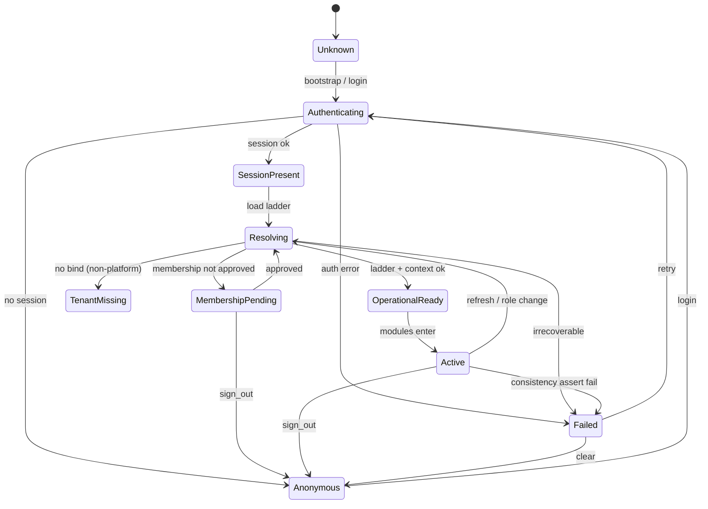
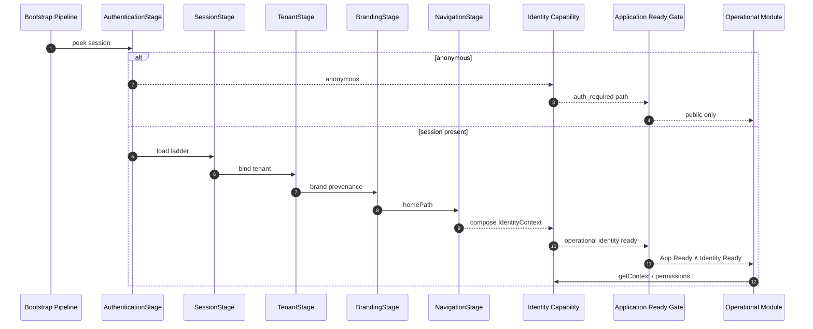

# Identity Capability

**OPERATIONAL-001 · Phase 1 — Observe → Design → Freeze**  
**ADR:** [0055 — Identity Capability](../adr/0055-identity-capability.md)  
**Status:** **FROZEN** (architecture only — no implementation in this phase)  
**Phase:** Operational Modules (post Product Core Foundation)

---

## Purpose

Define the **canonical Identity Capability** for YourMeal OS.

Identity is **not** Authentication.

| Term | Answers |
|------|---------|
| **Authentication** | “Who are you?” (credential / session proof) |
| **Identity Capability** | Who you are · which tenant · which roles · which permissions · which workspace · which branding · which locale · which flags · which preferences · which operational actor |

Every Operational Module (Orders, Production, Kitchen, Delivery, Billing, …) must depend on **one** answer:

> **Who is the current operational user inside YourMeal OS?**

That answer is the Identity Capability.

---

## Permanent methodology (all Operational Modules)

```text
Observe → Design → Freeze → Implement → Validate
```

No Orders / Kitchen / Delivery / Inventory / Billing module skips this ladder. Identity is the first Operational Capability to freeze the pattern.

---

## Naming map (YourMeal OS)

```text
YourMeal OS
├── Platform          (Developer Platform v1.0 · frozen)
├── Foundation        (Product Core Foundation · engineering-validated)
└── Operational Modules
      └── OPERATIONAL-001 Identity Capability  ← this document
```

Legacy names still appear in code (`AuthState`, `src/auth`). This capability **composes** them; it does not force a rename in Phase 1.

---

## Responsibilities

| Area | Identity owns | Does not own |
|------|---------------|--------------|
| Authentication | When identity is proven; session presence | Login UI chrome; password UX copy |
| Session | Canonical session + ladder readiness | Supabase client construction (Services stage) |
| Tenant | Active tenant bind (RI-001) | Tenant CRUD / SaaS admin tenant creation |
| Role | Role set for the actor | Role catalog schema changes (governance) |
| Permissions | Capability set derived for the actor | Per-module business rules using `can()` |
| Workspace | First / current workspace entry (`homePath` / surface) | In-workspace navigation trees |
| Branding Context | Provenance + tenant brand inputs for the actor | Logo upload admin (`brand.manage`) |
| Locale | Effective locale / localization settings resolution | i18n resource files |
| Feature Flags | Snapshot relevant to the actor (eval inputs) | Flag admin UI |
| User Preferences | Preferences attached to the person/actor | Domain-specific customer preference modules beyond identity |
| Operational Context | `membershipId`, tenant, actor stamps for Services | Order/kitchen domain aggregates |

---

## Lifecycle

```text
Unknown
   │
   ▼
Authenticating ──────────────────────────────┐
   │                                         │
   ▼                                         │
Authenticated (session present)              │
   │                                         │
   ▼                                         │
Identity Resolving                           │
   │  Profile → Membership → Roles           │
   │  Tenant → Permissions → Workspace       │
   │  Brand · Locale · Flags · Preferences   │
   ▼                                         │
Operational Ready  ←── IdentityResult.ok     │
   │                                         │
   ▼                                         │
Active (modules may run)                     │
   │                                         │
   ├── refresh (role/realtime)               │
   ├── suspend / revoke (membership)         │
   └── sign_out ─────────────────────────────┘
                                              ▼
                                         Anonymous / Cleared
```

**Relation to Application Ready Gate:**  
`Application Ready` (ADR 0053) is the **app latch**.  
`Operational Ready` (this capability) is the **identity latch** inside / after bootstrap. Product modules require both: app Ready **and** Identity Operational Ready (or an explicit anonymous/public mode).

---

## State machine



| State | Meaning | Modules may run? |
|-------|---------|------------------|
| `Unknown` | Not started | No |
| `Authenticating` | Proving session | No |
| `Anonymous` | No session (public/auth surfaces) | Public only |
| `SessionPresent` | Session object exists | No |
| `Resolving` | Loading ladder / context | No |
| `MembershipPending` | Waiting approval | Waiting surface only |
| `TenantMissing` | No tenant bind (except pure platform) | Limited / error |
| `OperationalReady` | IdentityResult ok | Yes (with App Ready) |
| `Active` | In use; may refresh | Yes |
| `Failed` | Blocking identity error | No |

---

## Public contracts (freeze)

Additive types. Prefer composing existing `AuthState` / `BootstrapIdentitySnapshot` rather than renaming them in Phase 1.

```ts
/** Capability-level status for the operational user. */
export type IdentityState =
  | "unknown"
  | "authenticating"
  | "anonymous"
  | "session_present"
  | "resolving"
  | "membership_pending"
  | "tenant_missing"
  | "operational_ready"
  | "active"
  | "failed";

export type IdentityErrorCode =
  | "AUTH_REQUIRED"
  | "AUTH_UNAVAILABLE"
  | "SESSION_INVALID"
  | "PROFILE_MISSING"
  | "MEMBERSHIP_PENDING"
  | "MEMBERSHIP_REJECTED"
  | "MEMBERSHIP_SUSPENDED"
  | "TENANT_MISSING"
  | "TENANT_INACTIVE"
  | "ROLE_EMPTY"
  | "CONSISTENCY_FAILED"
  | "UNKNOWN";

export type IdentityError = {
  code: IdentityErrorCode;
  message: string;
  recoverable: boolean;
  evidence?: Record<string, unknown>;
};

/** Permission vocabulary — reuse existing Capability union from permissions. */
export type PermissionModel = {
  roles: readonly string[]; // AppRole[]
  capabilities: readonly string[]; // Capability[]
};

/** Where the actor should work — LP-001 homePath remains the entry string. */
export type WorkspaceContext = {
  homePath: string;
  surface: "saas" | "admin" | "app" | "driver" | "public" | "unknown";
};

export type BrandingContext = {
  provenance: "static" | "remote" | "fallback";
  tenantSlug: string | null;
};

export type LocaleContext = {
  /** BCP 47 / app locale string from profile or fallback. */
  locale: string;
  /** Optional full settings when LocalizationProvider has resolved. */
  settings?: Record<string, unknown>;
};

export type FeatureFlagSnapshot = {
  evaluatedAt: string;
  flags: Record<string, boolean | string | number>;
};

export type UserPreferencesSnapshot = {
  locale?: string;
  /** Extensible bag — domain prefs stay in their modules. */
  values: Record<string, unknown>;
};

/**
 * Operational actor context — Services should prefer membershipId (ADR 0019).
 */
export type OperationalContext = {
  userId: string;
  membershipId: string | null;
  tenantId: string | null;
  tenantSlug: string | null;
  roles: readonly string[];
  capabilities: readonly string[];
};

/**
 * Canonical answer: who is the current operational user?
 * Composes AuthState fields without requiring an immediate rename.
 */
export type IdentityContext = {
  state: IdentityState;
  userId: string | null;
  sessionPresent: boolean;
  profile: {
    id: string;
    fullName: string | null;
    avatarUrl: string | null;
    locale: string;
    phone: string | null;
  } | null;
  tenant: { id: string; name: string; slug: string | null } | null;
  permissions: PermissionModel;
  workspace: WorkspaceContext | null;
  branding: BrandingContext | null;
  locale: LocaleContext | null;
  featureFlags: FeatureFlagSnapshot | null;
  preferences: UserPreferencesSnapshot | null;
  operational: OperationalContext | null;
};

export type IdentityResult = {
  ok: boolean;
  context: IdentityContext;
  errors: IdentityError[];
  /** Correlate with BootstrapResult.id / post-login pipeline id. */
  correlationId?: string;
};
```

### Capability facade (contract, not code)

```ts
interface IdentityCapability {
  /** Current composed identity — single read model. */
  getContext(): IdentityContext;
  getResult(): IdentityResult;
  isOperationalReady(): boolean;
  subscribe(listener: (result: IdentityResult) => void): () => void;
  /** Refresh roles/permissions/context without full app relaunch. */
  refresh(): Promise<IdentityResult>;
  clear(): void; // sign-out / anonymous
}
```

**Definition of Done (architecture):**  
There is exactly one canonical definition answering *who is the current operational user* — `IdentityContext` / `IdentityResult` via `IdentityCapability`.

---

## Sequence diagram



---

## Relationship with Bootstrap Pipeline

Bootstrap (ADR 0050–0053) owns **startup order**.  
Identity Capability owns the **composed operational meaning** of identity-related stage outputs.

| Bootstrap stage | Feeds Identity |
|-----------------|----------------|
| Authentication | `sessionPresent` / anonymous |
| Session | profile, roles, membership ladder |
| Tenant | `tenant` / `tenantId` |
| Branding | `BrandingContext.provenance` |
| Navigation | `WorkspaceContext.homePath` |
| Ready Gate | App may mount Product Core |

**Rules:**

1. Do **not** reorder `BootstrapPipeline.ts`.  
2. Identity Capability **must not** become a second orchestrator.  
3. Cold start and FCR-008 login both converge on the same `IdentityResult` shape.  
4. `BootstrapIdentityStore` / `AuthState` remain implementation substrates until Implement phase migrates to the facade.

---

## Relationship with Developer Platform

| Concern | Rule |
|---------|------|
| Doctor / Incidents / Knowledge / Recovery | Observe Identity lifecycle evidence — **no engine contract changes** for this ADR |
| Events (future) | e.g. `identity:resolving`, `identity:operational_ready`, `identity:failed` |
| Runtime Host | Must not own Identity business logic |

Identity failures become FOPEBA evidence; recovery stays Recommendation → Capability → Recovery (Platform), not Identity rewriting Doctor.

---

## Relationship with Product / Operational Modules

```text
Identity Capability
        │
        ▼
ServiceContext / module guards
        │
        ├── Orders
        ├── Production / Kitchen
        ├── Inventory
        ├── Delivery
        ├── Billing
        └── Administration
```

| Module need | Reads from Identity |
|-------------|---------------------|
| RLS / tenant scope | `operational.tenantId` |
| Audit actor | `operational.membershipId` (preferred) |
| `can('orders.create')` | `permissions.capabilities` |
| Landing / shell | `workspace.homePath` / surface |
| Theme | `branding` |
| Formats / copy | `locale` |
| Gradual rollout | `featureFlags` |

**Rule:** Modules never re-implement “load roles / tenant / membership”. They consume Identity.

---

## Existing foundations (do not reopen)

| ADR / doc | Kept |
|-----------|------|
| 0004 Auth + RBAC | Supabase Auth · capabilities |
| 0018 / 0019 Identity lifecycle hardening | Ladder · membership_id · non-goals |
| 0002 Localization | Locale resolution order |
| 0007 Feature flags | Service evaluation |
| 0014 Tenant-branded experience | Brand ownership |
| LP-001 / `homePathForRoles` | Landing policy |
| FCR-008 | Post-login session contract |
| RI-001 | One user → one tenant (app layer) |

Identity Capability **composes** these; it does not supersede them unless a future ADR explicitly does.

---

## Gaps to close in Implement (OPERATIONAL-001 Phase 2+)

| Gap | Target |
|-----|--------|
| `membershipId` not on AuthState / snapshot | Add to `OperationalContext` |
| Capabilities not on AuthState | Populate `PermissionModel.capabilities` |
| No `IdentityCapability` facade | Single read API for modules |
| Branding / locale / flags not composed | Fill optional sections of `IdentityContext` |
| Preferences bag incomplete | Define minimal identity-scoped prefs |

Phase 1 freezes contracts only.

---

## Future extension points

- Multi-membership / tenant switch (explicitly deferred — ADR 0019)  
- SSO / SCIM / impersonation (deferred)  
- Device trust / MFA as Authentication sub-capability  
- Offline identity cache (later Operational Offline capability)  
- Identity Doctor Capability (checklist ✔/✖) without breaking Platform freeze  

---

## Acceptance (Phase 1)

- [x] Responsibilities defined  
- [x] Lifecycle + state machine  
- [x] Public contracts (`IdentityContext`, `IdentityState`, `IdentityResult`, `IdentityError`, `PermissionModel`, `WorkspaceContext`, …)  
- [x] Sequence diagram  
- [x] Bootstrap / Platform / Modules relationships  
- [x] Extension points  
- [x] ADR 0055  
- [ ] **No implementation / UI / Provider / routing changes**

---

## Next

```text
OPERATIONAL-001 Phase 1  Architecture   ✅ ADR 0055
OPERATIONAL-001 Phase 2  Facade         ✅ ADR 0056
OPERATIONAL-001 Phase 3  Validate       ✅ ADR 0057 · engineering certified
OPERATIONAL-002          Customers Capability ✅ Architecture (ADR 0058)
OPERATIONAL-002 Phase 2  Customer Facade
```

### Facade entry (Phase 2)

```text
src/identity/IdentityFacade.ts
src/identity/useIdentity.ts
```

Modules: `identity.tenant` · `identity.permissions` · `identity.workspace` — never `supabase.auth.*`.

### Validation (Phase 3)

- Acta: [IDENTITY_VALIDATION_REPORT](../10-validation/IDENTITY_VALIDATION_REPORT.md) · ADR 0057  
- Runner: `src/identity/identity-validation.spec.ts`  
- Smoke: [IDENTITY_SMOKE_CHECKLIST](../10-validation/IDENTITY_SMOKE_CHECKLIST.md)
