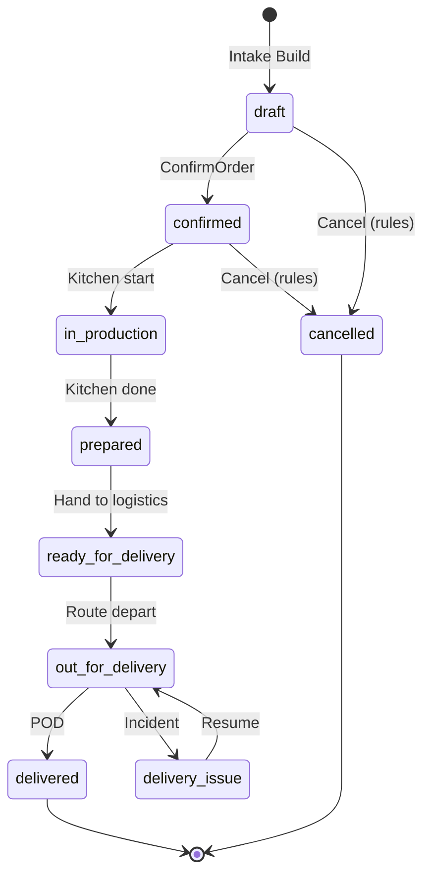
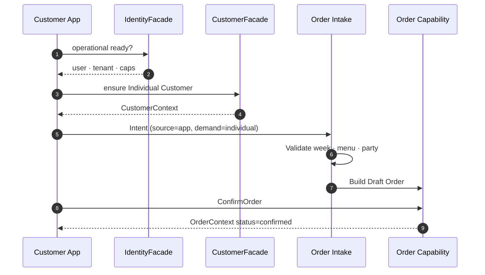
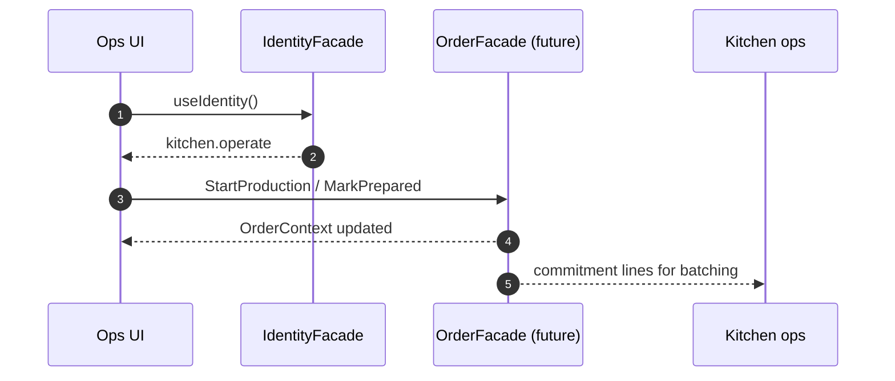

# Order Capability

**OPERATIONAL-003 · Phase 1 — Observe → Design → Freeze**  
**ADR:** [0062 — Order Capability](../adr/0062-order-capability.md)  
**Status:** **FROZEN** (architecture only — no Facade / UI / DB / implementation in this phase)  
**Depends on:** Identity (ADR 0055–0057) · Customers (ADR 0058–0061) · Order Intake (ADR 0017)  
**EatClean lens:** weekly meal prep · commitment for a concrete week · production · delivery · billing handoff  
**Maturity:** **Architecture** → Facade → Engineering Certified → Field Validated → Production Ready  
**Completeness:** Architecture → Facade → Validation → Capability Demo → Product UI → Field → Production

---

## Purpose

Define the **canonical Order Capability** for YourMeal OS.

Order is a **business capability**, not a screen and not an ecommerce cart.

> **What is an Order inside YourMeal OS?**

**One canonical answer:**

```text
An Order is the operational commitment the tenant has acquired
for a concrete operational week:

who demanded · what meals · which delivery day · where ·
which constraints · and where that commitment sits
in the production → delivery → billing lifecycle.
```

EatClean does not sell “products in a cart”.  
EatClean sells a **weekly operation**. Order is that commitment made explicit.

---

## EatClean first (not generic ecommerce)

| Daily question | Order Capability must answer |
|----------------|------------------------------|
| ¿Qué pidió? | Meals / lines · quantities · menu bindings |
| ¿Para qué semana? | Operational week (`OrderWeek`) |
| ¿Qué día se entrega? | Delivery day(s) within the week |
| ¿Dónde? | Delivery location (from Customer Capability) |
| ¿Qué menú? | Published weekly menu reference |
| ¿Qué modificaciones? | Dietary / prep modifications on lines |
| ¿Qué alérgenos? | Allergy risk surface (Customer + line notes) |
| ¿Está confirmado? | Lifecycle past draft → confirmed |
| ¿Está en producción? | Kitchen / production spine status |
| ¿Está listo? | Ready for delivery |
| ¿Está entregado? | Delivery completion |
| ¿Está facturado? | Billing readiness / link (Billing owns invoices) |

If a feature does not reduce time or errors in that weekly loop → **wait**.

---

## Naming (ubiquitous language)

| Term | Meaning |
|------|---------|
| **Order** | Operational commitment for a week (aggregate) |
| **Order Line / Item** | One meal commitment for a day (dish · qty · mods) |
| **OrderWeek** | Operational week bound to `week_start` (tenant calendar) |
| **OrderDeliverySlot** | Concrete delivery day (+ optional window) for part of the order |
| **Demand Channel** | `individual` \| `company` — commercial demand mode (ADR 0015) |
| **Order Source** | Intake channel: app · whatsapp · phone · admin · api · … (ADR 0017 · DICT-076) |
| **Draft Order** | Pre-commitment programming state (DICT-041) |
| **Confirm Order** | Transition that locks operational commitment (DICT-042) |
| **Order Intake** | Process that **builds** Orders — Orders never self-create (ADR 0017) |
| **Operational Status** | Lifecycle along kitchen / delivery spine |

**Do not confuse:**

| Concept | Question |
|---------|----------|
| `demand_channel` | ¿B2B o B2C? |
| Order Source | ¿Por dónde entró la intención? |
| Order Status | ¿Dónde está el compromiso en la operación? |
| Billing status | ¿Se puede / se ha cobrado? (Billing Capability) |

---

## Responsibilities

| Area | Order Capability owns | Does not own |
|------|----------------------|--------------|
| Lifecycle | Draft → confirmed → production → delivery → terminal | Auth / tenant binding (Identity) |
| Weekly planning | Bind to open operational week · menu validity | Publishing weekly menus (Weekly Menu module) |
| Lines | Dish · day · qty · modifications · notes | Recipe formulation / BOM (Production/Kitchen) |
| Validation rules | Open week · menu published · party present · caps | CRM of Customer records |
| Status transitions | Allowed ops transitions · staff/customer rules | Driver GPS / route optimization |
| Delivery readiness | Expose “ready for delivery” commitment | Route planning · stop sequencing (Delivery) |
| Billing handoff | Expose billable commitment facts | Invoice documents · payments (Billing) |
| Allergen / mods surface | Carry constraints needed for safe prep | Master allergy catalog ownership (Customer) |
| Audit | Status changes stamped with Identity actor | Doctor / Platform engines |

---

## Relationships

```text
Identity Capability
        │ authorizes · tenant · permissions · membershipId
        ▼
Customer Capability
        │ demand party · delivery location · allergens
        ▼
Order Intake (ADR 0017) ──Build──▶ Order Capability
        │
        ├── Production / Kitchen   (what to cook · batches · labels)
        ├── Delivery               (how routes run · POD)
        ├── Billing                (what to invoice)
        └── Inventory (future)     (stock constraints on confirm)
```

| Related | Rule |
|---------|------|
| **Identity** | Never call Supabase Auth from Order modules — consume `IdentityFacade` |
| **Customer** | Order references Demand Party + delivery location via Customer contracts |
| **Order Intake** | **Only Intake creates Orders.** Order Capability owns lifecycle after Build |
| **Production / Kitchen** | Consume Order lines / status; do not redefine “what was ordered” |
| **Delivery** | Consume delivery-ready Orders + locations; own routing |
| **Billing** | Consume confirmed/delivered facts; own invoices |
| **Weekly Menu** | Order validates against published menu; Menu owns publish |

---

## Lifecycle (capability level)

```text
Intent (any Order Source)
      │
      ▼
Order Intake (Normalize → Validate → Resolve → Build)
      │
      ▼
Draft Order ─────────────────────────────┐
      │ Confirm                            │
      ▼                                    │
Confirmed                                 │ cancel (rules)
      │                                    │
      ▼                                    │
In production → Prepared → Ready for delivery
      │
      ▼
Out for delivery ⇄ Delivery issue
      │
      ▼
Delivered ──▶ Billing handoff
```

Terminal: `cancelled` (from draft/confirmed under rules) · `delivered` (ops complete; billing may still be open).

---

## State machine



Aligns with existing operational spine (`OperationalOrderStatus`) — Capability freezes the **business meaning**; physical enum may already match pilot.

---

## Permission model

Consumes Identity `PermissionModel`. Order Capability declares required caps:

| Capability | Who | Purpose |
|------------|-----|---------|
| `orders.read` | Staff / customer (scoped) | View commitments |
| `orders.write` | Staff / customer (scoped) | Program draft / modify pre-lock |
| `orders.confirm` *(or write)* | Customer / staff | Confirm commitment |
| `kitchen.operate` | Kitchen | Production transitions |
| `logistics.operate` | Delivery | Delivery transitions |
| `accounting.operate` | Billing staff | Read billable order facts |

**Rule:** UI never invents permission checks — Identity + Capability matrix only.  
**Scope:** Customer self sees own party Orders; staff sees tenant Orders.

---

## Public contracts (freeze)

```ts
/** Operational week — tenant calendar, not “shopping session”. */
export type OrderWeek = {
  weekStart: string; // ISO date YYYY-MM-DD (Monday or tenant rule)
  label?: string;
};

/** Concrete delivery day (and optional window) for commitment. */
export type OrderDeliverySlot = {
  dayDate: string; // ISO date
  timeWindowLabel?: string | null;
  deliveryLocation: import("@/customer").DeliveryLocationRef | {
    kind: "customer_address";
    addressId: string;
  } | {
    kind: "company_site";
    siteId: string;
    deliveryGroupId?: string | null;
  };
};

export type OrderStatus =
  | "draft"
  | "confirmed"
  | "in_production"
  | "prepared"
  | "ready_for_delivery"
  | "out_for_delivery"
  | "delivered"
  | "delivery_issue"
  | "cancelled";

/** Billing facet — Billing owns invoices; Order exposes readiness. */
export type OrderBillingFacet = {
  billable: boolean;
  invoiced: boolean;
  invoiceIds: string[];
};

export type OrderErrorCode =
  | "NOT_FOUND"
  | "TENANT_MISMATCH"
  | "PERMISSION_DENIED"
  | "INVALID_STATE"
  | "WEEK_CLOSED"
  | "MENU_NOT_PUBLISHED"
  | "PARTY_REQUIRED"
  | "LINE_INVALID"
  | "ALLERGEN_CONFLICT"
  | "UNKNOWN";

export type OrderError = {
  code: OrderErrorCode;
  message: string;
  recoverable: boolean;
  evidence?: Record<string, unknown>;
};

export type OrderLineSummary = {
  id: string;
  dayDate: string;
  dishId: string;
  dishName: string;
  quantity: number;
  modifications?: string[];
  allergenNotes?: string[];
};

/** Staff / customer list card. */
export type OrderSummary = {
  id: string;
  week: OrderWeek;
  status: OrderStatus;
  demandChannel: "individual" | "company";
  orderSource: string; // Order Source (intake)
  partyRef: {
    kind: "individual" | "company_account";
    id: string;
    displayName: string;
  };
  deliveryDayPrimary: string | null;
  itemCount: number;
  total: number;
  currency: string;
  tenantId: string;
};

export type OrderDetails = {
  summary: OrderSummary;
  lines: OrderLineSummary[];
  deliverySlots: OrderDeliverySlot[];
  menuRef: { weeklyMenuId: string | null; weekStart: string };
  billing: OrderBillingFacet;
  constraints: {
    allergens: string[];
    modifications: string[];
  };
  timeline: { key: string; label: string; reached: boolean }[];
};

/**
 * Canonical operational read — “the commitment in context”.
 * Always authorized via Identity.
 */
export type OrderContext = {
  details: OrderDetails;
  permissions: {
    canRead: boolean;
    canWrite: boolean;
    canConfirm: boolean;
    canKitchen: boolean;
    canLogistics: boolean;
  };
  customerContextRef: {
    partyKind: "individual" | "company_account";
    partyId: string;
  };
};

export type OrderResult = {
  ok: boolean;
  context: OrderContext | null;
  errors: OrderError[];
};

/** Lifecycle intent vocabulary (Facade later — not save()). */
export type OrderLifecycleCommandName =
  | "ConfirmOrder"
  | "CancelOrder"
  | "StartProduction"
  | "MarkPrepared"
  | "MarkReadyForDelivery"
  | "DepartRoute"
  | "ConfirmDelivery"
  | "ReportDeliveryIssue";
```

### Facade (contract only — Implement later)

```ts
interface OrderFacade {
  getContext(orderId: string): Promise<OrderResult>;
  search(query: {
    weekStart?: string;
    status?: OrderStatus | OrderStatus[];
    partyId?: string;
  }): Promise<OrderSummary[]>;
  // mutate via named commands in Facade phase — not this ADR
}
```

---

## Capability questions (Definition of Done drivers)

| Question | Capability answer surface |
|----------|---------------------------|
| Who placed it? | `partyRef` + Identity actor on audit |
| Which week? | `OrderWeek` |
| Which delivery day / where? | `OrderDeliverySlot` + Customer location |
| Which menu / meals / qty? | `menuRef` + `OrderLineSummary[]` |
| Mods / allergens? | `constraints` + line notes |
| Operational status? | `OrderStatus` + timeline |
| Production / delivery readiness? | status spine + permissions |
| Billing? | `OrderBillingFacet` (Billing owns documents) |

---

## Sequence — particular confirms weekly commitment (CJ-001)



## Sequence — kitchen advances production



---

## Relationship with existing code (observe)

| Existing | Role under this Capability |
|----------|----------------------------|
| `OrderIntakeService` / ADR 0017 | Sole **Build** path |
| `OrderService` / `order-repository` | Lifecycle substrate (compose later) |
| `OperationalOrderStatus` | Physical status spine to map to `OrderStatus` |
| `UpcomingDelivery` view model | Customer Experience projection — not the Capability contract |
| CAP-004 / CAP-008 | Programming / Intake history — respect, do not fork vocabulary |
| `/admin/orders` | UI — later, behind Facade + LAW 003 |

Phase 1 does **not** move or rewrite these — Freeze only.

---

## Gaps → Facade / Validate / Demo phases

| Gap | Plan |
|-----|------|
| OrderFacade + Commands/Queries | OPERATIONAL-003 Phase 2 |
| Explicit `orders.confirm` cap | Freeze with Identity matrix |
| Billing facet wiring | With Billing Capability |
| Inventory hold on confirm | Future Inventory |
| Merge duplicate drafts | Business rule later |
| Capability Demo | Minimal Order Workspace after Validate |

---

## Future extension points

- Multi-slot B2B packaging groups  
- Marketplace Order Source  
- Partial delivery / split routes  
- Credit notes linked from Billing  
- Production plan generation from confirmed week set  

---

## Acceptance (Phase 1)

- [x] Canonical definition: Order = weekly operational commitment  
- [x] Responsibilities · lifecycle · state machine  
- [x] Contracts (`OrderContext`, `OrderSummary`, `OrderDetails`, `OrderStatus`, `OrderWeek`, `OrderDeliverySlot`, `OrderError`, lifecycle names)  
- [x] Sequence diagrams · permission model · relationships  
- [x] EatClean lens · Order Intake boundary · Demand Channel ≠ Order Source  
- [x] ADR 0062 · Capability Registry entry  
- [x] **No UI · no CRUD · no DB changes · no implementation**

---

## Next

```text
OPERATIONAL-003 Phase 1  Architecture   ✅ / this PR
OPERATIONAL-003 Phase 2  Facade         (compose Intake + Order services)
OPERATIONAL-003 Phase 3  Validate
OPERATIONAL-003 Phase 4  Capability Demo (Order Workspace · LAW 003/004)
Then Production / Kitchen / Delivery consume Order language
```
