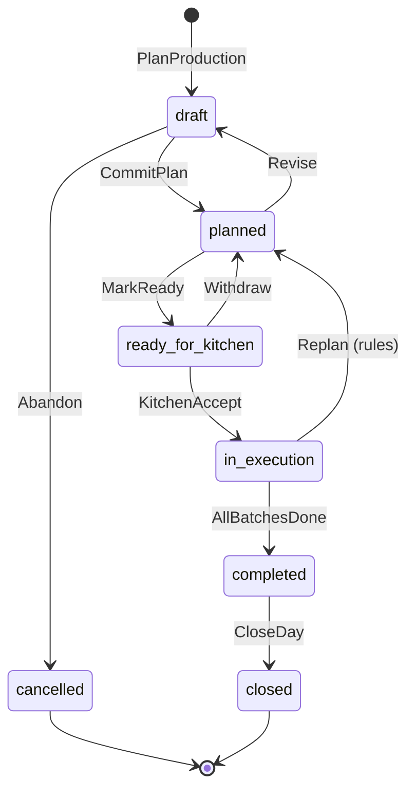
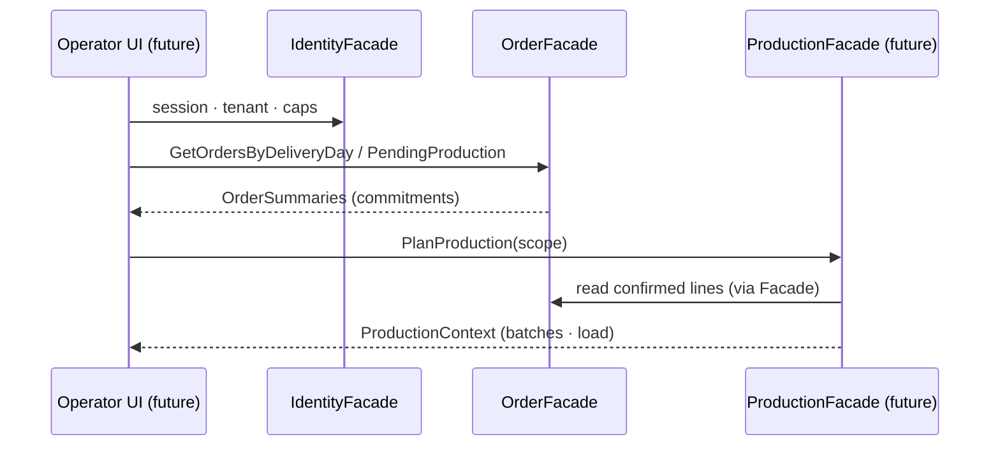
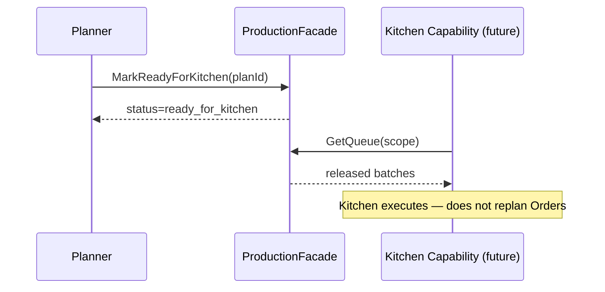

# Production Capability

**OPERATIONAL-004 · Phase 1 — Architecture Freeze**  
**ADR:** [0066 — Production Capability](../adr/0066-production-capability.md)  
**Status:** **Architecture** (Observe → Design → Freeze · no UI / DB / CRUD / implementation)  
**Depends on:** Identity · Customers · Orders (Engineering Certified + Capability Demos)  
**EatClean lens:** weekly meal prep · transform confirmed commitments into daily executable work  
**Type:** **Operational Execution** (first of its kind)  
**Maturity:** **Architecture** → Facade → Engineering Certified → Field Validated → Production Ready  
**Completeness:** Architecture → Facade → Validation → Capability Demo → Product UI → Field → Production

```text
Production = planificación operativa que transforma compromisos (Orders)
             en trabajo ejecutable.

Production never cooks.
Kitchen executes.
```

---

## Purpose

Define the **canonical Production Capability** for YourMeal OS.

Production is a **business capability**, not a screen and not a kitchen timer.

> **What is Production inside YourMeal OS?**

**One canonical answer:**

```text
Production is the operational planning that transforms Order commitments
into executable work:

what must be prepared · how work is grouped into batches ·
what load and capacity apply · when the schedule runs ·
and whether the plan is ready for Kitchen to execute.
```

**Canonical question:**

```text
¿Qué trabajo debe ejecutarse para cumplir los compromisos operativos?
```

```text
How do we transform operational commitments into executable work?
```

EatClean does not need Production to stir pots.  
EatClean needs Production to **plan the day** so Kitchen can cook without inventing the plan.

---

## Critical separation

| Capability | Owns | Does not own |
|------------|------|--------------|
| **Orders** | Operational commitment for a week | Planning batches / capacity |
| **Production** | Planning · batches · queue · load · schedule · readiness | Cooking / plating / labels as craft |
| **Kitchen** | Executing the plan · advancing batch work · prep states | Re-deriving “what was ordered” |
| **Delivery** | Routes · POD · logistics | Production schedule |
| **Billing** | Invoices · settlement | Production load |

```text
Order          →  ¿Qué compromiso existe?
Production     →  ¿Qué trabajo debe hacerse?
Kitchen        →  ¿Qué se está ejecutando ahora?
Delivery       →  ¿Qué hay que entregar?
Billing        →  ¿Qué hay que cobrar?
```

If a feature makes Production “cook”, it belongs in **Kitchen**.

---

## EatClean first (not generic MRP)

| Daily question | Production Capability must answer |
|----------------|-----------------------------------|
| ¿Qué compromisos entran hoy? | Confirmed Orders for operational day / week |
| ¿Qué platos / raciones? | Aggregated work from Order lines |
| ¿Cómo se agrupa? | Batches (by dish · day · constraints) |
| ¿Cuánta carga hay? | Production Load vs Capacity |
| ¿Está listo el plan? | Production Readiness for Kitchen |
| ¿Qué queda pendiente? | Production Queue |
| ¿Cuándo se cocina? | Production Schedule |
| ¿En qué estado está el plan? | Production Status |

If a feature does not reduce planning time or kitchen errors → **wait**.

Pilot substrate already explores this via Production Report / kitchen batches (EP-002B.1).  
This Capability **freezes the business meaning**; Facade later composes existing services without forking vocabulary.

---

## Naming (ubiquitous language)

| Term | Meaning |
|------|---------|
| **Production** | Operational planning capability (aggregate of plans for a scope) |
| **Production Plan** | Plan for a concrete operational day (or week slice) |
| **Production Batch** | Grouped executable work unit (typically by dish · day · mods) |
| **Production Queue** | Ordered list of batches / work awaiting Kitchen |
| **Production Load** | Measured work (raciones · prep minutes · batch count) |
| **Production Capacity** | Tenant capacity envelope for a day / station |
| **Production Schedule** | When batches are intended to run |
| **Production Status** | Lifecycle of the plan / batch readiness |
| **Production Readiness** | Whether Kitchen may start executing the plan |
| **Production Context** | Canonical read: plan + batches + load + permissions |

**Do not confuse:**

| Concept | Question |
|---------|----------|
| Order Status | ¿Dónde está el compromiso? |
| Production Status | ¿Dónde está el plan / lote? |
| Kitchen execution state | ¿Quién está cocinando este lote ahora? (Kitchen) |
| Delivery readiness | ¿Puede salir a ruta? (Order/Delivery) |

---

## Responsibilities

| Area | Production Capability owns | Does not own |
|------|---------------------------|--------------|
| Transform | Orders → executable work units | Redefining Order lines |
| Grouping | Batches by dish / day / constraints | Customer CRM |
| Workload | Load calculation · capacity compare | Hiring / roster HR |
| Schedule | Intended timing of batches | Driver routes |
| Readiness | Expose “ready for Kitchen” | Stirring / plating / tasting |
| Queue | Prioritized work for Kitchen | Station tool inventory (Kitchen/Inventory) |
| Status | Plan / batch planning lifecycle | Order lifecycle ownership |
| Audit | Planning changes stamped with Identity | Doctor / Platform engines |

---

## Relationships

```text
Identity Capability
        │ authorizes · tenant · permissions
        ▼
Customer Capability
        │ demand party · allergens (constraints into batches)
        ▼
Order Capability
        │ confirmed commitments · lines · delivery day
        ▼
Production Capability   ← YOU ARE HERE (planning)
        │
        ├── Kitchen     (executes batches · never redefines plan ownership)
        ├── Inventory   (future stock constraints on plan)
        ├── Delivery    (consumes readiness downstream of Kitchen)
        └── Billing     (may consume produced/delivered facts later)
```

| Related | Rule |
|---------|------|
| **Identity** | Never call Supabase Auth from Production — consume `IdentityFacade` |
| **Customer** | Allergen / party constraints flow through Order; Production does not own CRM |
| **Order** | **Production consumes OrderFacade only.** Never import Order repos / Supabase |
| **Kitchen** | **Kitchen consumes Production.** Kitchen never invents batches from raw Orders bypassing Production (long-term rule; pilot may compose until Facade lands) |
| **Inventory** | May constrain capacity / ingredients — Inventory owns stock |
| **Delivery** | Downstream of Kitchen completion · Order delivery spine |
| **Billing** | Outcome capability — does not plan production |

---

## Lifecycle (capability level)

```text
Confirmed Orders (Order Capability)
      │
      ▼
Plan Production (scope: operational day / week)
      │
      ▼
Draft Plan ──▶ Planned ──▶ Ready for Kitchen
      │                         │
      │                         ▼
      │                   Kitchen Execution (Kitchen Capability)
      │                         │
      ▼                         ▼
Cancelled / superseded     Batches in progress → complete
      │
      ▼
Closed (plan settled for the day)
```

Production Status describes the **plan**.  
Kitchen Status describes **execution of batches**.  
Order Status remains the commitment spine (`ScheduleProduction` on Order is the handoff signal — Production owns the plan that justifies that work).

---

## State machine



Batch-level states (planning facet):

```text
queued → released → (Kitchen owns: in_progress → done | blocked)
```

Production may expose `released`; Kitchen owns craft progress.

---

## Permission model

Consumes Identity `PermissionModel`. Production declares required caps:

| Capability | Who | Purpose |
|------------|-----|---------|
| `production.read` *(or kitchen.operate for pilot)* | Ops / kitchen leads | View plan · queue · load |
| `production.plan` *(or write)* | Ops planner | Create / revise plans · batches |
| `production.release` | Ops lead | Mark ready for Kitchen |
| `kitchen.operate` | Kitchen | Accept / execute (Kitchen Capability) |
| `orders.read` | Planner | Read commitments via OrderFacade |

**Rule:** UI never invents permission checks — Identity + Capability matrix only.  
Pilot may map onto existing `kitchen.operate` until caps are split — freeze intent here; Identity matrix updates in Facade phase.

---

## Public contracts (freeze)

```ts
/** Scope of a production plan — usually one operational day. */
export type ProductionScope = {
  dayDate: string; // ISO YYYY-MM-DD
  weekStart?: string;
  station?: string | null; // future multi-station
};

export type ProductionStatus =
  | "draft"
  | "planned"
  | "ready_for_kitchen"
  | "in_execution"
  | "completed"
  | "closed"
  | "cancelled";

export type ProductionBatchStatus =
  | "queued"
  | "released"
  | "in_progress" // Kitchen-owned progress mirrored for visibility
  | "done"
  | "blocked"
  | "cancelled";

export type ProductionErrorCode =
  | "NOT_FOUND"
  | "TENANT_MISMATCH"
  | "PERMISSION_DENIED"
  | "INVALID_STATE"
  | "ORDER_NOT_READY"
  | "CAPACITY_EXCEEDED"
  | "EMPTY_SCOPE"
  | "UNIMPLEMENTED"
  | "UNKNOWN";

export type ProductionError = {
  code: ProductionErrorCode;
  message: string;
  recoverable: boolean;
  evidence?: Record<string, unknown>;
};

export type ProductionCapacity = {
  scope: ProductionScope;
  maxPortions?: number | null;
  maxPrepMinutes?: number | null;
  maxBatches?: number | null;
};

export type ProductionLoad = {
  scope: ProductionScope;
  portionCount: number;
  batchCount: number;
  estimatedPrepMinutes?: number | null;
  customLineCount: number;
};

export type ProductionSchedule = {
  scope: ProductionScope;
  windows: Array<{
    label: string;
    startsAt?: string | null;
    endsAt?: string | null;
    batchIds: string[];
  }>;
};

/** Grouped executable work — typically one dish for one day. */
export type ProductionBatch = {
  id: string;
  scope: ProductionScope;
  dishId: string;
  dishName: string;
  portionCount: number;
  status: ProductionBatchStatus;
  orderIds: string[]; // commitments contributing to this batch
  constraints: {
    allergens: string[];
    modifications: string[];
    isCustom: boolean;
  };
  readiness: {
    releasedToKitchen: boolean;
    blockedReason?: string | null;
  };
};

export type ProductionSummary = {
  id: string; // plan id
  scope: ProductionScope;
  status: ProductionStatus;
  load: ProductionLoad;
  batchCount: number;
  readiness: boolean;
  tenantId: string;
};

export type ProductionQueue = {
  scope: ProductionScope;
  batches: ProductionBatch[];
};

/**
 * Canonical operational read — “the plan in context”.
 * Always authorized via Identity.
 */
export type ProductionContext = {
  summary: ProductionSummary;
  queue: ProductionQueue;
  capacity: ProductionCapacity | null;
  schedule: ProductionSchedule | null;
  permissions: {
    canRead: boolean;
    canPlan: boolean;
    canRelease: boolean;
    canViewKitchen: boolean;
  };
  sourceOrders: {
    orderIds: string[];
    weekStart?: string;
  };
};

export type ProductionResult = {
  ok: boolean;
  context: ProductionContext | null;
  errors: ProductionError[];
};

/** Planning intent vocabulary (Facade later — not save()). */
export type ProductionLifecycleCommandName =
  | "PlanProduction"
  | "CommitPlan"
  | "RevisePlan"
  | "MarkReadyForKitchen"
  | "WithdrawReadiness"
  | "CloseProductionDay"
  | "CancelPlan";
```

### Facade (future — Phase 2)

```ts
// src/production/ProductionFacade.ts · useProduction()
// Planning language — not CreateProduction/UpdateProduction/DeleteProduction
PlanProduction | CommitPlan | MarkReadyForKitchen | …
// Queries: GetProduction · GetQueue · GetLoad · GetCapacity · GetSchedule
```

Kitchen · Inventory · Delivery screens consume **only** `ProductionFacade` / `useProduction` for planning facts (after Facade lands).  
Until then, no new Production UI in this phase.

---

## Sequence diagrams

### Plan from Orders



### Release to Kitchen



---

## Extension points (future)

- Automatic planning from confirmed week set  
- AI workload balancing across stations  
- Kitchen optimization (prep sequencing)  
- Multi-station / multi-site capacity  
- Inventory-aware planning holds  

Freeze names; do not implement in Phase 1.

---

## Acceptance (Phase 1)

- [x] Canonical definition: Production = planning that transforms Orders into executable work  
- [x] Production never cooks · Kitchen executes  
- [x] Responsibilities · lifecycle · state machine  
- [x] Contracts (`ProductionContext`, `ProductionBatch`, `ProductionQueue`, `ProductionSummary`, `ProductionStatus`, `ProductionCapacity`, `ProductionSchedule`, `ProductionError`)  
- [x] Sequence diagrams · permission model · relationships  
- [x] EatClean lens · separation from Order / Kitchen  
- [x] ADR 0066 · Capability Registry entry  
- [x] **No UI · no CRUD · no DB changes · no implementation**

---

## Next

```text
OPERATIONAL-004 Phase 1  Architecture   ✅ ADR 0066 / this document
OPERATIONAL-004 Phase 2  Facade
OPERATIONAL-004 Phase 3  Validate
OPERATIONAL-004 Phase 4  Capability Demo
Then Kitchen Capability Architecture (execution)
```

**Operational Engine v1.0** (future milestone) requires Identity · Customers · Orders · Production · Kitchen · Delivery · Billing certified.
