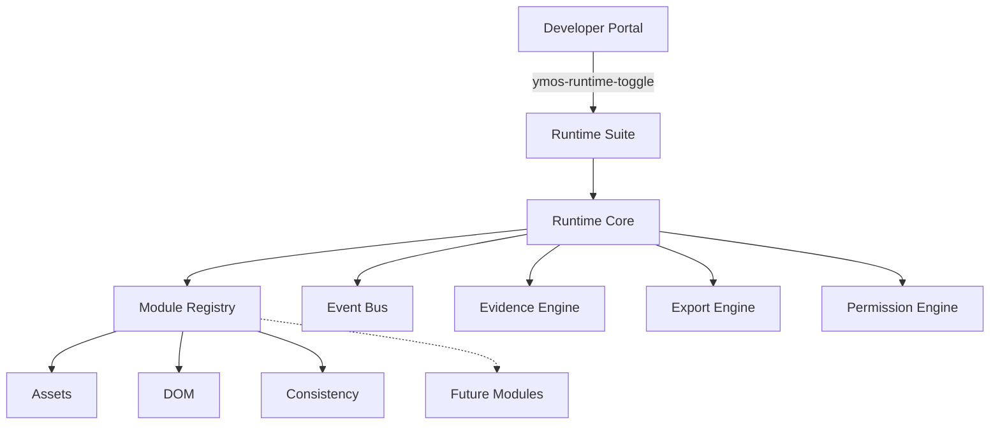

# Runtime Core

**Documento:** `RUNTIME_CORE.md`  
**Producto:** YourMeal OS **Developer Platform v1.0** · Foundation  
**Track:** DEVELOPER-PLATFORM-002  
**Estado:** Accepted · 2026-08-05  
**ADR:** [0038 — Runtime Core](../adr/0038-runtime-core.md)  
**Estándar:** Evidence before Implementation · FOPEBA · [FOUNDATION](../../FOUNDATION.md)

> El Runtime Core es el **kernel** del Runtime Suite.  
> Los módulos dependen del Core. El Core **nunca** depende de un módulo.

---

## Visión

```text
YourMeal OS
    │
    ├── User Experience          (producto cliente)
    │
    └── Developer Platform       (producto ingeniería)
            │
            ├── Developer Portal     (discovery + auth)
            │
            └── Runtime Suite
                    │
                    └── Runtime Core   ← este documento
                            │
                            └── Modules (Assets · DOM · Consistency · …)
```

---

## Arquitectura



### Principio

| | |
|--|--|
| Sí | Registry · Events · Evidence contract · Export contract · Permissions types |
| No | Conocer Assets/DOM/Doctor/Network por nombre dentro del Core |
| Regla | Todo módulo se **registra**; nunca modifica el Core |

---

## Module Registry

API:

```ts
registerModule(module)
unregisterModule(id)
getModules()
findModule(id)
isEnabled(id)
enable(id)
disable(id)
```

Metadata obligatoria: `id` · `title` · `category` · `version` · `permissions`.

---

## Module Contract

```ts
type RuntimeModule = {
  id, title, description?, icon?, version, category,
  experimental?, visible?, permissions,
  mount?, unmount?, dispose?,
  export?, health?
}
```

Phase 1: Assets / DOM / Consistency se registran como **bridges** (metadata + health/export stubs). La UI permanece en el Suite actual — **sin cambio funcional**.

---

## Event Bus

Eventos tipados (`runtime-open`, `module-registered`, `doctor-start`, …).  
Suscripción vía `onRuntimeCoreEvent` — no listeners globales fuera del Core.

---

## Evidence · Export · Permissions

| Pieza | Estado Foundation |
|-------|-------------------|
| Evidence | Contrato `RuntimeEvidence` + `createEvidence()` |
| Export | Interfaz `collect/serialize/prepare/download` — `download` no implementado |
| Permissions | Niveles PUBLIC → INTERNAL + predicado `canAccessModule` (sin auth real) |

---

## Built-ins registrados (v1.0)

| id | title | category |
|----|-------|----------|
| `assets` | Assets | Diagnostics |
| `dom` | DOM | Diagnostics |
| `consistency` | Consistency | Diagnostics |

Boot: `registerBuiltinRuntimeModules()` en `src/router.tsx`.

---

## Roadmap · Developer Platform

| Versión | Contenido |
|---------|-----------|
| **v1.0** Foundation | Portal · Suite · **Core** · Assets · DOM · Consistency |
| **v1.1** | Doctor · Logs · Storage · Session |
| **v1.2** | Performance · Network · API |
| **v1.3** | Branding · Feature Flags · Tenant |
| **v1.4+** | Export ZIP · Knowledge · Support package · FOPEBA evidence packs |

Cada módulo futuro = PR independiente que **solo se enchufa** al Registry.

---

## Non-goals (este PR)

Doctor · Network · Logs · ZIP · Telemetry · nuevas pestañas · cambios Assets/DOM/Consistency engines · Android · Capacitor.

---

**Framework first. Tools second.**
