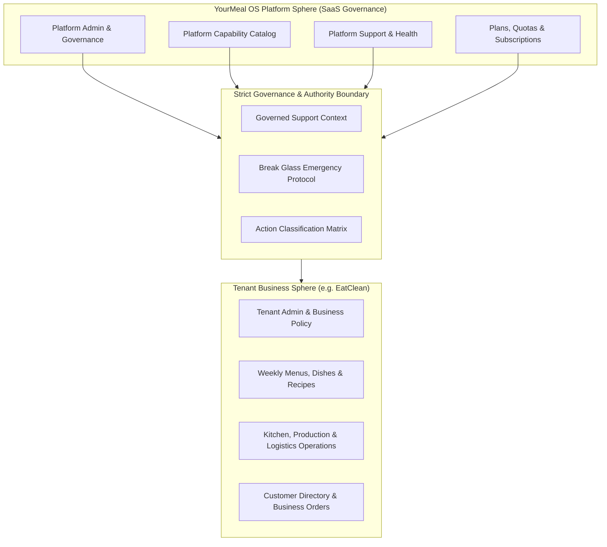

# Product Design 02-E · SaaS Platform Governance & Support Architecture
## 01 — Platform Governance Architecture

---

### 1. Purpose & Scope

The objective of **Product Design 02-E** is to formally establish the governance, authority, operational boundaries, and support architecture of **YourMeal OS** as a multi-tenant SaaS platform.

As YourMeal OS scales, it is vital to uphold a strict foundational rule:

> **YOURMEAL OS governs the PLATFORM.**
> **THE TENANT governs THE BUSINESS.**
> *YourMeal OS must never silently or autonomously become the business operator of a Tenant.*

---

### 2. Foundational Principles

The following ten principles govern all decisions, contracts, and future technical implementations within Product Design 02-E:

1. **PLATFORM AUTHORITY ≠ BUSINESS AUTHORITY**
   Platform operators have jurisdiction over infrastructure, availability, security policies, catalog definition, and tenant isolation. They do not possess arbitrary authority over tenant business policies, menu compositions, dish pricing, or customer commercial terms.

2. **SUPER ADMIN ≠ TENANT ADMIN**
   The `Super Admin` (SaaS Admin) role exists at the platform root. A `Tenant Admin` exists within a tenant workspace. Super Admin is not simply an "all-powerful Tenant Admin" with universal business override; accessing tenant business contexts requires governed mechanisms.

3. **SUPPORT ≠ AUTONOMOUS BUSINESS OPERATION**
   Platform Support agents may assist tenants, investigate technical incidents, and perform authorized data corrections, but they never act as autonomous operators of the tenant's daily commercial operations.

4. **AUTOMATION ≠ AUTONOMOUS BUSINESS DECISION**
   Platform background workers and automations enforce platform quotas, scheduled jobs, and operational pipelines, but never make silent, non-contractual business decisions for a tenant.

5. **TENANT ISOLATION IS ABSOLUTE**
   Data, configurations, credentials, customer PII, order histories, and audit records belonging to Tenant A must never be accessible, visible, or leak to Tenant B under any circumstance.

6. **SUPPORT ACCESS MUST BE SCOPED AND AUDITABLE**
   Elevated support sessions ("Support Context") must target exactly one tenant, declare an operational scope and justification, remain time-bounded, and generate complete audit traces.

7. **SENSITIVE ACTIONS REQUIRE ADDITIONAL CONTROL**
   Actions with material business, financial, or data integrity impact require multi-factor authorization, explicit tenant confirmation, and enhanced logging.

8. **BREAK GLASS IS EXCEPTIONAL, TEMPORARY AND AUDITED**
   Emergency override mechanisms ("Break Glass") exist only for severe platform outages or security incidents, require explicit justification, remain time-restricted, and mandate post-incident review.

9. **PLATFORM CATALOG ≠ TENANT ENTITLEMENT ≠ TENANT CONFIGURATION**
   The platform capability catalog defines what exists; tenant entitlements define what a tenant is licensed to use; tenant configuration defines how the tenant operates those licensed features.

10. **PRODUCT DESIGN DEFINES AUTHORITY; TECHNICAL DESIGN IMPLEMENTS THE AUTHORITY**
    02-E establishes the rules of authority, responsibility, and operational boundaries. Technical implementation details (database tables, RLS policies, cryptographic tokens) must strictly realize these specifications without altering their product semantics.

---

### 3. EatClean as a Reference Tenant

To prevent conceptual ambiguity:
- **YourMeal OS** is the multi-tenant SaaS operating system.
- **EatClean** is an individual tenant running on YourMeal OS.
- EatClean owns its business rules (subscription schedules, cut-off times, dish recipes, kitchen batching methods, delivery windows).
- YourMeal OS provides the platform engines, isolation boundaries, and support governance that empower EatClean without absorbing its commercial ownership.
