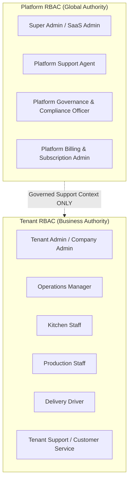

# Product Design 02-E · SaaS Platform Governance & Support Architecture
## 02 — Platform RBAC & Authority Model

---

### 1. Platform Role Taxonomy

Platform roles represent responsibilities at the SaaS infrastructure and global administration level. They are completely separated from Tenant-internal roles.

#### Platform Role Definitions:
1. **Super Admin (`saas_admin`)**:
   - **Scope**: Entire SaaS platform infrastructure, tenant provisioning, system health, platform catalog, global integrations.
   - **Current Baseline**: A single administrative user may accumulate all platform capabilities.
   - **Future Architecture**: Must allow configurable separation into distinct platform functional roles.
2. **Platform Support (`platform_support`)**:
   - **Scope**: Assisting tenants with operational issues, technical error investigations, data repairs, and system onboarding.
   - **Authority**: Must initiate a formal **Support Context** before accessing any tenant workspace.
3. **Platform Governance & Compliance (`platform_compliance`)**:
   - **Scope**: Platform audit inspection, data retention oversight, security compliance, Break Glass post-action reviews.
4. **Platform Billing (`platform_billing`)**:
   - **Scope**: Commercial plan catalog, tenant quota overrides, subscription lifecycle, invoice management at platform tier.

---

### 2. Platform RBAC vs. Tenant RBAC

A fundamental invariant of YourMeal OS is the absolute separation of role contexts:

| Dimension | Platform RBAC | Tenant RBAC |
| :--- | :--- | :--- |
| **Root Context** | SaaS Platform (`global`) | Tenant Workspace (`tenant_id`) |
| **Authority Domain** | Platform infrastructure, quotas, global catalog, tenant lifecycle | Menus, recipes, dishes, pricing, kitchen production, local orders |
| **Data Visibility** | Aggregated telemetry, technical logs, global tenant metadata | Tenant business rows, customer PII, recipes, order lines |
| **Role Assignment** | Governed by YourMeal OS Product / Platform | Governed exclusively by Tenant Admin (except bootstrap & support) |
| **Context Identifier** | Platform User Session | Tenant Member Context |

---

### 3. Multi-Role Individuals (Dual Personas)

An individual user account may hold both a Platform Role (e.g., `saas_admin`) and a Tenant Role (e.g., `company_admin` in EatClean):

- **Context Isolation Rule**: The user must explicitly operate within ONE active context at a time.
- **No Cross-Pollination**: Holding a Platform Role does not automatically grant implicit Tenant permissions outside a governed Support Session.
- **Audit Trace**: Every action records the explicit active persona and context identifier under which it was executed.

---

### 4. Super Admin Boundaries

Super Admin authority is bounded by the following rules:

1. **Platform Configuration**: Super Admin may freely create, update, and govern platform-level settings, global integration definitions, plan templates, and capability catalogs.
2. **Tenant Business Configuration**: Super Admin **CANNOT** modify a tenant's business configurations (e.g. dish prices, menu items, delivery schedules, customer records) from the global SaaS Admin panel.
3. **Tenant Interventions**: Any modification to a tenant's business domain must occur through an authorized, auditable **Support Context**.
