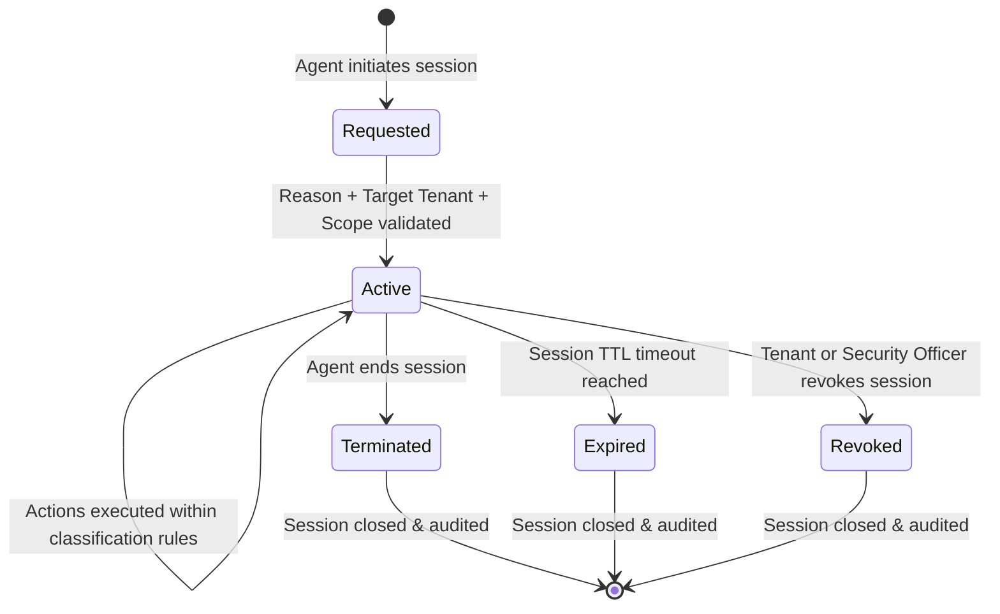

# Product Design 02-E · SaaS Platform Governance & Support Architecture
## 03 — Support Context & Scoped Operations

---

### 1. The Support Context Concept

In legacy administration patterns, a Super Admin could execute "Act as Tenant" or "Impersonate" and freely roam a tenant's workspace without bounds.

**YourMeal OS replaces this with Governed Support Context**:

```text
Super Admin / Platform Support
          ↓
   Support Context Initiation (Tenant + Scope + Reason + Ticket Ref)
          ↓
      1 Tenant Session (Strictly Scoped & Time-Bounded)
          ↓
 Action Classification (READ / TECH FIX / BUSINESS DATA MOD / SENSITIVE)
          ↓
 Authorization Verification (Explicit Tenant Consent for Business Mod)
          ↓
       ACTION EXECUTION
          ↓
   Enhanced Audit Emission
          ↓
   Mandatory Session Closure
```

---

### 2. Support Session Lifecycle

A Support Session is a first-class operational lifecycle object:



#### Lifecycle Phases:
1. **Initiation**:
   - Agent selects exactly ONE target tenant (`tenant_id`).
   - Agent inputs a mandatory **Operational Reason** (minimum length, clear justification).
   - Agent provides an external **Support Ticket / Incident Reference** (mandatory for non-trivial investigations).
   - Agent selects the requested **Operational Scope** (e.g., `Orders & Logistics`, `Menu & Catalog`, `Billing Investigation`, `Full Tenant Support`).
2. **Active State**:
   - Elevated permissions are granted *only* within the specified scope for the selected tenant.
   - A visible, persistent **Support Banner** is displayed across all UI surfaces during the entire session.
   - The session has a strict Time-To-Live (TTL) duration.
3. **Termination**:
   - The agent clicks "Finalizar sesión de soporte" or the TTL expires.
   - Elevated tokens are immediately invalidated.
   - A comprehensive summary audit entry is written.

---

### 3. Scoping & Multi-Tenant Switching Rules

1. **One Tenant per Session**: An agent cannot maintain simultaneous open support sessions across multiple tenants.
2. **Switching Requirement**: To inspect another tenant, the agent MUST formally terminate the current session and initiate a new session with dedicated justification.
3. **No Global Support Mode**: There is no such thing as a "Universal Support Mode" that unlocks all tenants at once.

---

### 4. Tenant Visibility & Notification

1. **Configurable Tenant Notification**:
   - The platform supports configurable notifications to Tenant Admins when a Support Session is initiated on their workspace.
   - Notification channels: In-app banner, email notification to Company Admin, webhook event.
2. **Tenant Transparency**:
   - Tenant Admins can view an audit log of all Support Sessions conducted on their workspace, including the agent name, timestamp, duration, reason, and list of actions executed.
   - Internal platform diagnostic details (e.g., server IPs, database replica names) remain masked from tenant view.
