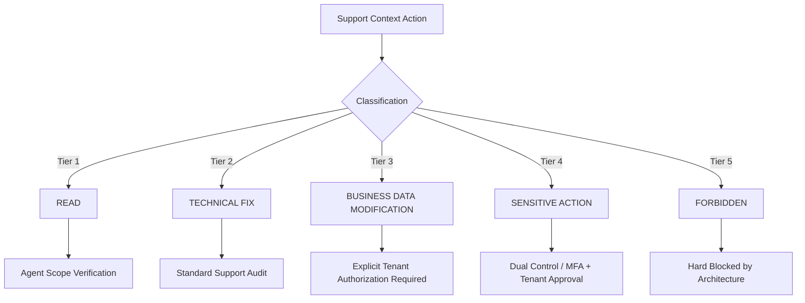

# Product Design 02-E · SaaS Platform Governance & Support Architecture
## 04 — Support Action Classification Matrix

---

### 1. The 5-Tier Action Classification

Every action executed within a Support Context is mapped to one of five strict tiers:

---

### 2. Tier Specifications & Authorization Rules

| Tier | Name | Description | Examples | Authorization Required |
| :--- | :--- | :--- | :--- | :--- |
| **Tier 1** | **READ** | Non-mutating inspection of tenant configuration, operational status, or error logs. | Viewing kitchen batch board, inspecting order history, checking delivery route status. | Valid Support Context session. |
| **Tier 2** | **TECHNICAL FIX** | Remediation of platform-level glitches, stuck job queues, or hung webhook states without altering commercial terms. | Re-queuing failed webhook delivery, re-syncing logistics cache, refreshing auth token cache. | Standard Support Context with reason & audit logging. |
| **Tier 3** | **BUSINESS DATA MODIFICATION** | Modifying business entities that affect operational fulfillment or customer agreements. | Editing order address at tenant request, changing delivery day, modifying dish prep instructions. | **Explicit Tenant Authorization** (recorded ticket/consent) + specific entity capability. |
| **Tier 4** | **SENSITIVE ACTION** | High-impact actions with financial, contractual, legal, or destructive consequences. | Issuing customer refund override, purging tenant audit history, updating tenant payout bank account. | **Dual Control (4-Eyes)** or MFA re-auth + Tenant Admin explicit written confirmation. |
| **Tier 5** | **FORBIDDEN** | Actions that violate tenant isolation, platform safety, cryptographic zero-knowledge, or business integrity. | Reading plaintext API secrets, modifying financial ledgers directly, cross-tenant data copying. | **NEVER ALLOWED** under any operational circumstance. |

---

### 3. Action Authorization Flow

When an agent in Support Context attempts an action:
1. System evaluates the Action Tier.
2. If `READ` or `TECHNICAL FIX`: Executes and logs standard support audit.
3. If `BUSINESS DATA MODIFICATION`: Checks for registered Tenant Authorization Reference; if missing, prompts for mandatory confirmation before execution.
4. If `SENSITIVE ACTION`: Requires elevated confirmation prompt, MFA re-verification, and registers an escalated audit record with before/after state diff.
5. If `FORBIDDEN`: Immediately rejected with `DOMAIN_SECURITY_VIOLATION`.
