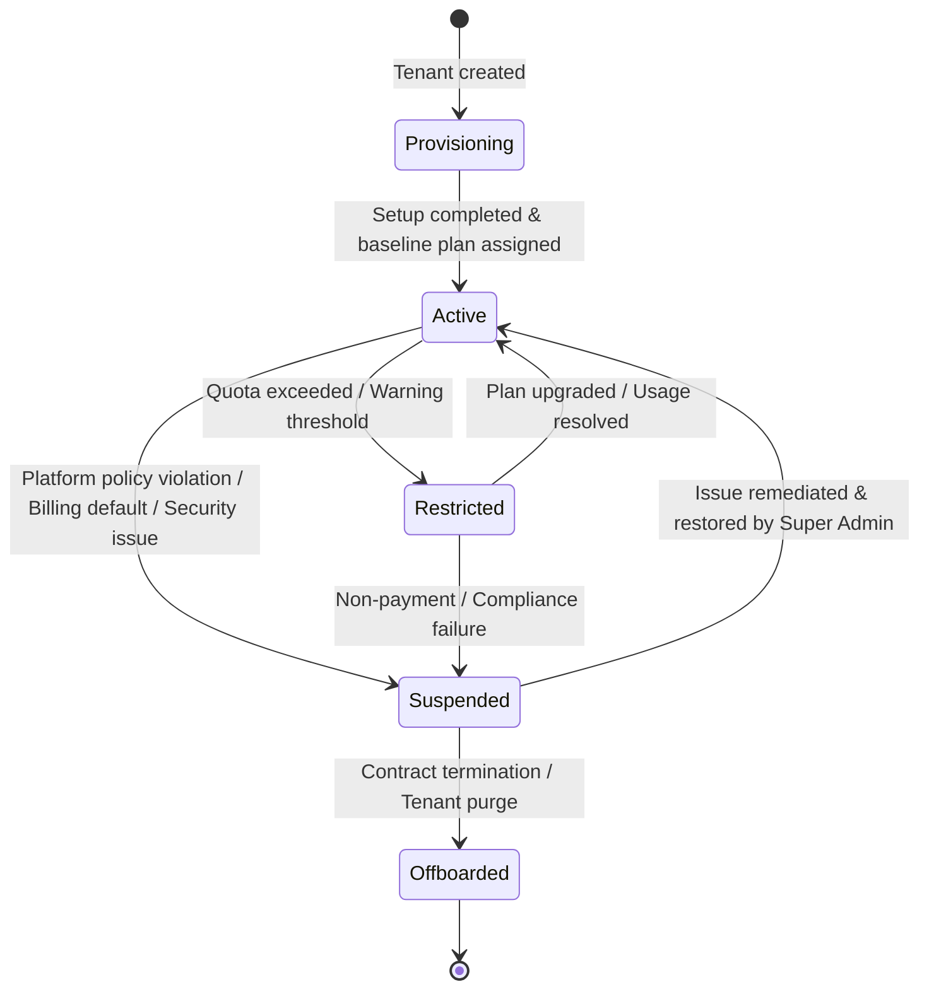

# Product Design 02-E · SaaS Platform Governance & Support Architecture
## 05 — Tenant Governance & Lifecycle

---

### 1. Tenant Lifecycle States



#### State Definitions:
1. **Provisioning**: Tenant record created, database schemas/storage assigned, default roles and baseline catalog seeded.
2. **Active**: Fully operational. Tenant Admin and users access all entitled modules.
3. **Restricted**: Specific quotas exceeded. Non-critical operations throttled or upgrade warnings surfaced, but core kitchen/order delivery functions remain available.
4. **Suspended**: Tenant operations halted due to platform security, severe policy breach, or formal administrative suspension.
5. **Offboarded**: Tenant contract concluded. Data enters retention period prior to formal compliance purge.

---

### 2. Tenant Suspension Policy & Mechanics

Super Admin may suspend a Tenant under strict platform governance rules:

- **Legitimate Grounds for Suspension**:
  1. Critical security vulnerability originating from tenant integration.
  2. Severe breach of SaaS Terms of Service.
  3. Commercial default / non-payment following statutory grace period.
  4. Legal or regulatory order requiring immediate service suspension.
- **Operational Impact of Suspension**:
  - Customer ordering surfaces display standard maintenance / unavailable notice.
  - Tenant staff logins are temporarily disabled.
  - Background production automation is paused safely without corrupting in-flight records.
  - Historical data, order snapshots, and financial records remain preserved and immutable.
- **Restoration**: Super Admin may reactivate the tenant once compliance or commercial remediations are verified.

---

### 3. Separation of Configuration Types

YourMeal OS enforces four distinct configuration layers:

```text
┌──────────────────────────────────────────────────────────┐
│ 1. TENANT METADATA (Platform Owned, Super Admin Governed) │
│    - Legal name, slug, status, billing tier, tenant_id   │
├──────────────────────────────────────────────────────────┤
│ 2. SUBSCRIPTION / ENTITLEMENTS (Platform Commercial Plan) │
│    - Active Plan, licensed modules, resource quotas      │
├──────────────────────────────────────────────────────────┤
│ 3. TENANT BUSINESS CONFIGURATION (Tenant Owned & Managed)│
│    - Menus, dish pricing, kitchen rules, cut-off times   │
├──────────────────────────────────────────────────────────┤
│ 4. RUNTIME / INFRASTRUCTURE CONFIG (Platform Engine)      │
│    - Worker concurrency, cache policies, webhook retries │
└──────────────────────────────────────────────────────────┘
```
