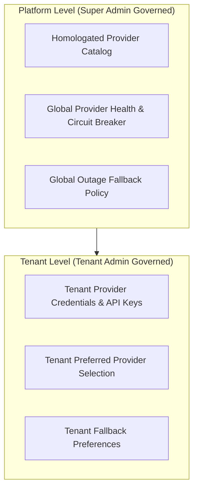

# Product Design 02-E · SaaS Platform Governance & Support Architecture
## 08 — Global & Tenant Integrations Governance

---

### 1. Integration Governance Model

YourMeal OS integrates with third-party providers across payments, logistics, SMS/WhatsApp, and maps:

1. **Platform Homologation**: All third-party providers (e.g., Stripe, Twilio, Stuart, Google Maps) are evaluated, certified, and maintained by YourMeal OS Product / Engineering.
2. **Tenant Provider Selection**: Tenants activate and configure their preferred homologated providers within their entitlement.
3. **Custom Tenant Providers**: If a tenant requires a bespoke integration (e.g., local courier API), it must follow a formal homologation path before production enablement.

---

### 2. Secret & Credential Zero-Knowledge Principle

A critical security and privacy invariant:

> **Super Admin must NEVER be able to read tenant API secrets, private keys, or payment tokens as plain text in the ordinary admin interface.**

- Credentials are encrypted at rest using envelope encryption or managed key vaults.
- The UI exposes only masked identifiers (e.g., `sk_live_...4a98`) and connection health indicators.
- In exceptional emergency scenarios, credential access requires full **Break Glass** protocol execution with mandatory compliance review.

---

### 3. Provider Outages & Emergency Fallback

When a third-party service suffers a global outage:
1. **Global Circuit Breaker**: Super Admin may toggle a platform circuit breaker to disable the degraded provider globally, preventing hung requests.
2. **Automated Fallback**: Platform routes transactions to secondary providers if configured in tenant settings (e.g., fallback from WhatsApp to Email).
3. **Emergency Override**: Platform can enforce emergency operational modes (e.g., manual payment recording) under global platform incident governance.
