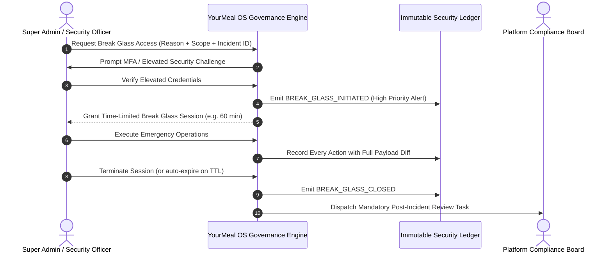

# Product Design 02-E · SaaS Platform Governance & Support Architecture
## 10 — Break Glass & Forbidden Actions Matrix

---

### 1. Break Glass Emergency Protocol

**Break Glass** is an exceptional, audited disaster-recovery mechanism designed for catastrophic platform failures, data corruption emergencies, or critical security vulnerabilities where standard support workflows cannot function.

#### Break Glass Rules:
1. **Emergency Only**: Reserved exclusively for severe Sev-1 outages or critical platform security emergencies.
2. **Mandatory Explicit Justification**: Requires incident identifier and detailed description of the emergency.
3. **Elevated Multi-Factor Authorization**: Requires step-up authentication.
4. **Strictly Time-Bounded**: Session automatically terminates upon TTL expiration.
5. **Enhanced Telemetry**: Real-time logging with full before/after snapshot diffs.
6. **Mandatory Post-Incident Review**: A formal post-mortem review by the Platform Compliance Board is mandatory after every invocation.
7. **Business Data Modification under Break Glass**: Permitted only under extreme emergency conditions with confirmed tenant authorization.

---

### 2. Forbidden Actions Matrix

The following actions are categorically forbidden by the architecture of YourMeal OS:

| Actor / Context | Forbidden Action | Rationale | Architectural Prevention |
| :--- | :--- | :--- | :--- |
| **Super Admin (Global)** | Modifying Tenant dish prices or recipes directly from SaaS panel | Violates Tenant business autonomy. | Actions require Tenant Support Context with audit. |
| **Super Admin (Global)** | Viewing plaintext third-party API credentials/secrets | Violates zero-knowledge security principle. | Secret encryption at rest; masked UI fields. |
| **Platform Support** | Modifying customer orders without Tenant authorization | Support is not autonomous business operation. | System enforces registered tenant authorization reference. |
| **Platform Support** | Initiating unbounded multi-tenant support sessions | Violates strict tenant scoping invariant. | 1 Session = 1 Tenant constraint in session engine. |
| **Tenant Admin** | Querying or modifying another Tenant's data | Violates multi-tenant isolation invariant. | Enforced at database RLS and service context layers. |
| **Automation / Worker** | Silently altering customer commercial agreements upon quota exhaustion | Business decisions belong to humans. | Quota 100% policy triggers alert/grace periods, not data deletion. |
| **Any Platform Role** | Deleting or tampering with Platform Audit logs | Audit records must remain immutable for compliance. | Append-only database rules; purge restricted to compliance officer. |
